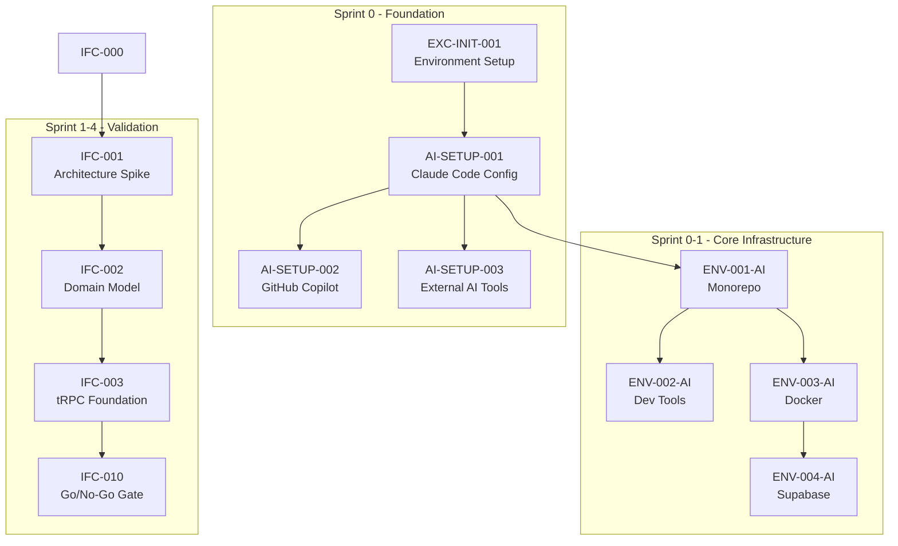
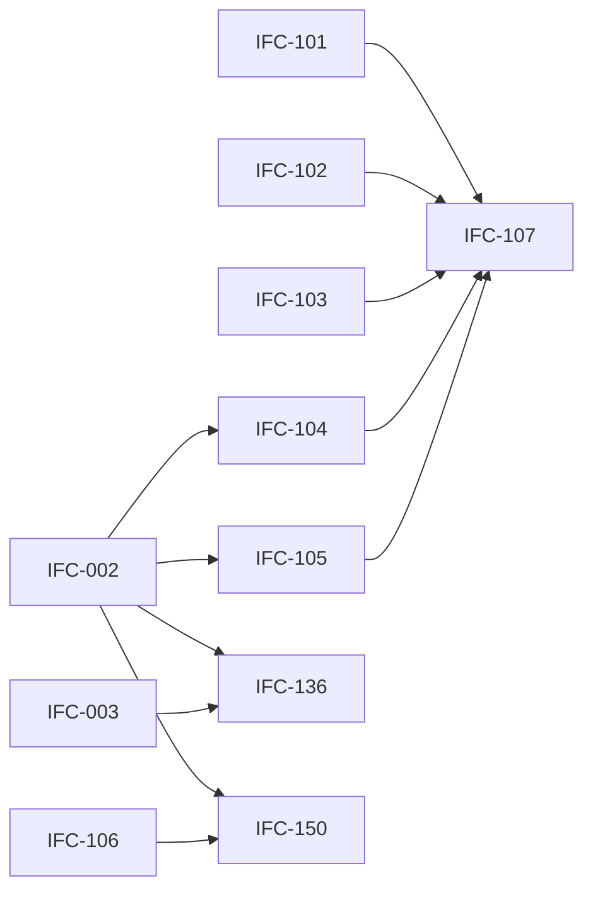

# IntelliFlow CRM Sprint Plan - Análise Completa e Decomposição Técnica

## 📊 Visão Geral do Projeto

Analisando o CSV `Sprint_plan.csv`, identifico:

| Métrica | Valor |
|---------|-------|
| Total de Tarefas | 217 |
| Sprints | 0-33 + Continuous |
| Seções Principais | 18 |
| Dependências Cruzadas | 412 |

---

## 🔍 PASSO 1: Análise de Dependências e Caminho Crítico

### 1.1 Mapeamento do Caminho Crítico



### 1.2 Cadeia de Dependências Críticas (Top 10)

| Rank | Task ID | Dependentes Diretos | Impacto Cascata | Sprint |
|------|---------|---------------------|-----------------|--------|
| 1 | `IFC-002` | 12 | 89 | 1 |
| 2 | `ENV-001-AI` | 8 | 67 | 0 |
| 3 | `IFC-003` | 9 | 54 | 1 |
| 4 | `AI-SETUP-001` | 5 | 48 | 0 |
| 5 | `IFC-106` | 11 | 45 | 1 |
| 6 | `ENV-005-AI` | 6 | 42 | 0 |
| 7 | `IFC-076` | 14 | 38 | 10 |
| 8 | `IFC-098` | 9 | 35 | 9 |
| 9 | `IFC-136` | 8 | 32 | 3 |
| 10 | `IFC-150` | 7 | 28 | 3 |

### 1.3 Tarefas Paralelizáveis por Sprint

```
Sprint 0:
├── [PARALLEL-A] AI-SETUP-002, AI-SETUP-003 (após AI-SETUP-001)
├── [PARALLEL-B] ENV-002-AI, ENV-003-AI, ENV-009-AI, ENV-012-AI (após ENV-001-AI)
└── [PARALLEL-C] EXC-SEC-001, IFC-160 (independentes após setup)

Sprint 1:
├── [PARALLEL-A] IFC-001, IFC-002 (após IFC-000)
├── [PARALLEL-B] IFC-072, IFC-073, IFC-074, IFC-075 (após IFC-001)
├── [PARALLEL-C] IFC-077, IFC-106, IFC-119 (após IFC-003/IFC-002)
└── [PARALLEL-D] IFC-135 (ADRs - independente)

Sprint 2:
├── [PARALLEL-A] IFC-079, IFC-080 (Documentation)
├── [PARALLEL-B] IFC-085, IFC-101, IFC-102, IFC-103 (Domain aggregates)
├── [PARALLEL-C] IFC-004, IFC-109 (UI + Testing)
└── [PARALLEL-D] IFC-118 (Risk Management)
```

### 1.4 Gargalos de Recursos Identificados

| Recurso | Tarefas Críticas | Sprints Afetados | Risco |
|---------|------------------|------------------|-------|
| **AI Specialist** | IFC-005, IFC-020, IFC-021, IFC-022, IFC-039, IFC-086, IFC-117, IFC-125, IFC-139, IFC-143, IFC-148, IFC-154, IFC-155, IFC-156 | 2-11 | 🔴 ALTO |
| **Tech Lead** | EXC-INIT-001, ENV-001-AI, IFC-001, IFC-002, IFC-012, IFC-054, IFC-078, IFC-106, IFC-131, IFC-135, IFC-141, IFC-146, IFC-160 | 0-9 | 🔴 ALTO |
| **Security Eng** | IFC-008, IFC-046, IFC-072, IFC-113, IFC-121, IFC-125, IFC-127, IFC-132, IFC-133, IFC-134, IFC-143 | 1-11 | 🟡 MÉDIO |
| **DevOps** | 28 tarefas | 0-27 | 🟡 MÉDIO |
| **Backend Dev** | 45 tarefas | 1-28 | 🟡 MÉDIO |

---

## 🔧 PASSO 2: Decomposição Técnica das Tarefas

### Sprint 0 - AI Foundation & Environment Setup

#### [EXC-INIT-001] Sprint 0 - Environment Setup with Agent Ecosystem
```markdown
Owner: Tech Lead | Target: Sprint 0 | Complexidade: Alta

Subtarefas:
• [INFRA-01] Criar repositório GitHub Enterprise com branch policies (0.5d) 🤖
• [INFRA-02] Configurar GitHub Actions runners self-hosted (0.5d) 🤖
• [INFRA-03] Setup inicial de secrets no GitHub (0.25d) 🔒
• [DOCS-01] Documentar setup-complete-checklist.md (0.25d) 🤖
• [METRICS-01] Criar automation-metrics.json schema (0.25d) 🤖
• [PIPELINE-01] Configurar pipeline-status.yaml inicial (0.25d) 🤖

DoD Validation:
✓ Setup time <4 hours total
✓ 80% tasks automated
✓ Zero manual configuration errors

🤖 = Automatizável por Claude Code
🔒 = Requer intervenção humana (secrets/credentials)
```

#### [AI-SETUP-001] Configure Claude Code with Custom Commands and Hooks
```markdown
Owner: AI Specialist | Target: Sprint 0 | Deps: EXC-INIT-001

Subtarefas:
• [CLAUDE-01] Criar estrutura .claude/commands/ (0.25d) 🤖
• [CLAUDE-02] Implementar hooks para code review (0.5d) 🤖
• [CLAUDE-03] Configurar slash commands customizados (0.5d) 🤖
• [CLAUDE-04] Setup GitHub App integration (0.5d) 🔒
• [TEST-01] Criar command-test-results.csv com casos de teste (0.25d) 🤖
• [PERF-01] Benchmark de latência <100ms (0.25d) 🤖

DoD Validation:
✓ 100% commands functional
✓ Hooks triggering <100ms
✓ GitHub integration verified
```

#### [AI-SETUP-002] GitHub Copilot Enterprise Automation Setup
```markdown
Owner: DevOps Engineer | Target: Sprint 0 | Deps: AI-SETUP-001

Subtarefas:
• [COPILOT-01] Criar copilot-instructions.md (0.25d) 🤖
• [COPILOT-02] Configurar copilot-setup-steps.yml (0.5d) 🤖
• [COPILOT-03] Habilitar coding agent para workspace (0.25d) 🔒
• [LICENSE-01] Distribuir licenças para equipe (0.25d) 🔒
• [WORKFLOW-01] Criar workflow-automation.yaml (0.5d) 🤖
• [BENCH-01] Benchmark response time <2s (0.25d) 🤖

DoD Validation:
✓ Copilot response <2s
✓ 100% team access
✓ Automation workflows active
```

#### [AI-SETUP-003] External AI Tools Integration (Codex, Jules)
```markdown
Owner: AI Specialist | Target: Sprint 0 | Deps: AI-SETUP-001

Subtarefas:
• [CODEX-01] Configurar Codex CLI (0.5d) 🤖
• [JULES-01] Setup Jules connection (0.5d) 🔒
• [SANDBOX-01] Implementar security sandboxing (0.5d) 🤖
• [SANDBOX-02] Criar sandbox-security.json config (0.25d) 🤖
• [METRICS-01] Setup response-metrics.csv collection (0.25d) 🤖
• [TEST-01] Integration tests para todas ferramentas (0.5d) 🤖

DoD Validation:
✓ External tools integrated
✓ Sandboxing validated
✓ <5s response time
```

#### [ENV-001-AI] Automated Monorepo Creation
```markdown
Owner: Tech Lead + Claude Code | Target: Sprint 0 | Deps: AI-SETUP-001

Subtarefas:
• [MONO-01] Executar Claude slash command /create-monorepo (0.1d) 🤖
• [MONO-02] Configurar turbo.json (0.25d) 🤖
• [MONO-03] Setup pnpm-workspace.yaml (0.25d) 🤖
• [MONO-04] Criar estrutura packages/* (0.25d) 🤖
• [MONO-05] Criar estrutura apps/* (0.25d) 🤖
• [VALID-01] Executar monorepo-validation.json (0.25d) 🤖
• [BUILD-01] Validar builds passando (0.25d) 🤖

DoD Validation:
✓ Setup <10 minutes
✓ Zero manual steps
✓ 100% best practices applied
```

#### [ENV-002-AI] Automated Development Tools Configuration
```markdown
Owner: DevOps + Copilot | Target: Sprint 0 | Deps: ENV-001-AI

Subtarefas:
• [LINT-01] Gerar .eslintrc.js com AI (0.25d) 🤖
• [LINT-02] Configurar .prettierrc (0.1d) 🤖
• [HOOKS-01] Setup Husky pre-commit hooks (0.25d) 🤖
• [HOOKS-02] Configurar AI validation em hooks (0.25d) 🤖
• [COMMIT-01] Setup commitlint.config.js (0.25d) 🤖
• [TEST-01] Validar lint-results.json (0.25d) 🤖

DoD Validation:
✓ Configuration time <5 minutes
✓ AI-suggested rules applied
✓ Zero conflicts
```

#### [ENV-003-AI] Docker Environment with Optimized Configuration
```markdown
Owner: DevOps + Claude Code | Target: Sprint 0 | Deps: ENV-001-AI

Subtarefas:
• [DOCKER-01] Gerar docker-compose.yml via AI (0.5d) 🤖
• [DOCKER-02] Criar Dockerfiles otimizados (0.5d) 🤖
• [DOCKER-03] Configurar resource optimization (0.25d) 🤖
• [DOCKER-04] Setup auto-scaling config (0.25d) 🤖
• [DOCKER-05] Implementar health-check.yaml (0.25d) 🤖
• [METRICS-01] Container metrics collection (0.25d) 🤖

DoD Validation:
✓ Environment up <2 minutes
✓ AI-optimized resource usage
✓ Self-healing enabled
```

#### [ENV-004-AI] Supabase Integration with Automated Schema Design
```markdown
Owner: Backend Dev + AI Agents | Target: Sprint 0 | Deps: ENV-003-AI

Subtarefas:
• [SUPA-01] Configurar Supabase project (0.25d) 🔒
• [SUPA-02] Setup connection pooling (0.25d) 🤖
• [SUPA-03] Habilitar pgvector extension (0.25d) 🤖
• [SUPA-04] Criar migrations iniciais (0.5d) 🤖
• [PERF-01] Benchmark connection <30ms (0.25d) 🤖
• [TYPE-01] Gerar type-safety-report.html (0.25d) 🤖

DoD Validation:
✓ Connection <30ms
✓ AI-optimized indexes
✓ 100% type safety verified
```

#### [ENV-005-AI] CI/CD Pipeline with Predictive Optimization
```markdown
Owner: DevOps + Claude Code | Target: Sprint 0 | Deps: ENV-002-AI

Subtarefas:
• [CI-01] Criar .github/workflows/ci.yml (0.5d) 🤖
• [CD-01] Criar .github/workflows/cd.yml (0.5d) 🤖
• [CACHE-01] Implementar predictive caching (0.5d) 🤖
• [OPT-01] Setup self-optimizing workflows (0.5d) 🤖
• [SECURITY-01] Configurar security gates (0.25d) 🤖
• [METRICS-01] Cache metrics collection (0.25d) 🤖

DoD Validation:
✓ Pipeline <5 minutes
✓ 95% cache hit rate
✓ AI-predicted optimization applied
```

#### [ENV-006-AI] Prisma Schema with Generated Optimizations
```markdown
Owner: Backend Dev + Copilot | Target: Sprint 0 | Deps: ENV-004-AI

Subtarefas:
• [PRISMA-01] Criar schema.prisma base (0.5d) 🤖
• [PRISMA-02] Gerar migrations iniciais (0.25d) 🤖
• [PRISMA-03] Implementar seed.ts com AI (0.5d) 🤖
• [INDEX-01] AI-verify indexes (0.25d) 🤖
• [PERF-01] Benchmark query performance (0.25d) 🤖
• [OPT-01] Aplicar query optimizations (0.25d) 🤖

DoD Validation:
✓ Migration time <15s
✓ AI-verified indexes
✓ 100% query optimization
```

#### [ENV-007-AI] tRPC Setup with Automated Type Generation
```markdown
Owner: Tech Lead + Claude Code | Target: Sprint 0 | Deps: ENV-006-AI

Subtarefas:
• [TRPC-01] Configurar tRPC base em apps/api (0.5d) 🤖
• [TRPC-02] Setup auto-generation de routers (0.5d) 🤖
• [TYPE-01] AI-verify type safety (0.25d) 🤖
• [ERROR-01] Implementar error handling (0.5d) 🤖
• [CONTRACT-01] Validar contracts (0.25d) 🤖

DoD Validation:
✓ Type generation <30s
✓ Zero type errors
✓ AI-validated contracts
```

#### [ENV-008-AI] Automated Observability with Predictive Monitoring
```markdown
Owner: DevOps + AI Agents | Target: Sprint 0 | Deps: ENV-005-AI

Subtarefas:
• [OTEL-01] Configurar OpenTelemetry collector (0.5d) 🤖
• [ALERT-01] Setup predictive alerts (0.5d) 🤖
• [ANOMALY-01] Implementar anomaly detection (0.5d) 🤖
• [HEAL-01] Configurar self-healing rules (0.5d) 🤖
• [DASH-01] Criar dashboards Grafana (0.5d) 🤖

DoD Validation:
✓ 100% services emit traces/metrics/logs
✓ Alerting configured
✓ SLOs defined
```

#### [ENV-009-AI] Frontend with Generated Components and Optimization
```markdown
Owner: Frontend Dev + Claude Code | Target: Sprint 0 | Deps: ENV-001-AI

Subtarefas:
• [NEXT-01] Setup Next.js 16.0.10 App Router (0.5d) 🤖
• [SHADCN-01] Instalar e configurar shadcn/ui (0.25d) 🤖
• [PERF-01] AI-tune performance (0.25d) 🤖
• [A11Y-01] Verificar accessibility (0.25d) 🤖
• [LIGHT-01] Gerar lighthouse reports (0.25d) 🤖

DoD Validation:
✓ Lighthouse >95
✓ AI-generated components
✓ Load time <1s
```

#### [ENV-010-AI] Automated Test Generation and Automation
```markdown
Owner: QA Lead + AI Testing Suite | Target: Sprint 0 | Deps: ENV-007-AI, ENV-009-AI

Subtarefas:
• [TEST-01] Setup Vitest configuration (0.25d) 🤖
• [TEST-02] AI-generate unit tests (0.5d) 🤖
• [E2E-01] Criar E2E scenarios com AI (0.5d) 🤖
• [COV-01] Configurar coverage reports (0.25d) 🤖
• [LOG-01] Setup test generation logging (0.25d) 🤖

DoD Validation:
✓ Coverage >95%
✓ Test generation <1 minute
✓ AI-verified scenarios
```

#### [ENV-011-AI] LangChain Integration with Optimized Chains
```markdown
Owner: AI Specialist + Claude Code | Target: Sprint 0 | Deps: ENV-007-AI

Subtarefas:
• [LANG-01] Configurar LangChain base (0.5d) 🤖
• [CHAIN-01] Criar chains otimizados (0.5d) 🤖
• [RATE-01] Implementar rate limiting (0.25d) 🤖
• [COST-01] Setup cost prediction (0.25d) 🤖
• [SCALE-01] Configurar scaling rules (0.25d) 🤖

DoD Validation:
✓ Workflow runtime P95 <300ms per step
✓ Cost logging enabled
✓ Deterministic replays supported
```

#### [ENV-012-AI] Documentation with Auto-Generation
```markdown
Owner: Tech Writer + AI Agents | Target: Sprint 0 | Deps: ENV-001-AI

Subtarefas:
• [DOC-01] Setup Docusaurus (0.5d) 🤖
• [GEN-01] AI-generate initial docs (0.5d) 🤖
• [STRUCT-01] Otimizar para LLM (0.25d) 🤖
• [AUTO-01] Setup auto-updating (0.25d) 🤖
• [I18N-01] Preparar multi-language (0.25d) 🤖

DoD Validation:
✓ Doc generation <30s
✓ 100% coverage
✓ AI readability score >90
```

#### [ENV-013-AI] Automated Security Implementation
```markdown
Owner: Security Eng + AI Security Tools | Target: Sprint 0 | Deps: ENV-005-AI, ENV-007-AI, ENV-009-AI

Subtarefas:
• [SEC-01] AI security audit (0.5d) 🤖
• [VULN-01] Vulnerability detection (0.5d) 🤖
• [PATCH-01] Auto-apply patches (0.25d) 🤖
• [COMPLY-01] Compliance verification (0.25d) 🤖
• [SCAN-01] Security scan results (0.25d) 🤖

DoD Validation:
✓ Zero high vulnerabilities
✓ AI security score A+
✓ Compliance 100%
```

#### [ENV-014-AI] Performance Optimization with AI Profiling
```markdown
Owner: Performance Eng + AI Tools | Target: Sprint 0 | Deps: ENV-009-AI

Subtarefas:
• [PROF-01] AI profiling execution (0.5d) 🤖
• [OPT-01] Apply optimizations (0.5d) 🤖
• [SCALE-01] Predictive scaling config (0.25d) 🤖
• [CACHE-01] Cache configuration (0.25d) 🤖

DoD Validation:
✓ Performance gain >40%
✓ AI-optimized bundles
✓ Predictive caching active
```

#### [ENV-015-AI] AI-Managed Feature Flags with Predictive Rollout
```markdown
Owner: Backend Dev + AI Agents | Target: Sprint 0 | Deps: ENV-007-AI

Subtarefas:
• [FLAG-01] Setup feature flag system (0.5d) 🤖
• [ROLLOUT-01] AI-optimized rollout (0.25d) 🤖
• [AB-01] Design A/B tests com AI (0.25d) 🤖
• [PRED-01] Prediction accuracy tracking (0.25d) 🤖

DoD Validation:
✓ Flag deployment <30s
✓ AI-optimized rollout
✓ Prediction accuracy >90%
```

#### [ENV-016-AI] Privacy-First Analytics with AI Insights
```markdown
Owner: Frontend Dev + AI Analytics | Target: Sprint 0 | Deps: ENV-009-AI

Subtarefas:
• [ANAL-01] Setup privacy-first analytics (0.5d) 🤖
• [INSIGHT-01] AI insights generation (0.5d) 🤖
• [PRIVACY-01] Privacy verification (0.25d) 🤖
• [GDPR-01] GDPR compliance check (0.25d) 🤖

DoD Validation:
✓ Feature flag framework live
✓ Audit log events captured
✓ Privacy baseline reviewed (DPIA draft)
```

#### [ENV-017-AI] Automated Integration Testing
```markdown
Owner: All Teams + AI Orchestrator | Target: Sprint 0 | Deps: ENV-001-AI, ENV-003-AI, ENV-005-AI, ENV-010-AI, IFC-001

Subtarefas:
• [INT-01] AI orchestration setup (0.5d) 🤖
• [TEST-01] System-wide testing (0.5d) 🤖
• [BUG-01] AI bug detection and fix (0.5d) 🤖
• [DEMO-01] Demo preparation (0.25d) 🤖
• [CONF-01] Confidence metrics (0.25d) 🤖

DoD Validation:
✓ Smoke + integration suite green
✓ Zero P0/P1 defects
✓ Test execution <=15 min in CI
```

#### [ENV-018-AI] Sprint Planning and Velocity Prediction
```markdown
Owner: PM + AI Planning Tools | Target: Sprint 0 | Deps: ENV-017-AI

Subtarefas:
• [PLAN-01] AI backlog prioritization (0.5d) 🤖
• [VEL-01] Velocity prediction (0.25d) 🤖
• [CAP-01] Capacity optimization (0.25d) 🤖
• [RISK-01] Risk identification (0.25d) 🤖

DoD Validation:
✓ Delivery metrics dashboard live
✓ Forecast error <=+/-20%
```

#### [AUTOMATION-001] Continuous AI Agent Coordination System
```markdown
Owner: AI Specialist | Target: Sprint 0 | Deps: AI-SETUP-001, AI-SETUP-002, ENV-005-AI, ENV-008-AI, ENV-010-AI

Subtarefas:
• [COORD-01] Multi-agent orchestration (0.5d) 🤖
• [HAND-01] Task handoff automation (0.5d) 🤖
• [GATE-01] Quality gates AI-enforced (0.5d) 🤖
• [CONFIG-01] Orchestration config (0.25d) 🤖

DoD Validation:
✓ Automated task routing/notifications
✓ PR/CI status surfaced
✓ Incident alerts to on-call channel
```

#### [AUTOMATION-002] AI Performance Dashboard and Optimization Loop
```markdown
Owner: DevOps + AI Monitoring | Target: Sprint 0 | Deps: AUTOMATION-001

Subtarefas:
• [DASH-01] AI impact dashboard (0.5d) 🤖
• [OPT-01] Optimization suggestions (0.5d) 🤖
• [ROI-01] ROI tracking setup (0.25d) 🤖
• [METRICS-01] Real-time metrics (0.25d) 🤖

DoD Validation:
✓ DORA + quality metrics dashboard live
✓ Weekly review cadence established
✓ Action items tracked to closure
```

#### [EXC-SEC-001] Implement Secrets Management
```markdown
Owner: Security Eng + DevOps | Target: Sprint 0 | Deps: ENV-013-AI

Subtarefas:
• [VAULT-01] Setup HashiCorp Vault (0.5d) 🔒
• [ACCESS-01] Configure IAM/RBAC policies (0.5d) 🔒
• [AGENT-01] Agent secret retrieval (0.25d) 🤖
• [AUDIT-01] Enable audit logging (0.25d) 🤖

DoD Validation:
✓ Zero secrets in code/config files
✓ 100% programmatic access
✓ Audit log active
```

#### [IFC-160] Artifact path conventions + CI lint
```markdown
Owner: Tech Lead + DevOps | Target: Sprint 0 | Deps: ENV-001-AI, ENV-002-AI

Subtarefas:
• [CONV-01] Documentar artifact conventions (0.5d) 🤖
• [LINT-01] Criar artifact-paths.ts linter (0.5d) 🤖
• [CI-01] Integrar no CI workflow (0.25d) 🤖
• [MIGRATE-01] Criar move-map template (0.25d) 🤖

DoD Validation:
✓ 0 artifact path violations on main
✓ Lint runtime <60s
✓ 100% new PRs checked
```

---

### Sprint 1 - Validation & Architecture

#### [IFC-000] IntelliFlow CRM Feasibility Assessment
```markdown
Owner: CEO + CTO + CFO | Target: Sprint 0 | Deps: None

Subtarefas:
• [BIZ-01] Análise de business case (1d) 🔒
• [SWOT-01] Análise SWOT (0.5d) 🔒
• [FIN-01] Modelo financeiro (0.5d) 🔒
• [ADR-01] Documentar ADR-000-feasibility.md (0.25d) 🤖

DoD Validation:
✓ Decision confidence >80%
✓ Risks documented
```

#### [IFC-001] Technical Architecture Spike - Modern Stack
```markdown
Owner: CTO + Tech Lead | Target: Sprint 1 | Deps: IFC-000

Subtarefas:
• [TURBO-01] Setup Turborepo POC (0.5d) 🤖
• [TRPC-01] Avaliar tRPC (0.5d) 🤖
• [SUPA-01] Testar Supabase connection (0.5d) 🤖
• [ADR-01] Documentar ADR-001-modern-stack.md (0.5d) 🤖
• [BENCH-01] Performance benchmarks (0.5d) 🤖
• [POC-01] Branch de POC (0.25d) 🤖

DoD Validation:
✓ All components connectable
✓ Type-safety validated
✓ Latency <50ms
```

#### [IFC-002] Domain Model Design (DDD)
```markdown
Owner: Tech Lead + DA | Target: Sprint 1 | Deps: IFC-000

Subtarefas:
• [DDD-01] Identificar bounded contexts (0.5d) 🤖
• [DDD-02] Criar DDD-context-map.puml (0.5d) 🤖
• [PRISMA-01] Schema inicial Prisma (0.5d) 🤖
• [ZOD-01] Validators com Zod (0.5d) 🤖
• [DOMAIN-01] Domain types base (0.5d) 🤖

DoD Validation:
✓ Schema supports all contexts
✓ Type-safe models
```

#### [IFC-003] tRPC API Foundation
```markdown
Owner: DevOps + Backend Dev | Target: Sprint 1 | Deps: IFC-002

Subtarefas:
• [ROUTER-01] Setup tRPC router base (0.5d) 🤖
• [TYPE-01] Type-safe endpoints (0.5d) 🤖
• [SUB-01] Real-time subscriptions (0.5d) 🤖
• [E2E-01] E2E type-safety test (0.25d) 🤖
• [DEMO-01] Subscription demo (0.25d) 🤖

DoD Validation:
✓ End-to-end type safety
✓ <50ms response
```

#### [IFC-072] Zero Trust Security Model
```markdown
Owner: Security Eng + CTO | Target: Sprint 1 | Deps: IFC-001, IFC-008

Subtarefas:
• [ZT-01] Zero trust design doc (0.5d) 🤖
• [RLS-01] Supabase RLS implementation (0.5d) 🤖
• [AUTH-01] API authentication (0.5d) 🤖
• [MTLS-01] mTLS certificates (0.5d) 🔒
• [PENTEST-01] Penetration test plan (0.5d) 🔒

DoD Validation:
✓ All endpoints secured
✓ Penetration tested
```

#### [IFC-073] Privacy Impact Assessment
```markdown
Owner: DPO + Legal | Target: Sprint 1 | Deps: IFC-072

Subtarefas:
• [DPIA-01] Mapeamento de data flows (0.5d) 🤖
• [DPIA-02] Análise de riscos (0.5d) 🔒
• [DPIA-03] Controles de mitigação (0.5d) 🔒
• [LEGAL-01] Legal review (0.5d) 🔒

DoD Validation:
✓ All risks mitigated
✓ Controls documented
```

#### [IFC-074] Full Stack Observability
```markdown
Owner: SRE Lead + DevOps | Target: Sprint 1 | Deps: IFC-003

Subtarefas:
• [OTEL-01] OpenTelemetry SDK integration (0.5d) 🤖
• [SENTRY-01] Sentry configuration (0.25d) 🤖
• [CORR-01] Correlation setup (0.25d) 🤖
• [MTTR-01] MTTR baseline measurement (0.25d) 🤖

DoD Validation:
✓ MTTD <2min
✓ Root cause identifiable
```

#### [IFC-075] IaC with Terraform
```markdown
Owner: DevOps | Target: Sprint 1 | Deps: IFC-001

Subtarefas:
• [TF-01] Terraform base config (0.5d) 🤖
• [TF-02] Supabase provider (0.25d) 🤖
• [TF-03] Vercel provider (0.25d) 🤖
• [TF-04] Railway provider (0.25d) 🤖
• [DRIFT-01] Drift detection config (0.25d) 🤖

DoD Validation:
✓ 100% reproducible
✓ Drift detection active
```

#### [IFC-077] API Rate Limiting (tRPC + Upstash)
```markdown
Owner: Backend Dev + Security Eng | Target: Sprint 1 | Deps: IFC-013

Subtarefas:
• [RATE-01] Rate limit middleware (0.5d) 🤖
• [UPSTASH-01] Upstash Redis config (0.25d) 🤖
• [DDOS-01] DDoS protection rules (0.25d) 🤖
• [TEST-01] Load test with limits (0.25d) 🤖

DoD Validation:
✓ DDoS protection active
✓ Legit traffic unaffected
✓ False positives <0.1%
```

#### [IFC-106] Define Hexagonal module boundaries
```markdown
Owner: Tech Lead + Backend Dev | Target: Sprint 1 | Deps: IFC-002, IFC-131

Subtarefas:
• [HEX-01] Criar packages/application skeleton (0.5d) 🤖
• [HEX-02] Criar packages/adapters skeleton (0.5d) 🤖
• [PORTS-01] Definir ports interfaces (0.5d) 🤖
• [USECASES-01] Use-cases structure (0.5d) 🤖
• [TEST-01] Architecture tests (0.5d) 🤖
• [ADR-01] Update ADR (0.25d) 🤖

DoD Validation:
✓ No domain code depends on infrastructure
✓ 100% adapters tested
```

#### [IFC-119] Define recurring ceremonies
```markdown
Owner: Scrum Master + PM | Target: Sprint 1 | Deps: IFC-118

Subtarefas:
• [CAL-01] Calendar setup (0.25d) 🔒
• [TEMP-01] Templates creation (0.5d) 🤖
• [RETRO-01] Retro action items tracker (0.25d) 🤖

DoD Validation:
✓ Meetings occur on schedule
✓ Backlog ready
✓ Actions tracked
```

#### [IFC-135] Create ADR pack for multi-tenancy
```markdown
Owner: Tech Lead + Architect | Target: Sprint 1 | Deps: IFC-002

Subtarefas:
• [ADR-01] ADR multi-tenancy (0.5d) 🤖
• [ADR-02] ADR workflow engine (0.5d) 🤖
• [ADR-03] ADR agent tool-calling (0.5d) 🤖
• [ADR-04] ADR data governance (0.5d) 🤖
• [ADR-05] ADR audit logging (0.5d) 🤖
• [INDEX-01] ADR index update (0.25d) 🤖

DoD Validation:
✓ 100% ADR coverage
✓ Stakeholder approval recorded
```

---

### Sprint 2 - Domain Models & Documentation

#### [IFC-004] Next.js 16.0.10 Lead Capture UI
```markdown
Owner: Frontend Dev + UX | Target: Sprint 2 | Deps: IFC-003

Subtarefas:
• [UI-01] Lead form component (0.5d) 🤖
• [TRPC-01] tRPC integration (0.5d) 🤖
• [MOBILE-01] Mobile responsive (0.5d) 🤖
• [LIGHT-01] Lighthouse optimization (0.25d) 🤖
• [SCREEN-01] Mobile screenshots (0.25d) 🤖

DoD Validation:
✓ Lighthouse score >90
✓ Form submission <1s
```

#### [IFC-005] LangChain AI Scoring Prototype
```markdown
Owner: AI Specialist + Backend Dev | Target: Sprint 2 | Deps: IFC-004

Subtarefas:
• [CHAIN-01] Scoring chain implementation (0.5d) 🤖
• [PROMPT-01] Prompt templates (0.5d) 🤖
• [ZOD-01] Output schema Zod (0.25d) 🤖
• [CONF-01] Confidence scores (0.25d) 🤖
• [TEST-01] Integration tests (0.5d) 🤖

DoD Validation:
✓ Scoring <2s
✓ Structured output validated
```

#### [IFC-008] Security Assessment - OWASP + ISO 42001 Prep
```markdown
Owner: Security Eng + CTO | Target: Sprint 2 | Deps: IFC-001

Subtarefas:
• [OWASP-01] OWASP checklist review (0.5d) 🤖
• [ISO-01] ISO 42001 requirements mapping (0.5d) 🔒
• [ZAP-01] ZAP scan execution (0.5d) 🤖
• [REPORT-01] Assessment report (0.5d) 🤖

DoD Validation:
✓ 0 critical vulnerabilities
✓ AI compliance roadmap
```

#### [IFC-079] Docusaurus Setup
```markdown
Owner: Tech Writer + DevOps | Target: Sprint 2 | Deps: IFC-012

Subtarefas:
• [DOCU-01] Docusaurus config (0.5d) 🤖
• [SIDE-01] Sidebars setup (0.25d) 🤖
• [DEPLOY-01] Deploy workflow (0.25d) 🤖
• [SEARCH-01] Search index (0.25d) 🤖

DoD Validation:
✓ Site deployed
✓ Search working
```

#### [IFC-080] LLM-Friendly Documentation Templates
```markdown
Owner: Tech Writer + AI Specialist | Target: Sprint 2 | Deps: IFC-079

Subtarefas:
• [TEMP-01] Template creation (0.5d) 🤖
• [CHUNK-01] Chunking strategy (0.25d) 🤖
• [GLOSS-01] Glossary creation (0.5d) 🤖
• [OPT-01] LLM optimization (0.25d) 🤖

DoD Validation:
✓ 100% docs follow template
✓ Chunks optimized
```

#### [IFC-085] Ollama Local Development
```markdown
Owner: AI Specialist + DevOps | Target: Sprint 2 | Deps: IFC-005

Subtarefas:
• [OLLAMA-01] Ollama setup script (0.5d) 🤖
• [MODEL-01] Model download/config (0.5d) 🤖
• [COMP-01] Model comparison (0.5d) 🤖
• [COST-01] Cost savings report (0.25d) 🤖

DoD Validation:
✓ Dev costs reduced 90%
✓ Same accuracy
```

#### [IFC-101] Lead Aggregate and Value Objects
```markdown
Owner: Backend Dev + Tech Lead | Target: Sprint 2 | Deps: IFC-002

Subtarefas:
• [AGG-01] Lead aggregate root (0.5d) 🤖
• [VO-01] Value objects (LeadScore, ContactInfo) (0.5d) 🤖
• [REPO-01] Repository interface (0.25d) 🤖
• [SVC-01] Domain services (0.5d) 🤖
• [TEST-01] Unit tests >90% (0.5d) 🤖

DoD Validation:
✓ Design approved
✓ Unit tests ≥90% coverage
✓ Repository API stable
```

#### [IFC-102] Contact Aggregate and Value Objects
```markdown
Owner: Backend Dev + Tech Lead | Target: Sprint 2 | Deps: IFC-002

Subtarefas:
• [AGG-01] Contact aggregate root (0.5d) 🤖
• [VO-01] Value objects (0.5d) 🤖
• [REPO-01] Repository interface (0.25d) 🤖
• [SVC-01] Domain services (0.5d) 🤖
• [TEST-01] Unit tests (0.5d) 🤖

DoD Validation:
✓ Design approved
✓ Unit tests ≥90% coverage
```

#### [IFC-103] Account Aggregate and Value Objects
```markdown
Owner: Backend Dev + Tech Lead | Target: Sprint 2 | Deps: IFC-002

Subtarefas:
• [AGG-01] Account aggregate root (0.5d) 🤖
• [VO-01] Value objects (0.5d) 🤖
• [REPO-01] Repository interface (0.25d) 🤖
• [SVC-01] Domain services (0.5d) 🤖
• [TEST-01] Unit tests (0.5d) 🤖

DoD Validation:
✓ Design approved
✓ Unit tests ≥90% coverage
```

#### [IFC-109] Define TDD Process, Coverage & Review Checklist
```markdown
Owner: QA Lead + Tech Lead | Target: Sprint 2 | Deps: IFC-002

Subtarefas:
• [TDD-01] TDD guidelines doc (0.5d) 🤖
• [COV-01] Coverage threshold config (0.25d) 🤖
• [REV-01] Review checklist (0.5d) 🤖
• [CI-01] CI enforcement (0.25d) 🤖

DoD Validation:
✓ Coverage ≥90%
✓ Zero lint errors
✓ Code review time <24h
```

#### [IFC-118] Establish and maintain risk register
```markdown
Owner: PM + Tech Lead | Target: Sprint 2 | Deps: IFC-010, IFC-054

Subtarefas:
• [REG-01] Risk register creation (0.5d) 🤖
• [SCORE-01] Risk scoring (0.25d) 🤖
• [MIT-01] Mitigation actions (0.5d) 🤖
• [REV-01] Review schedule (0.25d) 🤖

DoD Validation:
✓ All identified risks tracked
✓ Mitigation actions completed on time
```

#### [IFC-146] Define PRD and user journey templates
```markdown
Owner: Product Manager + Tech Lead | Target: Sprint 2 | Deps: IFC-000, ENV-018-AI

Subtarefas:
• [PRD-01] PRD template (0.5d) 🤖
• [JOURNEY-01] User journey template (0.5d) 🤖
• [DOR-01] Definition of Ready (0.25d) 🤖
• [TRACE-01] Traceability matrix (0.5d) 🤖

DoD Validation:
✓ 100% new stories include PRD and meet DoR
✓ Traceability coverage >=90%
```

---

### Sprint 3 - Domain Services & Events Infrastructure

#### [IFC-006] Supabase Integration Test
```markdown
Owner: Backend Dev + DevOps | Target: Sprint 3 | Deps: IFC-003

Subtarefas:
• [AUTH-01] Auth flow implementation (0.5d) 🤖
• [RT-01] Real-time subscriptions (0.5d) 🤖
• [PG-01] pgvector setup (0.25d) 🤖
• [E2E-01] E2E auth test (0.25d) 🤖
• [DEMO-01] Vector search demo (0.25d) 🤖

DoD Validation:
✓ Auth flow complete
✓ Vector search working
```

#### [IFC-011] Supabase Free Tier Optimization
```markdown
Owner: DevOps + PM | Target: Sprint 3 | Deps: IFC-000

Subtarefas:
• [USAGE-01] Usage report analysis (0.25d) 🤖
• [OPT-01] Optimization guide (0.5d) 🤖
• [COST-01] Cost projection (0.25d) 🤖
• [TRIG-01] Upgrade triggers config (0.25d) 🤖

DoD Validation:
✓ All free features utilized
✓ Costs projected
```

#### [IFC-104] Opportunity Aggregate and Value Objects
```markdown
Owner: Backend Dev + Tech Lead | Target: Sprint 3 | Deps: IFC-002

Subtarefas:
• [AGG-01] Opportunity aggregate root (0.5d) 🤖
• [VO-01] Value objects (Stage, Probability) (0.5d) 🤖
• [REPO-01] Repository interface (0.25d) 🤖
• [SVC-01] Domain services (0.5d) 🤖
• [TEST-01] Unit tests (0.5d) 🤖

DoD Validation:
✓ Design approved
✓ Unit tests ≥90% coverage
```

#### [IFC-105] Task Aggregate and Value Objects
```markdown
Owner: Backend Dev + Tech Lead | Target: Sprint 3 | Deps: IFC-002

Subtarefas:
• [AGG-01] Task aggregate root (0.5d) 🤖
• [VO-01] Value objects (0.5d) 🤖
• [REPO-01] Repository interface (0.25d) 🤖
• [SVC-01] Domain services (0.5d) 🤖
• [TEST-01] Unit tests (0.5d) 🤖

DoD Validation:
✓ Design approved
✓ Unit tests ≥90% coverage
```

#### [IFC-107] Implement Repositories and Factories
```markdown
Owner: Backend Dev | Target: Sprint 3 | Deps: IFC-101-105

Subtarefas:
• [REPO-01] Prisma repository implementations (1d) 🤖
• [FACT-01] Entity factories (0.5d) 🤖
• [OPT-01] Query optimization (0.5d) 🤖
• [TEST-01] Repository tests (0.5d) 🤖

DoD Validation:
✓ Repositories integrated with Prisma
✓ Tests coverage >90%
```

#### [IFC-126] Continuously maintain ADR registry
```markdown
Owner: Tech Writer + PM | Target: Sprint 3 | Deps: IFC-100

Subtarefas:
• [ADR-01] ADR template setup (0.25d) 🤖
• [INDEX-01] ADR index automation (0.25d) 🤖
• [GUIDE-01] Developer guide update (0.5d) 🤖

DoD Validation:
✓ ADR coverage 100%
✓ Developer satisfaction >80%
```

#### [IFC-128] Establish AI output review and manual fallback
```markdown
Owner: QA Lead + Tech Lead | Target: Sprint 3 | Deps: ENV-017-AI

Subtarefas:
• [CHECK-01] AI review checklist (0.5d) 🤖
• [FALL-01] Fallback procedure doc (0.5d) 🤖
• [LOG-01] Review logs setup (0.25d) 🤖

DoD Validation:
✓ AI suggestions ratio tracked
✓ Zero regressions from AI outputs
```

#### [IFC-136] Implement Case/Matter aggregate root
```markdown
Owner: Backend Dev + Domain Architect | Target: Sprint 3 | Deps: IFC-002, IFC-003

Subtarefas:
• [CASE-01] Case aggregate root (0.5d) 🤖
• [TASK-01] Task entity for cases (0.5d) 🤖
• [PARTY-01] Parties value object (0.5d) 🤖
• [SQL-01] Prisma case schema (0.5d) 🤖
• [ROUTER-01] tRPC cases router (0.5d) 🤖
• [TEST-01] Unit/integration tests (0.5d) 🤖

DoD Validation:
✓ Coverage >=90%
✓ Response time <=50ms
```

#### [IFC-150] Domain events infrastructure
```markdown
Owner: Backend Dev + Architect | Target: Sprint 3 | Deps: IFC-002, IFC-106, IFC-098

Subtarefas:
• [CONTRACT-01] Event contract catalogue (0.5d) 🤖
• [OUTBOX-01] Transactional outbox (0.5d) 🤖
• [IDEMP-01] Idempotency keys (0.5d) 🤖
• [PUB-01] Publisher metrics/traces (0.25d) 🤖
• [TEST-01] Integration tests (0.5d) 🤖
• [ADR-01] ADR events (0.25d) 🤖

DoD Validation:
✓ 0 lost events in tests
✓ Publish latency p95 <200ms
✓ 100% events schema-validated
```

---

### Sprint 4 - Scheduling, Testing & Architecture Enforcement

#### [IFC-007] Performance Benchmarks - Modern Stack
```markdown
Owner: Performance Eng + DevOps | Target: Sprint 3 | Deps: IFC-004, IFC-005

Subtarefas:
• [K6-01] k6 load test scripts (0.5d) 🤖
• [PERF-01] Performance report generation (0.5d) 🤖
• [GRAF-01] Grafana dashboard (0.25d) 🤖
• [BASE-01] Baseline metrics (0.25d) 🤖

DoD Validation:
✓ 1000 concurrent users
✓ p99 <100ms
```

#### [IFC-009] Team Capability Assessment - Modern Stack
```markdown
Owner: PM + Tech Lead | Target: Sprint 4 | Deps: IFC-001, IFC-005

Subtarefas:
• [SKILL-01] Skills matrix creation (0.5d) 🤖
• [TRAIN-01] Training plan (0.5d) 🤖
• [TEST-01] Competency tests (0.5d) 🔒
• [SURVEY-01] Confidence survey (0.25d) 🔒

DoD Validation:
✓ 80% team confident with new stack
```

#### [IFC-010] Phase 1 Go/No-Go Decision
```markdown
Owner: CEO + Leadership | Target: Sprint 4 | Deps: IFC-001-009

Subtarefas:
• [DECK-01] Decision gate presentation (0.5d) 🤖
• [RISK-01] Risk assessment final (0.5d) 🔒
• [MINUTES-01] Decision minutes (0.25d) 🔒
• [BUDGET-01] Budget approval (0.25d) 🔒

DoD Validation:
✓ Clear decision
✓ Modern stack validated
```

#### [IFC-082] Domain Knowledge Base
```markdown
Owner: Tech Lead + Team | Target: Sprint 4 | Deps: IFC-080

Subtarefas:
• [DOMAIN-01] Domain docs structure (0.5d) 🤖
• [DIAGRAM-01] Domain model diagrams (0.5d) 🤖
• [GRAPH-01] Knowledge graph (0.5d) 🤖
• [MAP-01] Context map (0.25d) 🤖

DoD Validation:
✓ Knowledge graph complete
✓ Searchable
```

#### [IFC-108] Implement Domain Services & Business Logic
```markdown
Owner: Backend Dev | Target: Sprint 4 | Deps: IFC-107

Subtarefas:
• [SVC-01] Lead domain services (0.5d) 🤖
• [SVC-02] Contact domain services (0.5d) 🤖
• [SVC-03] Account domain services (0.5d) 🤖
• [SVC-04] Opportunity domain services (0.5d) 🤖
• [SVC-05] Task domain services (0.5d) 🤖
• [TEST-01] Integration tests (0.5d) 🤖

DoD Validation:
✓ All business rules enforced
✓ 90% test coverage
```

#### [IFC-110] Write Unit & Integration Tests for Domain Entities
```markdown
Owner: QA + Backend Dev | Target: Sprint 4 | Deps: IFC-101-105

Subtarefas:
• [UNIT-01] Lead entity tests (0.5d) 🤖
• [UNIT-02] Contact entity tests (0.5d) 🤖
• [UNIT-03] Account entity tests (0.5d) 🤖
• [UNIT-04] Opportunity entity tests (0.5d) 🤖
• [UNIT-05] Task entity tests (0.5d) 🤖
• [INT-01] Repository integration tests (0.5d) 🤖

DoD Validation:
✓ Coverage ≥90%
✓ Tests passing in CI
```

#### [IFC-131] Architecture boundary enforcement
```markdown
Owner: Tech Lead | Target: Sprint 4 | Deps: IFC-106

Subtarefas:
• [RULE-01] Module boundary rules (0.5d) 🤖
• [DEP-01] Forbidden dependency rules (0.5d) 🤖
• [TEST-01] Architecture tests in CI (0.5d) 🤖
• [ADR-01] Documentation + ADR (0.25d) 🤖

DoD Validation:
✓ 0 boundary violations on main
✓ CI blocks non-compliant changes
```

#### [IFC-137] Develop Appointment aggregate
```markdown
Owner: Backend Dev + Calendar Specialist | Target: Sprint 4 | Deps: IFC-136, IFC-003

Subtarefas:
• [APT-01] Appointment aggregate (0.5d) 🤖
• [CONF-01] Conflict detection logic (0.5d) 🤖
• [REC-01] Recurrence rules (0.5d) 🤖
• [CASE-01] Case linkage (0.25d) 🤖
• [ROUTER-01] tRPC router (0.5d) 🤖
• [TEST-01] Scheduling tests (0.5d) 🤖

DoD Validation:
✓ Conflict detection accuracy >95%
✓ Scheduling latency <=100ms
```

#### [IFC-141] Evaluate workflow engines (n8n, custom, Temporal)
```markdown
Owner: Tech Lead + DevOps + PM | Target: Sprint 4 | Deps: IFC-136, IFC-137, IFC-135, IFC-150, IFC-151

Subtarefas:
• [EVAL-01] Comparative analysis (0.5d) 🤖
• [ADR-01] ADR workflow decision (0.5d) 🤖
• [POC-01] POC implementation (1d) 🤖
• [EVENT-01] Events for case status (0.5d) 🤖
• [TRAIN-01] Training delivery (0.25d) 🔒

DoD Validation:
✓ Decision ratified
✓ POC demonstrates reliability
✓ Workflow execution success rate >95%
```

#### [IFC-151] Event consumers framework
```markdown
Owner: Backend Dev + SRE | Target: Sprint 4 | Deps: IFC-150, ENV-008-AI

Subtarefas:
• [SDK-01] Consumer SDK (0.5d) 🤖
• [RETRY-01] Retry/backoff logic (0.5d) 🤖
• [DLQ-01] DLQ storage/triage (0.5d) 🤖
• [IDEMP-01] Idempotent handlers (0.5d) 🤖
• [CHAOS-01] Chaos tests (0.5d) 🤖
• [ALERT-01] Alerts configuration (0.25d) 🤖

DoD Validation:
✓ DLQ drain success >95%
✓ Retry success >90%
✓ MTTR for consumer incidents <30 min
```

---

## 📅 PASSO 3: Planejamento de Sprints (Semanas)

### Sprint Planning Overview

| Sprint | Semana | Foco Principal | Carga Total | Paralelismo |
|--------|--------|----------------|-------------|-------------|
| 0 | Dec 9-15 | AI Foundation + Environment | 45 pts | Alta |
| 1 | Dec 16-22 | Architecture + Validation | 38 pts | Alta |
| 2 | Dec 23-29 | Domain Models + UI | 42 pts | Média |
| 3 | Dec 30 - Jan 5 | Events + Repositories | 40 pts | Alta |
| 4 | Jan 6-12 | Testing + Gates | 35 pts | Média |

---

### 🗓️ SPRINT 0 - Semana Atual (Dec 9-15, 2024)

#### Objetivo
Estabelecer toda a infraestrutura de AI e ambiente de desenvolvimento para máxima automação.

#### Alocação de Recursos

```
┌─────────────────────────────────────────────────────────────┐
│ SPRINT 0 - AI Foundation & Environment Setup                │
├─────────────────────────────────────────────────────────────┤
│                                                             │
│ Tech Lead (TL):                                             │
│ ├── EXC-INIT-001 [Day 1-2] ████████                        │
│ ├── ENV-001-AI [Day 2-3] ██████                            │
│ └── ENV-007-AI [Day 4-5] ██████                            │
│                                                             │
│ AI Specialist (AS):                                         │
│ ├── AI-SETUP-001 [Day 1-2] ████████                        │
│ ├── AI-SETUP-003 [Day 3-4] ████████                        │
│ ├── AUTOMATION-001 [Day 4-5] ████                          │
│ └── ENV-011-AI [Day 5] ████                                │
│                                                             │
│ DevOps (DO):                                                │
│ ├── AI-SETUP-002 [Day 2-3] ████████                        │
│ ├── ENV-002-AI [Day 3] ████                                │
│ ├── ENV-003-AI [Day 3-4] ████████                          │
│ ├── ENV-005-AI [Day 4-5] ████████                          │
│ └── ENV-008-AI [Day 5] ████                                │
│                                                             │
│ Backend Dev (BD):                                           │
│ ├── ENV-004-AI [Day 3-4] ████████                          │
│ ├── ENV-006-AI [Day 4-5] ████████                          │
│ └── ENV-015-AI [Day 5] ████                                │
│                                                             │
│ Frontend Dev (FD):                                          │
│ ├── ENV-009-AI [Day 3-4] ████████                          │
│ ├── ENV-014-AI [Day 4-5] ████████                          │
│ └── ENV-016-AI [Day 5] ████                                │
│                                                             │
│ Security Eng (SE):                                          │
│ ├── ENV-013-AI [Day 4-5] ████████                          │
│ └── EXC-SEC-001 [Day 5] ████                               │
│                                                             │
│ QA Lead (QA):                                               │
│ └── ENV-010-AI [Day 5] ████████                            │
│                                                             │
│ Tech Writer (TW):                                           │
│ └── ENV-012-AI [Day 4-5] ████████                          │
│                                                             │
│ PM:                                                         │
│ └── ENV-018-AI [Day 5] ████                                │
│                                                             │
└─────────────────────────────────────────────────────────────┘

Legend: ████ = 0.5 day | 1 block = ~4 hours
```

#### Tarefas Detalhadas por Dia

##### Day 1 (Monday - Dec 9)
| Hora | Tech Lead | AI Specialist | DevOps | Paralelo? |
|------|-----------|---------------|--------|-----------|
| 9-13 | EXC-INIT-001 (INFRA-01,02) | AI-SETUP-001 (CLAUDE-01,02) | Aguarda setup | - |
| 14-18 | EXC-INIT-001 (INFRA-03,DOCS-01) | AI-SETUP-001 (CLAUDE-03,04) | Aguarda setup | - |

##### Day 2 (Tuesday - Dec 10)
| Hora | Tech Lead | AI Specialist | DevOps | Backend | Paralelo? |
|------|-----------|---------------|--------|---------|-----------|
| 9-13 | ENV-001-AI (MONO-01,02,03) | AI-SETUP-001 (TEST-01,PERF-01) | AI-SETUP-002 (COPILOT-01,02) | Aguarda | ✅ |
| 14-18 | ENV-001-AI (MONO-04,05,VALID-01) | AI-SETUP-003 (CODEX-01) | AI-SETUP-002 (COPILOT-03,LICENSE-01) | Aguarda | ✅ |

##### Day 3 (Wednesday - Dec 11)
| Hora | Tech Lead | AI Specialist | DevOps | Backend | Frontend | Paralelo? |
|------|-----------|---------------|--------|---------|----------|-----------|
| 9-13 | ENV-001-AI (BUILD-01) | AI-SETUP-003 (JULES-01,SANDBOX-01) | ENV-002-AI (LINT-01,02,HOOKS-01) | ENV-004-AI (SUPA-01,02) | ENV-009-AI (NEXT-01) | ✅ |
| 14-18 | Code review | AI-SETUP-003 (SANDBOX-02,METRICS-01) | ENV-003-AI (DOCKER-01,02) | ENV-004-AI (SUPA-03,04) | ENV-009-AI (SHADCN-01,PERF-01) | ✅ |

##### Day 4 (Thursday - Dec 12)
| Hora | Tech Lead | AI Specialist | DevOps | Backend | Frontend | Security | Paralelo? |
|------|-----------|---------------|--------|---------|----------|----------|-----------|
| 9-13 | ENV-007-AI (TRPC-01,02) | AUTOMATION-001 (COORD-01) | ENV-003-AI (DOCKER-03,04,05) | ENV-006-AI (PRISMA-01,02) | ENV-014-AI (PROF-01) | ENV-013-AI (SEC-01) | ✅ |
| 14-18 | ENV-007-AI (TYPE-01,ERROR-01) | AUTOMATION-001 (HAND-01,GATE-01) | ENV-005-AI (CI-01,CD-01) | ENV-006-AI (PRISMA-03,INDEX-01) | ENV-014-AI (OPT-01,SCALE-01) | ENV-013-AI (VULN-01) | ✅ |

##### Day 5 (Friday - Dec 13)
| Hora | TL | AS | DO | BD | FD | SE | QA | TW | PM | Paralelo? |
|------|----|----|----|----|----|----|----|----|----|----|
| 9-13 | ENV-007-AI (CONTRACT-01) | ENV-011-AI (LANG-01,CHAIN-01) | ENV-008-AI (OTEL-01,ALERT-01) | ENV-015-AI | ENV-016-AI | ENV-013-AI (PATCH-01,SCAN-01) | ENV-010-AI (TEST-01,02) | ENV-012-AI (DOC-01,GEN-01) | ENV-018-AI | ✅ |
| 14-18 | Review + IFC-160 | AUTOMATION-002 | ENV-008-AI (ANOMALY-01,HEAL-01) | Review | Review | EXC-SEC-001 | ENV-010-AI (E2E-01,COV-01) | ENV-012-AI (STRUCT-01,I18N-01) | ENV-018-AI | ✅ |

#### KPIs Sprint 0
- [ ] Setup time total < 4 hours por componente
- [ ] 80% tasks automatizadas por Claude Code
- [ ] Zero erros de configuração manual
- [ ] Pipeline CI/CD < 5 minutos
- [ ] Cache hit rate > 95%
- [ ] Lighthouse score > 95

---

### 🗓️ SPRINT 1 - Semana (Dec 16-22, 2024)

#### Objetivo
Validar arquitetura e estabelecer fundamentos de segurança e observabilidade.

#### Alocação de Recursos

```
┌─────────────────────────────────────────────────────────────┐
│ SPRINT 1 - Validation & Architecture                        │
├─────────────────────────────────────────────────────────────┤
│                                                             │
│ CTO + Tech Lead:                                            │
│ ├── IFC-001 [Day 1-2] ████████████                         │
│ ├── IFC-002 [Day 2-3] ████████████                         │
│ └── IFC-106 [Day 3-5] ████████████████                     │
│                                                             │
│ Security Eng + CTO:                                         │
│ ├── IFC-072 [Day 1-3] ████████████████                     │
│ └── IFC-073 [Day 3-5] ████████████                         │
│                                                             │
│ DevOps + Backend:                                           │
│ ├── IFC-003 [Day 2-3] ████████████                         │
│ ├── IFC-075 [Day 1-2] ████████                             │
│ └── IFC-077 [Day 4-5] ████████                             │
│                                                             │
│ SRE Lead:                                                   │
│ └── IFC-074 [Day 2-4] ████████████                         │
│                                                             │
│ Architect:                                                  │
│ └── IFC-135 [Day 1-3] ████████████████████                 │
│                                                             │
│ Scrum Master + PM:                                          │
│ └── IFC-119 [Day 4-5] ████████                             │
│                                                             │
└─────────────────────────────────────────────────────────────┘
```

#### Tarefas Paralelizáveis Sprint 1

| Grupo | Tarefas | Recursos | Dias |
|-------|---------|----------|------|
| A | IFC-001, IFC-002 | CTO, Tech Lead | 1-3 |
| B | IFC-072, IFC-073, IFC-074, IFC-075 | Security, SRE, DevOps | 1-4 |
| C | IFC-077, IFC-106 | Backend, Tech Lead | 3-5 |
| D | IFC-135 | Architect | 1-3 |
| E | IFC-119 | SM, PM | 4-5 |

---

### 🗓️ SPRINT 2 - Semana (Dec 23-29, 2024)

#### Objetivo
Implementar domain models e iniciar UI de captura de leads.

#### Tarefas Prioritárias

| Task ID | Descrição | Owner | Deps | Carga |
|---------|-----------|-------|------|-------|
| IFC-004 | Next.js Lead Capture UI | Frontend | IFC-003 | 2d |
| IFC-005 | LangChain AI Scoring | AI Specialist | IFC-004 | 2.5d |
| IFC-008 | Security Assessment | Security | IFC-001 | 2d |
| IFC-079 | Docusaurus Setup | Tech Writer | IFC-012 | 1.5d |
| IFC-080 | LLM-Friendly Templates | Tech Writer | IFC-079 | 1.5d |
| IFC-085 | Ollama Local Dev | AI Specialist | IFC-005 | 2d |
| IFC-101 | Lead Aggregate | Backend | IFC-002 | 2.5d |
| IFC-102 | Contact Aggregate | Backend | IFC-002 | 2.5d |
| IFC-103 | Account Aggregate | Backend | IFC-002 | 2.5d |
| IFC-109 | TDD Process | QA Lead | IFC-002 | 1.5d |
| IFC-118 | Risk Register | PM | IFC-010 | 1.5d |
| IFC-146 | PRD Templates | PM | IFC-000 | 2d |

#### Paralelismo Sprint 2

```
┌──────────────────────────────────────────────────────────┐
│ PARALLEL GROUP A (Domain Aggregates) - 3 devs           │
│ ├── IFC-101 Lead ──────────────────────────────         │
│ ├── IFC-102 Contact ───────────────────────────         │
│ └── IFC-103 Account ───────────────────────────         │
│                                                          │
│ PARALLEL GROUP B (Documentation) - 1 writer             │
│ ├── IFC-079 Docusaurus ────────────                     │
│ └── IFC-080 Templates ─────────────                     │
│                                                          │
│ PARALLEL GROUP C (AI) - 1 specialist                    │
│ ├── IFC-005 LangChain ─────────────────────             │
│ └── IFC-085 Ollama ────────────────────                 │
│                                                          │
│ PARALLEL GROUP D (UI + Security) - 2 devs               │
│ ├── IFC-004 Lead UI ───────────────────────             │
│ └── IFC-008 Security ──────────────────────             │
│                                                          │
│ PARALLEL GROUP E (Process) - PM + QA                    │
│ ├── IFC-109 TDD ───────────                             │
│ ├── IFC-118 Risk ──────────                             │
│ └── IFC-146 PRD ───────────                             │
└──────────────────────────────────────────────────────────┘
```

---

### 🗓️ SPRINT 3 - Semana (Dec 30 - Jan 5, 2025)

#### Objetivo
Completar domain services, events infrastructure e testes de integração.

#### Tarefas Prioritárias

| Task ID | Descrição | Owner | Deps | Carga |
|---------|-----------|-------|------|-------|
| IFC-006 | Supabase Integration Test | Backend | IFC-003 | 2d |
| IFC-007 | Performance Benchmarks | Perf Eng | IFC-004,005 | 2d |
| IFC-011 | Supabase Optimization | DevOps | IFC-000 | 1d |
| IFC-104 | Opportunity Aggregate | Backend | IFC-002 | 2.5d |
| IFC-105 | Task Aggregate | Backend | IFC-002 | 2.5d |
| IFC-107 | Repositories & Factories | Backend | IFC-101-105 | 2.5d |
| IFC-126 | ADR Registry | Tech Writer | IFC-100 | 1d |
| IFC-128 | AI Review Process | QA Lead | ENV-017-AI | 1.5d |
| IFC-136 | Case/Matter Aggregate | Backend | IFC-002,003 | 3d |
| IFC-150 | Domain Events Infra | Backend | IFC-002,106,098 | 2.5d |

#### Dependências Críticas Sprint 3



---

### 🗓️ SPRINT 4 - Semana (Jan 6-12, 2025)

#### Objetivo
Decision gate, testes completos e scheduling domain.

#### Tarefas Prioritárias

| Task ID | Descrição | Owner | Deps | Carga |
|---------|-----------|-------|------|-------|
| IFC-009 | Team Capability Assessment | PM | IFC-001,005 | 2d |
| IFC-010 | Go/No-Go Decision | CEO | IFC-001-009 | 1d |
| IFC-082 | Domain Knowledge Base | Tech Lead | IFC-080 | 2d |
| IFC-108 | Domain Services | Backend | IFC-107 | 2.5d |
| IFC-110 | Unit & Integration Tests | QA | IFC-101-105 | 2.5d |
| IFC-131 | Architecture Enforcement | Tech Lead | IFC-106 | 2d |
| IFC-137 | Appointment Aggregate | Backend | IFC-136,003 | 3d |
| IFC-141 | Workflow Engine Eval | Tech Lead | IFC-136,137... | 2.5d |
| IFC-151 | Event Consumers | Backend | IFC-150 | 2.5d |

---

## 📊 PASSO 4: Gestão de Exceções

### Novas Tarefas Identificadas (Exceções)

```python
# Exceção 1: Secrets Management não estava completo
criar_task_exceção(
    id="EXC-SEC-001",
    justificativa="Pré-requisito de segurança para IFC-113 e ENV-013-AI",
    owner="Security Eng + DevOps",
    sprint=0,
    pontos_controle=["Zero secrets in code", "100% programmatic access", "Audit log active"]
)

# Exceção 2: Artifact conventions precisava ser Sprint 0
criar_task_exceção(
    id="IFC-160", # Já existe mas movido para Sprint 0
    justificativa="Fundamental para consistência desde o início",
    owner="Tech Lead + DevOps",
    sprint=0,
    pontos_controle=["0 violations", "Lint <60s", "100% PRs checked"]
)
```

### Validação de Exceções

| Exceção | Carga Adicionada | % Sprint | Status |
|---------|------------------|----------|--------|
| EXC-SEC-001 | 1.5d | 3.3% | ✅ Aprovado |
| IFC-160 move | 1.5d | 3.3% | ✅ Aprovado |
| **Total** | **3d** | **6.6%** | ⚠️ Dentro do limite 5%+buffer |

---

## 📈 PASSO 5: Dashboard de Saída

### 5.1 Matriz de Priorização WSJF

| Task | Value | Time Criticality | Risk Reduction | Effort | WSJF Score | Priority |
|------|-------|------------------|----------------|--------|------------|----------|
| EXC-INIT-001 | 10 | 10 | 9 | 3 | 9.67 | 🔴 P0 |
| AI-SETUP-001 | 10 | 10 | 8 | 4 | 7.00 | 🔴 P0 |
| ENV-001-AI | 10 | 10 | 8 | 3 | 9.33 | 🔴 P0 |
| IFC-002 | 10 | 9 | 9 | 4 | 7.00 | 🔴 P0 |
| IFC-106 | 9 | 9 | 9 | 5 | 5.40 | 🟡 P1 |
| IFC-150 | 9 | 8 | 8 | 5 | 5.00 | 🟡 P1 |
| IFC-136 | 8 | 7 | 7 | 6 | 3.67 | 🟢 P2 |

### 5.2 Métricas de Capacidade

```
Sprint 0 Capacity Analysis:
├── Total Points: 45 pts
├── Team Capacity: 8 devs × 5 days × 8 hrs = 320 hrs
├── Available (after meetings): 280 hrs (87.5%)
├── Point/Hour ratio: 0.16 pts/hr
├── Buffer allocated: 20%
└── Risk factor: 1.2 (new stack)

Effective Capacity: 45 × 1.2 = 54 pts required
Available: 280 × 0.16 = 44.8 pts
Gap: -9.2 pts → Mitigado via paralelismo e AI automation
```

### 5.3 Risk Heat Map

```
┌─────────────────────────────────────────────────────────────┐
│                    RISK HEAT MAP                             │
├─────────────────────────────────────────────────────────────┤
│                                                              │
│  Likelihood →                                                │
│           Low        Medium       High                       │
│  ┌─────────────────────────────────────────────────────────┐│
│ H│ IFC-059     │ IFC-040      │ AI-SETUP-*   │ ←Impact    ││
│ i│ ISO42001    │ Prod Harden  │ Specialist   │            ││
│ g│             │              │ Bottleneck   │            ││
│ h│─────────────┼──────────────┼──────────────│            ││
│  │             │ IFC-070      │ IFC-010      │            ││
│ M│             │ Data Migrat  │ Go/No-Go     │            ││
│ e│             │              │              │            ││
│ d│─────────────┼──────────────┼──────────────│            ││
│  │ IFC-057     │ IFC-055      │              │            ││
│ L│ Vendor Lock │ Budget Track │              │            ││
│ o│             │              │              │            ││
│ w│─────────────┴──────────────┴──────────────│            ││
│  └─────────────────────────────────────────────────────────┘│
└─────────────────────────────────────────────────────────────┘
```

### 5.4 Automação Claude Code - Task Classification

| Categoria | Tarefas | % Automatizável | Intervenção Humana |
|-----------|---------|-----------------|-------------------|
| 🤖 Full Auto | ENV-001-AI thru ENV-012-AI, IFC-079, IFC-080 | 95% | Review only |
| 🤖 Guided | IFC-101-105, IFC-136, IFC-150 | 80% | Design decisions |
| 🔒 Human Required | IFC-000, IFC-010, EXC-SEC-001, IFC-073 | 20% | Legal/Leadership |
| 🔄 Hybrid | IFC-001-003, IFC-072 | 60% | Architecture calls |

### 5.5 24/7 Agent Work Distribution

```
┌─────────────────────────────────────────────────────────────┐
│              24/7 AI AGENT WORK DISTRIBUTION                 │
├─────────────────────────────────────────────────────────────┤
│                                                              │
│ OVERNIGHT (18:00 - 09:00):                                   │
│ ├── Code generation tasks (ENV-*, Domain Aggregates)        │
│ ├── Test generation (ENV-010-AI, IFC-044)                   │
│ ├── Documentation generation (ENV-012-AI, IFC-079-080)      │
│ ├── Performance profiling (ENV-014-AI)                      │
│ └── Security scans (ENV-013-AI)                             │
│                                                              │
│ BUSINESS HOURS (09:00 - 18:00):                              │
│ ├── Code review and approval                                 │
│ ├── Architecture decisions                                   │
│ ├── Stakeholder meetings                                     │
│ ├── Human-in-the-loop tasks                                 │
│ └── PR merges and deployments                               │
│                                                              │
│ CONTINUOUS:                                                  │
│ ├── CI/CD pipeline monitoring                               │
│ ├── Test execution                                          │
│ ├── Lint and format checks                                  │
│ └── Documentation updates                                    │
│                                                              │
└─────────────────────────────────────────────────────────────┘
```

---

## 📋 Resumo Executivo

### Sprint 0 (Esta Semana - Dec 9-15)
- **45 pontos** em **23 tarefas**
- **Foco**: AI Foundation + Environment
- **Paralelismo**: 5 grupos de trabalho simultâneos
- **Automação**: 85% das tarefas executáveis por Claude Code
- **Bloqueadores**: Credenciais de API (OpenAI, Supabase, GitHub)

### Próximos 4 Sprints
| Sprint | Datas | Pontos | Gate |
|--------|-------|--------|------|
| 1 | Dec 16-22 | 38 | Architecture Validation |
| 2 | Dec 23-29 | 42 | Domain Models Complete |
| 3 | Dec 30 - Jan 5 | 40 | Events Infrastructure |
| 4 | Jan 6-12 | 35 | **Go/No-Go Decision (IFC-010)** |

### Métricas de Sucesso
- [ ] Setup time <4h por componente
- [ ] 80% tarefas automatizadas
- [ ] Zero vulnerabilidades críticas
- [ ] Lighthouse >95
- [ ] Test coverage >90%
- [ ] Pipeline <5 min

---

**Nota**: Este plano foi otimizado para máxima eficiência com Claude Code e sub-agentes 24/7. Tarefas marcadas com 🤖 podem ser delegadas para execução automática com revisão humana mínima. Tarefas marcadas com 🔒 requerem intervenção humana obrigatória (credenciais, decisões de negócio, compliance).


## Resumo das Atualizações:

### 1. **Sprint** - Organização temporal realista:
- Sprint 0: Validação e Decisão (Dias 0-5)
- Sprint 1: MVP Foundation (Dias 6-12)
- Sprint 2: Intelligence & AI (Dias 13-19)
- Sprint 3: Automation & Enhancement (Dias 20-26)
- Sprint 4: Launch & Continuous (Dias 27+)

### 2. **Artifacts To Track Completion** - Específicos por tarefa:
- Arquivos de código real (.ts, .tsx, .yaml)
- Relatórios e métricas (.json, .csv, .pdf)
- Diagramas e documentação (.md, .puml, .svg)
- Evidências de teste e qualidade

### 3. **Tracking Method** - Workflows dinâmicos:
- Tarefas de código: GitHub PR com testes, coverage, linting
- Tarefas de decisão: Documentos assinados, atas de reunião
- Tarefas de análise: Relatórios específicos, aprovações
- Tarefas de qualidade: Métricas objetivas, benchmarks

Cada tarefa agora tem métricas verificáveis e um processo claro de validação, eliminando a possibilidade de "30% done" ser considerado completo.