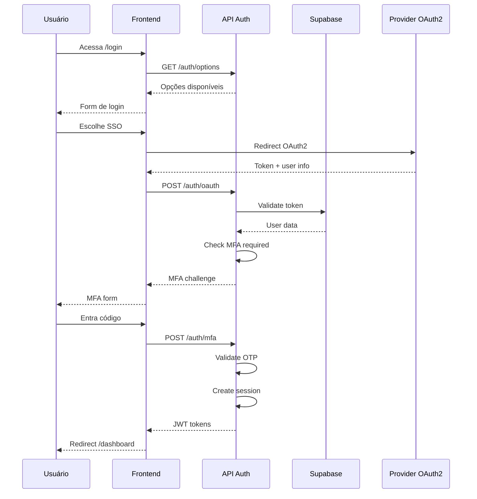

### 1.1 Login + Autenticação Multifator (SSO, OAuth2, 2FA)

**Cenário**: João, gerente de vendas, acessa o CRM pela manhã usando login
corporativo com 2FA.

**Especificações Técnicas**:

```yaml
id: FLOW-001
name: Login com Autenticação Multifator
category: Acesso e Identidade
priority: Critical
sprint: 1

actors:
  - Usuário (Sales/CS/Admin)
  - Sistema de Autenticação
  - Provider OAuth2 (Google/Microsoft)

pre_conditions:
  - Usuário possui conta ativa
  - Credenciais válidas
  - 2FA configurado (se habilitado)

flow_steps:
  1_initial_access:
    description: "Usuário acessa URL do CRM"
    system: Frontend (Next.js)
    validations:
      - HTTPS enforced
      - WAF validation
      - Rate limiting check
    artifacts:
      - apps/web/app/login/page.tsx
      - apps/web/middleware.ts

  2_authentication_choice:
    description: "Seleção do método de autenticação"
    options:
      - Email/Password tradicional
      - SSO Google Workspace
      - SSO Microsoft 365
      - SAML corporativo
    artifacts:
      - apps/web/components/auth/login-form.tsx
      - apps/web/components/auth/sso-buttons.tsx

  3_credential_validation:
    description: "Validação de credenciais"
    system: API (tRPC) + Supabase Auth
    validations:
      - Email format validation (Zod)
      - Password complexity check
      - Account status verification
      - Failed attempts counter
    artifacts:
      - apps/api/src/routers/auth.router.ts
      - packages/validators/src/auth.schema.ts
      - supabase/functions/auth-handler.ts

  4_mfa_challenge:
    description: "Desafio 2FA (se habilitado)"
    methods:
      - SMS OTP (6 dígitos)
      - Authenticator App (TOTP)
      - Email OTP
      - Backup codes
    validations:
      - OTP expiration (5 min)
      - Rate limiting (3 attempts)
      - Device fingerprinting
    artifacts:
      - apps/api/src/services/mfa.service.ts
      - apps/web/components/auth/mfa-challenge.tsx

  5_session_creation:
    description: "Criação de sessão segura"
    security:
      - JWT generation (access + refresh)
      - Session storage (httpOnly cookies)
      - RBAC/ABAC loading
      - Device registration
    artifacts:
      - apps/api/src/services/session.service.ts
      - packages/auth/src/jwt.utils.ts
      - apps/api/src/middleware/auth.middleware.ts

  6_redirect_dashboard:
    description: "Redirecionamento para dashboard"
    validations:
      - Default workspace selection
      - User preferences loading
      - Initial data prefetch
    artifacts:
      - apps/web/app/(dashboard)/page.tsx
      - apps/web/hooks/use-auth.ts

edge_cases:
  - account_locked: "Após 5 tentativas falhas"
  - mfa_device_lost: "Uso de backup codes"
  - sso_provider_down: "Fallback para email/password"
  - session_expired: "Refresh token rotation"
  - concurrent_sessions: "Limite de 3 dispositivos"

technical_artifacts:
  database:
    - schema: users, sessions, mfa_devices
    - indexes: email, session_token

  monitoring:
    - metrics: login_success_rate, mfa_adoption, session_duration
    - alerts: failed_login_spike, unusual_location

  security:
    - logs: auth_attempts, mfa_challenges, session_events
    - compliance: GDPR, SOC2, ISO27001

success_metrics:
  - login_time: <3s (p95)
  - mfa_completion: <30s
  - session_reliability: >99.9%
  - security_incidents: 0
```

**Cenário**: João, gerente de vendas, acessa o CRM pela manhã usando login
corporativo com 2FA.

**Passos Detalhados**:

```yaml
1. Acesso Inicial:
  - Usuário acessa https://crm.intelliflow.io
  - WAF Cloudflare valida origem
  - Redirect para página de login (Next.js RSC)

2. Autenticação:
  - Opções: Email/Senha, SSO Google, SSO Microsoft, SAML
  - Usuário escolhe SSO Microsoft
  - Redirect para login.microsoftonline.com
  - Retorno com token OAuth2

3. Verificação 2FA:
  - Sistema detecta 2FA obrigatório
  - Opções: SMS, Authenticator App, Email
  - Código enviado via Authenticator
  - Validação em <30 segundos

4. Criação de Sessão:
  - JWT gerado com claims (userId, tenantId, roles)
  - Refresh token armazenado (HttpOnly cookie)
  - RLS policies aplicadas no Supabase
  - Redirect para dashboard
```

**Edge Cases**:

- Login falhou 3x → Conta bloqueada por 15min
- Token expirado → Refresh automático silencioso
- IP suspeito → Challenge adicional (CAPTCHA)
- Dispositivo novo → Email de confirmação

**Sistemas Envolvidos**:

- Frontend: `apps/web/app/auth/login/page.tsx`
- API: `apps/api/src/auth/auth.router.ts`
- Supabase Auth + RLS
- Redis (session cache)

**Métricas**:

- Tempo de login: <5s
- Taxa de sucesso 2FA: >98%
- Sessões simultâneas: max 3

**Diagrama de Sequência**:


