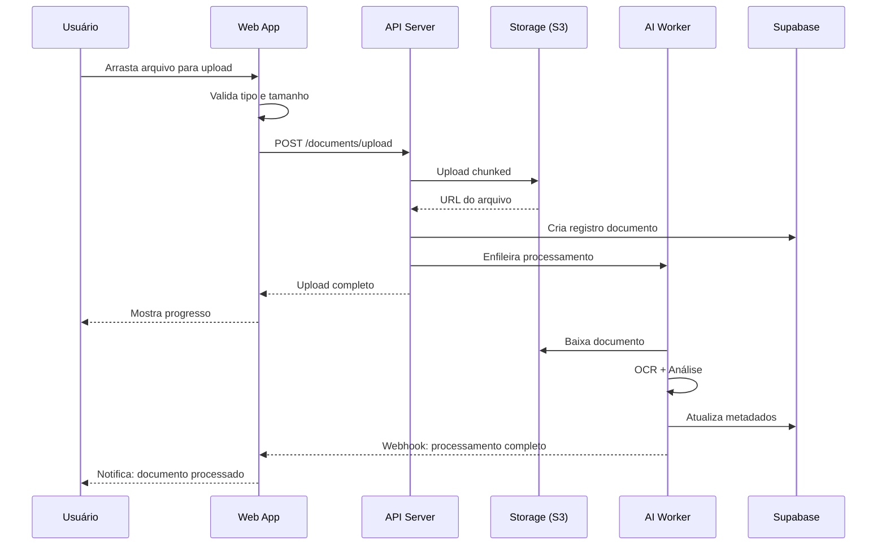

**Especificações Técnicas**:

```yaml
id: FLOW-021
name: Gestão de Documentos
category: Gestão de Documentos
priority: High
sprint: 5

actors:
  - Usuário do CRM
  - Sistema de Storage
  - Sistema de Processamento
  - Sistema de Segurança

pre_conditions:
  - Conta de usuário válida
  - Permissões de upload
  - Espaço de storage disponível
  - Tipo de arquivo suportado

flow_steps:
  1_document_upload:
    description: "Upload de documento"
    file_selection:
      - Drag and drop interface
      - File browser
      - URL import
      - Cloud storage sync
      - Bulk upload
    validation_checks:
      - File type validation
      - Size limits
      - Virus scanning
      - Content analysis
      - Metadata extraction
    progress_tracking:
      - Upload progress
      - Error handling
      - Retry logic
      - Cancellation
      - Resume capability
    artifacts:
      - apps/web/components/documents/upload-zone.tsx
      - apps/api/src/services/file-uploader.service.ts
      - apps/api/src/validators/file-validator.ts

  2_document_processing:
    description: "Processamento do documento"
    ocr_extraction:
      - Text recognition
      - Table extraction
      - Form field detection
      - Language identification
      - Quality assessment
    content_analysis:
      - Keyword extraction
      - Entity recognition
      - Sentiment analysis
      - Document classification
      - Duplicate detection
    metadata_enrichment:
      - Auto-tagging
      - Category assignment
      - Relationship mapping
      - Version tracking
      - Access control
    artifacts:
      - apps/ai-worker/src/chains/document-analysis.chain.ts
      - apps/api/src/services/ocr-processor.service.ts
      - apps/api/src/models/document-metadata.model.ts

  3_entity_linking:
    description: "Vinculação a entidades"
    contact_association:
      - Contact lookup
      - Relationship creation
      - Permission inheritance
      - Activity logging
      - Notification triggers
    deal_attachment:
      - Deal selection
      - Stage relevance
      - Approval workflows
      - Version control
      - Access management
    company_linking:
      - Company matching
      - Subsidiary handling
      - Industry classification
      - Size categorization
      - Relationship mapping
    artifacts:
      - apps/api/src/services/entity-linker.service.ts
      - apps/web/components/documents/entity-selector.tsx
      - apps/api/src/models/document-relationship.model.ts

  4_access_management:
    description: "Gestão de acesso"
    permission_system:
      - Role-based access
      - Individual sharing
      - Time-limited access
      - Watermarking
      - Download restrictions
    sharing_capabilities:
      - Internal team sharing
      - External client sharing
      - Public links
      - Password protection
      - Expiration dates
    audit_trail:
      - Access logging
      - Download tracking
      - View history
      - Modification logs
      - Compliance reporting
    artifacts:
      - apps/api/src/services/access-manager.service.ts
      - apps/web/components/documents/sharing-panel.tsx
      - apps/api/src/models/access-log.model.ts

edge_cases:
  - large_files: "Chunked upload and resumable transfer"
  - corrupted_files: "Integrity checking and recovery"
  - duplicate_content: "Similarity detection and merging"
  - access_conflicts: "Permission resolution and override"
  - storage_limits: "Quota management and cleanup"

technical_artifacts:
  storage:
    - cloud_providers: AWS S3, Google Cloud Storage
    - cdn_integration: Fast content delivery
    - backup_strategy: Multi-region replication
    - lifecycle_management: Automatic archiving

  security:
    - encryption: AES-256 at rest and in transit
    - access_control: Fine-grained permissions
    - audit_logging: Complete activity tracking
    - compliance: GDPR, HIPAA, SOX

  performance:
    - upload_speed: >10MB/s
    - processing_time: <30s for standard documents
    - search_speed: <500ms
    - concurrent_users: 1000+

success_metrics:
  - upload_success_rate: >99%
  - processing_accuracy: >95%
  - search_findability: >90%
  - sharing_adoption: >60%
  - security_incidents: 0
```

---

**Passos Detalhados**:

### 1. Upload de Documento

**Cenário**: Usuário precisa anexar um contrato a um deal no CRM.

1. **Acesso à área de documentos**
   - Usuário navega para o deal ou clica em "Documentos" na sidebar
   - Sistema exibe área de upload com drag-and-drop
   - Interface mostra tipos de arquivo aceitos e limite de tamanho

2. **Seleção do arquivo**
   - Usuário arrasta arquivo para zona de upload OU clica para abrir file
     browser
   - Sistema valida tipo de arquivo (.pdf, .docx, .xlsx, etc.)
   - Barra de progresso aparece durante upload

3. **Validação e processamento**
   - Sistema executa scan de vírus automaticamente
   - OCR extrai texto se for imagem ou PDF escaneado
   - Metadados são extraídos (autor, data criação, páginas)

4. **Confirmação**
   - Toast de sucesso: "Documento 'Contrato_v2.pdf' enviado com sucesso"
   - Documento aparece na lista com thumbnail preview
   - Tags automáticas são sugeridas baseadas no conteúdo

### 2. Vinculação a Entidades

**Cenário**: Documento precisa ser associado a múltiplas entidades.

1. **Seleção de entidades**
   - Painel lateral mostra opções: Contato, Empresa, Deal, Ticket
   - Campo de busca permite encontrar entidade específica
   - Multi-select permite vincular a várias entidades simultaneamente

2. **Definição de relacionamento**
   - Usuário escolhe tipo: "Contrato", "Proposta", "Anexo", "Referência"
   - Data de validade pode ser definida (ex: contrato expira em 1 ano)
   - Notas podem ser adicionadas explicando contexto

3. **Herança de permissões**
   - Sistema pergunta: "Aplicar permissões do Deal a este documento?"
   - Usuário confirma ou customiza permissões
   - Log de acesso é iniciado

### 3. Gestão de Acesso e Compartilhamento

**Cenário**: Documento precisa ser compartilhado com cliente externo.

1. **Abertura do painel de compartilhamento**
   - Usuário clica no ícone de compartilhar no documento
   - Modal exibe opções: Link público, Email, Acesso direto

2. **Configuração de acesso**
   - Tipo de link: Visualização apenas / Download permitido
   - Proteção: Senha opcional, data de expiração
   - Marca d'água: Opção para adicionar identificação no PDF

3. **Envio do link**
   - Usuário digita email do destinatário
   - Mensagem personalizada pode ser adicionada
   - Sistema envia email com link seguro

4. **Rastreamento**
   - Dashboard mostra: visualizações, downloads, data/hora de acesso
   - Alerta opcional quando documento é visualizado pela primeira vez

### 4. Busca e Organização

**Cenário**: Usuário precisa encontrar contrato específico de 6 meses atrás.

1. **Busca avançada**
   - Campo de busca com filtros: tipo, data, entidade, tags
   - Full-text search encontra conteúdo dentro dos documentos
   - Sugestões aparecem enquanto digita

2. **Resultados**
   - Cards mostram preview, título, data, entidades vinculadas
   - Highlight das palavras encontradas no conteúdo
   - Ordenação por relevância ou data

3. **Ações em lote**
   - Checkbox permite selecionar múltiplos documentos
   - Ações: Mover para pasta, Adicionar tags, Arquivar, Excluir
   - Confirmação para ações destrutivas

---

**Edge Cases Detalhados**:

| Cenário                  | Comportamento                       | Recuperação                             |
| ------------------------ | ----------------------------------- | --------------------------------------- |
| Upload de arquivo >100MB | Chunked upload com retry automático | Resume do ponto onde parou              |
| Arquivo corrompido       | Validação de integridade falha      | Mensagem clara + opção de re-upload     |
| Documento duplicado      | Alerta com preview lado-a-lado      | Opção de mesclar ou manter ambos        |
| Permissão negada         | Tela de erro com motivo específico  | Link para solicitar acesso              |
| Storage cheio            | Alerta antes do upload              | Sugestão de arquivar documentos antigos |

---

**Sistemas Envolvidos**:

```
┌─────────────────┐     ┌─────────────────┐     ┌─────────────────┐
│   Frontend      │────▶│   API Server    │────▶│  Storage (S3)   │
│   (Next.js)     │     │   (tRPC)        │     │                 │
└─────────────────┘     └────────┬────────┘     └─────────────────┘
                                 │
                    ┌────────────┼────────────┐
                    ▼            ▼            ▼
            ┌───────────┐ ┌───────────┐ ┌───────────┐
            │ AI Worker │ │  Supabase │ │  CDN      │
            │ (OCR/NLP) │ │  (DB+Auth)│ │(Delivery) │
            └───────────┘ └───────────┘ └───────────┘
```

---

**Métricas de Sucesso**:

| Métrica                         | Target | Medição                                   |
| ------------------------------- | ------ | ----------------------------------------- |
| Taxa de upload bem-sucedido     | >99%   | uploads_success / uploads_total           |
| Tempo médio de processamento    | <30s   | avg(processing_end - upload_end)          |
| Precisão do OCR                 | >95%   | validated_extractions / total_extractions |
| Documentos encontrados na busca | >90%   | found_in_first_page / total_searches      |
| Adoção de compartilhamento      | >60%   | users_sharing / active_users              |

---

**Diagrama de Sequência**:


