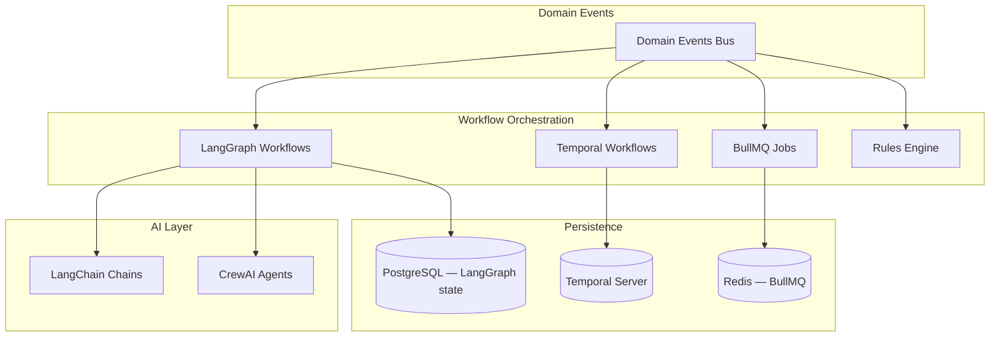

# ADR-005: Workflow Engine Architecture

**Status:** Accepted

**Date:** 2025-12-29

**Deciders:** Tech Lead, DevOps, Product Manager, AI Specialist, Engineering
Team

**Technical Story:** IFC-135, IFC-141

---

## Revision History

| Date       | Change                                                                           |
| ---------- | -------------------------------------------------------------------------------- |
| 2025-12-20 | Original decision: LangGraph + BullMQ hybrid (AI workflows + background jobs)    |
| 2025-12-29 | Extended to 4-engine architecture adding Temporal (durable flows) + Rules Engine |

This ADR consolidates the original workflow-engine decision with the subsequent
workflow-engine-selection refinement into a single authoritative record. Prior
split: `ADR-005-workflow-engine.md` (LangGraph+BullMQ) and
`ADR-014-workflow-engine-decision.md` (+Temporal+Rules).

---

## Context and Problem Statement

IntelliFlow CRM requires workflow automation for a spectrum of use cases:

- **AI agent orchestration** — lead scoring + qualification with
  human-in-the-loop review, multi-agent chains
- **Durable business processes** — case-management lifecycle (open → in-progress
  → closed), approval flows, order sagas that may span days to months
- **Background jobs** — email sending, scheduled reports, data sync,
  rate-limited external API calls
- **Real-time rule evaluation** — low-latency decisions that do not warrant
  workflow overhead

No single engine optimizes for all four profiles: AI-native orchestration,
guaranteed durable execution, simple queued jobs, and sub-millisecond rule
evaluation. The question is **which combination of engines, and when to use
each**.

## Decision Drivers

- **AI Integration** — Seamless integration with LangChain / CrewAI agents
- **Event-Driven** — Trigger workflows from domain events
- **Human-in-the-Loop** — Support approval steps and manual overrides
- **Long-Running Workflows** — Handle processes spanning days/weeks/months
  without state loss
- **Reliability / Durability** — Guaranteed execution semantics for
  business-critical flows
- **Observability** — Trace workflow state, retries, failures
- **Developer Experience** — Easy to define, test, debug workflows
- **Cost** — Licensing, hosting, operational cost
- **Flexibility** — Support both simple rules and complex orchestrations
- **Scalability** — Handle growth from MVP to production scale
- **Maintainability** — Minimize long-term maintenance burden

## Considered Options

### Option 1 — LangGraph (AI-native orchestration)

LangChain's stateful orchestration framework for AI agents.

- **Pros:** purpose-built for AI agent workflows; built-in state persistence /
  checkpointing; native human-in-the-loop via interrupts; seamless
  LangChain/CrewAI integration; LangSmith observability; TypeScript-native;
  visual DAG representation
- **Cons:** newer ecosystem; tight coupling to LangChain; documentation still
  evolving

### Option 2 — BullMQ (Redis-based job queue)

Redis-based job queue with basic workflow primitives.

- **Pros:** already in our stack; mature, battle-tested; excellent observability
  via Bull Board; retries, priorities, delayed jobs; persistence via Redis
- **Cons:** not designed for AI workflows; manual state management; complex
  branching; no native human-in-the-loop

### Option 3 — n8n (low-code workflow platform)

Visual workflow automation with 400+ pre-built integrations.

- **Pros:** visual builder; 300–400 integrations; non-technical users can build
  workflows; webhook/HTTP triggers; self-hosted
- **Cons:** not designed for AI orchestration; custom logic requires code nodes;
  hosting overhead; limited TypeScript; poor LangChain integration; basic state
  management
- **Score (IFC-141 evaluation):** 6.0/10

### Option 4 — Temporal (durable execution framework)

Enterprise-grade workflow orchestration with exactly-once semantics.

- **Pros:** guaranteed workflow completion; exactly-once semantics; full
  TypeScript SDK; proven at scale (Netflix, Uber, Stripe); built-in saga
  pattern; signals for human interaction; time-travel debugging
- **Cons:** requires Temporal Server (infra overhead); steeper learning curve;
  not AI-native (integrates via activities); hosting cost ~$100–200/mo
  self-hosted
- **Score (IFC-141 evaluation):** 7.8/10

### Option 5 — Custom event-driven engine

Build workflow engine on top of existing domain events and BullMQ.

- **Pros:** full control; no external dependencies; direct domain-model
  integration
- **Cons:** 4–6 weeks of development effort; must build reliability features;
  higher maintenance burden; risk of reinventing poorly; no existing ecosystem
  or tooling
- **Score (IFC-141 evaluation):** 6.4/10

## Decision Outcome

**Chosen option: 4-engine hybrid architecture** — each engine handles the
profile it was designed for.

| Workflow Type              | Engine                  | Rationale                                         |
| -------------------------- | ----------------------- | ------------------------------------------------- |
| AI orchestration           | **LangGraph**           | AI-native, state mgmt, human-in-loop, LangChain   |
| Durable business processes | **Temporal**            | Guaranteed execution, saga support, long-running  |
| Background jobs            | **BullMQ**              | Simple queued jobs, existing Redis infrastructure |
| Real-time rules            | **Custom Rules Engine** | Low-latency decisions, domain-specific            |

### Why this combination

1. **Temporal for reliability** — business processes like case management cannot
   fail silently or lose state across weeks/months.
2. **LangGraph for AI** — purpose-built for AI agent orchestration; leverages
   our LangChain/CrewAI investment.
3. **BullMQ for simplicity** — keeps simple background jobs on existing Redis;
   no reason to move these to Temporal.
4. **Rules engine for speed** — low-latency rule evaluation without workflow
   orchestration overhead.

### Architecture Overview

```
Domain Events ──> Event Router ──> Workflow Dispatcher
                                          │
            ┌───────────────┬──────────────┼──────────────┬──────────────┐
            │               │              │              │              │
      [LangGraph]      [Temporal]      [BullMQ]     [Rules Engine]       │
      AI Workflows     Durable Flows   Simple Jobs   Real-time           │
      ─ Lead Scoring   ─ Case          ─ Email Send  ─ Auto-assign       │
      ─ AI Qualify     ─ Approvals     ─ Data Sync   ─ Validation        │
      ─ Agent Chains   ─ Order Sagas   ─ Cleanup     ─ Routing           │
            │               │              │              │              │
            ▼               ▼              ▼              ▼              │
      ┌───────────────────────────────────────────────────────────────┐  │
      │                    Persistence Layer                          │  │
      │   PostgreSQL (LangGraph state) · Temporal Server · Redis      │  │
      └───────────────────────────────────────────────────────────────┘  │
```

### Mermaid representation (LangGraph + BullMQ detail)



## When to use which engine

**Use LangGraph for:**

- AI agent orchestration (multi-agent workflows)
- Lead qualification with AI scoring + human review
- Complex decision trees with conditional branching
- Workflows requiring human-in-the-loop approvals
- Multi-step AI chains with checkpointing

**Use Temporal for:**

- Case lifecycle spanning days to months
- Multi-step approval flows with signals/human interaction
- Order sagas with compensation logic
- Any workflow where exactly-once execution is mandatory
- Workflows that must survive deploys, restarts, or failures

**Use BullMQ for:**

- Simple background jobs (email sending, notifications)
- Scheduled tasks (daily reports, cleanup)
- Data synchronization (Supabase ↔ external APIs)
- Retry-based jobs (webhook deliveries)
- Rate-limited API calls

**Use Rules Engine for:**

- Auto-assignment on entity creation
- Real-time validation / enrichment on domain events
- Simple if-this-then-that routing without state

## Consequences

### Positive

- **Right tool per profile** — no single engine forced outside its sweet spot
- **Guaranteed execution** for business-critical flows via Temporal
- **AI-native** support via LangGraph with built-in state + observability
- **Cost-effective baseline** — BullMQ + LangGraph + Rules Engine are
  open-source; only Temporal adds hosting cost
- **Type safety** — TypeScript support across all four engines
- **Existing Redis infra** leveraged for BullMQ
- **Observability** — LangSmith, Temporal UI, Bull Board, domain event tracing

### Negative

- **Four systems** — developers must learn when to use each
- **Operational overhead** — Temporal Server requires provisioning and
  monitoring
- **Learning curve** — LangGraph and Temporal both non-trivial
- **Vendor coupling** — LangGraph ties us to LangChain ecosystem evolution
- **Hosting cost** — Temporal Server ~$100–200/mo self-hosted, more on Temporal
  Cloud

### Risks & Mitigations

| Risk                              | Mitigation                                                         |
| --------------------------------- | ------------------------------------------------------------------ |
| Temporal operational complexity   | Start with Docker Compose locally, migrate to Temporal Cloud later |
| Team learning curve (LG + TE)     | Training materials, runbooks, pair programming                     |
| Routing complexity (which engine) | Clear documentation + decision matrix (above) in team onboarding   |
| Vendor coupling to LangChain      | Keep LangGraph nodes thin; domain logic stays in use cases         |

## Implementation Notes

### Infrastructure rollout

1. **Week 1** — Provision Temporal Server via Docker Compose; configure Temporal
   TypeScript SDK; create workflow-engine wrapper module.
2. **Week 2** — Implement case-lifecycle workflow on Temporal; wire domain-event
   triggers; build activity implementations.
3. **Week 3** — Implement rules engine for simple automations; configure rule
   definitions; add rule evaluation to event handlers.
4. **Week 4** — Connect all engines to shared event bus; add observability (OTel
   metrics, tracing); document and train team.

### LangGraph workflow example — AI-driven lead qualification

```typescript
// apps/ai-worker/src/workflows/lead-qualification.workflow.ts
import { StateGraph, END } from '@langchain/langgraph';
import { AIMessage, HumanMessage } from '@langchain/core/messages';

interface LeadQualificationState {
  lead_id: string;
  lead_data: any;
  score: number | null;
  qualification_status: 'pending' | 'qualified' | 'disqualified';
  human_review_required: boolean;
  messages: any[];
}

const workflow = new StateGraph<LeadQualificationState>({
  channels: {
    lead_id: { value: (x: string, y: string) => y },
    lead_data: { value: (x: any, y: any) => y },
    score: { value: (x: number | null, y: number | null) => y },
    qualification_status: { value: (x: string, y: string) => y },
    human_review_required: { value: (x: boolean, y: boolean) => y },
    messages: { value: (x: any[], y: any[]) => x.concat(y), default: () => [] },
  },
});

workflow.addNode('score_lead', async (state) => {
  const scoringChain = getScoringChain();
  const score = await scoringChain.invoke({ lead_data: state.lead_data });
  return {
    score: score.value,
    messages: [new AIMessage(`Lead scored: ${score.value}/100`)],
  };
});

workflow.addNode('check_threshold', async (state) => {
  const human_review_required =
    state.score !== null && state.score >= 40 && state.score <= 60;
  return {
    human_review_required,
    messages: [
      new AIMessage(
        human_review_required ? 'Gray zone — human review' : 'Auto-decision'
      ),
    ],
  };
});

workflow.addNode('human_review', async () => ({
  messages: [new HumanMessage('Awaiting human review...')],
}));

workflow.addNode('auto_qualify', async (state) => {
  const qualified = state.score !== null && state.score > 60;
  return {
    qualification_status: qualified ? 'qualified' : 'disqualified',
    messages: [
      new AIMessage(
        `Auto-decision: ${qualified ? 'QUALIFIED' : 'DISQUALIFIED'}`
      ),
    ],
  };
});

workflow.setEntryPoint('score_lead');
workflow.addEdge('score_lead', 'check_threshold');
workflow.addConditionalEdges('check_threshold', (state) =>
  state.human_review_required ? 'human_review' : 'auto_qualify'
);
workflow.addEdge('human_review', END);
workflow.addEdge('auto_qualify', END);

export const leadQualificationWorkflow = workflow.compile();
```

### BullMQ job example — email sending

```typescript
// apps/ai-worker/src/workers/email.worker.ts
import { Worker, Job } from 'bullmq';
import { sendEmail } from '@intelliflow/adapters/email';

export const emailWorker = new Worker(
  'email-queue',
  async (job: Job) => {
    const { to, subject, body, template } = job.data;
    await sendEmail({ to, subject, body, template });
    return { sent_at: new Date().toISOString() };
  },
  { connection: redisConnection, concurrency: 10 }
);
```

### LangGraph state persistence

```sql
CREATE TABLE workflow_state (
  id UUID PRIMARY KEY DEFAULT uuid_generate_v4(),
  workflow_name VARCHAR(255) NOT NULL,
  workflow_id VARCHAR(255) NOT NULL,
  state JSONB NOT NULL,
  checkpoint INTEGER NOT NULL,
  created_at TIMESTAMPTZ NOT NULL DEFAULT NOW(),
  updated_at TIMESTAMPTZ NOT NULL DEFAULT NOW()
);

CREATE INDEX idx_workflow_state_lookup ON workflow_state(workflow_name, workflow_id);
```

### Observability

- **LangGraph:** LangSmith — trace executions, visualize graphs, debug state
  transitions, monitor human-approval steps
- **Temporal:** Temporal UI — workflow visibility, time-travel debugging, signal
  inspection
- **BullMQ:** Bull Board — real-time job monitoring, retry failed jobs, view
  logs, queue metrics
- **Cross-engine:** OpenTelemetry spans + domain-event trace correlation

## Validation Criteria

- [x] LangGraph workflow with human-in-the-loop implemented
- [x] BullMQ worker for background jobs running
- [x] State persistence working for LangGraph
- [x] Workflow triggers from domain events
- [x] LangSmith tracing configured
- [x] Bull Board dashboard accessible
- [x] Integration tests for both systems
- [x] Documentation for when to use each system
- [ ] Temporal Server running in development
- [ ] Case-lifecycle workflow implemented and tested on Temporal
- [ ] Rules engine processing events correctly
- [ ] Workflow execution success rate >95%
- [ ] Event-to-workflow latency <500ms
- [ ] Training materials delivered to team

## Rollback Plan

If Temporal proves too complex to operate:

1. Migrate case-lifecycle durable flows back to LangGraph with longer
   checkpointing
2. Keep BullMQ for simple jobs unchanged
3. Defer rules engine to Phase 2

If LangGraph proves too immature:

1. Migrate AI workflows to BullMQ with manual state management in Redis
2. Continue using LangChain chains without LangGraph orchestration
3. Implement custom state-machine logic in BullMQ jobs

## Links

- [LangGraph Documentation](https://langchain-ai.github.io/langgraphjs/)
- [Temporal Documentation](https://docs.temporal.io/)
- [Temporal TypeScript SDK](https://docs.temporal.io/typescript/introduction)
- [BullMQ Documentation](https://docs.bullmq.io/)
- [LangSmith](https://smith.langchain.com/)
- [Bull Board](https://github.com/felixmosh/bull-board)
- [IFC-141 Comparison Matrix](../../../docs/planning/workflow-comparison-matrix.md)
- Related: [ADR-002 Domain-Driven Design](./ADR-002-domain-driven-design.md)
- Related: [ADR-006 Agent Tool-Calling](./ADR-006-agent-tools.md)
- Related: [ADR-011 Domain Events](./ADR-011-domain-events.md)

## References

- [LangGraph Tutorial](https://langchain-ai.github.io/langgraphjs/tutorials/)
- [State Machines in Workflows](https://temporal.io/blog/workflow-state-machines)
- [Human-in-the-Loop AI Systems](https://huyenchip.com/2023/04/11/llm-engineering.html)
