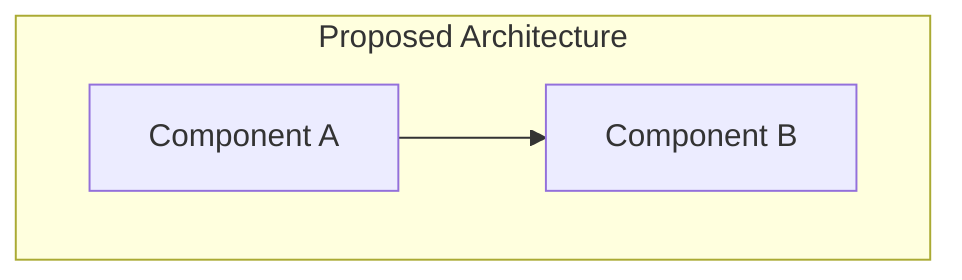

# ARP-XXX: [Title of Architectural Change Proposal]

**Status:** [Draft | Under Review | Approved | Rejected | Implemented]

**Proposed Date:** YYYY-MM-DD

**Proposer:** [Name/Role]

**Reviewers:** [List of required reviewers - e.g., Architecture Team, Security Team]

**Target Sprint:** [Sprint number when this would be implemented]

**Related Tasks:** [Link to Sprint_plan.csv tasks, e.g., IFC-XXX]

---

## Executive Summary

[1-2 paragraph summary of the proposed change. This should be understandable by non-technical stakeholders and answer: What are we changing and why?]

---

## Problem Statement

### Current Situation

[Describe the current architecture, what's working, and what's not working]

### Pain Points

- [Specific problem 1 with evidence]
- [Specific problem 2 with evidence]
- [Specific problem 3 with evidence]

### Impact if Not Addressed

[What happens if we don't make this change? Include business impact, technical debt, risks]

---

## Proposed Solution

### Overview

[High-level description of the proposed architectural change]

### Architecture Diagrams

[Include C4 diagrams or Mermaid diagrams showing the proposed architecture]

### Key Changes

1. **Change 1**: [Description]
2. **Change 2**: [Description]
3. **Change 3**: [Description]

### Technology Stack

| Component | Current | Proposed | Rationale |
|-----------|---------|----------|-----------|
| [Component 1] | [Current tech] | [New tech] | [Why change] |
| [Component 2] | [Current tech] | [New tech] | [Why change] |

---

## Design Considerations

### Quality Attributes Affected

| Quality Attribute | Current State | Proposed State | Impact |
|------------------|---------------|----------------|--------|
| Performance | [Current perf] | [Expected perf] | [+/- impact] |
| Scalability | [Current scale] | [Expected scale] | [+/- impact] |
| Maintainability | [Current maint] | [Expected maint] | [+/- impact] |
| Security | [Current sec] | [Expected sec] | [+/- impact] |
| Cost | [Current cost] | [Expected cost] | [+/- impact] |

### Trade-offs

**What we gain:**
- [Benefit 1 with metrics]
- [Benefit 2 with metrics]
- [Benefit 3 with metrics]

**What we lose or compromise:**
- [Trade-off 1]
- [Trade-off 2]
- [Trade-off 3]

### Risks and Mitigations

| Risk | Likelihood | Impact | Mitigation |
|------|------------|--------|------------|
| [Risk 1] | [H/M/L] | [H/M/L] | [How we'll mitigate] |
| [Risk 2] | [H/M/L] | [H/M/L] | [How we'll mitigate] |

---

## Implementation Plan

### Phase 1: [Phase Name]
**Duration:** [Estimate]
**Tasks:**
- [ ] Task 1
- [ ] Task 2
- [ ] Task 3

### Phase 2: [Phase Name]
**Duration:** [Estimate]
**Tasks:**
- [ ] Task 1
- [ ] Task 2

### Phase 3: [Phase Name]
**Duration:** [Estimate]
**Tasks:**
- [ ] Task 1
- [ ] Task 2

### Migration Strategy

[How will we migrate from current to proposed state? Blue-green deployment? Feature flags? Gradual rollout?]

### Rollback Plan

[How can we safely rollback if the change doesn't work out?]

1. Step 1
2. Step 2
3. Step 3

---

## Success Criteria

### Technical Metrics

- [ ] [Metric 1, e.g., API latency < 100ms]
- [ ] [Metric 2, e.g., Test coverage > 90%]
- [ ] [Metric 3, e.g., Zero regression bugs]

### Business Metrics

- [ ] [Metric 1, e.g., User satisfaction score > 4.5]
- [ ] [Metric 2, e.g., Feature adoption > 70%]
- [ ] [Metric 3, e.g., Support tickets reduced by 30%]

### Acceptance Criteria

- [ ] All tests passing
- [ ] Architecture tests updated and passing
- [ ] Documentation updated
- [ ] Team trained on new architecture
- [ ] Monitoring/alerting in place
- [ ] Performance benchmarks met
- [ ] Security review completed

---

## Resources Required

### Team Allocation

| Role | Effort | Timeline |
|------|--------|----------|
| Backend Developer | [X days/weeks] | [Start - End] |
| Frontend Developer | [X days/weeks] | [Start - End] |
| DevOps Engineer | [X days/weeks] | [Start - End] |
| Architect | [X days/weeks] | [Start - End] |

### Budget

| Item | Cost | Notes |
|------|------|-------|
| [Service/Tool 1] | $XXX/month | [Details] |
| [Service/Tool 2] | $XXX one-time | [Details] |
| **Total** | **$XXX** | |

### Dependencies

- [ ] Dependency 1 (Task ID or external)
- [ ] Dependency 2 (Task ID or external)
- [ ] Dependency 3 (Task ID or external)

---

## Alternatives Considered

### Alternative 1: [Name]

**Description:** [Brief description]

**Pros:**
- [Pro 1]
- [Pro 2]

**Cons:**
- [Con 1]
- [Con 2]

**Why not chosen:** [Explanation]

### Alternative 2: [Name]

**Description:** [Brief description]

**Pros:**
- [Pro 1]
- [Pro 2]

**Cons:**
- [Con 1]
- [Con 2]

**Why not chosen:** [Explanation]

### Do Nothing

**Impact of maintaining status quo:**
- [Impact 1]
- [Impact 2]

**Why not viable:** [Explanation]

---

## Stakeholder Input

### Architecture Team
[Input and concerns]

### Backend Team
[Input and concerns]

### Frontend Team
[Input and concerns]

### DevOps Team
[Input and concerns]

### Product/Business
[Input and concerns]

---

## Decision

[This section is filled out after review]

**Decision:** [Approved | Approved with conditions | Rejected | Deferred]

**Date:** YYYY-MM-DD

**Deciding Body:** [Who made the decision]

**Conditions (if applicable):**
- [Condition 1]
- [Condition 2]

**Rationale:**
[Why was this decision made?]

**Next Steps:**
1. [Create ADR-XXX documenting the decision]
2. [Update Sprint_plan.csv with implementation tasks]
3. [Begin implementation in Sprint X]

---

## Related Documents

- [Link to related ARPs]
- [Link to related ADRs]
- [Link to technical spike results]
- [Link to prototypes or POCs]
- [Link to benchmarks or performance tests]

---

## Appendices

### Appendix A: Detailed Technical Design

[Include detailed technical specifications, API contracts, database schemas, etc.]

### Appendix B: Performance Benchmarks

[Include benchmark results, load test results, etc.]

### Appendix C: Security Analysis

[Include threat model, security review results, etc.]

---

## Revision History

| Version | Date | Author | Changes |
|---------|------|--------|---------|
| 0.1 | YYYY-MM-DD | [Name] | Initial draft |
| 0.2 | YYYY-MM-DD | [Name] | Updated based on review feedback |
| 1.0 | YYYY-MM-DD | [Name] | Approved version |

---

## Guidelines for Using This Template

1. **Use ARPs for significant changes**: ARPs are for proposals that need review and consensus before implementation
2. **Start early**: Submit ARP before starting implementation to get feedback
3. **Be thorough**: Include enough detail for reviewers to make informed decisions
4. **Include diagrams**: Visual representations help communicate complex changes
5. **Quantify impact**: Use metrics and data to support your proposal
6. **Consider alternatives**: Show you've explored multiple options
7. **Plan for failure**: Include rollback plans and risk mitigations
8. **Update status**: Keep status current as proposal moves through review process

## When to Create an ARP

Create an ARP for changes that:

- Introduce new architectural patterns or principles
- Affect multiple bounded contexts or teams
- Require significant resources (time, budget, team allocation)
- Have high risk or impact on system quality attributes
- Need cross-team coordination
- Require new technology or service introductions
- Change fundamental assumptions about the system

Do NOT create ARPs for:

- Minor refactorings within a single module
- Bug fixes or performance optimizations
- Implementation details that don't affect architecture
- Changes already covered by existing ADRs
- Experimental prototypes or spikes (use RFC instead)

## Review Process

1. **Draft**: Author creates ARP and marks as "Draft"
2. **Review Request**: Submit PR and tag required reviewers
3. **Discussion**: Iterate on proposal based on feedback
4. **Decision**: Architecture team approves, rejects, or requests changes
5. **Implementation**: If approved, create ADR and implementation tasks
6. **Closure**: Mark as "Implemented" when complete

**Review SLA:** ARPs should be reviewed within 5 business days of submission.

---

**Related Templates:**
- [ADR Template](../adr/000-template.md) - For documenting decisions
- [Decision Workflow](../decision-workflow.md) - Process for making decisions
