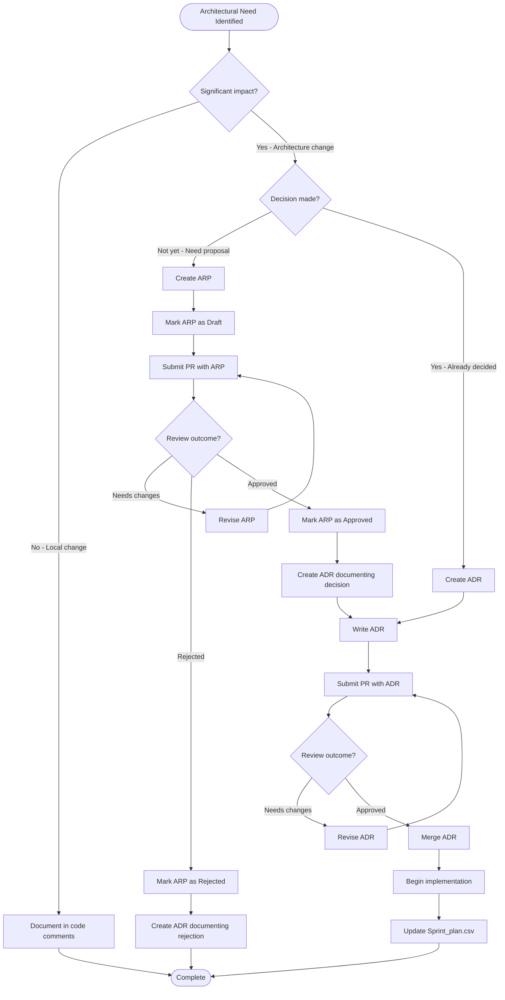

# Architecture Decision Workflow

This document defines the process for making and documenting architectural decisions in the IntelliFlow CRM project.

---

## Overview

Architecture decisions are critical to the long-term success of the project. This workflow ensures that:

1. Decisions are made with appropriate input and review
2. Rationale is documented for future maintainers
3. Stakeholders are aligned before implementation
4. Trade-offs are explicitly considered
5. Changes can be traced and audited

---

## Decision Framework

### Decision Types

We categorize architectural decisions into three levels:

| Level | Type | Examples | Documentation | Review Required |
|-------|------|----------|---------------|-----------------|
| **1** | Strategic | Hexagonal architecture, DDD adoption, technology stack | ADR | Architecture team + stakeholders |
| **2** | Tactical | API design patterns, database schema design, caching strategy | ADR | Architecture team |
| **3** | Implementation | Code organization, naming conventions, utility functions | Code comments | Tech lead review |

**Rule of thumb:**
- If it affects multiple teams or bounded contexts → **Level 1**
- If it affects a single bounded context but is hard to reverse → **Level 2**
- If it's easy to change and local to a module → **Level 3**

---

## When to Use Each Template

### Use an ARP (Architecture Review Proposal) when:

- ✅ You're **proposing** a significant architectural change
- ✅ You need **buy-in** from multiple stakeholders
- ✅ The change requires **significant resources** (time, budget, team)
- ✅ You want **feedback** before committing to implementation
- ✅ The change has **high risk** or affects system quality attributes
- ✅ You need to **compare alternatives** systematically

**Example scenarios:**
- Migrating from REST to GraphQL
- Introducing event sourcing for a bounded context
- Adopting a new database technology
- Implementing multi-region deployment

### Use an ADR (Architecture Decision Record) when:

- ✅ A decision has been **made** (or rejected)
- ✅ You want to **document rationale** for future reference
- ✅ The decision affects **architectural structure**
- ✅ You need to create an **audit trail** of architectural evolution
- ✅ The decision has **trade-offs** that should be explicit

**Example scenarios:**
- Chosen to use tRPC for API layer (decision made)
- Rejected microservices in favor of modular monolith
- Adopted specific design pattern (e.g., Repository pattern)
- Selected specific technology (e.g., Prisma over TypeORM)

### Use Code Comments when:

- ✅ The decision is **local** to a single file or module
- ✅ It's an **implementation detail** not affecting architecture
- ✅ The change is **easily reversible**
- ✅ No cross-team coordination needed

**Example scenarios:**
- Choosing a specific sorting algorithm
- Organizing imports in a certain way
- Using a specific library function

---

## Decision Workflow

### Workflow Diagram



### Detailed Process

#### For Proposals (ARPs)

1. **Identify Need** (Day 0)
   - Recognize that an architectural change is needed
   - Gather initial context and pain points
   - Determine if ARP is warranted (see "When to Use")

2. **Create Draft ARP** (Days 1-3)
   - Copy template from `docs/architecture/arp/000-template.md`
   - Number sequentially (e.g., `ARP-001-migrate-to-graphql.md`)
   - Fill out all sections thoroughly
   - Include diagrams, metrics, and alternatives
   - Status: **Draft**

3. **Internal Review** (Days 4-5)
   - Share with immediate team for feedback
   - Refine proposal based on early input
   - Ensure proposal is clear and complete

4. **Submit for Review** (Day 6)
   - Create GitHub PR with ARP
   - Tag required reviewers (architecture team, affected teams)
   - Update status to **Under Review**
   - Share in team channels for visibility

5. **Review Period** (Days 7-11, max 5 business days)
   - Reviewers provide feedback on PR
   - Author responds to questions and concerns
   - Iterate on proposal as needed
   - Schedule sync meeting if needed for complex topics

6. **Decision Meeting** (Day 12)
   - Architecture team meets to make final decision
   - Consider: technical merit, business value, risks, resources
   - Vote: Approve, Approve with Conditions, Reject, or Defer

7. **Communicate Decision** (Day 13)
   - Update ARP status: **Approved**, **Rejected**, or **Deferred**
   - Fill out "Decision" section in ARP
   - Notify all stakeholders
   - If approved, proceed to create ADR

#### For Decisions (ADRs)

1. **Create ADR** (When decision is made)
   - Copy template from `docs/architecture/adr/000-template.md`
   - Number sequentially (e.g., `ADR-007-use-redis-caching.md`)
   - Document decision, rationale, and consequences
   - Status: **Proposed** (or **Accepted** if already consensus)

2. **Submit for Review** (Day 1)
   - Create GitHub PR with ADR
   - Tag architecture team for review
   - Link to related ARP if exists

3. **Quick Review** (Days 2-3)
   - Architecture team reviews for completeness
   - Ensure rationale is clear and trade-offs documented
   - Approve or request clarifications

4. **Merge ADR** (Day 4)
   - Update status to **Accepted**
   - Merge PR to make decision official
   - Add ADR to documentation site

5. **Implementation** (Following sprints)
   - Create tasks in `Sprint_plan.csv` for implementation
   - Reference ADR in task descriptions
   - Track progress through sprint metrics

6. **Validation** (Post-implementation)
   - Verify validation criteria from ADR are met
   - Document any deviations or learnings
   - Update ADR if decision needs revision

---

## Decision Authority Matrix

This matrix defines who has authority to make different types of architectural decisions.

| Decision Type | Proposer | Reviewer(s) | Decision Authority | Veto Power |
|---------------|----------|-------------|-------------------|------------|
| **Level 1 (Strategic)** | Anyone | Architecture Team + affected teams + Product | Architecture Team (consensus) | CTO, Tech Lead |
| **Level 2 (Tactical)** | Anyone | Architecture Team + affected team | Architecture Team (majority) | Tech Lead |
| **Level 3 (Implementation)** | Developer | Tech Lead or Senior Dev | Tech Lead | None |

### Roles and Responsibilities

**Architecture Team:**
- Review ARPs and ADRs
- Ensure decisions align with strategic direction
- Evaluate technical merit and trade-offs
- Maintain architecture consistency across bounded contexts
- Current members: Backend Lead, Tech Lead, Senior Backend Dev

**Tech Lead:**
- Final decision authority on tactical decisions
- Veto power on strategic decisions if they conflict with roadmap
- Ensure decisions support product goals
- Resolve conflicts between teams

**CTO:**
- Veto power on decisions with significant business impact
- Approves decisions requiring budget or external resources
- Ensures alignment with company strategy

**Proposer (Anyone):**
- Can propose architectural changes via ARP
- Responsible for gathering context and alternatives
- Responds to feedback during review

**Affected Teams:**
- Provide input on proposals that impact their work
- Flag concerns or blockers
- Required reviewers for Level 1 decisions

---

## Review Guidelines

### For Reviewers

When reviewing an ARP or ADR, consider:

1. **Completeness**
   - [ ] Problem statement is clear
   - [ ] Alternatives are thoroughly explored
   - [ ] Trade-offs are explicit
   - [ ] Risks and mitigations are identified
   - [ ] Implementation plan is realistic

2. **Technical Merit**
   - [ ] Solution addresses the problem
   - [ ] Technology choices are appropriate
   - [ ] Design is scalable and maintainable
   - [ ] Performance implications considered
   - [ ] Security reviewed

3. **Alignment**
   - [ ] Aligns with architectural principles (hexagonal, DDD)
   - [ ] Consistent with existing patterns
   - [ ] Supports product roadmap
   - [ ] Fits within budget and timeline

4. **Feasibility**
   - [ ] Team has necessary skills
   - [ ] Resources are available
   - [ ] Dependencies are manageable
   - [ ] Timeline is realistic

5. **Documentation**
   - [ ] Rationale is well-explained
   - [ ] Diagrams are clear
   - [ ] Success criteria are measurable
   - [ ] Rollback plan is viable

### Providing Feedback

- **Be constructive**: Focus on improving the proposal, not criticizing the proposer
- **Be specific**: Point to specific sections and suggest alternatives
- **Be timely**: Review within 2 business days of being tagged
- **Be collaborative**: Assume good intent and work toward consensus
- **Be clear**: Mark feedback as "blocking" vs "nice-to-have"

### Review SLAs

| Document Type | Review Deadline | Decision Deadline |
|---------------|-----------------|-------------------|
| ARP | 2 days per reviewer | 5 business days total |
| ADR | 1 day per reviewer | 3 business days total |

---

## Templates and Examples

### Available Templates

1. **ADR Template**: [`docs/architecture/adr/000-template.md`](./adr/000-template.md)
   - Use for documenting decisions

2. **ARP Template**: [`docs/architecture/arp/000-template.md`](./arp/000-template.md)
   - Use for proposing changes

### Example Documents

1. **ADR-001**: [Hexagonal Architecture](./adr/001-hexagonal-architecture.md)
   - Example of a strategic decision
   - Shows comprehensive trade-off analysis

2. **ADR-002**: [CSV as Source of Truth](../planning/adr/ADR-002-csv-source-of-truth.md)
   - Example of a tactical decision
   - Demonstrates migration planning

---

## Diagram and Flowchart Conventions

For detailed guidance on creating diagrams and flowcharts, see:

- [Diagram Conventions](./diagrams/README.md) - C4 model, PlantUML, Mermaid standards
- [Flowchart Conventions](./flowcharts/README.md) - Process flows, decision trees

**Quick Reference:**

**Use C4 diagrams for:**
- System context (Level 1)
- Container diagrams (Level 2)
- Component diagrams (Level 3)
- Code diagrams (Level 4)

**Use Mermaid for:**
- Sequence diagrams (API flows, interactions)
- Flowcharts (decision workflows, processes)
- State diagrams (entity lifecycle)

**Use PlantUML for:**
- Complex domain models
- Deployment diagrams
- Timing diagrams

---

## Best Practices

### DO

✅ **Write ADRs for all significant decisions** - Even if consensus exists
✅ **Start with "why"** - Context and problem statement are most important
✅ **Be concise** - Aim for 1-2 pages for ADRs, 3-5 for ARPs
✅ **Include diagrams** - Visual representations aid understanding
✅ **Link related documents** - Create a web of architectural knowledge
✅ **Update status** - Keep ADR/ARP status current
✅ **Review periodically** - Revisit decisions after implementation
✅ **Involve stakeholders early** - Get input before decisions are made

### DON'T

❌ **Don't skip documentation** - "Everyone knows" is not sufficient
❌ **Don't document too late** - ADRs should be created when decision is made, not months later
❌ **Don't make it a rubber stamp** - Reviews should be thorough and critical
❌ **Don't leave orphaned ARPs** - Update status even if rejected or deferred
❌ **Don't ignore dissent** - Document concerns even if overruled
❌ **Don't update ADRs** - Create new ADRs that supersede old ones
❌ **Don't skip alternatives** - Show you've considered multiple options

---

## Maintenance and Governance

### Periodic Review

- **Quarterly**: Architecture team reviews all "Accepted" ADRs to ensure they're still valid
- **Per Sprint**: Review ARPs in "Under Review" status to ensure they're progressing
- **Annually**: Audit ADR/ARP process for effectiveness and make improvements

### Updating Decisions

When an architectural decision needs to change:

1. **DO NOT** modify the original ADR
2. **DO** create a new ADR that supersedes the old one
3. Update old ADR status to "Superseded by ADR-XXX"
4. Link both ADRs bidirectionally

**Example:**
```markdown
<!-- In ADR-005 -->
**Status:** Superseded by ADR-023

<!-- In ADR-023 -->
**Status:** Accepted
Supersedes ADR-005
```

### Deprecating Decisions

When a decision becomes irrelevant (e.g., technology no longer used):

1. Update status to "Deprecated"
2. Add note explaining why it's deprecated
3. Keep ADR for historical reference

---

## Tooling and Automation

### Validation

Architecture decisions should be validated with architecture tests where possible:

```typescript
// tests/architecture/boundaries.test.ts
test('domain has no infrastructure dependencies', () => {
  expectNoDependencies(
    ['packages/domain/**'],
    ['packages/adapters/**', 'apps/**']
  );
});
```

### CI/CD Integration

- ADRs/ARPs require CI checks before merging
- Automated checks for:
  - Valid markdown syntax
  - Sequential numbering
  - Required sections present
  - Links are not broken

### Future Enhancements

- [ ] Automated ADR index generation
- [ ] ADR search functionality in docs site
- [ ] GitHub bot to suggest ADR creation on certain PRs
- [ ] Metrics dashboard for decision tracking

---

## Questions and Support

**Questions about the process?**
- Post in `#architecture` Slack channel
- Tag `@architecture-team` for guidance

**Need help writing an ARP or ADR?**
- Review existing examples in `docs/architecture/adr/`
- Pair with a member of the architecture team
- Reference this workflow document

**Process feedback?**
- Submit PR to improve this document
- Raise in architecture team meetings
- Post in `#architecture` channel

---

## Related Documents

- [ADR Template](./adr/000-template.md)
- [ARP Template](./arp/000-template.md)
- [Architecture Overview](./overview.md)
- [Engineering Playbook](../operations/engineering-playbook.md)
- [Diagram Conventions](./diagrams/README.md)
- [Flowchart Conventions](./flowcharts/README.md)

---

**Document Owner:** Architecture Team
**Last Updated:** 2025-12-20
**Next Review:** 2026-03-20
