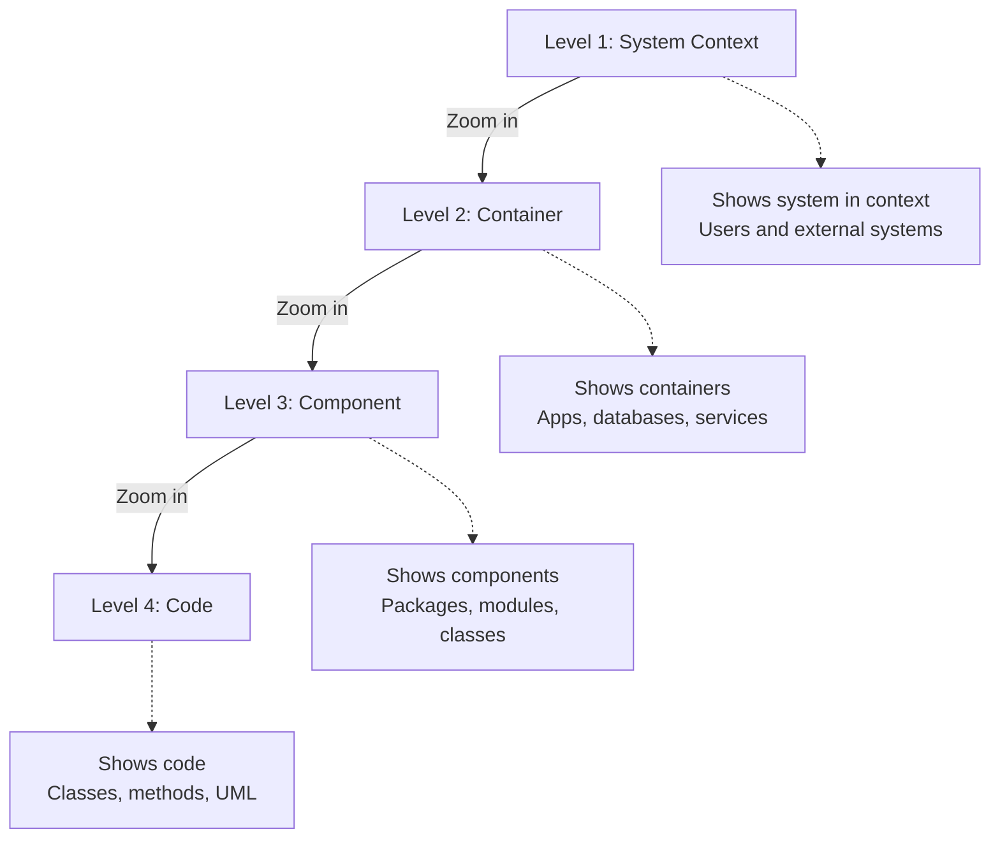
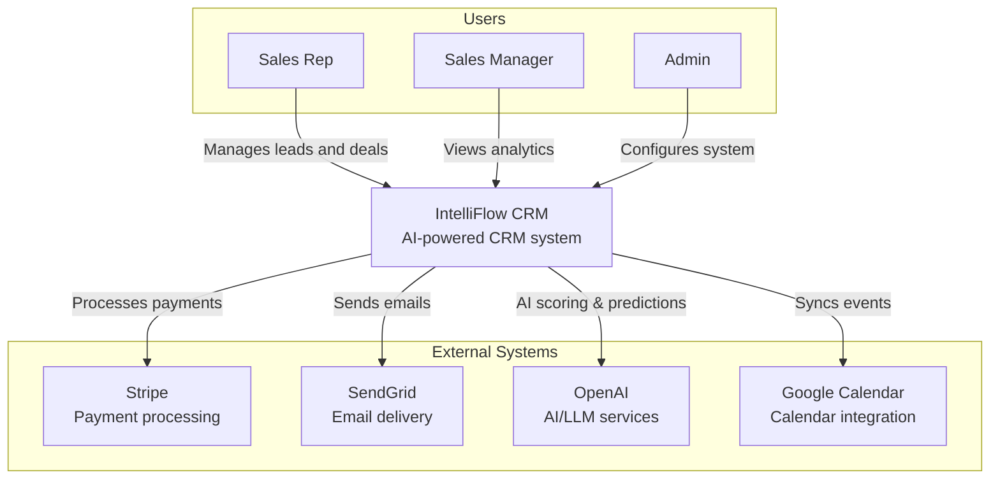
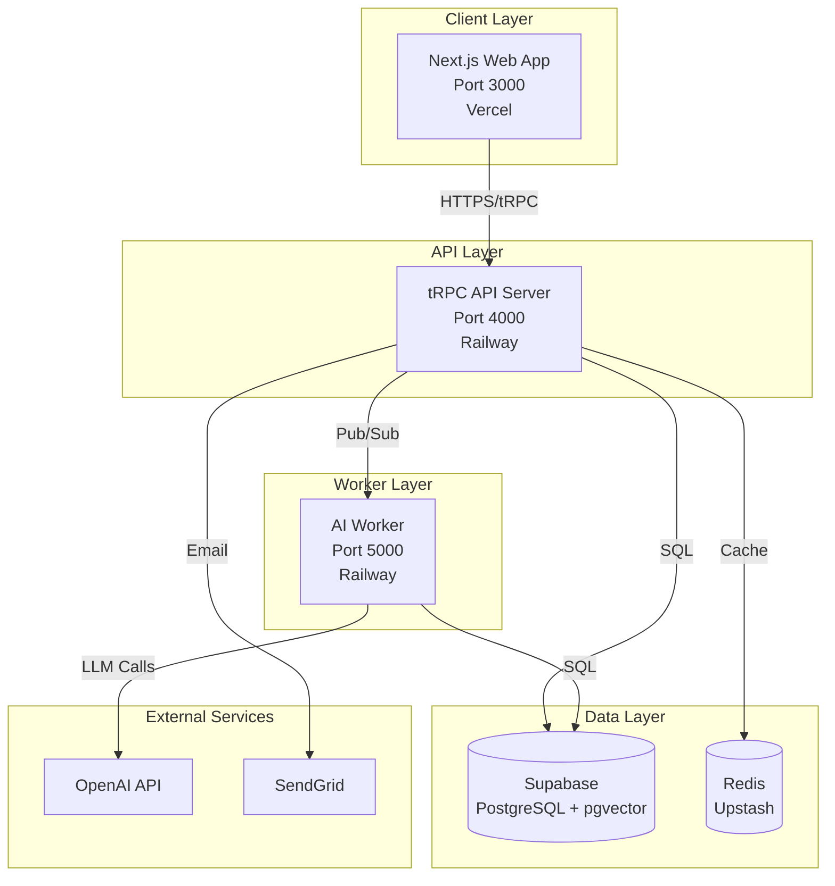
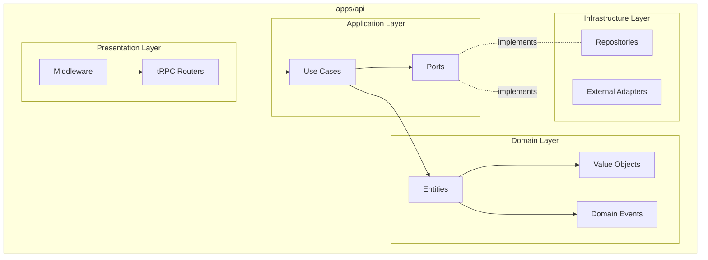
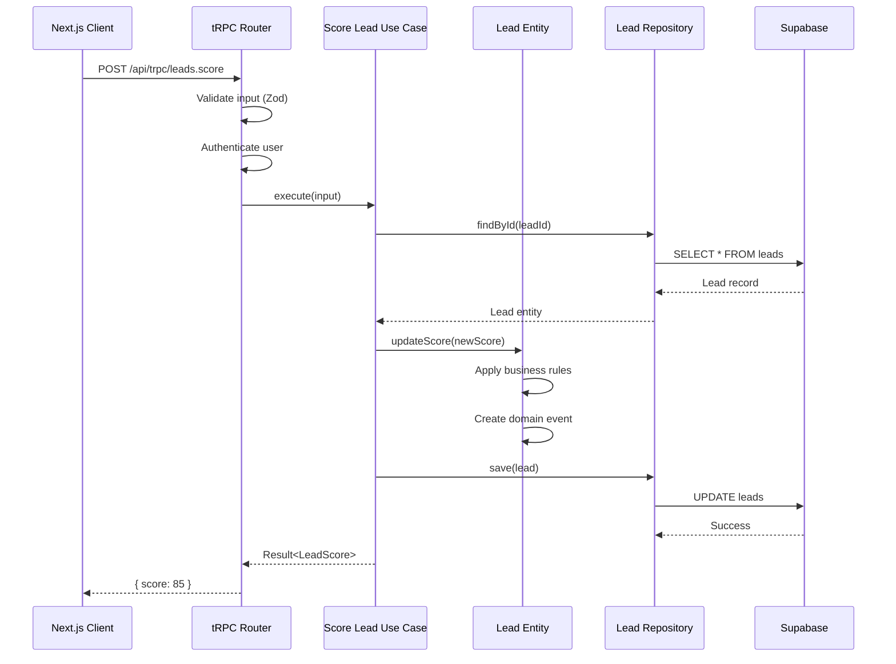
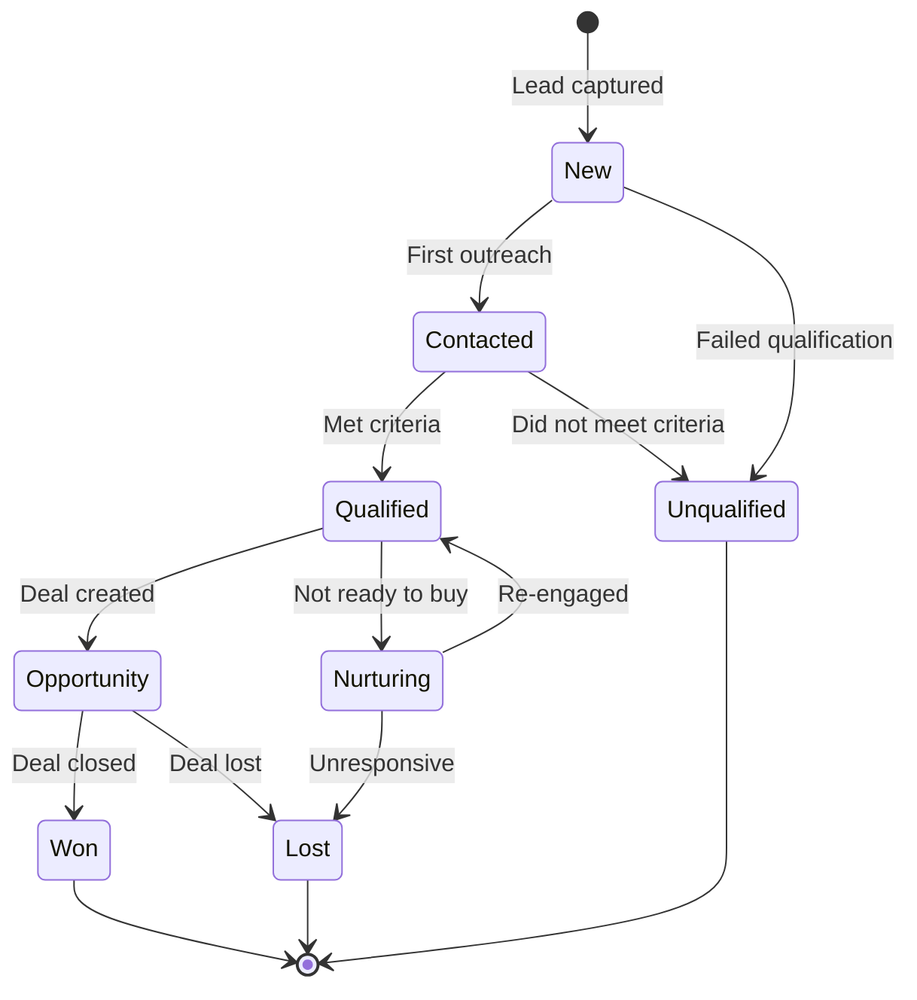
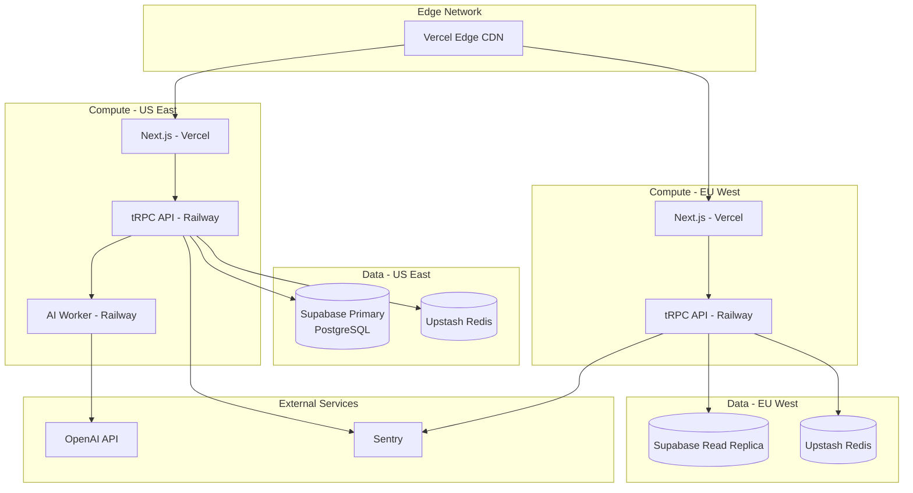
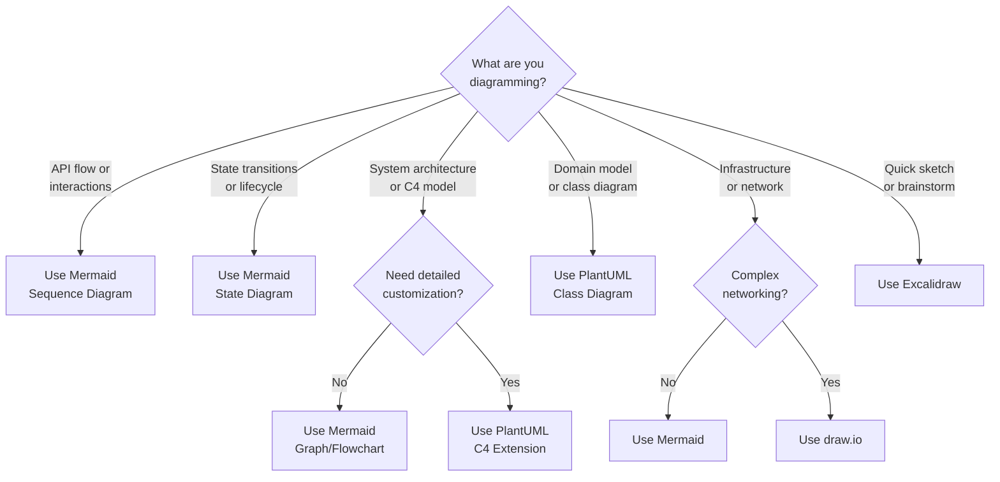
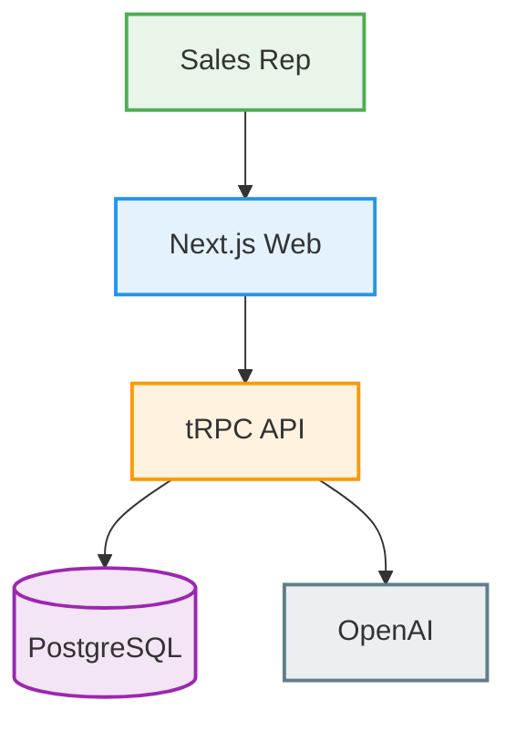

# Architecture Diagram Conventions

This guide defines standards and conventions for creating architecture diagrams
in the IntelliFlow CRM project.

---

## Overview

Clear, consistent diagrams are essential for communicating architecture
decisions. This document establishes:

- Which diagram types to use for different purposes
- Naming and styling conventions
- Tool recommendations
- File organization
- Best practices

---

## Table of Contents

- [C4 Model](#c4-model)
- [Diagram Types](#diagram-types)
- [Tool Selection](#tool-selection)
- [Naming Conventions](#naming-conventions)
- [Styling Guidelines](#styling-guidelines)
- [File Organization](#file-organization)
- [Examples](#examples)
- [Best Practices](#best-practices)

---

## C4 Model

We use the **C4 model** (Context, Containers, Components, Code) as our primary
framework for architecture diagrams.

### C4 Levels



### When to Use Each Level

| Level                  | Purpose                                   | Audience                       | Update Frequency              |
| ---------------------- | ----------------------------------------- | ------------------------------ | ----------------------------- |
| **L1: System Context** | Show how our system fits in the world     | Executives, Product, All teams | Rarely (major features)       |
| **L2: Container**      | Show high-level technical building blocks | Architects, Leads, DevOps      | Occasionally (new services)   |
| **L3: Component**      | Show internal structure of containers     | Developers, Architects         | Regularly (new modules)       |
| **L4: Code**           | Show class/module relationships           | Developers                     | Rarely (complex modules only) |

---

## Diagram Types

### 1. System Context Diagram (C4 Level 1)

**Purpose:** Show how IntelliFlow CRM fits in the broader ecosystem

**Elements:**

- IntelliFlow CRM system (the thing we're building)
- Users and personas
- External systems (Stripe, Sendgrid, OpenAI, etc.)

**Example:**



**File naming:** `01-system-context.mmd` (Mermaid) or `01-system-context.puml`
(PlantUML)

---

### 2. Container Diagram (C4 Level 2)

**Purpose:** Show high-level technical architecture and deployment units

**Elements:**

- Applications (Web, API, Worker)
- Databases (Supabase, Redis)
- Message queues
- External services

**Example:**



**File naming:** `02-container.mmd`

---

### 3. Component Diagram (C4 Level 3)

**Purpose:** Show internal structure of a specific container

**Elements:**

- Packages/modules
- Layers (domain, application, adapters)
- Dependencies between components

**Example (API Container):**



**File naming:** `03-component-api.mmd`

---

### 4. Sequence Diagram

**Purpose:** Show how objects/services interact over time

**Use for:**

- API request flows
- Authentication flows
- Event-driven workflows
- Cross-system interactions

**Example:**



**File naming:** `seq-lead-scoring-flow.mmd`

---

### 5. State Diagram

**Purpose:** Show entity lifecycle and state transitions

**Use for:**

- Lead status flow
- Deal pipeline stages
- Ticket lifecycle
- Order processing states

**Example:**



**File naming:** `state-lead-lifecycle.mmd`

---

### 6. Deployment Diagram

**Purpose:** Show infrastructure and deployment architecture

**Use for:**

- Production environment layout
- Multi-region setup
- Networking and security zones
- CI/CD pipeline

**Example:**



**File naming:** `deploy-production-multi-region.mmd`

---

## Tool Selection

### Recommended Tools

| Tool           | Use Cases                                     | Pros                                                   | Cons                              | Format        |
| -------------- | --------------------------------------------- | ------------------------------------------------------ | --------------------------------- | ------------- |
| **Mermaid**    | Sequence, flowcharts, state, simple diagrams  | Text-based, git-friendly, renders in GitHub/Docusaurus | Limited styling                   | `.mmd`        |
| **PlantUML**   | Complex UML, domain models, detailed diagrams | Powerful, widely supported                             | Requires Java, harder syntax      | `.puml`       |
| **Excalidraw** | Ad-hoc sketches, whiteboarding, brainstorming | Easy to use, beautiful output                          | Not text-based, harder to version | `.excalidraw` |
| **draw.io**    | Complex custom diagrams, network diagrams     | Feature-rich, professional                             | Not text-based, large files       | `.drawio`     |

### Decision Tree



### General Guidelines

**Use Mermaid when:**

- Diagram needs to be versioned with code
- Simple to moderate complexity
- Rendering in GitHub/Docusaurus is important
- Collaboration through text edits

**Use PlantUML when:**

- Complex domain models or UML
- Need precise control over layout
- Using C4-PlantUML extension
- Generating from code

**Use Excalidraw when:**

- Brainstorming or sketching
- Presenting to non-technical stakeholders
- Need hand-drawn aesthetic
- Quick mockups

**Use draw.io when:**

- Complex network diagrams
- Need rich visual customization
- Creating detailed infrastructure diagrams
- One-time diagrams that won't change often

---

## Naming Conventions

### File Naming Pattern

```
<level>-<type>-<subject>.<extension>

Examples:
01-system-context.mmd
02-container.mmd
03-component-api.mmd
03-component-web.mmd
seq-lead-scoring-flow.mmd
state-deal-lifecycle.mmd
deploy-production.mmd
```

### Naming Components

| Level                  | Prefix          | Example                       |
| ---------------------- | --------------- | ----------------------------- |
| System Context (C4-L1) | `01-system-`    | `01-system-context.mmd`       |
| Container (C4-L2)      | `02-container-` | `02-container.mmd`            |
| Component (C4-L3)      | `03-component-` | `03-component-api.mmd`        |
| Code (C4-L4)           | `04-code-`      | `04-code-lead-aggregate.puml` |
| Sequence               | `seq-`          | `seq-authentication-flow.mmd` |
| State                  | `state-`        | `state-lead-lifecycle.mmd`    |
| Deployment             | `deploy-`       | `deploy-production.mmd`       |

---

## Styling Guidelines

### Color Palette

Use consistent colors to represent different types of elements:

| Element Type        | Mermaid Color  | PlantUML Color | Hex          |
| ------------------- | -------------- | -------------- | ------------ |
| **User/Actor**      | `fill:#E8F5E9` | `#E8F5E9`      | Green-50     |
| **Frontend/UI**     | `fill:#E3F2FD` | `#E3F2FD`      | Blue-50      |
| **API/Backend**     | `fill:#FFF3E0` | `#FFF3E0`      | Orange-50    |
| **Database**        | `fill:#F3E5F5` | `#F3E5F5`      | Purple-50    |
| **External System** | `fill:#ECEFF1` | `#ECEFF1`      | Blue-Gray-50 |
| **Worker/Queue**    | `fill:#FFF9C4` | `#FFF9C4`      | Yellow-50    |

### Mermaid Styling Example



### Typography

- **Node labels**: Use clear, concise labels (max 3-4 words)
- **Descriptions**: Add descriptions on second line if needed
- **Ports/URLs**: Include port numbers or URLs for containers

---

## File Organization

### Directory Structure

```
docs/architecture/diagrams/
├── README.md                        # This file
├── 01-system-context.mmd            # C4 Level 1
├── 02-container.mmd                 # C4 Level 2
├── 03-component-api.mmd             # C4 Level 3 (API)
├── 03-component-web.mmd             # C4 Level 3 (Web)
├── 03-component-ai-worker.mmd       # C4 Level 3 (AI Worker)
├── seq-lead-scoring-flow.mmd        # Sequence diagram
├── seq-authentication-flow.mmd      # Sequence diagram
├── state-lead-lifecycle.mmd         # State diagram
├── state-deal-pipeline.mmd          # State diagram
├── deploy-production.mmd            # Deployment diagram
├── domain/                          # Domain-specific diagrams
│   ├── crm-context-bounded.puml     # CRM bounded context
│   ├── intelligence-context.puml    # Intelligence context
│   └── platform-context.puml        # Platform context
└── sketches/                        # Excalidraw/ad-hoc sketches
    ├── initial-architecture.excalidraw
    └── feature-brainstorm.excalidraw
```

### Embedding in Documentation

Reference diagrams in ADRs and documentation:

**Markdown:**

```markdown
## Architecture Overview


```

**In ADRs:**

```markdown
## Proposed Architecture

See [Container Diagram](../diagrams/02-container.mmd) for the high-level
structure.
```

---

## Examples

### Example 1: C4 System Context

See: [`01-system-context.mmd`](./01-system-context.mmd)

### Example 2: C4 Container

See: [`02-container.mmd`](./02-container.mmd)

### Example 3: Sequence Diagram

See: [`seq-lead-scoring-flow.mmd`](./seq-lead-scoring-flow.mmd)

### Example 4: State Diagram

See: [`state-lead-lifecycle.mmd`](./state-lead-lifecycle.mmd)

---

## Best Practices

### DO

✅ **Start with context** - Begin with L1 system context before diving deep ✅
**Use consistent notation** - Stick to established symbols and colors ✅ **Keep
it simple** - Diagrams should clarify, not confuse ✅ **Label everything** - All
nodes and edges should have clear labels ✅ **Version with code** - Store
diagrams in git alongside code ✅ **Update regularly** - Keep diagrams in sync
with implementation ✅ **Add legends** - Include a legend for complex diagrams
✅ **Link diagrams** - Create navigation between abstraction levels

### DON'T

❌ **Don't overcomplicate** - If diagram is hard to read, split it ❌ **Don't
use screenshots** - Use text-based formats for versionability ❌ **Don't mix
abstraction levels** - Keep L1, L2, L3, L4 separate ❌ **Don't duplicate
information** - One source of truth per concept ❌ **Don't skip
titles/legends** - Always include context ❌ **Don't use obscure tools** - Stick
to team-approved tools ❌ **Don't create and forget** - Diagrams need
maintenance

---

## Validation Checklist

Before committing a diagram, verify:

- [ ] Follows C4 model conventions (if applicable)
- [ ] Uses consistent naming convention
- [ ] Includes title and description
- [ ] Colors follow style guide
- [ ] All elements are labeled
- [ ] Legend included (if needed)
- [ ] Renders correctly in GitHub/Docusaurus
- [ ] Linked from relevant documentation
- [ ] Saved in correct directory
- [ ] Source file committed (not just image)

---

## Tools and Resources

### Online Editors

- **Mermaid Live**: https://mermaid.live/
- **PlantUML Online**: http://www.plantuml.com/plantuml/
- **Excalidraw**: https://excalidraw.com/
- **draw.io**: https://app.diagrams.net/

### VS Code Extensions

- **Mermaid Preview**: `bierner.markdown-mermaid`
- **PlantUML**: `jebbs.plantuml`
- **Draw.io Integration**: `hediet.vscode-drawio`
- **Excalidraw**: `pomdtr.excalidraw-editor`

### Documentation

- **C4 Model**: https://c4model.com/
- **Mermaid Docs**: https://mermaid.js.org/
- **PlantUML Reference**: https://plantuml.com/
- **C4-PlantUML**: https://github.com/plantuml-stdlib/C4-PlantUML

---

## Related Documents

- [ADR Template](../adr/000-template.md)
- [ARP Template](../arp/000-template.md)
- [Decision Workflow](../decision-workflow.md)
- [Flowchart Conventions](../flowcharts/README.md)
- [Architecture Overview](../overview.md)

---

**Document Owner:** Architecture Team **Last Updated:** 2025-12-20 **Next
Review:** 2026-03-20
