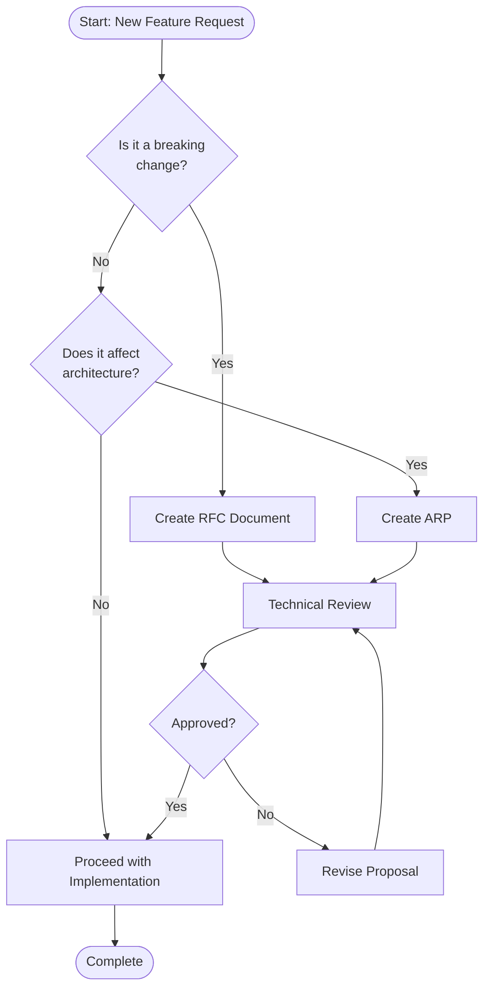
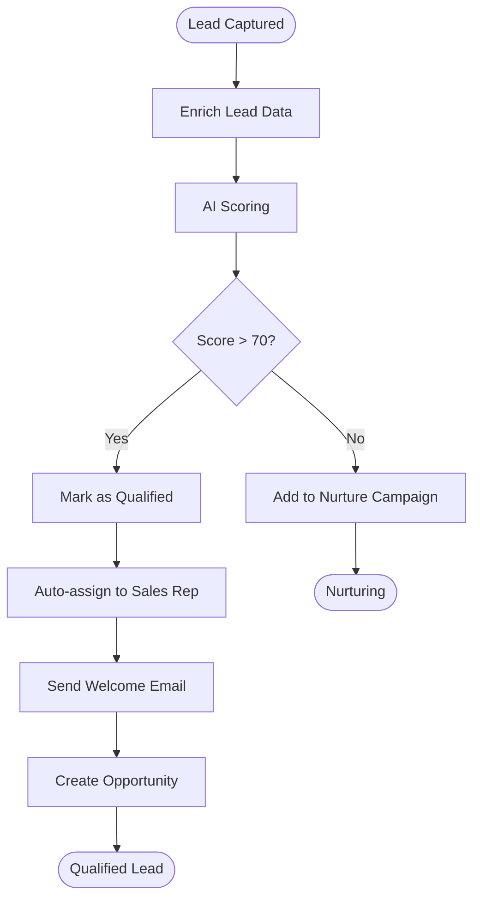
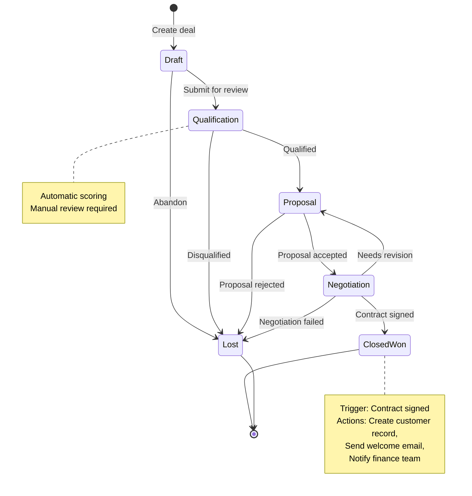
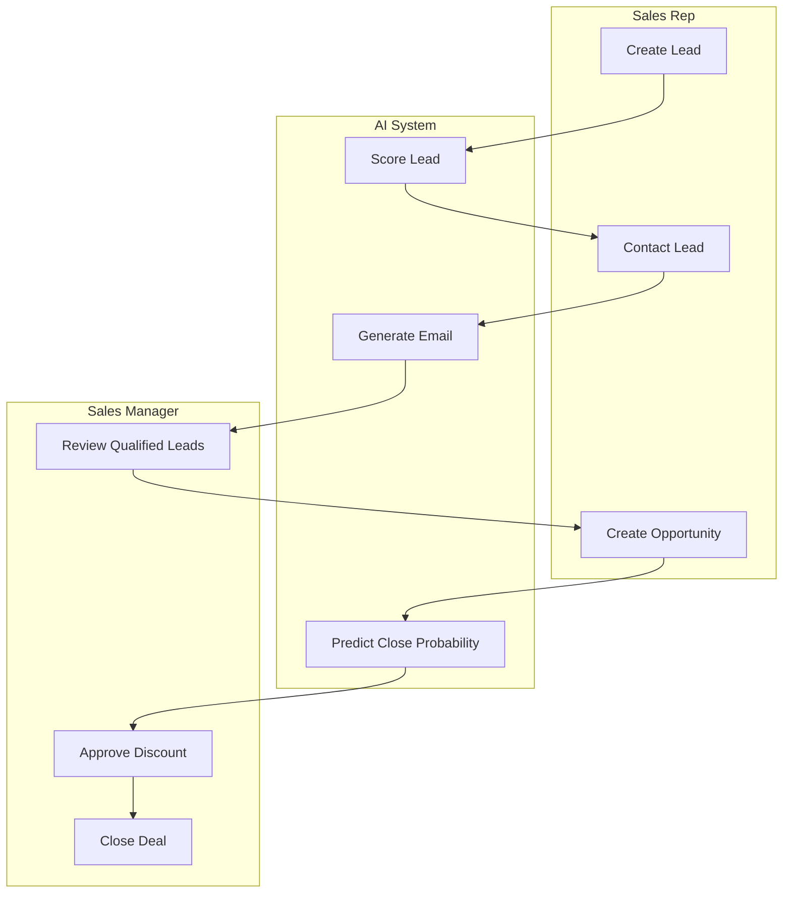
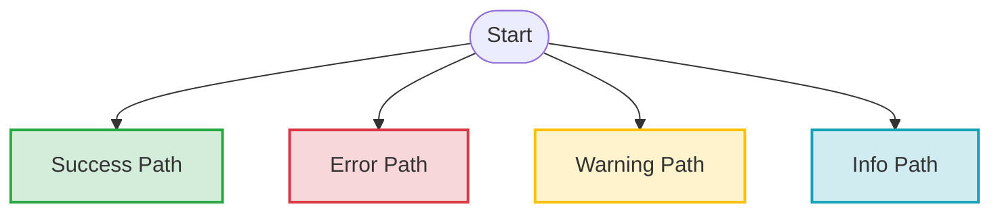
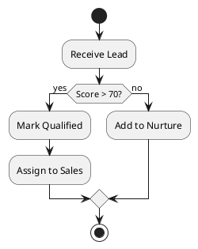
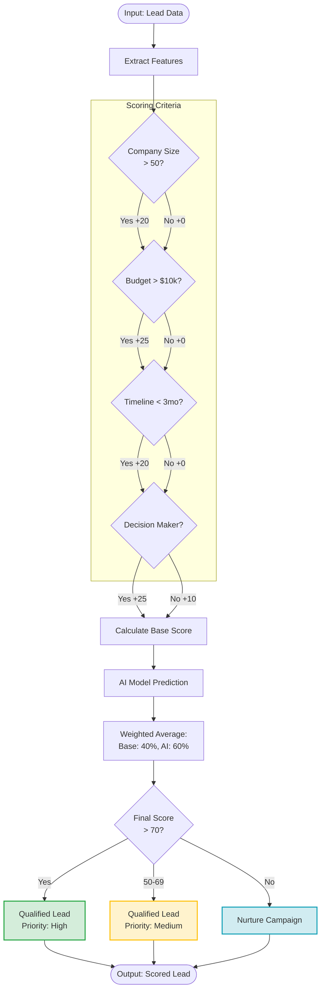
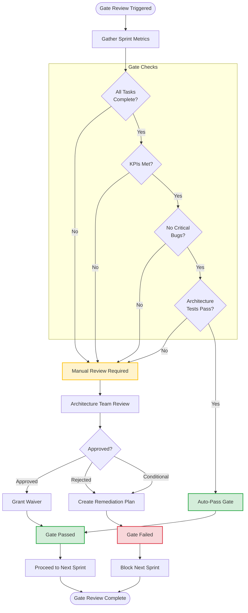

# Process Flowchart Conventions

This guide defines standards for creating process flowcharts and decision trees
in the IntelliFlow CRM project.

---

## Overview

While [Diagram Conventions](../diagrams/README.md) covers architectural diagrams
(C4, containers, components), this document focuses specifically on **process
flowcharts** used to document:

- Decision workflows and approval processes
- Business process flows
- State machine transitions
- Algorithm logic flows
- User journey flows

---

## Table of Contents

- [When to Use Flowcharts](#when-to-use-flowcharts)
- [Flowchart Types](#flowchart-types)
- [Notation Standards](#notation-standards)
- [Tool Selection](#tool-selection)
- [Naming Conventions](#naming-conventions)
- [Best Practices](#best-practices)
- [Examples](#examples)

---

## When to Use Flowcharts

### Use Flowcharts For:

- **Decision workflows**: When documenting approval processes, review flows, or
  multi-step decisions
- **Business processes**: When mapping out sales processes, lead qualification,
  customer onboarding
- **Algorithm logic**: When explaining complex conditional logic or branching
  behavior
- **State transitions**: When showing how entities move through different states
- **User journeys**: When documenting user interaction flows through the system

### Don't Use Flowcharts For:

- **System architecture**: Use C4 diagrams instead (see
  [Diagram Conventions](../diagrams/README.md))
- **API interactions**: Use sequence diagrams instead
- **Data structures**: Use class or entity-relationship diagrams
- **Deployment architecture**: Use deployment diagrams

---

## Flowchart Types

### 1. Decision Flowchart

**Purpose:** Document decision-making processes with multiple conditional
branches

**Example Use Cases:**

- Architecture decision workflow (ARP → ADR process)
- Lead scoring decision logic
- Feature flag evaluation
- Approval workflows

**Example:**



**File naming:** `flow-decision-feature-approval.mmd`

---

### 2. Process Flowchart

**Purpose:** Document sequential business processes with decision points

**Example Use Cases:**

- Lead capture to conversion process
- Customer onboarding workflow
- Support ticket lifecycle
- Invoice generation process

**Example:**



**File naming:** `flow-process-lead-qualification.mmd`

---

### 3. State Transition Flowchart

**Purpose:** Show how entities transition between states based on events

**Example Use Cases:**

- Deal pipeline stages
- Ticket status transitions
- Order fulfillment states
- User account lifecycle

**Example:**



**File naming:** `flow-state-deal-pipeline.mmd`

---

### 4. Swimlane Flowchart

**Purpose:** Show processes across multiple actors or systems with clear
responsibility boundaries

**Example Use Cases:**

- Cross-team workflows
- User-system interactions
- Multi-stage approval processes
- Handoff processes

**Example:**



**File naming:** `flow-swimlane-sales-process.mmd`

---

## Notation Standards

### Shape Conventions

Use standard flowchart shapes with consistent meaning:

| Shape                 | Mermaid Syntax | Meaning        | Example             |
| --------------------- | -------------- | -------------- | ------------------- |
| **Rounded Rectangle** | `([Label])`    | Start/End      | `([Start Process])` |
| **Rectangle**         | `[Label]`      | Process/Action | `[Score Lead]`      |
| **Diamond**           | `{Label}`      | Decision       | `{Score > 70?}`     |
| **Parallelogram**     | `[/Label/]`    | Input/Output   | `[/User Input/]`    |
| **Cylinder**          | `[(Label)]`    | Database       | `[(Save to DB)]`    |
| **Hexagon**           | `{{Label}}`    | Preparation    | `{{Initialize}}`    |
| **Circle**            | `((Label))`    | Connector      | `((A))`             |

### Arrow Types

| Arrow Type  | Mermaid Syntax | Meaning                    |
| ----------- | -------------- | -------------------------- | --- | ------------------------ |
| **Solid**   | `-->`          | Primary flow               |
| **Dotted**  | `-.->`         | Alternative/secondary flow |
| **Bold**    | `==>`          | Important/critical path    |
| **Labeled** | `-->           | Label                      | `   | Condition or description |

### Color Coding

Use colors to indicate flow types or outcomes:



---

## Tool Selection

### Recommended: Mermaid

**Primary tool for all flowcharts** in this project.

**Advantages:**

- Text-based (git-friendly)
- Renders in GitHub and Docusaurus
- Easy to collaborate on
- Versioned with code
- No external dependencies

**Limitations:**

- Limited layout control
- Basic styling options

**When to use:** All flowcharts unless Mermaid limitations block you

---

### Alternative: PlantUML Activity Diagrams

**Use when:**

- Need complex swimlanes
- Require precise layout control
- Generating from code

**Example:**



---

### Alternative: Excalidraw

**Use when:**

- Brainstorming or sketching
- Need hand-drawn aesthetic
- Creating presentation materials

**Not recommended for:**

- Production documentation (not text-based)
- Frequently updated processes

---

## Naming Conventions

### File Naming Pattern

```
flow-<type>-<subject>.mmd

Examples:
flow-decision-architecture-approval.mmd
flow-process-lead-qualification.mmd
flow-state-deal-pipeline.mmd
flow-swimlane-customer-onboarding.mmd
```

### Type Prefixes

| Prefix            | Type               | Example                               |
| ----------------- | ------------------ | ------------------------------------- |
| `flow-decision-`  | Decision flowchart | `flow-decision-gate-review.mmd`       |
| `flow-process-`   | Process flowchart  | `flow-process-invoice-generation.mmd` |
| `flow-state-`     | State transition   | `flow-state-ticket-lifecycle.mmd`     |
| `flow-swimlane-`  | Swimlane flowchart | `flow-swimlane-approval-workflow.mmd` |
| `flow-algorithm-` | Algorithm logic    | `flow-algorithm-scoring-logic.mmd`    |

---

## Best Practices

### DO

✅ **Start simple** - Begin with basic flow, add complexity only if needed ✅
**Use consistent shapes** - Follow standard notation (rectangle for action,
diamond for decision) ✅ **Label clearly** - Every node and edge should have a
clear, concise label ✅ **Show happy path first** - Primary flow should be the
most prominent ✅ **Include legends** - Add legend for complex flowcharts with
custom notation ✅ **Keep it focused** - One flowchart per process; split
complex flows ✅ **Add notes** - Use notes to explain complex decision criteria
✅ **Version with code** - Store in git alongside related code ✅ **Link to
docs** - Reference flowcharts from ADRs, runbooks, and documentation

### DON'T

❌ **Don't overcomplicate** - If flowchart is too complex, break it down ❌
**Don't mix abstraction levels** - Keep process flows separate from technical
architecture ❌ **Don't use custom notation** - Stick to standard flowchart
shapes ❌ **Don't skip decision criteria** - Label all decision branches with
conditions ❌ **Don't leave dead ends** - All branches should lead somewhere ❌
**Don't duplicate information** - Reference other flowcharts instead of copying
❌ **Don't forget error paths** - Show what happens when things go wrong ❌
**Don't skip validation** - Ensure flowchart renders correctly

---

## Examples

### Example 1: Architecture Decision Workflow

See: [Decision Workflow](../decision-workflow.md#workflow-diagram) - Complete
workflow from problem identification to implementation.

---

### Example 2: Lead Scoring Algorithm



**File:** `flow-algorithm-lead-scoring.mmd`

---

### Example 3: Sprint Gate Review Process



**File:** `flow-process-gate-review.mmd`

---

## Validation Checklist

Before committing a flowchart, verify:

- [ ] Follows standard flowchart notation (shapes used correctly)
- [ ] Uses consistent naming convention
- [ ] All decision branches are labeled
- [ ] No dead ends (all paths lead to an end state)
- [ ] Includes start and end nodes
- [ ] Colors follow style guide (if used)
- [ ] Renders correctly in GitHub/Docusaurus
- [ ] Saved in correct directory (`docs/architecture/flowcharts/`)
- [ ] Referenced from relevant documentation
- [ ] Legend included (if custom notation used)

---

## Integration with Documentation

### Referencing Flowcharts

**In ADRs:**

```markdown
## Decision Outcome

The approval workflow follows this process:


```

**In Runbooks:**

```markdown
## Incident Response Process

When a production incident occurs, follow this flowchart:

See:
[Incident Response Flow](../architecture/flowcharts/flow-process-incident-response.mmd)
```

**In User Documentation:**

```markdown
## How Leads Are Qualified

The system uses the following algorithm to score and qualify leads:


```

---

## Related Documents

- [Diagram Conventions](../diagrams/README.md) - For architectural diagrams (C4,
  containers, components)
- [ADR Template](../adr/000-template.md) - Reference flowcharts from ADRs
- [ARP Template](../arp/000-template.md) - Include process flows in proposals
- [Decision Workflow](../decision-workflow.md) - Example of complex decision
  flowchart

---

**Document Owner:** Architecture Team **Last Updated:** 2025-12-21 **Next
Review:** 2026-03-21
