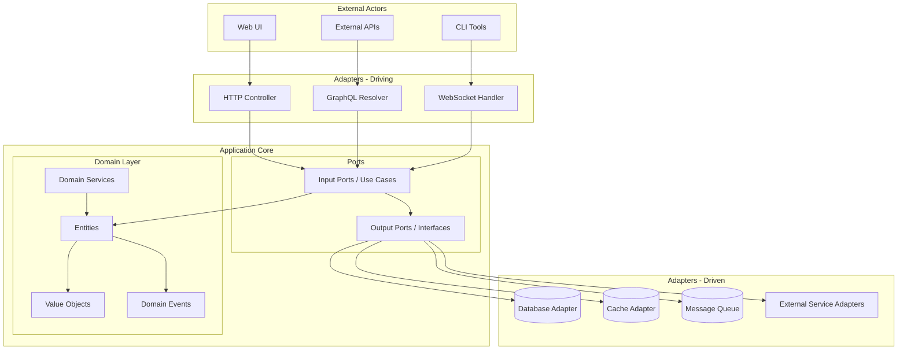
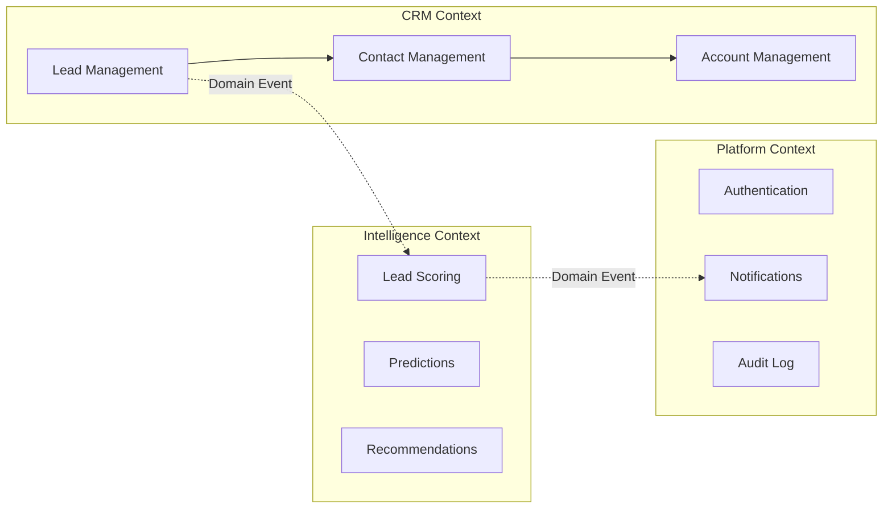
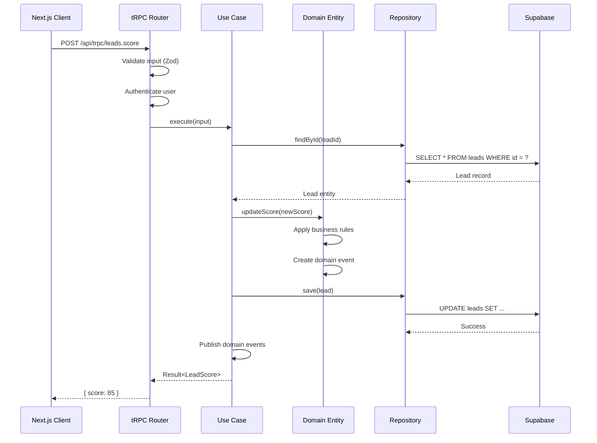
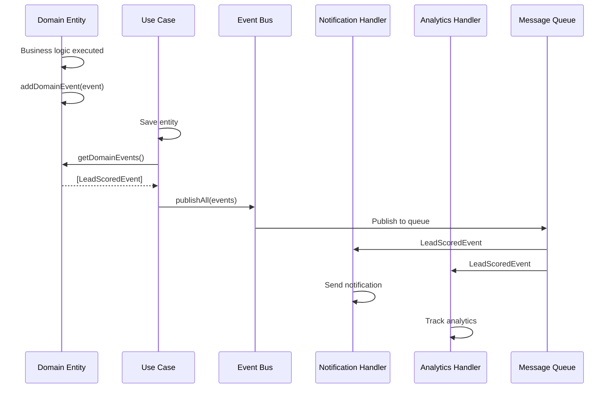
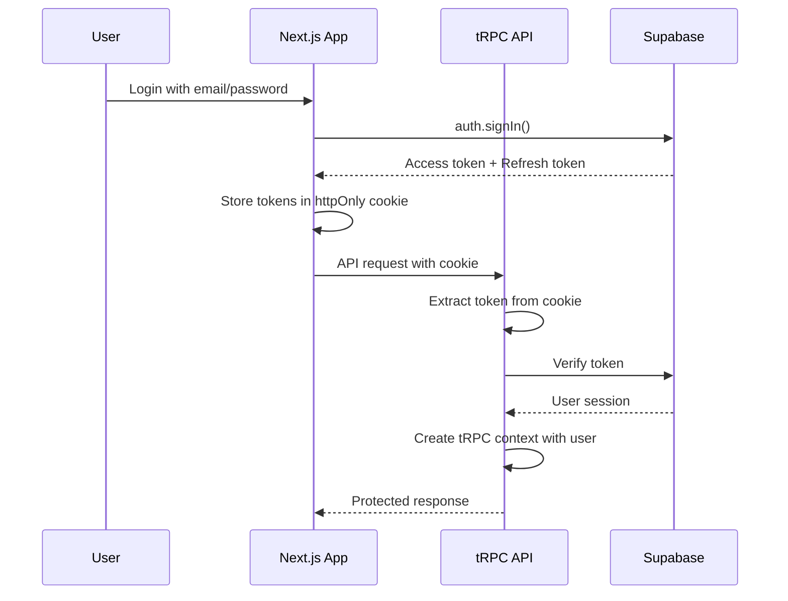
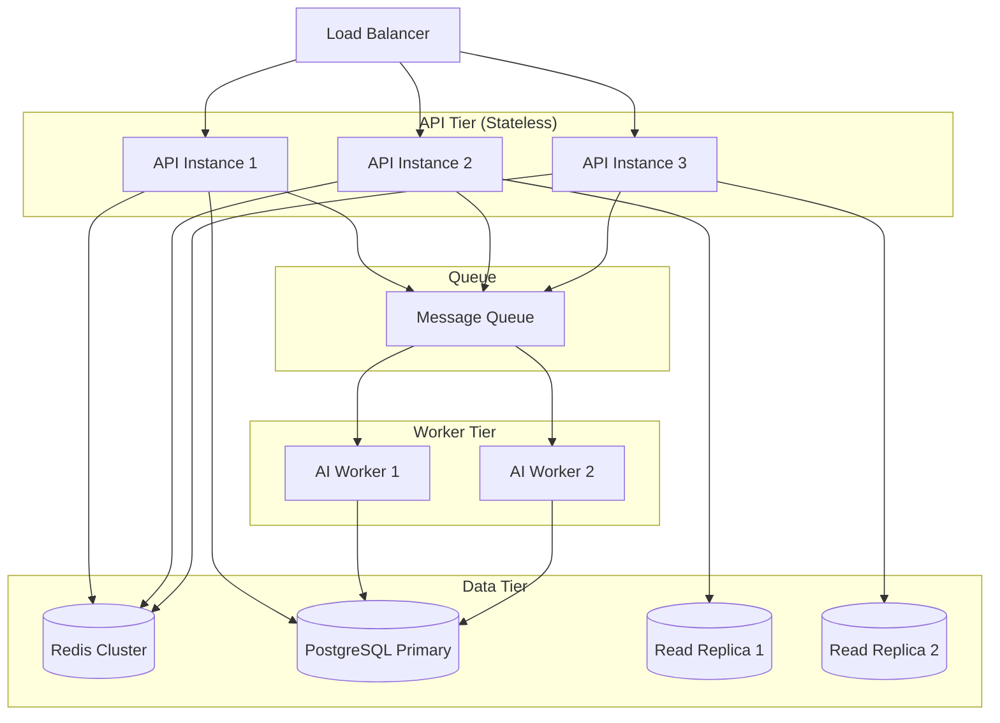
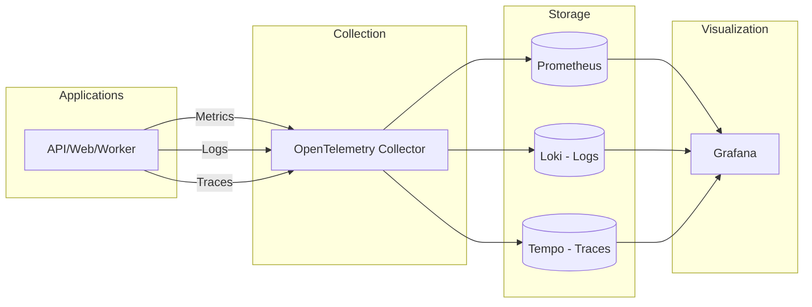
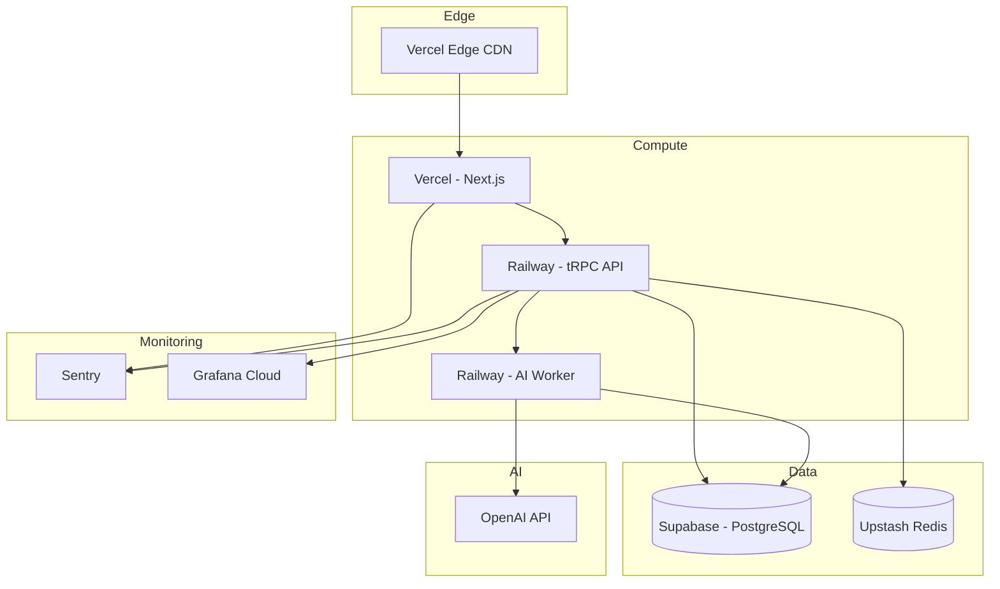

# Architecture Overview

## Introduction

IntelliFlow CRM is built with a modern, scalable architecture that emphasizes
type safety, maintainability, and AI-first development. This document provides a
comprehensive overview of the system architecture, design principles, and key
technical decisions.

## Architectural Style

### Hexagonal Architecture (Ports and Adapters)

IntelliFlow CRM follows the **hexagonal architecture** pattern (also known as
Ports and Adapters) to achieve clean separation of concerns and testability.



**Key Benefits:**

- **Testability**: Core business logic can be tested in isolation
- **Flexibility**: Easy to swap out infrastructure components
- **Maintainability**: Clear boundaries between layers
- **Technology Independence**: Domain logic is framework-agnostic

### Domain-Driven Design (DDD)

The system is organized around **bounded contexts** that represent distinct
business domains:



**Bounded Contexts:**

1. **CRM Context**: Core CRM entities (Leads, Contacts, Accounts, Opportunities)
2. **Intelligence Context**: AI/ML features (Scoring, Qualification,
   Predictions)
3. **Platform Context**: Cross-cutting concerns (Auth, Notifications, Audit)

## System Architecture

### High-Level Component Diagram

```mermaid
graph TB
    subgraph "Client Layer"
        WEB[Next.js Web App<br/>Port 3000]
        MOBILE[Mobile App<br/>Future]
    end

    subgraph "API Gateway Layer"
        TRPC[tRPC API Server<br/>Port 4000]
        REST[REST API<br/>Future]
    end

    subgraph "Application Services"
        API_APP[API Application<br/>Use Cases]
        AI_WORKER[AI Worker<br/>Port 5000]
        TRACKER[Project Tracker<br/>Port 3002]
    end

    subgraph "Domain Layer"
        DOMAIN[Domain Models<br/>@intelliflow/domain]
        VALIDATORS[Validators<br/>@intelliflow/validators]
    end

    subgraph "Data Layer"
        PRISMA[Prisma Client<br/>@intelliflow/db]
        SUPABASE[(Supabase<br/>PostgreSQL + pgvector)]
        REDIS[(Redis<br/>Cache & Rate Limiting)]
    end

    subgraph "AI/ML Services"
        LANGCHAIN[LangChain Chains]
        CREWAI[CrewAI Agents]
        OLLAMA[Ollama<br/>Local LLM]
        OPENAI[OpenAI API<br/>Production]
    end

    subgraph "Observability"
        OTEL[OpenTelemetry]
        PROM[Prometheus]
        GRAFANA[Grafana]
    end

    WEB --> TRPC
    MOBILE -.-> REST

    TRPC --> API_APP
    REST -.-> API_APP

    API_APP --> DOMAIN
    API_APP --> VALIDATORS
    API_APP --> PRISMA
    API_APP --> AI_WORKER

    AI_WORKER --> LANGCHAIN
    LANGCHAIN --> CREWAI
    LANGCHAIN --> OLLAMA
    LANGCHAIN --> OPENAI

    PRISMA --> SUPABASE
    API_APP --> REDIS

    API_APP --> OTEL
    OTEL --> PROM
    PROM --> GRAFANA
```

### Monorepo Structure

The codebase is organized as a **Turborepo monorepo** with pnpm workspaces:

```
intelliFlow-CRM/
├── apps/                      # Applications
│   ├── web/                   # Next.js frontend
│   ├── api/                   # tRPC API server
│   ├── ai-worker/             # AI processing worker
│   └── project-tracker/       # Sprint tracking tool
│
├── packages/                  # Shared packages
│   ├── domain/                # Domain models (DDD)
│   ├── application/           # Use cases & ports
│   ├── adapters/              # Infrastructure adapters
│   ├── db/                    # Prisma client
│   ├── validators/            # Zod schemas
│   ├── api-client/            # tRPC client
│   └── ui/                    # Shared UI components
│
└── infra/                     # Infrastructure
    ├── docker/                # Docker configs
    ├── supabase/              # Database migrations
    └── monitoring/            # Observability configs
```

**Workspace Benefits:**

- **Code Sharing**: Shared packages used across applications
- **Type Safety**: Changes propagate through the entire stack
- **Build Optimization**: Turborepo caches and parallelizes builds
- **Version Control**: Single source of truth for dependencies

## Layer Responsibilities

### 1. Domain Layer (`packages/domain/`)

**Purpose**: Pure business logic with no external dependencies

**Contains:**

- **Entities**: Core business objects with identity (Lead, Contact, Account)
- **Value Objects**: Immutable objects defined by their values (Email,
  PhoneNumber, LeadScore)
- **Domain Events**: Business events that trigger side effects
- **Repository Interfaces**: Contracts for data access (no implementations)
- **Domain Services**: Business logic that doesn't fit in entities

**Rules:**

- No dependencies on infrastructure
- No frameworks or libraries (pure TypeScript)
- All business rules enforced here
- Immutable where possible
- > 95% test coverage required

**Example:**

```typescript
// packages/domain/src/entities/Lead.ts
export class Lead extends AggregateRoot {
  private constructor(
    private id: LeadId,
    private email: Email,
    private score: LeadScore,
    private status: LeadStatus
  ) {
    super();
  }

  public updateScore(newScore: LeadScore): void {
    if (this.score.equals(newScore)) return;

    this.score = newScore;
    this.addDomainEvent(new LeadScoredEvent(this.id, newScore));
  }

  public qualify(): Result<void, DomainError> {
    if (!this.score.isQualified()) {
      return Result.fail(new LeadNotQualifiedError(this.id));
    }

    this.status = LeadStatus.Qualified;
    this.addDomainEvent(new LeadQualifiedEvent(this.id));
    return Result.ok();
  }
}
```

### 2. Application Layer (`packages/application/`)

**Purpose**: Orchestrate domain logic and coordinate infrastructure

**Contains:**

- **Use Cases**: Application-specific business flows
- **Input Ports**: Interfaces for incoming requests
- **Output Ports**: Interfaces for infrastructure (repositories, external APIs)
- **Application Services**: Coordinate multiple use cases
- **DTOs**: Data Transfer Objects for API contracts

**Rules:**

- Depend on domain layer
- Define interfaces for infrastructure
- No direct infrastructure dependencies
- Transaction management
- > 90% test coverage required

**Example:**

```typescript
// packages/application/src/usecases/ScoreLeadUseCase.ts
export class ScoreLeadUseCase {
  constructor(
    private leadRepository: LeadRepository,
    private aiScoringService: AIServicePort,
    private eventBus: EventBusPort
  ) {}

  async execute(input: ScoreLeadInput): Promise<Result<LeadScore, Error>> {
    // 1. Load lead from repository
    const lead = await this.leadRepository.findById(input.leadId);
    if (!lead) return Result.fail(new LeadNotFoundError(input.leadId));

    // 2. Call AI service to calculate score
    const scoreResult = await this.aiScoringService.scoreLead(lead);
    if (scoreResult.isFailure()) return scoreResult;

    // 3. Update domain entity
    lead.updateScore(scoreResult.value);

    // 4. Persist changes
    await this.leadRepository.save(lead);

    // 5. Publish domain events
    await this.eventBus.publishAll(lead.getDomainEvents());

    return Result.ok(scoreResult.value);
  }
}
```

### 3. Adapters Layer (`packages/adapters/`)

**Purpose**: Implement infrastructure concerns

**Contains:**

- **Repository Implementations**: Prisma-based data access
- **External API Clients**: Third-party service integrations
- **Event Publishers**: Message queue implementations
- **Cache Adapters**: Redis caching logic
- **AI Service Adapters**: LangChain/CrewAI implementations

**Rules:**

- Implement output ports from application layer
- Handle all external I/O
- No business logic
- > 90% test coverage with mocks

**Example:**

```typescript
// packages/adapters/src/repositories/PrismaLeadRepository.ts
export class PrismaLeadRepository implements LeadRepository {
  constructor(private prisma: PrismaClient) {}

  async save(lead: Lead): Promise<void> {
    const data = LeadMapper.toPersistence(lead);

    await this.prisma.lead.upsert({
      where: { id: data.id },
      create: data,
      update: data,
    });
  }

  async findById(id: LeadId): Promise<Lead | null> {
    const record = await this.prisma.lead.findUnique({
      where: { id: id.value },
    });

    return record ? LeadMapper.toDomain(record) : null;
  }
}
```

### 4. API Layer (`apps/api/`)

**Purpose**: Expose HTTP/WebSocket endpoints

**Contains:**

- **tRPC Routers**: Type-safe API endpoints
- **Middleware**: Authentication, logging, error handling
- **Context**: Request-scoped dependencies
- **Input Validation**: Zod schema validation

**Rules:**

- Use application layer use cases
- Handle HTTP concerns only
- No business logic
- All inputs validated with Zod

**Example:**

```typescript
// apps/api/src/modules/leads/leads.router.ts
export const leadsRouter = router({
  score: protectedProcedure
    .input(scoreLeadSchema)
    .mutation(async ({ input, ctx }) => {
      const useCase = new ScoreLeadUseCase(
        ctx.leadRepository,
        ctx.aiScoringService,
        ctx.eventBus
      );

      const result = await useCase.execute(input);

      if (result.isFailure()) {
        throw new TRPCError({
          code: 'INTERNAL_SERVER_ERROR',
          message: result.error.message,
        });
      }

      return result.value;
    }),
});
```

### 5. Frontend Layer (`apps/web/`)

**Purpose**: User interface and experience

**Contains:**

- **Pages**: Next.js App Router pages
- **Components**: React components (shadcn/ui)
- **Hooks**: Custom React hooks
- **State Management**: Zustand stores
- **API Client**: tRPC client hooks

**Rules:**

- Use tRPC client for API calls
- Component-driven architecture
- Tailwind CSS for styling
- Accessible (WCAG 2.1 AA)

## Data Flow

### Request Flow (tRPC API)



### Event Flow (Domain Events)



## Technology Decisions

### Why tRPC?

**Benefits:**

- End-to-end type safety without code generation
- Automatic client generation
- Excellent DX with autocomplete
- Smaller bundle size than GraphQL

**Trade-offs:**

- TypeScript only (not a problem for us)
- Limited ecosystem compared to REST/GraphQL
- Requires monorepo or shared types

### Why Prisma?

**Benefits:**

- Type-safe database client
- Great migration workflow
- Introspection and Studio for debugging
- Works well with PostgreSQL

**Trade-offs:**

- Generated code can be large
- Limited support for complex queries
- Performance overhead vs raw SQL

### Why Supabase?

**Benefits:**

- PostgreSQL with pgvector for embeddings
- Built-in authentication
- Real-time subscriptions
- Row Level Security (RLS)
- Great developer experience

**Trade-offs:**

- Vendor lock-in (mitigated by using Prisma)
- Pricing for high-scale usage
- Limited customization vs self-hosted

### Why LangChain + CrewAI?

**Benefits:**

- Rich ecosystem for AI chains
- Multi-agent collaboration with CrewAI
- Easy integration with LLMs
- Streaming support

**Trade-offs:**

- Rapidly evolving APIs
- Performance overhead
- Complex for simple use cases

## Security Architecture

### Authentication Flow



### Authorization Model

- **Row Level Security (RLS)**: Database-level authorization in Supabase
- **RBAC**: Role-Based Access Control for business logic
- **API Keys**: For external integrations
- **Rate Limiting**: Redis-based rate limiting per user/IP

## Scalability Considerations

### Horizontal Scaling



**Strategies:**

- **Stateless API**: All state in database or cache
- **Read Replicas**: Offload read queries
- **Queue-Based Workers**: Async processing for heavy AI tasks
- **CDN**: Static assets served from edge

### Performance Targets

| Metric             | Target  | Measurement    |
| ------------------ | ------- | -------------- |
| API Response (p95) | < 100ms | OpenTelemetry  |
| API Response (p99) | < 200ms | OpenTelemetry  |
| AI Scoring         | < 2s    | Custom metrics |
| Database Query     | < 20ms  | Prisma metrics |
| Frontend FCP       | < 1s    | Lighthouse     |
| Frontend TTI       | < 2s    | Lighthouse     |

## Observability

### Metrics Collection



**Key Metrics:**

- **DORA Metrics**: Deployment frequency, lead time, MTTR, change failure rate
- **Business Metrics**: Lead conversion, scoring accuracy, AI cost
- **System Metrics**: Response time, error rate, throughput

## Deployment Architecture

### Production Environment



## Next Steps

- [Repository Layout](./repo-layout.md): Understand the codebase structure
- [Domain Model](./domain/overview.md): Learn about domain entities
- [API Design](../api/trpc-routes.md): Explore the API
- [Deployment Guide](../guides/deployment.md): Deploy to production

## References

- [Architecture Decision Records](../planning/adr/template.md)
- [Hexagonal Architecture](https://alistair.cockburn.us/hexagonal-architecture/)
- [Domain-Driven Design](https://martinfowler.com/tags/domain%20driven%20design.html)
- [tRPC Documentation](https://trpc.io)
- [Prisma Best Practices](https://www.prisma.io/docs/guides/performance-and-optimization)
