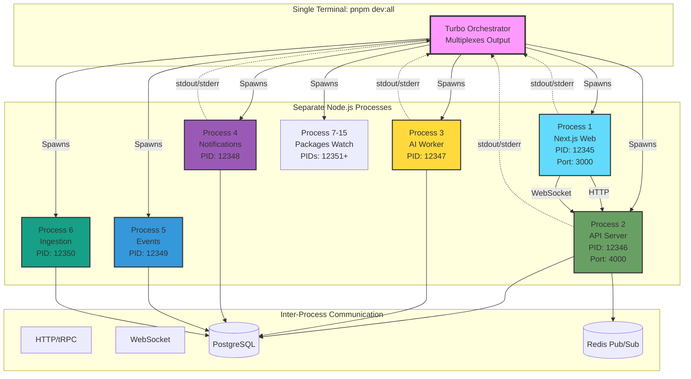
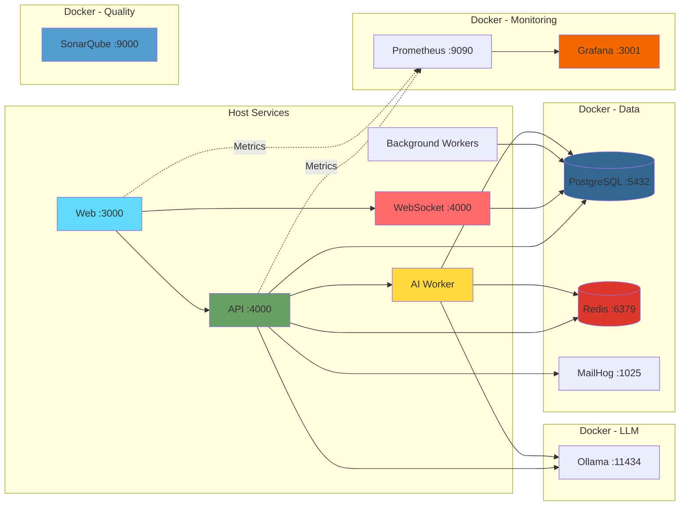

# IntelliFlow CRM - Services Architecture

## Quick Reference

| Command            | Services Started                 | Processes | RAM       | Use Case            |
| ------------------ | -------------------------------- | --------- | --------- | ------------------- |
| `pnpm dev`         | Web + API + AI Worker + Packages | ~10-12    | ~1.5-2 GB | ✅ Most development |
| `pnpm dev:all`     | Above + 3 Workers                | ~13-15    | ~2-3 GB   | Full stack testing  |
| `pnpm dev:full`    | Everything (+ Project Tracker)   | ~14-16    | ~3-4 GB   | Complete system     |
| Separate terminals | Individual services              | As needed | As needed | Cleaner logs        |

**Key Points:**

- 🔄 **Turbo runs services as separate processes**, not threads
- 📊 **Multiplexed output** in one terminal with color-coded logs
- 🎯 **Concurrency: 20** parallel tasks maximum
- ⚡ **Persistent tasks** keep running until Ctrl+C
- 🐳 **Docker services** run independently (must start separately)

## What does `pnpm dev` do?

The `pnpm dev` command runs:

```bash
turbo run dev --filter=!@intelliflow/project-tracker
```

This starts **ALL** workspaces with a `dev` script **EXCEPT** the
project-tracker:

- ✅ Next.js Web App (apps/web)
- ✅ API Server (apps/api)
- ✅ AI Worker (apps/ai-worker)
- ✅ All shared packages in watch mode
- ❌ Workers (notifications, events, ingestion) - **NOT started**
- ❌ Project Tracker - explicitly excluded

**To start workers too**, use: `pnpm dev:all`

## How Concurrency Works (Turbo + pnpm)

### Turbo Configuration

From `turbo.json`:

```json
{
  "ui": "tui", // Terminal UI for multiplexed output
  "concurrency": "20", // Max 20 parallel tasks
  "tasks": {
    "dev": {
      "cache": false, // Never cache dev builds
      "persistent": true // Keep running (don't exit)
    }
  }
}
```

### Process Management

#### When you run `pnpm dev` or `pnpm dev:all`:

1. **Turbo spawns multiple child processes** - one per workspace
2. **All processes run in parallel** (up to 20 concurrent)
3. **Turbo multiplexes output** to a single terminal with TUI (Terminal UI)
4. **Each service gets its own color** in the output
5. **Persistent tasks never exit** - they keep running until you Ctrl+C

#### Example Process Tree:

```
┌─ Terminal (PowerShell/bash)
│
└─ pnpm dev:all
   │
   └─ turbo run dev (orchestrator)
      ├─ [Process 1] apps/web:dev → next dev (port 3000)
      ├─ [Process 2] apps/api:dev → tsx watch src/index.ts (port 4000)
      ├─ [Process 3] apps/ai-worker:dev → tsx watch src/index.ts
      ├─ [Process 4] workers/notifications:dev → tsx watch src/main.ts
      ├─ [Process 5] workers/events:dev → tsx watch src/main.ts
      ├─ [Process 6] workers/ingestion:dev → tsx watch src/main.ts
      └─ [Processes 7-15] packages/*:dev → tsup --watch (build in watch mode)
```

### Output Multiplexing

Turbo's TUI (Terminal UI) shows:

```
┌ apps/web:dev ────────────────────────────────
│ ▲ Next.js 16.0.10
│ - Local:        http://localhost:3000
│ ✓ Ready in 2.1s
├ apps/api:dev ───────────────────────────────
│ [INFO] API Server listening on :4000
│ [INFO] Database connected
├ apps/ai-worker:dev ─────────────────────────
│ [INFO] AI Worker started
│ [INFO] Redis connected
├ workers/notifications-worker:dev ───────────
│ [INFO] Notifications worker started
└──────────────────────────────────────────────
```

### Ctrl+C Behavior

When you press **Ctrl+C**:

1. **Signal propagates to Turbo**
2. **Turbo kills all child processes**
3. **Graceful shutdown** (if services handle SIGTERM)
4. **All processes exit together**

### Resource Considerations

Running `pnpm dev:all` starts ~10-15 processes:

| Service     | Process        | RAM (approx) | CPU        |
| ----------- | -------------- | ------------ | ---------- |
| Next.js Web | Node.js        | ~400-600 MB  | Medium     |
| API Server  | Node.js (tsx)  | ~200-300 MB  | Low        |
| AI Worker   | Node.js (tsx)  | ~150-250 MB  | Low-Medium |
| 3x Workers  | Node.js (tsx)  | ~150 MB each | Low        |
| ~8 Packages | Node.js (tsup) | ~100 MB each | Low        |
| **Total**   | -              | **~2-3 GB**  | **Medium** |

**Plus Docker services add:**

- PostgreSQL: ~50-100 MB
- Redis: ~10-30 MB

### Thread vs Process Model

⚠️ **Important:** These are **processes**, not threads!

- Each service runs as a **separate Node.js process**
- Each has its **own V8 engine and event loop**
- No shared memory between services
- Communication happens via:
  - **HTTP/tRPC** (Web ↔ API)
  - **WebSocket** (Web ↔ WS Server)
  - **Database** (shared state)
  - **Redis** (pub/sub, queues)



### Logging

#### Multiplexed Logs (Default)

All logs appear in one terminal, prefixed by service name:

```
apps/web:dev     | ▲ Next.js started
apps/api:dev     | [INFO] Server listening
ai-worker:dev    | [INFO] Worker ready
```

#### Separate Logs (Alternative)

To run services in separate terminals:

```powershell
# Terminal 1
pnpm dev:web

# Terminal 2
pnpm dev:api

# Terminal 3
pnpm dev:worker

# Terminal 4
pnpm dev:workers
```

#### Log Files

Some services may write to log files:

```bash
logs/dev.log          # If you pipe: pnpm dev 2>&1 | Tee-Object -FilePath logs/dev.log
apps/api/logs/        # API-specific logs (if configured)
```

### Best Practices for Development

#### 1. **Use `pnpm dev` for Core Work**

```bash
pnpm dev              # Enough for most frontend/API development
```

**Starts:** Web + API + AI Worker + Packages **RAM:** ~1.5-2 GB

#### 2. **Add Workers When Needed**

```bash
pnpm dev:all          # When you need background processing
```

**Starts:** Everything above + 3 workers **RAM:** ~2-3 GB

#### 3. **Separate Terminals for Heavy Development**

If Turbo's multiplexed output is hard to read:

```powershell
# Terminal 1: Frontend
pnpm dev:web

# Terminal 2: Backend
pnpm dev:api

# Terminal 3: Workers (if needed)
pnpm dev:workers
```

#### 4. **Monitor Resource Usage**

```powershell
# Windows
Get-Process node | Select-Object ProcessName, Id, CPU, WS | Sort-Object WS -Descending

# Or use Task Manager
# Look for multiple "Node.js JavaScript Runtime" processes
```

#### 5. **Clean Shutdown**

- Press **Ctrl+C once** - Turbo will kill all processes
- Wait for graceful shutdown (2-5 seconds)
- If hung, press **Ctrl+C twice** for force kill

#### 6. **Port Conflicts**

If ports are in use:

```powershell
# Check what's using port 3000
netstat -ano | findstr :3000

# Kill process by PID (from netstat output)
taskkill /PID <PID> /F
```

### Troubleshooting

#### Problem: Services won't start

```bash
# Check if ports are already in use
pnpm dev:status

# Kill all node processes (nuclear option)
taskkill /F /IM node.exe

# Restart Docker services
docker compose restart
```

#### Problem: Out of memory

```bash
# Reduce concurrency in turbo.json
# Change "concurrency": "20" to "concurrency": "10"

# Or run fewer services
pnpm dev              # Instead of pnpm dev:all
```

#### Problem: Logs are overwhelming

```bash
# Run in separate terminals (see Best Practices #3)

# Or redirect to files
pnpm dev:web 2>&1 > logs/web.log
pnpm dev:api 2>&1 > logs/api.log
```

#### Problem: Turbo hangs on Ctrl+C

```powershell
# Force kill all node processes
Get-Process node | Stop-Process -Force

# Or kill specific process tree
taskkill /F /T /PID <turbo_pid>
```

### Performance Tips

1. **Enable Turbo caching for builds** (already configured)
2. **Use SSD** for node_modules (significantly faster)
3. **Increase Node.js memory** if needed:
   ```bash
   export NODE_OPTIONS="--max-old-space-size=4096"  # 4GB
   ```
4. **Close unused applications** to free RAM
5. **Use Docker Desktop resource limits** (Settings → Resources)

## Running Services Overview

```mermaid
graph TB
    subgraph Host["🖥️ HOST SERVICES (Node.js/pnpm)"]
        subgraph Frontend["Frontend Layer"]
            Web["Next.js Web App<br/>Port: 3000/3001<br/><code>pnpm dev:web</code><br/>✅ Started by pnpm dev"]
            Tracker["Project Tracker<br/>Port: 3002<br/><code>pnpm tracker</code><br/>❌ NOT in pnpm dev"]
        end

        subgraph Backend["Backend Layer"]
            API["API Server (tRPC)<br/>Port: 4000<br/><code>pnpm dev:api</code><br/>✅ Started by pnpm dev"]
            WS["WebSocket Server<br/>Port: 4000<br/><code>pnpm dev:api:ws</code><br/>❌ NOT in pnpm dev"]
        end

        subgraph Workers["Worker Services"]
            Notifications["Notifications Worker<br/><code>pnpm dev:workers</code><br/>❌ NOT in pnpm dev"]
            Events["Events Worker<br/><code>pnpm dev:workers</code><br/>❌ NOT in pnpm dev"]
            Ingestion["Ingestion Worker<br/><code>pnpm dev:workers</code><br/>❌ NOT in pnpm dev"]
            AI["AI Worker<br/><code>pnpm dev:worker</code><br/>✅ Started by pnpm dev"]
        end
    end

    subgraph Docker["🐳 DOCKER SERVICES (docker-compose.yml)"]
        subgraph Data["Data Layer"]
            DB[(PostgreSQL + pgvector<br/>Port: 5432<br/><code>docker compose up postgres</code>)]
            DBTest[(PostgreSQL Test<br/>Port: 5433<br/><code>docker compose up postgres-test</code>)]
            Redis[(Redis Cache<br/>Port: 6379<br/><code>docker compose up redis</code>)]
            RedisTest[(Redis Test<br/>Port: 6380<br/><code>docker compose up redis-test</code>)]
        end

        subgraph Tools["Development Tools"]
            Adminer["Adminer DB UI<br/>Port: 8080<br/><code>--profile tools</code>"]
            RedisInsight["RedisInsight UI<br/>Port: 8001<br/><code>--profile tools</code>"]
            Mailhog["MailHog SMTP<br/>Ports: 1025, 8025<br/><code>docker compose up mailhog</code>"]
        end
    end

    subgraph DockerExtra["🐳 ADDITIONAL DOCKER STACKS"]
        subgraph Quality["Code Quality (docker-compose.sonarqube.yml)"]
            Sonar["SonarQube<br/>Port: 9000<br/><code>pnpm sonar:start</code>"]
            SonarDB[(SonarQube PostgreSQL)]
        end

        subgraph LLM["Local LLM (docker-compose.ollama.yml)"]
            Ollama["Ollama<br/>Port: 11434<br/><code>docker compose -f docker-compose.ollama.yml up</code>"]
        end

        subgraph Monitor["Monitoring Stack (infra/monitoring/)"]
            OTel["OpenTelemetry Collector<br/>Ports: 4317, 4318"]
            Prometheus["Prometheus<br/>Port: 9090"]
            Loki["Loki (Logs)<br/>Port: 3100"]
            Tempo["Tempo (Traces)<br/>Port: 3200"]
            Grafana["Grafana<br/>Port: 3001"]
        end
    end

    Web -->|HTTP/REST| API
    Web -->|WebSocket| WS
    API --> DB
    WS --> DB
    API --> Redis
    Notifications --> DB
    Events --> DB
    Ingestion --> DB
    AI --> DB
    AI --> Redis
    API -.->|AI Tasks| AI
    API --> Mailhog

    API -.->|Metrics| OTel
    Web -.->|Metrics| OTel
    Workers -.->|Metrics| OTel
    OTel --> Prometheus
    OTel --> Loki
    OTel --> Tempo
    Prometheus --> Grafana
    Loki --> Grafana
    Tempo --> Grafana

    Sonar -.->|Analysis| SonarDB
    API -.->|LLM Inference| Ollama
    AI -.->|LLM Inference| Ollama

    style Web fill:#61dafb,stroke:#333,stroke-width:2px
    style API fill:#68a063,stroke:#333,stroke-width:2px
    style WS fill:#ff6b6b,stroke:#333,stroke-width:2px
    style AI fill:#ffd93d,stroke:#333,stroke-width:2px
    style DB fill:#336791,stroke:#333,stroke-width:2px
    style Redis fill:#dc382d,stroke:#333,stroke-width:2px
    style Notifications fill:#9b59b6,stroke:#333,stroke-width:2px
    style Events fill:#3498db,stroke:#333,stroke-width:2px
    style Ingestion fill:#16a085,stroke:#333,stroke-width:2px
    style Grafana fill:#f46800,stroke:#333,stroke-width:2px
    style Sonar fill:#549dd0,stroke:#333,stroke-width:2px
    style Ollama fill:#000000,stroke:#fff,stroke-width:2px,color:#fff
```



## Service Details

### 🖥️ HOST SERVICES (Running on your machine)

#### Frontend Services

- **Next.js Web App** (`pnpm dev:web`) ✅ **Auto-started by `pnpm dev`**
  - Port: 3000 (or 3001 alternate)
  - Location: `apps/web/`
  - Framework: Next.js 16 with App Router
  - Features: SSR, React Query, tRPC client
- **Project Tracker** (`pnpm tracker`) ❌ **NOT in `pnpm dev`**
  - Port: 3002
  - Location: `apps/project-tracker/`
  - Purpose: Internal project metrics and tracking

#### Backend Services

- **API Server** (`pnpm dev:api`) ✅ **Auto-started by `pnpm dev`**
  - Port: 4000
  - Location: `apps/api/`
  - Framework: tRPC with Express
  - Features: Type-safe API, authentication, business logic

- **WebSocket Server** (`pnpm dev:api:ws`) ❌ **NOT in `pnpm dev`**
  - Port: 4000 (shared with API)
  - Location: `apps/api/src/ws-server.ts`
  - Features: Real-time updates, subscriptions, live notifications
  - **Must start separately!**

#### Worker Services

- **AI Worker** (`pnpm dev:worker`) ✅ **Auto-started by `pnpm dev`**
  - Location: `apps/ai-worker/`
  - Purpose: AI/ML operations, embeddings, intelligent scoring

- **Notifications Worker** (`pnpm dev:workers`) ❌ **NOT in `pnpm dev`**
  - Location: `apps/workers/notifications-worker/`
  - Purpose: Process and send notifications

- **Events Worker** (`pnpm dev:workers`) ❌ **NOT in `pnpm dev`**
  - Location: `apps/workers/events-worker/`
  - Purpose: Handle domain events and async processing

- **Ingestion Worker** (`pnpm dev:workers`) ❌ **NOT in `pnpm dev`**
  - Location: `apps/workers/ingestion-worker/`
  - Purpose: Data ingestion and ETL processes

### 🐳 DOCKER SERVICES

#### Core Data Services (`docker compose up -d`)

- **PostgreSQL (Main)**
  - Port: 5432
  - Image: pgvector/pgvector:pg16
  - Database: intelliflow_dev
  - Volume: postgres_data
- **PostgreSQL (Test)**
  - Port: 5433
  - Database: intelliflow_test
  - Volume: postgres_test_data

- **Redis (Main)**
  - Port: 6379
  - Image: redis:7-alpine
  - Volume: redis_data
- **Redis (Test)**
  - Port: 6380
  - Image: redis:7-alpine

- **MailHog (Email Testing)**
  - SMTP Port: 1025
  - Web UI: http://localhost:8025
  - Catches all outbound emails

#### Development Tools (`docker compose --profile tools up -d`)

- **Adminer** (Database UI)
  - URL: http://localhost:8080
  - Database management interface
- **RedisInsight** (Redis UI)
  - URL: http://localhost:8001
  - Redis management interface

#### Code Quality Stack (`pnpm sonar:start`)

File: `docker-compose.sonarqube.yml`

- **SonarQube**
  - URL: http://localhost:9000
  - Default: admin/admin
  - Static code analysis
- **SonarQube PostgreSQL**
  - Internal database for SonarQube

#### Local LLM Stack

File: `docker-compose.ollama.yml`

- **Ollama**
  - Port: 11434
  - Run: `docker compose -f docker-compose.ollama.yml up -d`
  - Local LLM inference (Llama, Mistral, etc.)

#### Monitoring Stack (`cd infra/monitoring && docker compose up -d`)

File: `infra/monitoring/docker-compose.monitoring.yml`

- **OpenTelemetry Collector**
  - OTLP gRPC: 4317
  - OTLP HTTP: 4318
  - Central telemetry hub

- **Prometheus**
  - URL: http://localhost:9090
  - Metrics storage and queries
- **Loki**
  - Port: 3100
  - Log aggregation
- **Tempo**
  - Port: 3200
  - Distributed tracing
- **Grafana**
  - URL: http://localhost:3001
  - Credentials: admin/admin
  - Unified observability dashboard

## Common Development Commands

### Quick Start Commands

```bash
# 🚀 Start core development (Web + API + AI Worker + Packages)
pnpm dev

# 🔥 Start everything except project-tracker (includes workers)
pnpm dev:all

# 💯 Start absolutely everything (including project-tracker)
pnpm dev:full

# 🐳 Start Docker infrastructure
docker compose up -d

# 🛑 Stop Docker services
docker compose down
```

### Start Individual Host Services

```bash
# Frontend
pnpm dev:web              # Next.js Web App (port 3000)
pnpm tracker              # Project Tracker (port 3002)

# Backend
pnpm dev:api              # API Server (port 4000)
pnpm dev:api:ws           # WebSocket Server (port 4000) ⚠️ Must start separately!

# Workers
pnpm dev:worker           # AI Worker only
pnpm dev:workers          # All background workers (notifications, events, ingestion)
```

### Docker Stack Commands

```bash
# Core data services
docker compose up -d                    # Start PostgreSQL, Redis, MailHog
docker compose up -d postgres redis     # Start specific services only
docker compose --profile tools up -d    # Include Adminer & RedisInsight

# Additional stacks
pnpm sonar:start                        # Start SonarQube (code quality)
docker compose -f docker-compose.ollama.yml up -d          # Start Ollama (local LLM)
cd infra/monitoring && docker compose up -d                # Start monitoring stack

# Management
docker compose ps                       # List running services
docker compose logs -f [service]        # Follow logs
docker compose down -v                  # Stop and remove volumes
docker compose restart [service]        # Restart specific service
```

### Check Running Services

```bash
# Check which ports are in use (Windows)
pnpm dev:status
# Or manually:
netstat -ano | findstr :3000
netstat -ano | findstr :4000

# Check Docker services
docker compose ps

# Monitor dev services (bash script)
pnpm dev:check
```

### Database Commands

```bash
pnpm db:generate          # Generate Prisma client
pnpm db:migrate           # Run migrations
pnpm db:seed              # Seed database
pnpm db:studio            # Open Prisma Studio (port 5555)
pnpm db:reset             # Reset database
```

## Port Reference

| Service              | Port      | Location | Command                                          | In `pnpm dev`? |
| -------------------- | --------- | -------- | ------------------------------------------------ | -------------- |
| **Host Services**    |
| Web App              | 3000/3001 | Host     | `pnpm dev:web`                                   | ✅ Yes         |
| Project Tracker      | 3002      | Host     | `pnpm tracker`                                   | ❌ No          |
| API Server           | 4000      | Host     | `pnpm dev:api`                                   | ✅ Yes         |
| WebSocket Server     | 4000      | Host     | `pnpm dev:api:ws`                                | ❌ No          |
| AI Worker            | -         | Host     | `pnpm dev:worker`                                | ✅ Yes         |
| Notifications Worker | -         | Host     | `pnpm dev:workers`                               | ❌ No          |
| Events Worker        | -         | Host     | `pnpm dev:workers`                               | ❌ No          |
| Ingestion Worker     | -         | Host     | `pnpm dev:workers`                               | ❌ No          |
| **Docker Services**  |
| PostgreSQL           | 5432      | Docker   | `docker compose up postgres`                     | -              |
| PostgreSQL Test      | 5433      | Docker   | `docker compose up postgres-test`                | -              |
| Redis                | 6379      | Docker   | `docker compose up redis`                        | -              |
| Redis Test           | 6380      | Docker   | `docker compose up redis-test`                   | -              |
| MailHog SMTP         | 1025      | Docker   | `docker compose up mailhog`                      | -              |
| MailHog UI           | 8025      | Docker   | `docker compose up mailhog`                      | -              |
| Adminer              | 8080      | Docker   | `--profile tools`                                | -              |
| RedisInsight         | 8001      | Docker   | `--profile tools`                                | -              |
| Prisma Studio        | 5555      | Host     | `pnpm db:studio`                                 | -              |
| **Code Quality**     |
| SonarQube            | 9000      | Docker   | `pnpm sonar:start`                               | -              |
| **LLM**              |
| Ollama               | 11434     | Docker   | `docker compose -f docker-compose.ollama.yml up` | -              |
| **Monitoring**       |
| Grafana              | 3001      | Docker   | See monitoring section                           | -              |
| Prometheus           | 9090      | Docker   | See monitoring section                           | -              |
| Loki                 | 3100      | Docker   | See monitoring section                           | -              |
| Tempo                | 3200      | Docker   | See monitoring section                           | -              |
| OTLP HTTP            | 4318      | Docker   | See monitoring section                           | -              |
| OTLP gRPC            | 4317      | Docker   | See monitoring section                           | -              |

## Service Dependencies



## Infrastructure as Code (IaC)

### Docker Compose Files

| File                                             | Purpose             | Start Command                                       |
| ------------------------------------------------ | ------------------- | --------------------------------------------------- |
| `docker-compose.yml`                             | Core data services  | `docker compose up -d`                              |
| `docker-compose.sonarqube.yml`                   | Code quality        | `pnpm sonar:start`                                  |
| `docker-compose.ollama.yml`                      | Local LLM           | `docker compose -f docker-compose.ollama.yml up -d` |
| `infra/monitoring/docker-compose.monitoring.yml` | Observability stack | `cd infra/monitoring && docker compose up -d`       |

### Service Profiles

```bash
# Start with tools (Adminer + RedisInsight)
docker compose --profile tools up -d

# Start specific services only
docker compose up -d postgres redis

# Start everything in base compose file
docker compose up -d
```

### Environment Files

- `.env.local` - Local development overrides (gitignored)
- `.env` - Default environment template (committed)
- `.env.test` - Test environment (committed)

### Infrastructure Locations

- `infra/docker/` - Docker-related configs
- `infra/monitoring/` - Observability stack
- `infra/supabase/` - Supabase migrations and policies

## Typical Startup Sequence

### Minimal Setup (Most Common)

```bash
# 1. Start Docker services (one-time, keeps running)
docker compose up -d

# 2. Run migrations (if needed)
pnpm db:migrate

# 3. Start development
pnpm dev
```

This gives you: Web App (3000) + API (4000) + AI Worker + PostgreSQL + Redis

### Full Development Setup

```bash
# 1. Start Docker infrastructure
docker compose up -d

# 2. Seed database (first time)
pnpm db:seed

# 3. Start all services
pnpm dev:all
```

This gives you: Web + API + AI Worker + All Background Workers + Infrastructure

### Complete Setup with Observability

```bash
# 1. Start core infrastructure
docker compose up -d

# 2. Start monitoring stack
cd infra/monitoring && docker compose up -d && cd ../..

# 3. Start code quality (optional)
pnpm sonar:start

# 4. Start local LLM (optional)
docker compose -f docker-compose.ollama.yml up -d

# 5. Start all application services
pnpm dev:all

# 6. Open monitoring dashboards
# Grafana: http://localhost:3001 (admin/admin)
# Prometheus: http://localhost:9090
```

### What's Running Where?

#### After `docker compose up -d`:

- ✅ PostgreSQL (5432, 5433)
- ✅ Redis (6379, 6380)
- ✅ MailHog (1025, 8025)

#### After `pnpm dev`:

- ✅ Next.js Web (3000)
- ✅ API Server (4000)
- ✅ AI Worker
- ❌ WebSocket Server (must start with `pnpm dev:api:ws`)
- ❌ Background Workers (must start with `pnpm dev:workers`)
- ❌ Project Tracker (must start with `pnpm tracker`)

#### After `pnpm dev:all`:

- ✅ Everything in `pnpm dev` PLUS:
- ✅ Notifications Worker
- ✅ Events Worker
- ✅ Ingestion Worker
- ❌ Still missing: WebSocket Server, Project Tracker

### Recommended Daily Workflow

```bash
# Morning startup
docker compose up -d              # Wake up infrastructure (if stopped)
pnpm dev                          # Start core development

# When you need workers
pnpm dev:workers                  # In separate terminal

# When you need WebSocket
pnpm dev:api:ws                   # In separate terminal

# Evening shutdown
# Ctrl+C in all terminal windows
docker compose stop               # Optional: stop Docker (or leave running)
```
