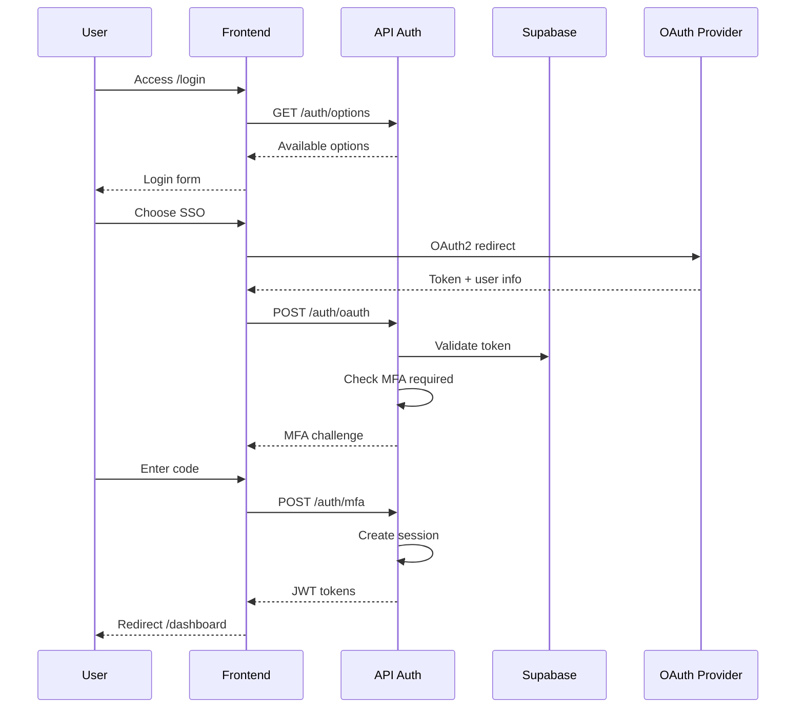

# IntelliFlow CRM - Page Map & User Flows

This document provides a comprehensive overview of all pages, routes, navigation
structure, and user flows in the IntelliFlow CRM web application.

> **Note**: For detailed user flow specifications with YAML definitions, Mermaid
> diagrams, and technical artifacts, see the **Flow Documentation** at:
> `apps/project-tracker/docs/metrics/_global/flows/`
>
> The flow index is at:
> `apps/project-tracker/docs/metrics/_global/flows/flow-index.md`
>
> **For integration tasks and page specs**: See
> `docs/design/integration-backlog.md` (23 tasks with API requirements)

---

## Table of Contents

1. [Route Overview](#route-overview)
2. [Page Map by Category](#page-map-by-category)
3. [Authentication & Authorization](#authentication--authorization)
4. [Navigation Structure](#navigation-structure)
5. [User Flows Summary](#user-flows-summary)
6. [Route Groups & Layouts](#route-groups--layouts)
7. [API Routes](#api-routes)
8. [Flow Documentation Reference](#flow-documentation-reference)

---

## Route Overview

### Summary Statistics

| Category        | Count |
| --------------- | ----- |
| Total Pages     | 68    |
| Public Pages    | 20    |
| Protected Pages | 48    |
| API Routes      | 16    |
| Layouts         | 15    |

---

## Page Map by Category

### 1. Public Pages (No Authentication Required)

These pages are accessible without login. Located in `(public)` route group.

| Route                     | Page            | Description                                                                |
| ------------------------- | --------------- | -------------------------------------------------------------------------- |
| `/`                       | Home            | Landing page (shows PublicHomePage or AuthenticatedHomePage based on auth) |
| `/login`                  | Login           | Email/password + OAuth login                                               |
| `/signup`                 | Sign Up         | New account registration                                                   |
| `/signup/success`         | Sign Up Success | Registration confirmation                                                  |
| `/forgot-password`        | Forgot Password | Password reset request                                                     |
| `/reset-password/[token]` | Reset Password  | Password reset with token                                                  |
| `/logout`                 | Logout          | Session termination                                                        |
| `/about`                  | About           | Company information                                                        |
| `/features`               | Features        | Product features showcase                                                  |
| `/pricing`                | Pricing         | Subscription plans                                                         |
| `/security`               | Security        | Security practices                                                         |
| `/contact`                | Contact         | Contact form                                                               |
| `/partners`               | Partners        | Partner program                                                            |
| `/press`                  | Press           | Press releases                                                             |
| `/status`                 | Status          | System status page                                                         |
| `/blog`                   | Blog            | Blog listing                                                               |
| `/blog/[slug]`            | Blog Post       | Individual blog article                                                    |
| `/careers`                | Careers         | Job listings                                                               |
| `/careers/[id]`           | Job Detail      | Individual job posting                                                     |
| `/lp/[slug]`              | Landing Page    | Dynamic marketing landing pages                                            |

---

### 2. Authentication Pages

| Route                        | Page               | Description                                     |
| ---------------------------- | ------------------ | ----------------------------------------------- |
| `/auth/callback`             | OAuth Callback     | Handles OAuth provider redirects (Google, etc.) |
| `/auth/mfa/verify`           | MFA Verification   | Two-factor authentication input                 |
| `/auth/verify-email/[token]` | Email Verification | Email confirmation with token                   |

---

### 3. Dashboard

| Route                  | Page                | Description                             |
| ---------------------- | ------------------- | --------------------------------------- |
| `/dashboard`           | Dashboard           | Main dashboard with widgets and metrics |
| `/dashboard/new`       | New Dashboard       | Create custom dashboard                 |
| `/dashboard/customize` | Customize Dashboard | Edit dashboard layout and widgets       |

---

### 4. CRM Core - Leads

| Route                     | Page            | Description                       | Sidebar Section |
| ------------------------- | --------------- | --------------------------------- | --------------- |
| `/leads`                  | Leads List      | All leads with filters and search | Lead Views      |
| `/leads?view=my`          | My Leads        | Leads assigned to current user    | Lead Views      |
| `/leads?view=starred`     | Starred Leads   | Bookmarked leads                  | Lead Views      |
| `/leads?view=recent`      | Recent Leads    | Recently viewed leads             | Lead Views      |
| `/leads?segment=new-week` | New This Week   | Leads created this week           | Segments        |
| `/leads?segment=hot`      | Hot Leads       | Leads with score >80              | Segments        |
| `/leads?segment=followup` | Needs Follow-up | Leads requiring action            | Segments        |
| `/leads/new`              | New Lead        | Create lead form                  | -               |
| `/leads/[id]`             | Lead Detail     | Lead 360° view with activities    | -               |

---

### 5. CRM Core - Contacts

| Route            | Page           | Description                 |
| ---------------- | -------------- | --------------------------- |
| `/contacts`      | Contacts List  | All contacts with filters   |
| `/contacts/new`  | New Contact    | Create contact form         |
| `/contacts/[id]` | Contact Detail | Contact profile and history |

---

### 6. CRM Core - Deals (Opportunities)

| Route                  | Page              | Description                 |
| ---------------------- | ----------------- | --------------------------- |
| `/deals`               | Deals List        | Pipeline view and deal list |
| `/deals/[id]`          | Deal Detail       | Deal overview with stages   |
| `/deals/[id]/forecast` | Deal Forecast     | AI-powered deal probability |
| `/deals/forecast`      | Forecast Overview | Sales forecasting dashboard |

---

### 7. CRM Core - Tickets (Support)

| Route           | Page          | Description                   |
| --------------- | ------------- | ----------------------------- |
| `/tickets`      | Tickets List  | Support tickets queue         |
| `/tickets/[id]` | Ticket Detail | Ticket view with conversation |

---

### 8. Documents

| Route             | Page            | Description                   |
| ----------------- | --------------- | ----------------------------- |
| `/documents`      | Documents List  | Document repository           |
| `/documents/new`  | Upload Document | Document upload form          |
| `/documents/[id]` | Document Detail | Document preview and metadata |

---

### 9. AI & Agent Actions

| Route              | Page          | Description                       |
| ------------------ | ------------- | --------------------------------- |
| `/agent-approvals` | Agent Actions | AI agent approval queue (IFC-149) |

---

### 10. Analytics & Reports

| Route        | Page                | Description               |
| ------------ | ------------------- | ------------------------- |
| `/analytics` | Analytics Dashboard | Charts, metrics, and KPIs |

---

### 11. Cases (Legal/Service)

| Route             | Page          | Description             |
| ----------------- | ------------- | ----------------------- |
| `/cases/timeline` | Case Timeline | Case history and events |

---

### 12. Notifications

| Route                     | Page                  | Description              |
| ------------------------- | --------------------- | ------------------------ |
| `/notifications`          | Notifications         | All notifications list   |
| `/notifications/settings` | Notification Settings | Notification preferences |

---

### 13. User Profile

| Route      | Page         | Description          |
| ---------- | ------------ | -------------------- |
| `/profile` | User Profile | User account details |

---

### 14. Settings

| Route                     | Page                  | Description                     |
| ------------------------- | --------------------- | ------------------------------- |
| `/settings`               | Settings Overview     | Settings navigation             |
| `/settings/account`       | Account Settings      | Personal account settings       |
| `/settings/team`          | Team Settings         | Team members and roles          |
| `/settings/ai`            | AI Chains             | AI configuration and chains     |
| `/settings/integrations`  | Integrations          | Third-party integrations        |
| `/settings/notifications` | Notification Settings | Alert preferences               |
| `/settings/pipeline`      | Pipeline Settings     | Sales pipeline stages           |
| `/settings/security/mfa`  | MFA Settings          | Two-factor authentication setup |

---

### 15. Billing

| Route                      | Page             | Description                      |
| -------------------------- | ---------------- | -------------------------------- |
| `/billing`                 | Billing Overview | Subscription summary             |
| `/billing/checkout`        | Checkout         | Payment processing               |
| `/billing/subscriptions`   | Subscriptions    | Manage subscription plans        |
| `/billing/payment-methods` | Payment Methods  | Credit cards and payment options |
| `/billing/invoices`        | Invoices         | Invoice history                  |
| `/billing/invoices/[id]`   | Invoice Detail   | Individual invoice view          |
| `/billing/receipts`        | Receipts         | Payment receipts                 |

---

### 16. Governance

| Route                                    | Page                | Description                   |
| ---------------------------------------- | ------------------- | ----------------------------- |
| `/governance`                            | Governance Overview | Compliance dashboard          |
| `/governance/adr`                        | ADR Registry        | Architecture Decision Records |
| `/governance/compliance`                 | Compliance          | Compliance standards tracking |
| `/governance/policies`                   | Policies            | Policy management             |
| `/governance/quality-reports`            | Quality Reports     | Quality assessment reports    |
| `/governance/quality-reports/[reportId]` | Report Detail       | Individual quality report     |

---

## Authentication & Authorization

### Route Protection Levels

```
┌─────────────────────────────────────────────────────────────────┐
│                        ROUTE PROTECTION                         │
├─────────────────────────────────────────────────────────────────┤
│                                                                 │
│  PUBLIC (No Auth)          PROTECTED (Auth Required)           │
│  ─────────────────         ─────────────────────────           │
│  /                         /dashboard     [USER+]              │
│  /login                    /leads         [USER+]              │
│  /signup                   /contacts      [USER+]              │
│  /forgot-password          /deals         [USER+]              │
│  /reset-password/*         /tickets       [USER+]              │
│  /about                    /documents     [USER+]              │
│  /features                 /analytics     [MANAGER+]           │
│  /pricing                  /settings      [USER+]              │
│  /blog/*                   /admin         [ADMIN]              │
│  /careers/*                /governance    [USER+]              │
│  /auth/callback            /billing       [USER+]              │
│                                                                 │
└─────────────────────────────────────────────────────────────────┘
```

### Role Hierarchy

| Role      | Access Level | Description                      |
| --------- | ------------ | -------------------------------- |
| `USER`    | Basic        | Standard CRM access              |
| `MANAGER` | Elevated     | Team analytics + user management |
| `ADMIN`   | Full         | System administration            |

### Authentication Flow

```
┌──────────────────────────────────────────────────────────────────────────┐
│                         AUTHENTICATION FLOW                               │
└──────────────────────────────────────────────────────────────────────────┘

    ┌─────────┐
    │  User   │
    └────┬────┘
         │
         ▼
    ┌─────────────┐     No      ┌──────────────┐
    │ Has Session?│────────────►│   /login     │
    └──────┬──────┘             └──────┬───────┘
           │ Yes                       │
           │                           ▼
           │                  ┌────────────────┐
           │                  │ Email/Password │
           │                  │      OR        │
           │                  │ Google OAuth   │
           │                  └────────┬───────┘
           │                           │
           │                           ▼
           │                  ┌────────────────┐
           │                  │ /auth/callback │
           │                  │ (OAuth only)   │
           │                  └────────┬───────┘
           │                           │
           │                           ▼
           │                  ┌────────────────┐     Yes    ┌─────────────────┐
           │                  │  MFA Enabled?  │───────────►│ /auth/mfa/verify│
           │                  └────────┬───────┘            └────────┬────────┘
           │                           │ No                          │
           │                           │                             │
           │                           ▼                             │
           │              ┌─────────────────────┐                    │
           └─────────────►│  Set Cookies:       │◄───────────────────┘
                          │  - accessToken      │
                          │  - session          │
                          └──────────┬──────────┘
                                     │
                                     ▼
                          ┌─────────────────────┐
                          │    / (Home)         │
                          │ AuthenticatedHome   │
                          └─────────────────────┘
```

---

## Navigation Structure

### Main Navigation Bar (Header)

Visible to authenticated users only.

```
┌─────────────────────────────────────────────────────────────────────────────┐
│ [Logo]  Dashboard  Leads  Contacts  Deals  Tickets  Documents  Agent  Reports │ [Search] [🔔] [User] │
└─────────────────────────────────────────────────────────────────────────────┘
```

| Nav Item      | Route              | Icon                  |
| ------------- | ------------------ | --------------------- |
| Dashboard     | `/dashboard`       | `dashboard`           |
| Leads         | `/leads`           | `group`               |
| Contacts      | `/contacts`        | `person`              |
| Deals         | `/deals`           | `handshake`           |
| Tickets       | `/tickets`         | `confirmation_number` |
| Documents     | `/documents`       | `description`         |
| Agent Actions | `/agent-approvals` | `smart_toy`           |
| Reports       | `/analytics`       | `bar_chart`           |

### Context Sidebars

Each module has a dedicated sidebar with views and segments.

#### Leads Sidebar

```
Lead Views
├── All Leads           /leads
├── My Leads            /leads?view=my
├── Starred             /leads?view=starred
└── Recently Viewed     /leads?view=recent

Segments
├── New This Week       /leads?segment=new-week
├── Hot Leads (>80)     /leads?segment=hot
└── Needs Follow-up     /leads?segment=followup
```

#### Settings Sidebar

```
Settings
├── Account             /settings/account
├── Team                /settings/team
├── AI Chains           /settings/ai
├── Integrations        /settings/integrations
└── Notifications       /settings/notifications

More
└── Governance          /governance
```

### Available Sidebars

| Module          | Config File                  |
| --------------- | ---------------------------- |
| Leads           | `configs/leads.ts`           |
| Contacts        | `configs/contacts.ts`        |
| Documents       | `configs/documents.ts`       |
| Deals           | `configs/deals.ts`           |
| Tickets         | `configs/tickets.ts`         |
| Analytics       | `configs/analytics.ts`       |
| Agent Approvals | `configs/agent-approvals.ts` |
| Notifications   | `configs/notifications.ts`   |
| Governance      | `configs/governance.ts`      |
| Settings        | `configs/settings.ts`        |
| Billing         | `configs/billing.ts`         |

---

## User Flows Summary

> **Detailed Flow Documentation**: All user flows are documented with full YAML
> specifications, Mermaid sequence diagrams, and technical artifacts in:
> `apps/project-tracker/docs/metrics/_global/flows/`

### Flow Categories Overview

| Category                     | Flows                          | Description                                           |
| ---------------------------- | ------------------------------ | ----------------------------------------------------- |
| **Acesso e Identidade**      | FLOW-001 to FLOW-004           | Authentication, MFA, permissions, workspace switching |
| **Comercial Core**           | FLOW-005 to FLOW-010           | Leads, deals, pipeline, conversions, renewals         |
| **Relacionamento e Suporte** | FLOW-011 to FLOW-015           | Tickets, SLA, escalation, feedback                    |
| **Comunicação**              | FLOW-016 to FLOW-022           | Email, chat, calls, meetings, activity feed           |
| **Analytics e Insights**     | FLOW-023 to FLOW-028           | Reports, dashboards, forecasting                      |
| **Segurança e Compliance**   | FLOW-029 to FLOW-033, FLOW-040 | Backup, DR, GDPR, DSAR                                |
| **Qualidade e Testes**       | FLOW-034 to FLOW-038           | Testing, performance, quality gates                   |
| **Search & AI**              | FLOW-039, FLOW-041             | Document search, RAG retrieval                        |
| **AI Configuration**         | FLOW-045                       | AI chain versioning, experiments                      |

### Quick Flow Reference

| Route                   | Primary Flow           | Description                       |
| ----------------------- | ---------------------- | --------------------------------- |
| `/login`                | **FLOW-001**           | Login with MFA (SSO, OAuth2, 2FA) |
| `/forgot-password`      | **FLOW-003**           | Password recovery                 |
| `/admin/users`          | **FLOW-002**           | User and permission management    |
| `/leads/new`            | **FLOW-005**           | Lead creation with AI scoring     |
| `/leads/[id]` (convert) | **FLOW-006**           | Lead to contact/deal conversion   |
| `/deals` (Kanban)       | **FLOW-007**           | Pipeline management               |
| `/deals/[id]`           | **FLOW-008**           | Deal creation and updates         |
| `/deals/[id]` (close)   | **FLOW-009**           | Deal won/lost closure             |
| `/tickets/new`          | **FLOW-011**           | Support ticket creation           |
| `/tickets/[id]`         | **FLOW-012, 013, 014** | Routing, SLA, resolution          |
| `/contacts/[id]`        | **FLOW-020**           | Activity timeline                 |
| `/analytics`            | **FLOW-023**           | Report builder                    |
| `/search`               | **FLOW-039**           | Document search (FTS + semantic)  |
| `/settings/ai`          | **FLOW-045**           | AI chain versioning admin         |
| `/agent-approvals`      | IFC-149                | AI agent action approvals         |

---

## Visual Flow Diagrams

### Flow 1: New User Onboarding (FLOW-001, FLOW-003)

```
┌─────────────────────────────────────────────────────────────────────────────┐
│                        NEW USER ONBOARDING FLOW                             │
└─────────────────────────────────────────────────────────────────────────────┘

    Landing Page (/)
         │
         ▼
    ┌──────────┐
    │ /signup  │ ◄── Enter: Name, Email, Password
    └────┬─────┘
         │
         ▼
    ┌────────────────────┐
    │ /signup/success    │ ◄── "Check your email"
    └─────────┬──────────┘
              │
              ▼ (Email Link)
    ┌─────────────────────────┐
    │ /auth/verify-email/[t]  │ ◄── Verify email token
    └─────────┬───────────────┘
              │
              ▼
    ┌──────────┐
    │ /login   │ ◄── Login with verified account
    └────┬─────┘
         │
         ▼
    ┌───────────────────┐
    │ / (Authenticated  │
    │   Home Page)      │
    └─────────┬─────────┘
              │
              ▼
    ┌──────────────┐
    │ /dashboard   │ ◄── Start using the CRM
    └──────────────┘
```

---

### Flow 2: OAuth Login - Google (FLOW-001)

```
┌─────────────────────────────────────────────────────────────────────────────┐
│                           GOOGLE OAUTH FLOW                                 │
└─────────────────────────────────────────────────────────────────────────────┘

    /login
      │
      │ Click "Continue with Google"
      ▼
    ┌──────────────────────┐
    │ Google OAuth Consent │ ◄── External (accounts.google.com)
    └──────────┬───────────┘
               │
               │ Redirect with auth code
               ▼
    ┌──────────────────────┐
    │   /auth/callback     │ ◄── Exchange code for tokens
    └──────────┬───────────┘
               │
               │ Set cookies (accessToken, session)
               ▼
    ┌──────────────────────┐
    │ / (Home Page)        │ ◄── Shows AuthenticatedHomePage
    └──────────────────────┘
```

---

### Flow 3: Lead Management (FLOW-005, FLOW-006)

```
┌─────────────────────────────────────────────────────────────────────────────┐
│                         LEAD MANAGEMENT FLOW                                │
└─────────────────────────────────────────────────────────────────────────────┘

    /leads (List View)
         │
         ├──────────────────────┐
         │                      │
         ▼                      ▼
    ┌──────────┐          ┌─────────────┐
    │ /leads/  │          │ /leads/new  │ ◄── Create new lead
    │   [id]   │          └──────┬──────┘
    │ (Detail) │                 │
    └────┬─────┘                 │
         │                       │
         │  ┌────────────────────┘
         │  │
         ▼  ▼
    ┌────────────────────────────────────────┐
    │           Lead Detail Page             │
    │  ┌─────────────────────────────────┐  │
    │  │ Lead Info    │ Activity Feed    │  │
    │  │ - Score      │ - Calls          │  │
    │  │ - Status     │ - Emails         │  │
    │  │ - Source     │ - Meetings       │  │
    │  │ - Owner      │ - Notes          │  │
    │  └─────────────────────────────────┘  │
    │                                        │
    │  Actions:                              │
    │  [Convert to Contact] [Qualify] [Edit] │
    └────────────────────────────────────────┘
         │
         │ Convert (FLOW-006)
         ▼
    ┌────────────────┐
    │ /contacts/[id] │ ◄── New contact created
    └────────────────┘
```

---

### Flow 4: Deal Pipeline (FLOW-007, FLOW-008, FLOW-009)

```
┌─────────────────────────────────────────────────────────────────────────────┐
│                          DEAL PIPELINE FLOW                                 │
└─────────────────────────────────────────────────────────────────────────────┘

                          /deals (Pipeline View)
                                   │
         ┌─────────────────────────┼─────────────────────────┐
         │                         │                         │
         ▼                         ▼                         ▼
    ┌──────────┐            ┌──────────┐            ┌──────────┐
    │ Stage 1  │────────────│ Stage 2  │────────────│ Stage 3  │
    │ Qualify  │  drag/drop │ Propose  │  drag/drop │  Close   │
    └──────────┘            └──────────┘            └──────────┘
         │                         │                         │
         └─────────────────────────┼─────────────────────────┘
                                   │
                                   ▼
                          /deals/[id] (Detail)
                                   │
                      ┌────────────┴────────────┐
                      │                         │
                      ▼                         ▼
              /deals/[id]/forecast      Update Stage/Amount
              (AI Probability)          (Inline Edit)
                      │
                      ▼
              ┌───────────────┐
              │  FLOW-009     │
              │  Won / Lost   │
              └───────────────┘
```

---

### Flow 5: Password Reset (FLOW-003)

```
┌─────────────────────────────────────────────────────────────────────────────┐
│                         PASSWORD RESET FLOW                                 │
└─────────────────────────────────────────────────────────────────────────────┘

    /login
      │
      │ Click "Forgot Password?"
      ▼
    ┌───────────────────┐
    │ /forgot-password  │ ◄── Enter email
    └─────────┬─────────┘
              │
              │ Email sent with reset link
              ▼
    ┌─────────────────────────────┐
    │ /reset-password/[token]     │ ◄── Enter new password
    └─────────────┬───────────────┘
                  │
                  │ Password updated
                  ▼
    ┌─────────────┐
    │   /login    │ ◄── Login with new password
    └─────────────┘
```

---

### Flow 6: Ticket Support (FLOW-011 to FLOW-014)

```
┌─────────────────────────────────────────────────────────────────────────────┐
│                         TICKET SUPPORT FLOW                                 │
└─────────────────────────────────────────────────────────────────────────────┘

    Customer Request
         │
         ▼
    ┌─────────────┐
    │ /tickets/   │ ◄── Create ticket (FLOW-011)
    │    new      │
    └──────┬──────┘
           │
           │ AI Categorization
           ▼
    ┌─────────────────────────────────────────┐
    │         Auto-Routing (FLOW-012)         │
    │  ┌─────────┐  ┌─────────┐  ┌─────────┐ │
    │  │ Queue A │  │ Queue B │  │ Queue C │ │
    │  │ (Sales) │  │(Support)│  │(Billing)│ │
    │  └────┬────┘  └────┬────┘  └────┬────┘ │
    └───────┼────────────┼────────────┼──────┘
            │            │            │
            └────────────┼────────────┘
                         │
                         ▼
    ┌─────────────────────────────────────────┐
    │        /tickets/[id] (Detail)           │
    │  ┌───────────────────────────────────┐ │
    │  │ SLA Timer (FLOW-013)              │ │
    │  │ ████████░░░░░░░░░░ 4h remaining   │ │
    │  └───────────────────────────────────┘ │
    │                                         │
    │  [Reply] [Escalate] [Transfer] [Close] │
    └────────────────┬────────────────────────┘
                     │
                     │ FLOW-014
                     ▼
    ┌─────────────────────────────────────────┐
    │           Resolution                    │
    │  ┌─────────┐        ┌─────────────────┐│
    │  │ Resolved│───────►│ Feedback Survey ││
    │  └─────────┘        │   (FLOW-015)    ││
    │                     └─────────────────┘│
    └─────────────────────────────────────────┘
```

---

### Flow 7: AI Agent Approval (IFC-149)

```
┌─────────────────────────────────────────────────────────────────────────────┐
│                      AI AGENT APPROVAL FLOW (IFC-149)                       │
└─────────────────────────────────────────────────────────────────────────────┘

    AI Agent generates action
         │
         ▼
    ┌───────────────────────────┐
    │ /agent-approvals  │ ◄── Review queue
    │                           │
    │  ┌─────────────────────┐  │
    │  │ Pending Actions     │  │
    │  │ ───────────────     │  │
    │  │ □ Send email to X   │  │
    │  │ □ Update lead score │  │
    │  │ □ Create task       │  │
    │  └─────────────────────┘  │
    │                           │
    │  [Approve] [Reject] [Edit]│
    └───────────────────────────┘
         │
         ├─── Approve ───► Action executed
         │
         └─── Reject ────► Action discarded + feedback
```

---

### Flow 8: Document Search (FLOW-039)

```
┌─────────────────────────────────────────────────────────────────────────────┐
│                    DOCUMENT SEARCH FLOW (FLOW-039)                          │
└─────────────────────────────────────────────────────────────────────────────┘

    User Query (Header Search Bar)
         │
         ▼
    ┌─────────────────────────────────────────┐
    │         Search Processing               │
    │  ┌─────────────┐   ┌─────────────────┐ │
    │  │ Full-Text   │   │    Semantic     │ │
    │  │   Search    │   │   (Embeddings)  │ │
    │  └──────┬──────┘   └────────┬────────┘ │
    │         │                   │          │
    │         └─────────┬─────────┘          │
    │                   │                    │
    │                   ▼                    │
    │         ┌─────────────────┐            │
    │         │  Hybrid Merge   │            │
    │         │  + ACL Filter   │            │
    │         └────────┬────────┘            │
    └──────────────────┼─────────────────────┘
                       │
                       ▼
    ┌─────────────────────────────────────────┐
    │           /search (Results)             │
    │  ┌─────────────────────────────────┐   │
    │  │ 📄 Contract_2024.pdf (98%)      │   │
    │  │ 📄 Proposal_Draft.docx (87%)    │   │
    │  │ 📧 Email: Re: Pricing (82%)     │   │
    │  └─────────────────────────────────┘   │
    │                                         │
    │  Filters: [Type ▼] [Date ▼] [Owner ▼]  │
    └─────────────────────────────────────────┘
```

---

### Flow 9: AI Chain Configuration (FLOW-045)

```
┌─────────────────────────────────────────────────────────────────────────────┐
│                    AI CHAIN VERSIONING (FLOW-045)                           │
└─────────────────────────────────────────────────────────────────────────────┘

    /settings/ai
         │
         ▼
    ┌─────────────────────────────────────────────────────────────────────────┐
    │                    AI Chain Management Dashboard                        │
    │  ┌─────────────────────────────────────────────────────────────────┐   │
    │  │ Chain Versions                                                   │   │
    │  │ ┌───────────────┬──────────┬──────────┬──────────┬───────────┐ │   │
    │  │ │ Chain         │ Version  │ Status   │ Traffic  │ Actions   │ │   │
    │  │ ├───────────────┼──────────┼──────────┼──────────┼───────────┤ │   │
    │  │ │ lead-scoring  │ v2.3.1   │ ● Active │ 100%     │ [Rollback]│ │   │
    │  │ │ churn-risk    │ v1.2.0   │ ● Active │ 80%      │ [A/B Test]│ │   │
    │  │ │ auto-response │ v3.0.0   │ ○ Shadow │ 20%      │ [Promote] │ │   │
    │  │ └───────────────┴──────────┴──────────┴──────────┴───────────┘ │   │
    │  └─────────────────────────────────────────────────────────────────┘   │
    │                                                                         │
    │  ┌─────────────────────┐  ┌─────────────────────┐                      │
    │  │ Zep Memory Budget   │  │ Experiment Results  │                      │
    │  │ ████████░░ 78%      │  │ v3.0.0 +12% better  │                      │
    │  └─────────────────────┘  └─────────────────────┘                      │
    └─────────────────────────────────────────────────────────────────────────┘
```

---

### Flow Documentation Structure

Each flow file (`FLOW-XXX.md`) contains:

```yaml
# Standard Flow Structure
id: FLOW-XXX
name: Flow Name
category: Category
priority: Critical/High/Medium/Low
sprint: Target Sprint

actors:
  - Actor list

pre_conditions:
  - Required conditions

flow_steps:
  step_name:
    description: 'Step description'
    validations: [...]
    artifacts: [...]

edge_cases:
  - case_name: 'Description'

technical_artifacts:
  database: [schemas, indexes]
  monitoring: [metrics, alerts]
  security: [logs, compliance]

success_metrics:
  - metric_name: target_value
```

### Mermaid Diagrams

All flows also include Mermaid sequence diagrams. Example from FLOW-001:



---

## Route Groups & Layouts

### Layout Hierarchy

```
app/
├── layout.tsx                    # Root layout (Navigation, Theme, Providers)
│
├── (public)/                     # Public route group
│   └── layout.tsx                # Public layout (minimal, no auth nav)
│
├── dashboard/
│   └── page.tsx                  # Uses root layout
│
├── leads/
│   └── (list)/
│       └── layout.tsx            # Leads sidebar layout
│
├── contacts/
│   └── (list)/
│       └── layout.tsx            # Contacts sidebar layout
│
├── deals/
│   ├── (list)/
│   │   └── layout.tsx            # Deals sidebar layout
│   ├── [id]/
│   │   └── layout.tsx            # Deal detail layout
│   └── forecast/
│       └── layout.tsx            # Forecast layout
│
├── settings/
│   └── layout.tsx                # Settings sidebar layout
│
├── billing/
│   └── layout.tsx                # Billing sidebar layout
│
├── governance/
│   └── layout.tsx                # Governance sidebar layout
│
└── notifications/
    └── layout.tsx                # Notifications layout
```

### Route Group Purposes

| Group      | Purpose                               |
| ---------- | ------------------------------------- |
| `(public)` | Marketing pages, no auth required     |
| `(list)`   | List views with sidebar navigation    |
| `[id]`     | Dynamic detail pages                  |
| `[slug]`   | Dynamic content pages (blog, careers) |
| `[token]`  | Token-based verification pages        |

---

## API Routes

### Internal API Endpoints

| Route                                   | Method   | Description                 |
| --------------------------------------- | -------- | --------------------------- |
| `/api/trpc/[trpc]`                      | ALL      | tRPC API handler            |
| `/api/adr`                              | GET      | List ADRs                   |
| `/api/adr/create`                       | POST     | Create new ADR              |
| `/api/adr/status`                       | GET/POST | ADR status management       |
| `/api/adr/validate`                     | POST     | Validate ADR                |
| `/api/adr/index`                        | GET      | ADR index                   |
| `/api/compliance/[standardId]`          | GET      | Compliance standard details |
| `/api/compliance/risks`                 | GET      | Compliance risks            |
| `/api/compliance/timeline`              | GET      | Compliance timeline         |
| `/api/quality-reports`                  | GET      | Quality reports list        |
| `/api/quality-reports/generate`         | POST     | Generate report             |
| `/api/quality-reports/status`           | GET      | Report status               |
| `/api/quality-reports/view`             | GET      | View report                 |
| `/api/quality-reports/test-run`         | POST     | Trigger test run            |
| `/api/quality-reports/test-run/[runId]` | GET      | Test run status             |
| `/api/quality-reports/test-run/events`  | GET      | SSE events                  |

---

## Integration Checklist

### Pages Requiring Backend Integration

| Page                     | Integration Status | Required APIs                                                                                               |
| ------------------------ | ------------------ | ----------------------------------------------------------------------------------------------------------- |
| `/` (Authenticated Home) | 🔴 Hardcoded       | `dashboard.getWelcomeSummary`, `feed.getItems`, `ai.getDailyInsights`, `goals.getTodayFocus`, `pins.getAll` |
| `/dashboard`             | 🟡 Partial         | `dashboard.getMetrics`, `dashboard.getWidgets`                                                              |
| `/leads`                 | 🟢 Integrated      | `leads.list`, `leads.getById`                                                                               |
| `/leads/[id]`            | 🟡 Partial         | `leads.getById`, `activities.getByLead`                                                                     |
| `/contacts`              | 🟢 Integrated      | `contacts.list`, `contacts.getById`                                                                         |
| `/deals`                 | 🟢 Integrated      | `deals.list`, `deals.getById`                                                                               |
| `/deals/[id]/forecast`   | 🔴 Hardcoded       | `ai.getDealForecast`                                                                                        |
| `/tickets`               | 🟢 Integrated      | `tickets.list`, `tickets.getById`                                                                           |
| `/analytics`             | 🟡 Partial         | `analytics.getMetrics`                                                                                      |
| `/agent-approvals`       | 🟡 Partial         | `agentActions.getPending`                                                                                   |
| `/billing`               | 🔴 Hardcoded       | Stripe integration                                                                                          |
| `/governance/*`          | 🟢 Integrated      | Local file system APIs                                                                                      |

### Legend

- 🔴 Hardcoded - Uses static/mock data
- 🟡 Partial - Some integration, some hardcoded
- 🟢 Integrated - Fully connected to backend

---

## Flow Documentation Reference

### All 42 Documented Flows

| Flow ID  | Name                                    | Category                 | Sprint | Priority |
| -------- | --------------------------------------- | ------------------------ | ------ | -------- |
| FLOW-001 | Login com Autenticação Multifator       | Acesso e Identidade      | 1      | Critical |
| FLOW-002 | Gestão de Usuários e Permissões         | Acesso e Identidade      | 1      | High     |
| FLOW-003 | Recuperação de Senha                    | Acesso e Identidade      | 1      | High     |
| FLOW-004 | Troca de Tenant/Workspace               | Acesso e Identidade      | 2      | Medium   |
| FLOW-005 | Criação de Novo Lead                    | Comercial Core           | 1      | Critical |
| FLOW-006 | Conversão Lead para Contato e Deal      | Comercial Core           | 4      | Critical |
| FLOW-007 | Gestão de Pipeline Kanban               | Comercial Core           | 4      | Critical |
| FLOW-008 | Criação e Atualização de Deal           | Comercial Core           | 4      | Critical |
| FLOW-009 | Fechamento de Deal Won/Lost             | Comercial Core           | 5      | Critical |
| FLOW-010 | Renovação de Contrato                   | Comercial Core           | 5      | High     |
| FLOW-011 | Abertura de Ticket de Suporte           | Relacionamento e Suporte | 2      | High     |
| FLOW-012 | Roteamento Automático de Tickets        | Relacionamento e Suporte | 5      | High     |
| FLOW-013 | Gestão de SLA e Escalation              | Relacionamento e Suporte | 5      | High     |
| FLOW-014 | Resolução e Fechamento de Ticket        | Relacionamento e Suporte | 4      | High     |
| FLOW-015 | Coleta e Análise de Feedback (NPS/CSAT) | Relacionamento e Suporte | 6      | Medium   |
| FLOW-016 | Envio de Email com Tracking             | Comunicação              | 5      | High     |
| FLOW-017 | Integração de Chat Bidirecional         | Comunicação              | 5      | Medium   |
| FLOW-018 | Registro de Chamadas Telefônicas        | Comunicação              | 5      | Medium   |
| FLOW-019 | Agendamento de Reuniões                 | Comunicação              | 5      | Medium   |
| FLOW-020 | Feed de Atividade Unificado             | Comunicação              | 5      | High     |
| FLOW-021 | Campanha de Email Marketing             | Comunicação              | 6      | Medium   |
| FLOW-022 | Notificações Push/In-App                | Comunicação              | 7      | Medium   |
| FLOW-023 | Construtor de Relatórios                | Analytics e Insights     | 5      | High     |
| FLOW-024 | Dashboard Customizável                  | Analytics e Insights     | 6      | High     |
| FLOW-025 | Previsão de Vendas (AI)                 | Analytics e Insights     | 7      | High     |
| FLOW-026 | Análise de Sentimento                   | Analytics e Insights     | 8      | Medium   |
| FLOW-027 | Métricas de Performance                 | Analytics e Insights     | 8      | High     |
| FLOW-028 | Exportação de Dados                     | Analytics e Insights     | 9      | Medium   |
| FLOW-029 | Gestão de Audit Log                     | Segurança e Compliance   | 2      | Critical |
| FLOW-030 | Backup e Disaster Recovery              | Segurança e Compliance   | 0      | Critical |
| FLOW-031 | Criptografia de Dados                   | Segurança e Compliance   | 1      | Critical |
| FLOW-032 | Conformidade LGPD/GDPR                  | Segurança e Compliance   | 3      | Critical |
| FLOW-033 | Gestão de API Keys                      | Segurança e Compliance   | 3      | High     |
| FLOW-034 | Testes Unitários Automatizados          | Qualidade e Testes       | 2      | High     |
| FLOW-035 | Testes de Integração                    | Qualidade e Testes       | 2      | High     |
| FLOW-036 | Testes E2E (Playwright)                 | Qualidade e Testes       | 3      | High     |
| FLOW-037 | Code Review Automatizado                | Qualidade e Testes       | 3      | High     |
| FLOW-038 | Testes de Performance e Load            | Qualidade e Testes       | 2      | High     |
| FLOW-039 | Document Search (FTS + Semantic)        | Search & AI              | 12     | Critical |
| FLOW-040 | DSAR Data Erasure (GDPR Article 17)     | Segurança e Compliance   | 11-12  | Critical |
| FLOW-041 | Case RAG Retrieval (Agent Tool)         | Search & AI              | 12-13  | Critical |
| FLOW-045 | AI Chain Versioning Admin UI            | AI & Configuration       | 14     | High     |

### File Locations

```
apps/project-tracker/docs/metrics/_global/flows/
├── flow-index.md          # Master index with route mappings
├── FLOW-001.md            # Login + MFA
├── FLOW-002.md            # User management
├── FLOW-003.md            # Password recovery
├── ...
├── FLOW-041.md            # Case RAG retrieval
└── FLOW-045.md            # AI chain versioning
```

### Related Documentation

| Document      | Location                                                    | Description                          |
| ------------- | ----------------------------------------------------------- | ------------------------------------ |
| Flow Index    | `flows/flow-index.md`                                       | Master index linking flows to routes |
| Sitemap       | `docs/design/sitemap.md`                                    | All application routes               |
| Style Guide   | `docs/company/brand/style-guide.md`                         | Component patterns                   |
| Page Registry | `docs/design/page-registry.md`                              | Detailed page specs                  |
| Sprint Plan   | `apps/project-tracker/docs/metrics/_global/Sprint_plan.csv` | Task tracking                        |

---

## Document History

| Version | Date       | Author      | Changes                                        |
| ------- | ---------- | ----------- | ---------------------------------------------- |
| 1.0     | 2026-02-02 | Claude Code | Initial documentation                          |
| 1.1     | 2026-02-02 | Claude Code | Added reference to existing flow documentation |
