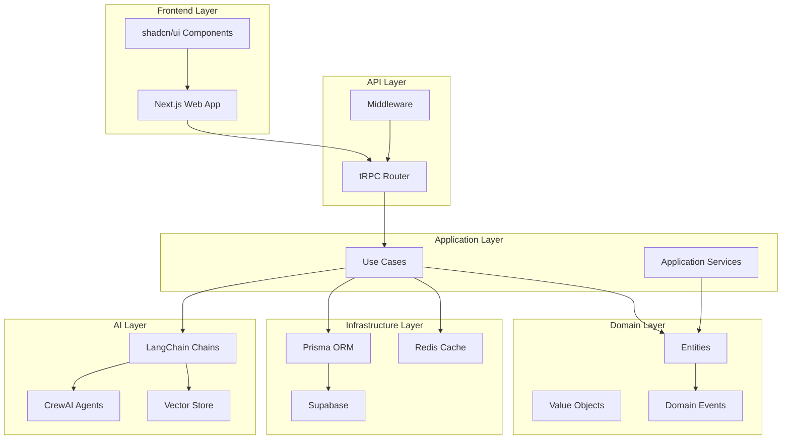

# Introduction to IntelliFlow CRM

Welcome to the IntelliFlow CRM documentation! This comprehensive guide will help
you understand, develop, and deploy the AI-powered CRM system.

## What is IntelliFlow CRM?

IntelliFlow CRM is an intelligent customer relationship management system that
leverages artificial intelligence to automate lead scoring, qualification, and
engagement. Built with a modern monorepo architecture, it provides end-to-end
type safety and seamless integration between the frontend, backend, and AI
services.

## Key Features

### AI-Powered Intelligence

- **Automatic Lead Scoring**: AI evaluates leads based on behavior,
  firmographics, and historical data
- **Smart Qualification**: CrewAI agents automatically qualify leads using
  multi-step reasoning
- **Predictive Analytics**: Machine learning models predict conversion
  probability and churn risk
- **Natural Language Processing**: Extract insights from emails, calls, and
  documents

### Type-Safe Architecture

- **End-to-End Type Safety**: From database to frontend with Prisma, tRPC, and
  TypeScript
- **Runtime Validation**: Zod schemas ensure data integrity at runtime
- **Auto-Generated Clients**: tRPC automatically generates type-safe API clients
- **No More API Bugs**: Catch type errors at compile time, not in production

### Modern Developer Experience

- **Monorepo Architecture**: Turborepo with pnpm workspaces for efficient
  development
- **AI-Assisted Development**: Optimized for Claude Code and GitHub Copilot
- **Hot Module Replacement**: Instant feedback during development
- **Comprehensive Testing**: Unit, integration, and E2E tests with >90% coverage

### Production-Ready Infrastructure

- **Scalable Backend**: tRPC API with horizontal scaling support
- **Real-Time Updates**: WebSocket connections for live data
- **Vector Search**: pgvector for semantic search and recommendations
- **Observability**: OpenTelemetry, Prometheus, and Grafana integration

## Architecture Overview

IntelliFlow CRM follows a **Domain-Driven Design (DDD)** approach with
**hexagonal architecture** to ensure clean separation of concerns and
maintainability.

## Technology Stack

### Frontend

- **Next.js 16.0.10**: React framework with App Router
- **shadcn/ui**: Customizable UI components built on Radix UI
- **Tailwind CSS**: Utility-first CSS framework
- **React Query**: Powerful data fetching and caching
- **tRPC Client**: Type-safe API client

### Backend

- **tRPC**: End-to-end typesafe APIs
- **Prisma ORM**: Type-safe database client
- **PostgreSQL**: Primary database with pgvector extension
- **Redis**: Caching and rate limiting
- **Supabase**: Authentication and real-time subscriptions

### AI/ML

- **LangChain**: Framework for building AI applications
- **CrewAI**: Multi-agent orchestration framework
- **OpenAI API**: GPT-4 for production workloads
- **Ollama**: Local LLM inference for development
- **pgvector**: Vector embeddings storage and search

### Infrastructure

- **Turborepo**: High-performance build system
- **pnpm**: Fast, disk-efficient package manager
- **Docker**: Containerization for local development
- **Railway/Vercel**: Cloud deployment platforms
- **GitHub Actions**: CI/CD automation

## Core Principles

### 1. Type Safety First

Every piece of data flowing through the system is type-checked:

- Database schema → Prisma types
- API contracts → tRPC procedures
- Runtime data → Zod validation
- Frontend state → TypeScript types

### 2. Domain-Driven Design

Business logic is organized around domain concepts:

- **Entities**: Core business objects (Lead, Contact, Account)
- **Value Objects**: Immutable data with business meaning
- **Aggregates**: Consistency boundaries for transactions
- **Domain Events**: Communication between bounded contexts

### 3. AI-First Development

The entire codebase is optimized for AI assistance:

- Claude Code integration with custom commands
- GitHub Copilot instructions for context
- Automated testing and validation
- LLM-friendly documentation

### 4. Test-Driven Development

Quality is enforced through comprehensive testing:

- Unit tests: >95% coverage for domain layer
- Integration tests: >90% coverage for application layer
- E2E tests: Critical user flows with Playwright
- AI tests: Deterministic outputs with fixtures

## Quick Start

Ready to get started? Here's what you need to do:

1. **[Install Prerequisites](./guides/getting-started.md#prerequisites)**:
   Node.js, pnpm, Docker
2. **[Clone and Setup](./guides/getting-started.md#installation)**: Get the code
   and install dependencies
3. **[Start Development](./guides/getting-started.md#start-development-servers)**:
   Run the development servers
4. **[Explore the Docs](./architecture/overview.md)**: Learn about the
   architecture

## Documentation Structure

This documentation is organized into several sections:

- **[Getting Started](./getting-started.md)**: Installation and setup guides
- **[Architecture](./architecture/overview.md)**: System design and technical
  architecture
- **[API Reference](./api/trpc-routes.md)**: Complete API documentation
- **[Developer Guides](./guides/getting-started.md)**: Development workflows and
  best practices
- **[Planning](./planning/adr/template.md)**: Architecture Decision Records and
  sprint plans

## Contributing

We welcome contributions from the community! Please read our
[Contributing Guide](./guides/contributing.md) to learn about:

- Code of Conduct
- Development workflow
- Pull request process
- Coding standards

## Getting Help

Need assistance? Here are your options:

- **Documentation**: Browse the comprehensive docs (you're here!)
- **GitHub Issues**:
  [Report bugs or request features](https://github.com/intelliflow/intelliflow-crm/issues)
- **GitHub Discussions**:
  [Ask questions and share ideas](https://github.com/intelliflow/intelliflow-crm/discussions)
- **CLAUDE.md**: Review AI assistant instructions for development context

## License

IntelliFlow CRM is licensed under the MIT License. See the
[LICENSE](https://github.com/intelliflow/intelliflow-crm/blob/main/LICENSE) file
for details.

---

**Next Steps**: Head over to [Getting Started](./getting-started.md) to set up
your development environment and start building!
