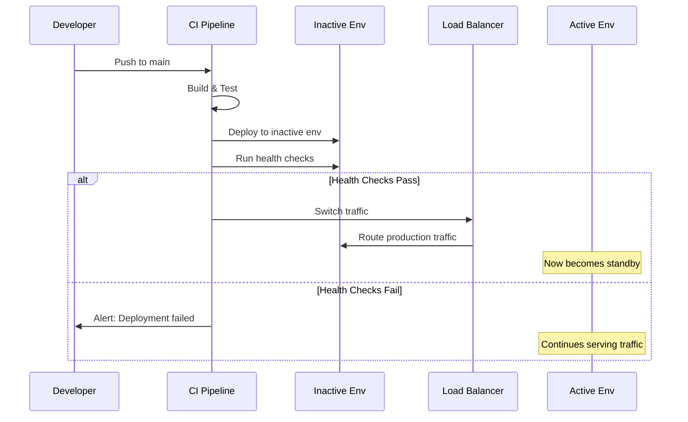

# Release and Rollback Strategy

## Overview

IntelliFlow CRM implements a **blue/green deployment strategy** to ensure
zero-downtime deployments with instant rollback capability. This document
outlines the deployment architecture, procedures, and rollback mechanisms.

## Blue/Green Deployment Architecture

### Environment Structure

```
                    +-----------------+
                    |   Load Balancer |
                    |  (Vercel Edge)  |
                    +--------+--------+
                             |
                   +---------+---------+
                   |                   |
            +------v------+     +------v------+
            |    BLUE     |     |    GREEN    |
            | Environment |     | Environment |
            +------+------+     +------+------+
                   |                   |
            +------v------+     +------v------+
            |  Database   |     |  Database   |
            |   (Shared)  |     |   (Shared)  |
            +-------------+     +-------------+
```

### Environment Details

| Environment | Purpose                                | URL Pattern                 |
| ----------- | -------------------------------------- | --------------------------- |
| Blue        | Primary production or standby          | `blue.intelliflow-crm.dev`  |
| Green       | Secondary production or standby        | `green.intelliflow-crm.dev` |
| Production  | Active alias (points to blue OR green) | `intelliflow-crm.dev`       |

### Key Characteristics

- **Identical Environments**: Blue and green are functionally identical
- **Shared Database**: Both environments connect to the same database
- **Instant Switching**: Traffic switch via DNS/alias takes <1 minute
- **Zero Downtime**: No service interruption during deployments

## Deployment Workflow

### Standard Deployment Process



### Deployment Steps

1. **Determine State**
   - Identify active environment (blue or green)
   - Target deployment to inactive environment

2. **Deploy to Inactive**
   - Build application with production configuration
   - Deploy to inactive environment
   - Wait for deployment propagation (30s)

3. **Health Validation**
   - Run health checks on inactive environment
   - Verify `/api/health` returns 200
   - Verify `/api/health/ready` returns 200
   - Verify `/api/health/live` returns 200
   - Run smoke tests on critical endpoints

4. **Traffic Switch** (<1 minute target)
   - Update production alias to point to new environment
   - Verify production health after switch
   - Record deployment metrics

5. **Monitor**
   - Watch error rates and latency for 15 minutes
   - Keep previous environment running for quick rollback

## Rollback Procedures

### Automatic Rollback Triggers

Rollback is automatically triggered when:

- Health checks fail after deployment
- Error rate exceeds 5% within 5 minutes of deployment
- P99 latency exceeds 2x baseline
- Critical service dependencies fail

### Manual Rollback

To manually trigger a rollback:

1. **Via GitHub Actions**:

   ```bash
   # Navigate to Actions > Blue/Green Deployment > Run workflow
   # Select action: "rollback"
   ```

2. **Via CLI** (emergency):

   ```bash
   # Switch production alias to previous environment
   vercel alias set <previous-deployment-url> intelliflow-crm.dev

   # Or via Railway
   railway service update --production <previous-service-id>
   ```

### Rollback Timeline

| Phase        | Duration    | Actions                                   |
| ------------ | ----------- | ----------------------------------------- |
| Detection    | 0-5 min     | Automated monitoring detects issue        |
| Decision     | 0-2 min     | On-call engineer confirms rollback needed |
| Execution    | <1 min      | Traffic switch to previous environment    |
| Verification | 2-5 min     | Confirm services healthy                  |
| **Total**    | **<10 min** | Full rollback complete                    |

## Health Check Endpoints

### Required Endpoints

| Endpoint               | Purpose         | Expected Response                     |
| ---------------------- | --------------- | ------------------------------------- |
| `/api/health`          | Basic health    | `200 OK` with `{"status": "healthy"}` |
| `/api/health/ready`    | Readiness probe | `200 OK` when ready to serve traffic  |
| `/api/health/live`     | Liveness probe  | `200 OK` when process is alive        |
| `/api/health/detailed` | Full status     | `200 OK` with component status        |

### Health Check Implementation

```typescript
// apps/api/src/routes/health.ts
import { Router } from 'express';

const healthRouter = Router();

healthRouter.get('/health', async (req, res) => {
  res.json({
    status: 'healthy',
    timestamp: new Date().toISOString(),
    version: process.env.DEPLOYMENT_VERSION || 'unknown',
  });
});

healthRouter.get('/health/ready', async (req, res) => {
  const checks = await Promise.all([checkDatabase(), checkRedis()]);

  const ready = checks.every((c) => c.healthy);
  res.status(ready ? 200 : 503).json({
    ready,
    checks,
  });
});

healthRouter.get('/health/live', (req, res) => {
  res.json({ alive: true });
});

export { healthRouter };
```

## Metrics and Monitoring

### Deployment Metrics

Tracked in `artifacts/metrics/blue-green-metrics.csv`:

| Metric           | Description            | Target           |
| ---------------- | ---------------------- | ---------------- |
| `switch_time_ms` | Time to switch traffic | <60000ms (1 min) |
| `health_status`  | Health check result    | healthy          |
| `success`        | Deployment success     | true             |

### Monitoring Dashboards

- **Deployment Timeline**: Grafana dashboard showing deployment history
- **Error Rate Comparison**: Compare error rates between environments
- **Latency Distribution**: P50, P95, P99 latency by environment

### Alerts

| Alert             | Condition                  | Action                         |
| ----------------- | -------------------------- | ------------------------------ |
| DeploymentFailed  | Health checks fail         | Notify on-call, no switch      |
| RollbackTriggered | Rollback executed          | Page on-call engineer          |
| HighErrorRate     | Error rate >5% post-deploy | Consider rollback              |
| HighLatency       | P99 >2x baseline           | Investigate, consider rollback |

## Database Migration Strategy

### Forward-Compatible Migrations

All database migrations MUST be forward-compatible to support blue/green:

1. **Add columns as nullable** first
2. **Deploy code that handles both states**
3. **Run migration**
4. **Deploy code that requires new schema**
5. **Clean up (make columns non-nullable if needed)**

### Rollback-Safe Migrations

```sql
-- Good: Can rollback without breaking old code
ALTER TABLE leads ADD COLUMN new_field TEXT;

-- Bad: Breaks old code if rolled back
ALTER TABLE leads RENAME COLUMN old_name TO new_name;
```

### Migration Workflow

```
Blue (v1.0) ──────────────────────────────────────────►
                    Migration runs ─────►
                                   Green (v1.1) ───────►
                                              Switch ──►
Blue becomes standby ─────────────────────────────────►
```

## Emergency Procedures

### Complete Service Outage

1. **Verify the issue** (not a monitoring false positive)
2. **Attempt rollback** to previous environment
3. **If rollback fails**, spin up a new environment from known-good commit
4. **Page engineering leadership** for extended outages (>15 min)

### Database Corruption

1. **Immediately halt all deployments**
2. **Enable read-only mode** on all environments
3. **Restore from latest backup**
4. **Verify data integrity**
5. **Resume operations**

### Security Incident

1. **Isolate affected environment**
2. **Switch traffic to clean environment**
3. **Engage security team**
4. **Do NOT deploy** until cleared

## Configuration

### Required Secrets (GitHub Actions)

| Secret                    | Description                    |
| ------------------------- | ------------------------------ |
| `VERCEL_TOKEN`            | Vercel deployment token        |
| `VERCEL_ORG_ID`           | Vercel organization ID         |
| `VERCEL_PROJECT_ID_BLUE`  | Blue environment project ID    |
| `VERCEL_PROJECT_ID_GREEN` | Green environment project ID   |
| `DATABASE_URL`            | Production database connection |
| `SLACK_WEBHOOK`           | Deployment notifications       |

### Required Variables

| Variable                | Description                 |
| ----------------------- | --------------------------- |
| `BLUE_ENVIRONMENT_URL`  | Blue environment URL        |
| `GREEN_ENVIRONMENT_URL` | Green environment URL       |
| `PRODUCTION_URL`        | Production URL              |
| `PRODUCTION_DOMAIN`     | Production domain for alias |

## Runbook Quick Reference

### Deploy New Version

```bash
# Trigger via GitHub Actions
gh workflow run blue-green-deploy.yml \
  -f action=deploy \
  -f target_environment=auto
```

### Check Status

```bash
# View current environment status
gh workflow run blue-green-deploy.yml \
  -f action=status
```

### Manual Rollback

```bash
# Rollback to previous environment
gh workflow run blue-green-deploy.yml \
  -f action=rollback
```

### Emergency Rollback (skip health checks)

```bash
# Only use in emergencies
gh workflow run blue-green-deploy.yml \
  -f action=deploy \
  -f skip_health_checks=true
```

## Success Criteria (IFC-112 KPIs)

| KPI                    | Target                    | Measurement             |
| ---------------------- | ------------------------- | ----------------------- |
| Deployment switch time | <1 minute                 | Recorded in metrics CSV |
| Zero downtime          | 100% uptime during deploy | Health check continuity |
| Rollback time          | <1 minute                 | Recorded in metrics CSV |
| Health check pass rate | 100% before switch        | Workflow logs           |

## Related Documentation

- [CI/CD Pipeline](.github/workflows/ci.yml)
- [Health Check Configuration](../infra/monitoring/health-checks.yaml)
- [Incident Response](./incident-response.md)
- [Database Migrations](./database-migrations.md)
