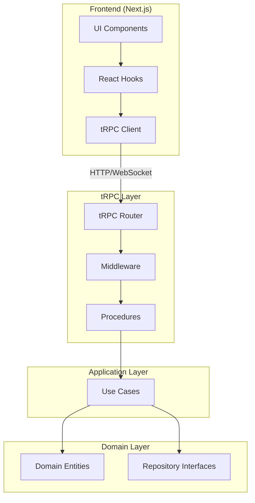

# ADR-003: Type-Safe API Design with tRPC

**Status:** Accepted

**Date:** 2025-12-21

**Deciders:** Tech Lead, Backend Team, Frontend Team

**Technical Story:** IFC-003, IFC-135

## Context and Problem Statement

IntelliFlow CRM requires a type-safe API layer that connects the frontend
(Next.js) with the backend (domain/application layers). We need end-to-end type
safety from database schema through API to UI components, without manual type
synchronization or code generation steps. The API must support real-time
subscriptions, file uploads, error handling, and authentication while
maintaining excellent developer experience for AI-assisted development. Should
we use REST, GraphQL, or tRPC?

## Decision Drivers

- **End-to-End Type Safety**: TypeScript types flow automatically from backend
  to frontend
- **Zero Code Generation**: No build steps for API contracts (Prisma is
  acceptable)
- **Developer Experience**: Autocomplete, IntelliSense, and refactoring across
  API boundary
- **Real-Time Support**: WebSocket subscriptions for live updates
- **Performance**: Low latency (<50ms overhead), efficient serialization
- **Error Handling**: Type-safe error responses with detailed context
- **Authentication**: Seamless integration with auth providers
- **Monorepo Optimization**: Works well with Turborepo shared packages
- **AI-Friendly**: Clear patterns for AI code generation

## Considered Options

- **Option 1**: tRPC (type-safe RPC with automatic client generation)
- **Option 2**: GraphQL with TypeScript code generation (GraphQL Codegen)
- **Option 3**: REST API with OpenAPI/Swagger + code generation
- **Option 4**: REST API with manual TypeScript types

## Decision Outcome

Chosen option: **"tRPC"**, because it provides end-to-end type safety without
any code generation, has minimal runtime overhead, integrates seamlessly with
our TypeScript monorepo, and offers the best developer experience for
AI-assisted development. tRPC's type inference means changes to backend
procedures automatically update frontend types, eliminating manual
synchronization and preventing API contract bugs.

### Positive Consequences

- **Zero Build Steps**: No code generation required (except Prisma for DB)
- **Instant Type Safety**: Backend changes immediately reflected in frontend
- **Autocomplete Everywhere**: Full IntelliSense in frontend API calls
- **Refactoring Safety**: Renaming procedures updates all call sites
  automatically
- **Minimal Runtime Cost**: <5ms overhead vs direct function calls
- **Simple Error Handling**: Type-safe errors with TRPCError
- **WebSocket Support**: Built-in subscriptions for real-time features
- **Monorepo Native**: Shared types via workspace packages
- **Excellent DX**: AI tools (Claude Code, Copilot) work exceptionally well

### Negative Consequences

- **TypeScript Only**: Cannot be used by non-TypeScript clients
- **Smaller Ecosystem**: Fewer tools/integrations than REST/GraphQL
- **Tight Coupling**: Backend and frontend must share TypeScript types
- **Limited Querying**: No query flexibility like GraphQL
- **Learning Curve**: Team must learn tRPC conventions
- **Vendor Lock-In**: Migrating away from tRPC requires rewriting API layer

## Pros and Cons of the Options

### tRPC (CHOSEN)

Type-safe RPC with automatic TypeScript inference.

- Good, because it provides end-to-end type safety without code generation
- Good, because it has minimal runtime overhead (<5ms)
- Good, because refactoring is safe across API boundary
- Good, because it integrates perfectly with monorepos
- Good, because it supports WebSocket subscriptions
- Good, because error handling is type-safe
- Good, because AI tools work exceptionally well
- Bad, because it's TypeScript-only (no mobile/external clients)
- Bad, because it has smaller ecosystem than REST/GraphQL
- Bad, because it couples frontend to backend types

### GraphQL with Code Generation

GraphQL API with TypeScript codegen.

- Good, because it allows flexible querying (no over-fetching)
- Good, because it has large ecosystem and tooling
- Good, because it supports subscriptions
- Good, because it's language-agnostic
- Bad, because it requires code generation (slower DX)
- Bad, because types can drift from schema
- Bad, because it has runtime overhead (parsing, resolvers)
- Bad, because it's complex to set up correctly
- Bad, because N+1 query problem requires careful optimization

### REST with OpenAPI

REST API with OpenAPI spec + code generation.

- Good, because it's well-understood and universal
- Good, because it's language-agnostic
- Good, because it has excellent tooling (Swagger, Postman)
- Bad, because it requires code generation
- Bad, because types can drift from API
- Bad, because versioning is manual
- Bad, because real-time requires separate solution (SSE/WebSockets)
- Bad, because no compile-time API contract validation

### REST with Manual Types

REST API with manually written TypeScript types.

- Good, because it's simple and familiar
- Good, because it's language-agnostic
- Bad, because types must be manually synchronized
- Bad, because API changes can break clients silently
- Bad, because no IntelliSense for API calls
- Bad, because refactoring is error-prone
- Bad, because testing requires runtime validation

## Implementation Notes

### Architecture



### tRPC Router Definition

```typescript
// apps/api/src/trpc.ts
import { initTRPC, TRPCError } from '@trpc/server';
import { type CreateNextContextOptions } from '@trpc/server/adapters/next';
import superjson from 'superjson';
import { ZodError } from 'zod';

// Context includes authenticated user and services
export const createContext = async (opts: CreateNextContextOptions) => {
  const session = await getServerSession(opts.req, opts.res);

  if (!session?.user) {
    throw new TRPCError({
      code: 'UNAUTHORIZED',
      message: 'You must be logged in to access this endpoint',
    });
  }

  const tenantId = session.user.tenant_id;

  // Create Prisma client with tenant middleware
  const prisma = new PrismaClient();
  prisma.$use(tenantMiddleware(tenantId));

  // Set RLS context
  await prisma.$executeRaw`SET app.current_tenant_id = ${tenantId}`;

  return {
    session,
    userId: session.user.id,
    tenantId,
    prisma,
    // Repositories
    leadRepository: new PrismaLeadRepository(prisma),
    contactRepository: new PrismaContactRepository(prisma),
    // Services
    aiScoringService: new AIService(),
    eventBus: new EventBus(),
  };
};

export type Context = Awaited<ReturnType<typeof createContext>>;

// Initialize tRPC with superjson for Date/Map/Set support
const t = initTRPC.context<Context>().create({
  transformer: superjson,
  errorFormatter({ shape, error }) {
    return {
      ...shape,
      data: {
        ...shape.data,
        zodError:
          error.cause instanceof ZodError ? error.cause.flatten() : null,
      },
    };
  },
});

// Reusable procedures
export const router = t.router;
export const publicProcedure = t.procedure;
export const protectedProcedure = t.procedure.use(async ({ ctx, next }) => {
  if (!ctx.session) {
    throw new TRPCError({ code: 'UNAUTHORIZED' });
  }
  return next({ ctx });
});
```

### Example Module Router

```typescript
// apps/api/src/modules/leads/leads.router.ts
import { router, protectedProcedure } from '../../trpc';
import { z } from 'zod';
import { TRPCError } from '@trpc/server';
import { ScoreLeadUseCase } from '@intelliflow/application';

// Input validation with Zod
const createLeadSchema = z.object({
  email: z.string().email(),
  firstName: z.string().optional(),
  lastName: z.string().optional(),
  company: z.string().optional(),
  source: z.string(),
});

const scoreLeadSchema = z.object({
  leadId: z.string().uuid(),
});

export const leadsRouter = router({
  // Query: Read operations
  getById: protectedProcedure
    .input(z.object({ id: z.string().uuid() }))
    .query(async ({ input, ctx }) => {
      const lead = await ctx.leadRepository.findById(LeadId.create(input.id));

      if (!lead) {
        throw new TRPCError({
          code: 'NOT_FOUND',
          message: `Lead with ID ${input.id} not found`,
        });
      }

      return {
        id: lead.getId().getValue(),
        email: lead.getEmail().getValue(),
        score: lead.getScore().getValue(),
        status: lead.getStatus().toString(),
        createdAt: lead.getCreatedAt(),
      };
    }),

  list: protectedProcedure
    .input(
      z.object({
        limit: z.number().min(1).max(100).default(20),
        cursor: z.string().uuid().optional(),
        status: z
          .enum(['new', 'contacted', 'qualified', 'disqualified'])
          .optional(),
      })
    )
    .query(async ({ input, ctx }) => {
      const leads = await ctx.prisma.lead.findMany({
        where: {
          tenant_id: ctx.tenantId,
          status: input.status,
        },
        take: input.limit + 1,
        cursor: input.cursor ? { id: input.cursor } : undefined,
        orderBy: { created_at: 'desc' },
      });

      let nextCursor: string | undefined = undefined;
      if (leads.length > input.limit) {
        const nextItem = leads.pop();
        nextCursor = nextItem?.id;
      }

      return {
        items: leads,
        nextCursor,
      };
    }),

  // Mutation: Write operations
  create: protectedProcedure
    .input(createLeadSchema)
    .mutation(async ({ input, ctx }) => {
      const emailResult = Email.create(input.email);

      if (emailResult.isFailure()) {
        throw new TRPCError({
          code: 'BAD_REQUEST',
          message: emailResult.error.message,
        });
      }

      const lead = Lead.create({
        id: LeadId.create(),
        email: emailResult.value,
        firstName: input.firstName,
        lastName: input.lastName,
        company: input.company,
        source: input.source,
      });

      await ctx.leadRepository.save(lead);

      // Publish domain events
      await ctx.eventBus.publishAll(lead.getDomainEvents());

      return {
        id: lead.getId().getValue(),
        email: lead.getEmail().getValue(),
      };
    }),

  score: protectedProcedure
    .input(scoreLeadSchema)
    .mutation(async ({ input, ctx }) => {
      const useCase = new ScoreLeadUseCase(
        ctx.leadRepository,
        ctx.aiScoringService,
        ctx.eventBus
      );

      const result = await useCase.execute({
        leadId: LeadId.create(input.leadId),
      });

      if (result.isFailure()) {
        throw new TRPCError({
          code: 'INTERNAL_SERVER_ERROR',
          message: result.error.message,
        });
      }

      return {
        score: result.value.getValue(),
      };
    }),

  // Subscription: Real-time updates
  onScored: protectedProcedure
    .input(z.object({ leadId: z.string().uuid() }))
    .subscription(async ({ input, ctx }) => {
      return observable<{ score: number }>((emit) => {
        const onScore = (event: LeadScoredEvent) => {
          if (event.leadId.getValue() === input.leadId) {
            emit.next({ score: event.newScore.getValue() });
          }
        };

        // Subscribe to event bus
        ctx.eventBus.on('LeadScoredEvent', onScore);

        // Cleanup
        return () => {
          ctx.eventBus.off('LeadScoredEvent', onScore);
        };
      });
    }),
});
```

### Root Router (App Router)

```typescript
// apps/api/src/router.ts
import { router } from './trpc';
import { leadsRouter } from './modules/leads/leads.router';
import { contactsRouter } from './modules/contacts/contacts.router';
import { opportunitiesRouter } from './modules/opportunities/opportunities.router';

export const appRouter = router({
  leads: leadsRouter,
  contacts: contactsRouter,
  opportunities: opportunitiesRouter,
});

export type AppRouter = typeof appRouter;
```

### Frontend Client Setup

```typescript
// apps/web/src/lib/trpc.ts
import { createTRPCReact } from '@trpc/react-query';
import { httpBatchLink } from '@trpc/client';
import type { AppRouter } from '@intelliflow/api';
import superjson from 'superjson';

export const trpc = createTRPCReact<AppRouter>();

export const trpcClient = trpc.createClient({
  transformer: superjson,
  links: [
    httpBatchLink({
      url: process.env.NEXT_PUBLIC_API_URL || 'http://localhost:3001/api/trpc',
      headers() {
        return {
          authorization: getAuthToken(),
        };
      },
    }),
  ],
});
```

### Frontend Usage

```typescript
// apps/web/app/leads/page.tsx
'use client';

import { trpc } from '@/lib/trpc';
import { Button } from '@/components/ui/button';

export default function LeadsPage() {
  // Query with automatic types
  const { data: leads, isLoading } = trpc.leads.list.useQuery({
    limit: 20,
    status: 'new',
  });
  // TypeScript knows: leads = { items: Lead[], nextCursor?: string }

  // Mutation with optimistic updates
  const scoreMutation = trpc.leads.score.useMutation({
    onSuccess: () => {
      // Invalidate and refetch
      trpcClient.leads.list.invalidate();
    },
  });

  const handleScore = async (leadId: string) => {
    await scoreMutation.mutateAsync({ leadId });
  };

  // Subscription for real-time updates
  trpc.leads.onScored.useSubscription(
    { leadId: 'lead-uuid' },
    {
      onData(data) {
        console.log('Lead scored:', data.score);
      },
    }
  );

  if (isLoading) return <div>Loading...</div>;

  return (
    <div>
      {leads?.items.map((lead) => (
        <div key={lead.id}>
          <p>{lead.email}</p>
          <p>Score: {lead.score}</p>
          <Button onClick={() => handleScore(lead.id)}>
            Score Lead
          </Button>
        </div>
      ))}
    </div>
  );
}
```

### Error Handling

```typescript
// Type-safe error handling
const createMutation = trpc.leads.create.useMutation({
  onError: (error) => {
    // TypeScript knows error shape
    if (error.data?.zodError) {
      // Zod validation errors
      console.error('Validation errors:', error.data.zodError.fieldErrors);
    } else if (error.data?.code === 'UNAUTHORIZED') {
      // Redirect to login
      router.push('/login');
    } else {
      // Generic error
      toast.error(error.message);
    }
  },
});
```

### Testing

```typescript
// apps/api/src/modules/leads/__tests__/leads.router.spec.ts
import { createContext } from '../../../trpc';
import { appRouter } from '../../../router';

describe('leadsRouter', () => {
  it('should create a lead', async () => {
    const ctx = await createContext({
      req: mockRequest,
      res: mockResponse,
    });

    const caller = appRouter.createCaller(ctx);

    const result = await caller.leads.create({
      email: 'test@example.com',
      source: 'website',
    });

    expect(result.id).toBeDefined();
    expect(result.email).toBe('test@example.com');
  });

  it('should throw error for invalid email', async () => {
    const ctx = await createContext({
      req: mockRequest,
      res: mockResponse,
    });

    const caller = appRouter.createCaller(ctx);

    await expect(
      caller.leads.create({
        email: 'invalid-email',
        source: 'website',
      })
    ).rejects.toThrow('Invalid email format');
  });
});
```

### Performance Optimization

```typescript
// Batch requests automatically
const [lead1, lead2, lead3] = await Promise.all([
  trpc.leads.getById.query({ id: 'id-1' }),
  trpc.leads.getById.query({ id: 'id-2' }),
  trpc.leads.getById.query({ id: 'id-3' }),
]);
// tRPC automatically batches these into a single HTTP request
```

### Validation Criteria

- [x] tRPC router setup with context and procedures
- [x] Frontend client configured with superjson
- [x] Type safety validated (compile-time errors on API changes)
- [x] Error handling tested with TRPCError
- [x] Real-time subscriptions working via WebSockets
- [x] Request batching verified
- [x] Authentication middleware functional
- [x] Integration tests passing
- [x] <50ms API overhead measured

### Rollback Plan

If tRPC proves limiting:

1. **Migrate to GraphQL**:
   - Keep domain/application layers
   - Replace tRPC routers with GraphQL resolvers
   - Use GraphQL Codegen for type generation
   - Estimated effort: 2-3 weeks

2. **Migrate to REST**:
   - Keep domain/application layers
   - Replace tRPC with Express/Fastify
   - Generate OpenAPI from Zod schemas
   - Use ts-rest for type-safe REST
   - Estimated effort: 2-3 weeks

However, evaluate at IFC-010 (Sprint 4 decision gate) before considering
rollback.

## Links

- [tRPC Documentation](https://trpc.io/)
- [Hexagonal Architecture](../../architecture/adr/001-hexagonal-architecture.md)
- Related: [ADR-001 Modern Stack](./ADR-001-modern-stack.md)
- Related: [ADR-002 Domain-Driven Design](./ADR-002-domain-driven-design.md)
- Related:
  [IFC-003 tRPC API Foundation](../../apps/project-tracker/docs/metrics/_global/Sprint_plan.csv)
- [tRPC Best Practices](https://trpc.io/docs/best-practices)

## References

- [tRPC vs GraphQL vs REST](https://trpc.io/docs/concepts)
- [End-to-End Type Safety](https://www.prisma.io/blog/fullstack-type-safety)
- [React Query (used by tRPC)](https://tanstack.com/query/latest)

---

**Conclusion**: tRPC provides the optimal API layer for IntelliFlow CRM,
delivering end-to-end type safety without code generation, minimal runtime
overhead, and exceptional developer experience. The tight integration with
TypeScript and monorepo structure makes it ideal for AI-assisted development and
rapid iteration.

**Status**: ✅ tRPC router implemented with type-safe procedures. Ready for
Sprint 1 API development.
