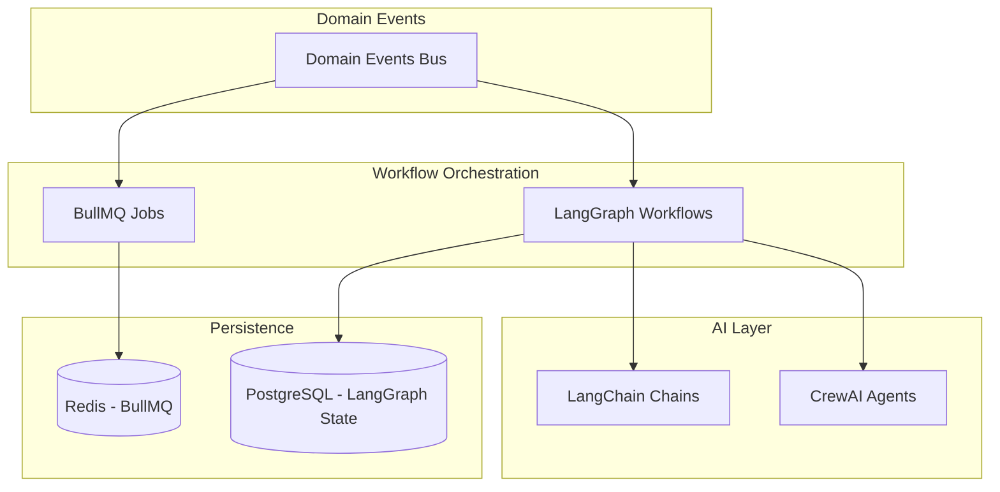

# ADR-005: Workflow Engine Choice

**Status:** Accepted

**Date:** 2025-12-20

**Deciders:** Tech Lead, DevOps, Product Manager, AI Specialist

**Technical Story:** IFC-135, IFC-141

## Context and Problem Statement

IntelliFlow CRM requires workflow automation to handle business processes like
lead nurturing, follow-up sequences, case management workflows, and AI agent
orchestration. We need to choose a workflow engine that supports event-driven
automation, AI agent coordination, human-in-the-loop approvals, and complex
multi-step processes. Should we use a third-party workflow platform, build a
custom engine, or use a specialized AI workflow framework?

## Decision Drivers

- **AI Integration**: Seamless integration with LangChain/CrewAI agents
- **Event-Driven**: Trigger workflows from domain events
- **Human-in-the-Loop**: Support approval steps and manual overrides
- **Long-Running Workflows**: Handle processes spanning days/weeks
- **Observability**: Track workflow state, retries, failures
- **Developer Experience**: Easy to define and test workflows
- **Cost**: Licensing, hosting, and operational costs
- **Reliability**: Durable execution with retries and error handling
- **Flexibility**: Support both simple rules and complex orchestrations

## Considered Options

- **Option 1**: LangGraph (AI-native workflow orchestration)
- **Option 2**: BullMQ (job queue with workflow primitives)
- **Option 3**: n8n (low-code workflow automation platform)
- **Option 4**: Temporal (durable execution framework)
- **Option 5**: Custom event-driven engine with state machine

## Decision Outcome

Chosen option: **"LangGraph for AI workflows + BullMQ for background jobs"**,
because this hybrid approach provides the best fit for our use cases. LangGraph
is purpose-built for AI agent orchestration with state management, branching
logic, and human-in-the-loop steps. BullMQ handles simpler background jobs like
email sending, data sync, and scheduled tasks. This separation keeps AI
workflows clean and leverages existing BullMQ infrastructure.

### Positive Consequences

- **AI-Native**: LangGraph designed specifically for AI agent workflows
- **State Management**: Built-in state persistence and checkpointing
- **Human-in-the-Loop**: Native support for approval nodes and interrupts
- **TypeScript Support**: Full type safety with LangGraph.js
- **Observability**: LangSmith provides workflow tracing and debugging
- **Graph Visualization**: Visual representation of workflow DAGs
- **BullMQ Integration**: Existing infrastructure for simple jobs
- **Cost Effective**: Both are open-source (LangSmith optional)
- **Flexibility**: Use LangGraph for complex AI, BullMQ for simple jobs

### Negative Consequences

- **Two Systems**: Maintain both LangGraph and BullMQ
- **Learning Curve**: Team must learn LangGraph concepts
- **Ecosystem Maturity**: LangGraph is newer than alternatives
- **Vendor Coupling**: Tight coupling to LangChain ecosystem
- **Migration Effort**: Existing BullMQ jobs stay as-is

## Pros and Cons of the Options

### LangGraph

LangChain's stateful, orchestration framework for AI agents.

- Good, because it's purpose-built for AI agent workflows
- Good, because it has built-in state management and persistence
- Good, because it supports human-in-the-loop with interrupts
- Good, because it integrates seamlessly with LangChain/CrewAI
- Good, because LangSmith provides excellent observability
- Good, because it supports complex branching and conditional logic
- Good, because it's TypeScript-native with full type safety
- Bad, because it's newer with smaller ecosystem
- Bad, because it's tightly coupled to LangChain
- Bad, because documentation is still evolving

### BullMQ

Redis-based job queue with workflow capabilities.

- Good, because we already use it for background jobs
- Good, because it's mature and battle-tested
- Good, because it has excellent observability (Bull Board)
- Good, because it supports retries, priorities, delayed jobs
- Good, because Redis provides persistence and reliability
- Bad, because it's not designed for AI workflows
- Bad, because state management is manual
- Bad, because branching logic is complex to implement
- Bad, because no native human-in-the-loop support

### n8n

Low-code workflow automation platform.

- Good, because it provides visual workflow builder
- Good, because it has 300+ pre-built integrations
- Good, because it supports webhooks and HTTP triggers
- Good, because non-technical users can build workflows
- Good, because it has self-hosted option
- Bad, because it's designed for integrations, not AI orchestration
- Bad, because custom logic requires code nodes
- Bad, because hosting adds infrastructure complexity
- Bad, because TypeScript integration is limited
- Bad, because it doesn't integrate well with LangChain

### Temporal

Durable execution framework for long-running workflows.

- Good, because it provides guaranteed execution semantics
- Good, because it handles failures and retries automatically
- Good, because it supports complex workflows and sagas
- Good, because it's battle-tested at scale
- Good, because it has strong TypeScript support
- Bad, because it requires running Temporal server (infrastructure overhead)
- Bad, because it's complex to set up and operate
- Bad, because it's not designed for AI workflows
- Bad, because it has steep learning curve
- Bad, because hosting costs can be high

### Custom Event-Driven Engine

Build workflow engine on top of domain events.

- Good, because it's fully customized to our needs
- Good, because it integrates directly with domain model
- Good, because we control the entire stack
- Bad, because it requires significant development effort
- Bad, because we must build all features from scratch
- Bad, because testing and reliability are our responsibility
- Bad, because no existing ecosystem or tooling

## Implementation Notes

### Architecture



### LangGraph Workflow Example

AI-driven lead qualification workflow:

```typescript
// apps/ai-worker/src/workflows/lead-qualification.workflow.ts
import { StateGraph, END } from '@langchain/langgraph';
import { AIMessage, HumanMessage } from '@langchain/core/messages';

interface LeadQualificationState {
  lead_id: string;
  lead_data: any;
  score: number | null;
  qualification_status: 'pending' | 'qualified' | 'disqualified';
  human_review_required: boolean;
  messages: any[];
}

const workflow = new StateGraph<LeadQualificationState>({
  channels: {
    lead_id: { value: (x: string, y: string) => y },
    lead_data: { value: (x: any, y: any) => y },
    score: { value: (x: number | null, y: number | null) => y },
    qualification_status: { value: (x: string, y: string) => y },
    human_review_required: { value: (x: boolean, y: boolean) => y },
    messages: { value: (x: any[], y: any[]) => x.concat(y), default: () => [] },
  },
});

// Node: Score lead with AI
workflow.addNode('score_lead', async (state) => {
  const scoringChain = getScoringChain();
  const score = await scoringChain.invoke({ lead_data: state.lead_data });

  return {
    score: score.value,
    messages: [new AIMessage(`Lead scored: ${score.value}/100`)],
  };
});

// Node: Check if human review needed
workflow.addNode('check_threshold', async (state) => {
  const human_review_required =
    state.score !== null && state.score >= 40 && state.score <= 60;

  return {
    human_review_required,
    messages: [
      new AIMessage(
        human_review_required
          ? 'Score in gray zone - human review required'
          : 'Score clear - auto-decision'
      ),
    ],
  };
});

// Node: Human review (interrupt point)
workflow.addNode('human_review', async (state) => {
  // This node will pause and wait for human input
  return {
    messages: [new HumanMessage('Awaiting human review...')],
  };
});

// Node: Auto-qualify
workflow.addNode('auto_qualify', async (state) => {
  const qualified = state.score !== null && state.score > 60;

  return {
    qualification_status: qualified ? 'qualified' : 'disqualified',
    messages: [
      new AIMessage(
        `Auto-decision: ${qualified ? 'QUALIFIED' : 'DISQUALIFIED'}`
      ),
    ],
  };
});

// Define edges
workflow.setEntryPoint('score_lead');
workflow.addEdge('score_lead', 'check_threshold');

workflow.addConditionalEdges('check_threshold', (state) => {
  return state.human_review_required ? 'human_review' : 'auto_qualify';
});

workflow.addEdge('human_review', END);
workflow.addEdge('auto_qualify', END);

export const leadQualificationWorkflow = workflow.compile();
```

### BullMQ Job Example

Simple email sending job:

```typescript
// apps/ai-worker/src/workers/email.worker.ts
import { Worker, Job } from 'bullmq';
import { sendEmail } from '@intelliflow/adapters/email';

export const emailWorker = new Worker(
  'email-queue',
  async (job: Job) => {
    const { to, subject, body, template } = job.data;

    await sendEmail({ to, subject, body, template });

    return { sent_at: new Date().toISOString() };
  },
  {
    connection: redisConnection,
    concurrency: 10,
  }
);
```

### When to Use LangGraph vs BullMQ

**Use LangGraph for:**

- AI agent orchestration (multi-agent workflows)
- Lead qualification with AI scoring + human review
- Complex decision trees with conditional branching
- Long-running workflows with state persistence
- Workflows requiring human-in-the-loop approvals
- Multi-step AI chains with checkpointing

**Use BullMQ for:**

- Simple background jobs (email sending, notifications)
- Scheduled tasks (daily reports, cleanup jobs)
- Data synchronization (Supabase to external APIs)
- Retry-based jobs (webhook deliveries)
- Rate-limited API calls (external integrations)

### State Persistence

LangGraph state stored in PostgreSQL:

```sql
CREATE TABLE workflow_state (
  id UUID PRIMARY KEY DEFAULT uuid_generate_v4(),
  workflow_name VARCHAR(255) NOT NULL,
  workflow_id VARCHAR(255) NOT NULL,
  state JSONB NOT NULL,
  checkpoint INTEGER NOT NULL,
  created_at TIMESTAMPTZ NOT NULL DEFAULT NOW(),
  updated_at TIMESTAMPTZ NOT NULL DEFAULT NOW()
);

CREATE INDEX idx_workflow_state_lookup ON workflow_state(workflow_name, workflow_id);
```

### Observability

**LangSmith** for LangGraph workflows:

- Trace every workflow execution
- Visualize workflow graphs
- Debug state transitions
- Monitor human approval steps

**Bull Board** for BullMQ jobs:

- Real-time job monitoring
- Retry failed jobs
- View job logs and errors
- Track queue metrics

### Validation Criteria

- [x] LangGraph workflow with human-in-the-loop implemented
- [x] BullMQ worker for background jobs running
- [x] State persistence working for LangGraph
- [x] Workflow triggers from domain events
- [x] LangSmith tracing configured
- [x] Bull Board dashboard accessible
- [x] Integration tests for both systems
- [x] Documentation for when to use each system

### Rollback Plan

If LangGraph proves too complex:

1. Migrate AI workflows to BullMQ with manual state management
2. Use Redis for workflow state storage
3. Implement custom state machine logic in BullMQ jobs
4. Continue using LangChain chains without LangGraph orchestration

## Links

- [LangGraph Documentation](https://langchain-ai.github.io/langgraphjs/)
- [BullMQ Documentation](https://docs.bullmq.io/)
- [LangSmith](https://smith.langchain.com/)
- [Bull Board](https://github.com/felixmosh/bull-board)
- Related: [ADR-006 Agent Tool-Calling](./ADR-006-agent-tools.md)
- Related:
  [IFC-141 Workflow Engine Evaluation](../../apps/project-tracker/docs/metrics/_global/Sprint_plan.csv)

## References

- [LangGraph Tutorial](https://langchain-ai.github.io/langgraphjs/tutorials/)
- [State Machines in Workflows](https://temporal.io/blog/workflow-state-machines)
- [Human-in-the-Loop AI Systems](https://huyenchip.com/2023/04/11/llm-engineering.html)
