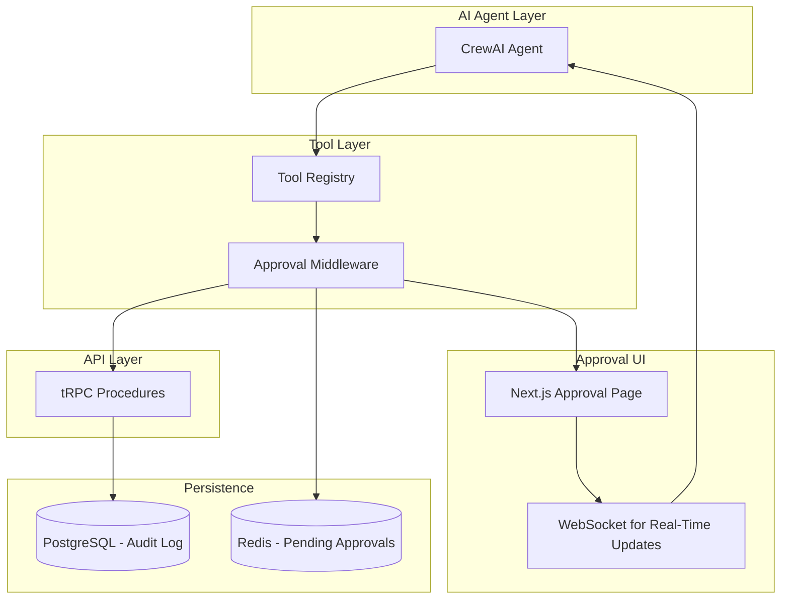

# ADR-006: Agent Tool-Calling Model

**Status:** Accepted

**Date:** 2025-12-20

**Deciders:** AI Specialist, Tech Lead, Backend Team, Security Engineer

**Technical Story:** IFC-135, IFC-139

## Context and Problem Statement

IntelliFlow CRM uses AI agents (CrewAI) to automate tasks like lead
qualification, email drafting, calendar scheduling, and case research. These
agents need to call application services (tRPC endpoints) to read data, create
records, update statuses, and interact with external systems. How should we
expose application functionality to AI agents while ensuring security,
observability, and human oversight for high-risk actions?

## Decision Drivers

- **Security**: Prevent unauthorized actions by AI agents
- **Type Safety**: Ensure agents call endpoints with correct parameters
- **Human-in-the-Loop**: Require approval for high-risk actions (send email,
  update case)
- **Observability**: Audit all agent actions with full context
- **Rollback**: Support undo/rollback for agent-initiated changes
- **Authorization**: Respect user/tenant permissions
- **Error Handling**: Gracefully handle API errors and retries
- **Developer Experience**: Easy to expose new tools to agents
- **Cost Control**: Prevent runaway agent behavior

## Considered Options

- **Option 1**: Direct tRPC procedure calls via typed adapters
- **Option 2**: OpenAPI-based tools with LangChain OpenAPI agent
- **Option 3**: Custom tool registry with approval flow middleware
- **Option 4**: Function-calling with LLM native tools (OpenAI functions)
- **Option 5**: Hybrid approach (tRPC tools + approval middleware + LangChain
  integration)

## Decision Outcome

Chosen option: **"Hybrid approach (tRPC tools + approval middleware + LangChain
integration)"**, because it combines the best of all approaches. We expose tRPC
procedures as LangChain tools with full type safety, wrap high-risk tools in
approval middleware that pauses execution for human review, and use LangChain's
tool-calling primitives for agent orchestration. This provides security,
observability, and developer experience.

### Positive Consequences

- **Type Safety**: tRPC procedures have TypeScript types that generate tool
  schemas
- **Security**: Approval middleware enforces human review for sensitive actions
- **Reusability**: Same tRPC endpoints used by UI and agents
- **Observability**: LangSmith traces all tool calls with context
- **Authorization**: tRPC context includes user/tenant for RBAC
- **Rollback**: Tool calls can be logged and reversed via compensating actions
- **DX**: Exposing a new tool is as simple as adding a tRPC procedure
- **Error Handling**: tRPC error handling automatically works for tools

### Negative Consequences

- **Complexity**: Approval flow adds middleware layer
- **Latency**: Human approval adds wait time for high-risk actions
- **State Management**: Approval UI must persist pending actions
- **Testing**: Must test both agent flows and approval flows
- **User Experience**: Approval notifications can be disruptive

## Pros and Cons of the Options

### Direct tRPC calls

Agents call tRPC procedures directly via typed client.

- Good, because it leverages existing API infrastructure
- Good, because type safety is guaranteed
- Good, because authorization works via tRPC context
- Bad, because no built-in approval flow
- Bad, because agent errors bypass human review
- Bad, because rollback must be implemented manually

### OpenAPI-based tools

Generate OpenAPI spec from tRPC, use LangChain OpenAPI agent.

- Good, because LangChain has built-in OpenAPI support
- Good, because OpenAPI spec documents all endpoints
- Bad, because tRPC → OpenAPI conversion is lossy
- Bad, because no native approval flow
- Bad, because type safety is degraded

### Custom tool registry

Build custom tool abstraction with approval middleware.

- Good, because full control over tool execution
- Good, because approval flow is first-class
- Bad, because requires significant custom code
- Bad, because no integration with LangChain ecosystem
- Bad, because type safety must be maintained manually

### LLM native function calling

Use OpenAI function calling directly.

- Good, because it's native to OpenAI API
- Good, because it has minimal overhead
- Bad, because it's tightly coupled to OpenAI
- Bad, because local models (Ollama) have limited support
- Bad, because approval flow must be custom-built

### Hybrid approach

tRPC + approval middleware + LangChain tools.

- Good, because it combines strengths of all approaches
- Good, because type safety + approval + observability
- Good, because works with any LLM (OpenAI, Ollama)
- Bad, because it's more complex to set up
- Bad, because approval flow adds latency

## Implementation Notes

### Architecture



### Tool Definition

Automatically generate LangChain tools from tRPC procedures:

```typescript
// packages/ai/tools/trpc-tool-factory.ts
import { DynamicStructuredTool } from '@langchain/core/tools';
import { z } from 'zod';
import { TRPCClient } from '@intelliflow/api-client';

interface ToolOptions {
  requiresApproval: boolean;
  riskLevel: 'low' | 'medium' | 'high';
  category: 'read' | 'write' | 'external';
}

export function createTRPCTool<TInput extends z.ZodTypeAny, TOutput>(
  name: string,
  description: string,
  inputSchema: TInput,
  trpcProcedure: (input: z.infer<TInput>) => Promise<TOutput>,
  options: ToolOptions
) {
  return new DynamicStructuredTool({
    name,
    description,
    schema: inputSchema,
    func: async (input: z.infer<TInput>) => {
      // Check if approval required
      if (options.requiresApproval) {
        const approved = await requestApproval({
          tool_name: name,
          input,
          risk_level: options.riskLevel,
        });

        if (!approved) {
          throw new Error('Action rejected by human reviewer');
        }
      }

      // Execute tRPC procedure
      const result = await trpcProcedure(input);

      // Log to audit trail
      await logToolExecution({
        tool_name: name,
        input,
        output: result,
        timestamp: new Date(),
        approved: options.requiresApproval,
      });

      return JSON.stringify(result);
    },
  });
}
```

### Example Tools

```typescript
// packages/ai/tools/lead-tools.ts
import { createTRPCTool } from './trpc-tool-factory';
import { trpc } from '@intelliflow/api-client';
import { z } from 'zod';

// READ tool (no approval needed)
export const searchLeadsTool = createTRPCTool(
  'search_leads',
  'Search for leads by email, name, or company. Returns lead details including score and status.',
  z.object({
    query: z.string().describe('Search query (email, name, or company)'),
    limit: z.number().default(10).describe('Maximum number of results'),
  }),
  (input) => trpc.leads.search.query(input),
  {
    requiresApproval: false,
    riskLevel: 'low',
    category: 'read',
  }
);

// WRITE tool (requires approval)
export const updateLeadStatusTool = createTRPCTool(
  'update_lead_status',
  'Update the status of a lead (e.g., New → Qualified → Converted). Requires human approval.',
  z.object({
    lead_id: z.string().uuid().describe('Lead UUID'),
    new_status: z
      .enum(['new', 'contacted', 'qualified', 'disqualified', 'converted'])
      .describe('New status to set'),
    reason: z.string().describe('Reason for status change'),
  }),
  (input) => trpc.leads.updateStatus.mutate(input),
  {
    requiresApproval: true,
    riskLevel: 'high',
    category: 'write',
  }
);

// EXTERNAL tool (requires approval)
export const sendEmailTool = createTRPCTool(
  'send_email',
  'Send an email to a lead or contact. Requires human approval before sending.',
  z.object({
    to: z.string().email().describe('Recipient email address'),
    subject: z.string().describe('Email subject line'),
    body: z.string().describe('Email body (HTML supported)'),
    lead_id: z.string().uuid().optional().describe('Associated lead ID'),
  }),
  (input) => trpc.email.send.mutate(input),
  {
    requiresApproval: true,
    riskLevel: 'high',
    category: 'external',
  }
);
```

### Approval Flow

Store pending approvals in Redis:

```typescript
// packages/ai/approval/approval-service.ts
interface PendingApproval {
  id: string;
  tool_name: string;
  input: any;
  risk_level: 'low' | 'medium' | 'high';
  requested_at: string;
  requested_by_agent: string;
  tenant_id: string;
  user_id: string;
  status: 'pending' | 'approved' | 'rejected';
}

export async function requestApproval(data: {
  tool_name: string;
  input: any;
  risk_level: string;
}): Promise<boolean> {
  const approvalId = uuidv4();

  const pendingApproval: PendingApproval = {
    id: approvalId,
    tool_name: data.tool_name,
    input: data.input,
    risk_level: data.risk_level as any,
    requested_at: new Date().toISOString(),
    requested_by_agent: 'lead-qualifier-agent',
    tenant_id: getTenantId(),
    user_id: getUserId(),
    status: 'pending',
  };

  // Store in Redis with 24h TTL
  await redis.setex(
    `approval:${approvalId}`,
    86400,
    JSON.stringify(pendingApproval)
  );

  // Notify user via WebSocket
  await publishApprovalNotification(pendingApproval);

  // Wait for approval (poll Redis or use pub/sub)
  return await waitForApproval(approvalId);
}

async function waitForApproval(approvalId: string): Promise<boolean> {
  const timeout = 3600000; // 1 hour timeout
  const pollInterval = 1000; // Check every second

  const startTime = Date.now();

  while (Date.now() - startTime < timeout) {
    const data = await redis.get(`approval:${approvalId}`);

    if (!data) {
      throw new Error('Approval request expired');
    }

    const approval = JSON.parse(data) as PendingApproval;

    if (approval.status === 'approved') {
      return true;
    }

    if (approval.status === 'rejected') {
      return false;
    }

    await sleep(pollInterval);
  }

  throw new Error('Approval timeout - no response after 1 hour');
}
```

### Approval UI

Next.js page for approving/rejecting agent actions:

```typescript
// apps/web/app/agent-approvals/page.tsx
'use client';

import { useEffect, useState } from 'react';
import { trpc } from '@/lib/trpc';
import { Button } from '@/components/ui/button';
import { Card } from '@/components/ui/card';

export default function AgentApprovalsPage() {
  const [approvals, setApprovals] = useState<PendingApproval[]>([]);

  const { data: pendingApprovals } = trpc.approvals.list.useQuery();

  const approveMutation = trpc.approvals.approve.useMutation();
  const rejectMutation = trpc.approvals.reject.useMutation();

  const handleApprove = async (approvalId: string) => {
    await approveMutation.mutateAsync({ approval_id: approvalId });
  };

  const handleReject = async (approvalId: string) => {
    await rejectMutation.mutateAsync({ approval_id: approvalId });
  };

  return (
    <div className="container mx-auto p-8">
      <h1 className="text-3xl font-bold mb-6">Agent Approvals</h1>

      {pendingApprovals?.map((approval) => (
        <Card key={approval.id} className="p-6 mb-4">
          <div className="flex justify-between items-start">
            <div>
              <h3 className="text-xl font-semibold">{approval.tool_name}</h3>
              <p className="text-sm text-gray-500">Risk Level: {approval.risk_level}</p>
              <pre className="mt-4 p-4 bg-gray-100 rounded">
                {JSON.stringify(approval.input, null, 2)}
              </pre>
            </div>

            <div className="flex gap-2">
              <Button onClick={() => handleApprove(approval.id)} variant="default">
                Approve
              </Button>
              <Button onClick={() => handleReject(approval.id)} variant="destructive">
                Reject
              </Button>
            </div>
          </div>
        </Card>
      ))}

      {pendingApprovals?.length === 0 && (
        <p className="text-gray-500">No pending approvals</p>
      )}
    </div>
  );
}
```

### Agent Usage

Use tools in CrewAI agents:

```typescript
// apps/ai-worker/src/agents/lead-qualifier.agent.ts
import { Agent } from 'crewai';
import {
  searchLeadsTool,
  updateLeadStatusTool,
  sendEmailTool,
} from '@intelliflow/ai/tools';

export const leadQualifierAgent = new Agent({
  role: 'Lead Qualification Specialist',
  goal: 'Qualify incoming leads based on score and engagement',
  backstory:
    'You are an expert at identifying high-quality leads for law firms. You analyze lead data and recommend qualification decisions.',
  tools: [searchLeadsTool, updateLeadStatusTool, sendEmailTool],
  verbose: true,
});
```

### Audit Logging

Log all tool executions:

```sql
CREATE TABLE agent_tool_executions (
  id UUID PRIMARY KEY DEFAULT uuid_generate_v4(),
  tenant_id UUID NOT NULL REFERENCES tenants(id),
  agent_name VARCHAR(255) NOT NULL,
  tool_name VARCHAR(255) NOT NULL,
  input JSONB NOT NULL,
  output JSONB,
  approved BOOLEAN NOT NULL DEFAULT false,
  approved_by UUID REFERENCES users(id),
  risk_level VARCHAR(50) NOT NULL,
  executed_at TIMESTAMPTZ NOT NULL DEFAULT NOW(),
  duration_ms INTEGER,
  error TEXT
);

CREATE INDEX idx_tool_executions_tenant ON agent_tool_executions(tenant_id, executed_at DESC);
CREATE INDEX idx_tool_executions_tool ON agent_tool_executions(tool_name, executed_at DESC);
```

### Rollback Support

Implement compensating actions:

```typescript
// packages/ai/rollback/rollback-service.ts
export async function rollbackToolExecution(
  executionId: string
): Promise<void> {
  const execution = await db.agentToolExecution.findUnique({
    where: { id: executionId },
  });

  if (!execution) {
    throw new Error('Execution not found');
  }

  // Define rollback actions per tool
  const rollbackActions: Record<
    string,
    (input: any, output: any) => Promise<void>
  > = {
    update_lead_status: async (input, output) => {
      // Revert status change
      await trpc.leads.updateStatus.mutate({
        lead_id: input.lead_id,
        new_status: output.previous_status,
        reason: 'Rollback from agent action',
      });
    },

    send_email: async (input, output) => {
      // Can't unsend email, but log rollback attempt
      await logRollbackAttempt({
        tool: 'send_email',
        message: 'Email cannot be unsent - logged for audit',
      });
    },
  };

  const rollback = rollbackActions[execution.tool_name];

  if (rollback) {
    await rollback(execution.input, execution.output);
    await db.agentToolExecution.update({
      where: { id: executionId },
      data: { rolled_back: true, rolled_back_at: new Date() },
    });
  }
}
```

### Validation Criteria

- [x] Tools auto-generated from tRPC procedures
- [x] Approval middleware working for high-risk tools
- [x] Approval UI functional with approve/reject
- [x] Audit log captures all tool executions
- [x] Rollback implemented for reversible actions
- [x] Agent can call tools successfully
- [x] Integration tests for approval flow
- [x] Documentation for adding new tools

### Rollback Plan

If the approval flow is too disruptive:

1. Make approval optional via feature flag
2. Auto-approve low-risk tools
3. Only require approval for external actions (email, API calls)
4. Add batch approval UI for multiple pending actions

## Links

- [LangChain Tools](https://js.langchain.com/docs/modules/agents/tools/)
- [CrewAI Documentation](https://docs.crewai.com/)
- [tRPC Procedures](https://trpc.io/docs/procedures)
- Related: [ADR-005 Workflow Engine](./ADR-005-workflow-engine.md)
- Related: [ADR-008 Audit Logging](./ADR-008-audit-logging.md)
- [Sprint Plan: IFC-139](../../apps/project-tracker/docs/metrics/_global/Sprint_plan.csv)

## References

- [Human-in-the-Loop AI](https://huyenchip.com/2023/04/11/llm-engineering.html)
- [LangSmith Tracing](https://docs.smith.langchain.com/)
- [AI Safety Best Practices](https://openai.com/safety)
