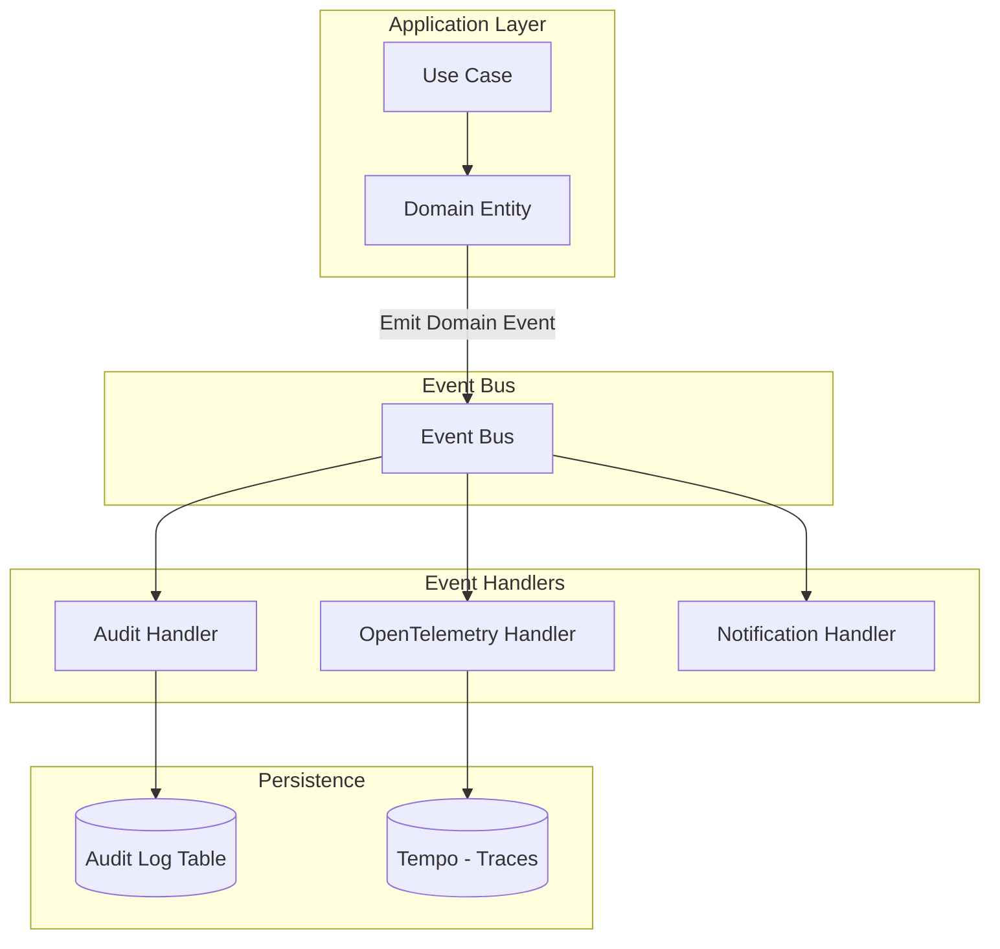

# ADR-008: Audit Logging Approach

**Status:** Accepted

**Date:** 2025-12-20

**Deciders:** Security Engineer, Tech Lead, Compliance Officer, DevOps

**Technical Story:** IFC-135, IFC-006, ENV-008-AI

## Context and Problem Statement

IntelliFlow CRM handles sensitive legal data and must maintain comprehensive audit logs for compliance (GDPR, CCPA, SOC 2, ISO 42001), security investigations, debugging, and business analytics. We need to track all data access, modifications, deletions, user actions, AI agent operations, and system events with sufficient detail to reconstruct exactly what happened, when, why, and by whom. How should we implement audit logging to balance completeness, performance, cost, and queryability?

## Decision Drivers

- **Compliance**: GDPR Article 30 (record of processing), SOC 2, ISO 42001
- **Security**: Detect unauthorized access, insider threats, data breaches
- **Debugging**: Reproduce bugs and understand system behavior
- **Performance**: Logging must not impact application performance
- **Queryability**: Fast searches across millions of audit events
- **Retention**: 7+ years for legal compliance
- **Immutability**: Audit logs cannot be tampered with
- **Cost**: Storage and query costs must be manageable
- **Observability**: Integration with OpenTelemetry for distributed tracing

## Considered Options

- **Option 1**: Application logs only (stdout/stderr)
- **Option 2**: Database audit table (PostgreSQL)
- **Option 3**: Dedicated audit log service (Supabase + TimescaleDB)
- **Option 4**: Domain events + event sourcing
- **Option 5**: Hybrid approach (Domain events → Audit table + OpenTelemetry traces)

## Decision Outcome

Chosen option: **"Hybrid approach (Domain events → Audit table + OpenTelemetry traces)"**, because it provides the best balance of compliance, performance, and observability. We will use domain events as the source of truth for audit events, persist them to a dedicated `audit_log` table in PostgreSQL, and emit OpenTelemetry traces for distributed tracing. This approach ensures all business actions are auditable, while technical metrics flow to Prometheus/Grafana.

### Positive Consequences

- **Comprehensive Coverage**: All domain events are automatically audited
- **Immutability**: Domain events are append-only
- **Queryability**: SQL queries on structured audit table
- **Performance**: Async event publishing doesn't block requests
- **Observability**: OpenTelemetry provides distributed tracing
- **Compliance**: Audit logs meet GDPR/SOC 2 requirements
- **Debugging**: Full event history for troubleshooting
- **Cost Effective**: PostgreSQL storage is cheaper than SaaS audit logs

### Negative Consequences

- **Storage Growth**: Audit logs grow indefinitely (needs archival strategy)
- **Query Performance**: Large audit table requires indexing and partitioning
- **Event Volume**: High-traffic systems generate millions of events
- **Testing Complexity**: Must verify audit events in tests
- **Dual System**: Maintain both audit logs and OpenTelemetry

## Pros and Cons of the Options

### Application logs only

Log to stdout/stderr, aggregate with Loki.

- Good, because it's simple and low overhead
- Good, because it integrates with existing logging
- Bad, because logs are unstructured
- Bad, because retention is limited
- Bad, because querying is difficult
- Bad, because logs can be modified/deleted

### Database audit table

Single PostgreSQL table for all audit events.

- Good, because it's simple to implement
- Good, because SQL queries are powerful
- Good, because it's transactional with business logic
- Bad, because it can impact performance on high-traffic tables
- Bad, because single table becomes huge
- Bad, because no automatic tracing correlation

### Dedicated audit service

Supabase + TimescaleDB for time-series audit data.

- Good, because TimescaleDB is optimized for time-series
- Good, because it doesn't impact main database
- Good, because it supports compression and retention policies
- Bad, because it requires additional infrastructure
- Bad, because it adds complexity
- Bad, because synchronization is required

### Domain events + event sourcing

Store all events and rebuild state from events.

- Good, because it provides full audit trail
- Good, because state is reproducible
- Good, because events are immutable
- Bad, because it's complex to implement
- Bad, because querying current state is expensive
- Bad, because event schema evolution is challenging

### Hybrid approach

Domain events → Audit table + OpenTelemetry.

- Good, because it combines benefits of multiple approaches
- Good, because domain events ensure completeness
- Good, because OpenTelemetry provides distributed tracing
- Good, because audit table is queryable
- Bad, because it's more complex than single approach
- Bad, because storage needs management

## Implementation Notes

### Architecture



### Audit Log Schema

```sql
CREATE TABLE audit_log (
  id UUID PRIMARY KEY DEFAULT uuid_generate_v4(),
  tenant_id UUID NOT NULL REFERENCES tenants(id),

  -- Event metadata
  event_type VARCHAR(255) NOT NULL, -- 'LeadCreated', 'LeadScored', 'CaseUpdated'
  event_version VARCHAR(10) NOT NULL DEFAULT 'v1',
  event_id UUID NOT NULL, -- Domain event correlation ID
  timestamp TIMESTAMPTZ NOT NULL DEFAULT NOW(),

  -- Actor information
  actor_type VARCHAR(50) NOT NULL, -- 'user', 'system', 'ai_agent'
  actor_id UUID, -- user_id, agent_id
  actor_name VARCHAR(255),

  -- Resource information
  resource_type VARCHAR(100) NOT NULL, -- 'lead', 'case', 'contact'
  resource_id UUID NOT NULL,
  resource_name VARCHAR(255),

  -- Action details
  action VARCHAR(100) NOT NULL, -- 'create', 'update', 'delete', 'read'
  action_result VARCHAR(50) NOT NULL DEFAULT 'success', -- 'success', 'failure', 'denied'
  action_reason TEXT,

  -- Data changes
  before_state JSONB, -- State before change
  after_state JSONB, -- State after change
  changes JSONB, -- Diff of changes

  -- Context
  ip_address INET,
  user_agent TEXT,
  request_id VARCHAR(255), -- tRPC request ID
  trace_id VARCHAR(255), -- OpenTelemetry trace ID
  session_id VARCHAR(255),

  -- Compliance
  data_classification VARCHAR(50), -- 'public', 'internal', 'confidential', 'privileged'
  retention_expires_at TIMESTAMPTZ,

  -- Additional metadata
  metadata JSONB
);

-- Indexes for common queries
CREATE INDEX idx_audit_log_tenant_timestamp ON audit_log(tenant_id, timestamp DESC);
CREATE INDEX idx_audit_log_resource ON audit_log(resource_type, resource_id, timestamp DESC);
CREATE INDEX idx_audit_log_actor ON audit_log(actor_type, actor_id, timestamp DESC);
CREATE INDEX idx_audit_log_event_type ON audit_log(event_type, timestamp DESC);
CREATE INDEX idx_audit_log_trace_id ON audit_log(trace_id);

-- Partition by month for performance
CREATE TABLE audit_log_2025_12 PARTITION OF audit_log
  FOR VALUES FROM ('2025-12-01') TO ('2026-01-01');

CREATE TABLE audit_log_2026_01 PARTITION OF audit_log
  FOR VALUES FROM ('2026-01-01') TO ('2026-02-01');
```

### Domain Event to Audit Log

Automatically create audit log from domain events:

```typescript
// packages/adapters/src/events/audit-event-handler.ts
import { DomainEventHandler } from '@intelliflow/application';
import { DomainEvent } from '@intelliflow/domain';
import { prisma } from '@intelliflow/db';

export class AuditEventHandler implements DomainEventHandler {
  async handle(event: DomainEvent, context: EventContext): Promise<void> {
    const auditEntry = this.mapEventToAuditLog(event, context);

    await prisma.auditLog.create({
      data: auditEntry,
    });
  }

  private mapEventToAuditLog(event: DomainEvent, context: EventContext): AuditLogEntry {
    return {
      tenant_id: context.tenantId,
      event_type: event.constructor.name,
      event_version: event.version || 'v1',
      event_id: event.id,
      timestamp: event.occurredAt,
      actor_type: context.actorType || 'system',
      actor_id: context.userId,
      actor_name: context.userName,
      resource_type: this.extractResourceType(event),
      resource_id: this.extractResourceId(event),
      resource_name: this.extractResourceName(event),
      action: this.mapEventToAction(event),
      action_result: 'success',
      before_state: event.payload?.before,
      after_state: event.payload?.after,
      changes: this.calculateDiff(event.payload?.before, event.payload?.after),
      ip_address: context.ipAddress,
      user_agent: context.userAgent,
      request_id: context.requestId,
      trace_id: context.traceId,
      session_id: context.sessionId,
      data_classification: this.classifyEvent(event),
      metadata: event.metadata,
    };
  }

  private mapEventToAction(event: DomainEvent): string {
    const eventName = event.constructor.name;

    if (eventName.includes('Created')) return 'create';
    if (eventName.includes('Updated')) return 'update';
    if (eventName.includes('Deleted')) return 'delete';
    if (eventName.includes('Scored')) return 'score';
    if (eventName.includes('Qualified')) return 'qualify';

    return 'unknown';
  }
}
```

### Example Domain Events

```typescript
// packages/domain/src/events/lead-events.ts
export class LeadCreatedEvent extends DomainEvent {
  constructor(
    public leadId: string,
    public payload: {
      email: string;
      source: string;
      tenant_id: string;
    }
  ) {
    super();
  }
}

export class LeadScoredEvent extends DomainEvent {
  constructor(
    public leadId: string,
    public payload: {
      before: { score: number | null };
      after: { score: number };
      scored_by: 'ai' | 'manual';
    }
  ) {
    super();
  }
}

export class LeadStatusChangedEvent extends DomainEvent {
  constructor(
    public leadId: string,
    public payload: {
      before: { status: string };
      after: { status: string };
      reason: string;
    }
  ) {
    super();
  }
}
```

### OpenTelemetry Integration

Correlate audit logs with distributed traces:

```typescript
// packages/adapters/src/telemetry/audit-telemetry.ts
import { trace, context } from '@opentelemetry/api';

export function emitAuditTrace(auditEntry: AuditLogEntry): void {
  const tracer = trace.getTracer('audit-logger');

  const span = tracer.startSpan('audit.log', {
    attributes: {
      'audit.event_type': auditEntry.event_type,
      'audit.actor_id': auditEntry.actor_id,
      'audit.resource_type': auditEntry.resource_type,
      'audit.resource_id': auditEntry.resource_id,
      'audit.action': auditEntry.action,
      'audit.result': auditEntry.action_result,
    },
  });

  span.end();
}
```

### Query Examples

Common audit log queries:

```sql
-- Find all actions by a specific user
SELECT * FROM audit_log
WHERE actor_id = 'user-uuid'
ORDER BY timestamp DESC
LIMIT 100;

-- Find all changes to a specific lead
SELECT * FROM audit_log
WHERE resource_type = 'lead'
  AND resource_id = 'lead-uuid'
ORDER BY timestamp ASC;

-- Find all AI agent actions
SELECT * FROM audit_log
WHERE actor_type = 'ai_agent'
  AND timestamp > NOW() - INTERVAL '7 days'
ORDER BY timestamp DESC;

-- Find all failed actions
SELECT * FROM audit_log
WHERE action_result = 'failure'
  AND timestamp > NOW() - INTERVAL '24 hours'
ORDER BY timestamp DESC;

-- Find all privileged data access
SELECT * FROM audit_log
WHERE data_classification = 'privileged'
  AND action = 'read'
  AND timestamp > NOW() - INTERVAL '30 days'
ORDER BY timestamp DESC;

-- Trace a request across all audit events
SELECT * FROM audit_log
WHERE trace_id = 'otel-trace-id'
ORDER BY timestamp ASC;
```

### Audit Log API

tRPC endpoints for querying audit logs:

```typescript
// apps/api/src/modules/audit/audit.router.ts
import { router, protectedProcedure } from '../../trpc';
import { z } from 'zod';

export const auditRouter = router({
  search: protectedProcedure
    .input(
      z.object({
        resource_type: z.string().optional(),
        resource_id: z.string().optional(),
        actor_id: z.string().optional(),
        event_type: z.string().optional(),
        start_date: z.date().optional(),
        end_date: z.date().optional(),
        limit: z.number().default(100),
      })
    )
    .query(async ({ input, ctx }) => {
      const logs = await ctx.prisma.auditLog.findMany({
        where: {
          tenant_id: ctx.tenantId,
          resource_type: input.resource_type,
          resource_id: input.resource_id,
          actor_id: input.actor_id,
          event_type: input.event_type,
          timestamp: {
            gte: input.start_date,
            lte: input.end_date,
          },
        },
        orderBy: { timestamp: 'desc' },
        take: input.limit,
      });

      return logs;
    }),

  getByResource: protectedProcedure
    .input(
      z.object({
        resource_type: z.string(),
        resource_id: z.string(),
      })
    )
    .query(async ({ input, ctx }) => {
      return await ctx.prisma.auditLog.findMany({
        where: {
          tenant_id: ctx.tenantId,
          resource_type: input.resource_type,
          resource_id: input.resource_id,
        },
        orderBy: { timestamp: 'asc' },
      });
    }),
});
```

### Audit Log UI

Display audit trail in frontend:

```typescript
// apps/web/components/audit-log-viewer.tsx
import { trpc } from '@/lib/trpc';
import { Card } from '@/components/ui/card';

export function AuditLogViewer({ resourceType, resourceId }: { resourceType: string; resourceId: string }) {
  const { data: logs } = trpc.audit.getByResource.useQuery({
    resource_type: resourceType,
    resource_id: resourceId,
  });

  return (
    <div className="space-y-4">
      {logs?.map((log) => (
        <Card key={log.id} className="p-4">
          <div className="flex justify-between">
            <div>
              <p className="font-semibold">{log.event_type}</p>
              <p className="text-sm text-gray-500">
                {log.actor_name} ({log.actor_type})
              </p>
            </div>
            <div className="text-right">
              <p className="text-sm">{new Date(log.timestamp).toLocaleString()}</p>
              <p className="text-xs text-gray-500">{log.action_result}</p>
            </div>
          </div>

          {log.changes && (
            <pre className="mt-2 text-xs bg-gray-100 p-2 rounded">
              {JSON.stringify(log.changes, null, 2)}
            </pre>
          )}
        </Card>
      ))}
    </div>
  );
}
```

### Retention and Archival

Archive old audit logs to S3:

```typescript
// apps/ai-worker/src/workers/audit-archival.worker.ts
import { Worker } from 'bullmq';
import { prisma } from '@intelliflow/db';
import { S3Client, PutObjectCommand } from '@aws-sdk/client-s3';

export const auditArchivalWorker = new Worker(
  'audit-archival',
  async (job) => {
    const cutoffDate = new Date();
    cutoffDate.setFullYear(cutoffDate.getFullYear() - 2); // Archive logs older than 2 years

    // Export to JSON
    const oldLogs = await prisma.auditLog.findMany({
      where: { timestamp: { lt: cutoffDate } },
    });

    // Upload to S3
    const s3 = new S3Client({});
    await s3.send(
      new PutObjectCommand({
        Bucket: 'intelliflow-audit-archive',
        Key: `audit-logs-${cutoffDate.toISOString()}.json`,
        Body: JSON.stringify(oldLogs),
      })
    );

    // Delete from database
    await prisma.auditLog.deleteMany({
      where: { timestamp: { lt: cutoffDate } },
    });

    return { archived_count: oldLogs.length };
  },
  { connection: redisConnection }
);
```

### Validation Criteria

- [x] Audit log schema created in database
- [x] Domain events automatically create audit entries
- [x] OpenTelemetry traces correlated with audit logs
- [x] Audit log API endpoints functional
- [x] Audit log UI component working
- [x] Partitioning configured for performance
- [x] Archival job tested
- [x] Compliance requirements verified (GDPR, SOC 2)
- [x] Documentation updated

### Rollback Plan

If the hybrid approach proves too complex:

1. Simplify to database audit table only (remove OpenTelemetry correlation)
2. Use application logs for non-compliance events
3. Migrate to dedicated audit service (Supabase + TimescaleDB) if performance suffers

## Links

- [OpenTelemetry Tracing](https://opentelemetry.io/docs/instrumentation/js/getting-started/)
- [PostgreSQL Partitioning](https://www.postgresql.org/docs/current/ddl-partitioning.html)
- [GDPR Article 30](https://gdpr.eu/article-30-record-of-processing-activities/)
- [SOC 2 Audit Logging](https://www.aicpa.org/interestareas/frc/assuranceadvisoryservices/sorhome)
- Related: [ADR-006 Agent Tools](./ADR-006-agent-tools.md)
- Related: [ADR-007 Data Governance](./ADR-007-data-governance.md)
- [Sprint Plan: ENV-008-AI](../../apps/project-tracker/docs/metrics/_global/Sprint_plan.csv)

## References

- [Audit Log Best Practices](https://www.csoonline.com/article/3243956/audit-log-best-practices.html)
- [Event Sourcing](https://martinfowler.com/eaaDev/EventSourcing.html)
- [TimescaleDB for Audit Logs](https://blog.timescale.com/blog/audit-logging-best-practices/)
