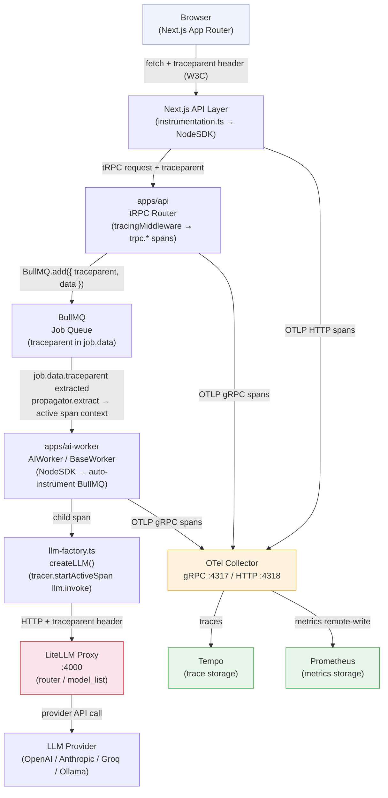

# Sprint 18 Scoping: OpenTelemetry SDK Install + Distributed Tracing

**Status:** Draft — pending sprint-18 planning sign-off **Owner:** Platform /
AI-Platform Team **Target sprint:** 18 **Audit source:**
`docs/architecture/audits/2026-04-17-agent-system-audit.md` — findings M10 + L2
**ADR reference:** ADR-048 (hybrid AI inference), ADR-001 (observability pillar)
**Effort estimate:** 7–9 engineering days (see §11)

---

## 1. Context

The 2026-04-17 agent-system audit surfaced two directly related findings that
block the observability commitments made in ADR-001 and IFC-074:

**M10 — OTel SDK absent from ai-worker.** `apps/ai-worker/package.json` carries
zero `@opentelemetry/*` dependencies. The collector infrastructure (OTLP
receivers on 4317 / 4318, Tempo exporter, Prometheus remote-write) is fully
configured and running, but the worker that produces the most interesting
signals — LLM invocations, BullMQ job lifecycles, hallucination checks, cost
accumulation — emits no spans whatsoever. The collector receives nothing from
the busiest service in the monorepo.

**L2 — Prometheus scrape port mismatch.** The collector config at
`infra/monitoring/otel-config.yaml` (and the copy at
`infra/monitoring/otel-config.yaml`) registers the ai-worker scrape target at
`localhost:3002`. The actual `AIWorker` class binds `HEALTH_PORT` (defaulting to
`5000`) for its HTTP health and `/metrics` endpoint. Prometheus therefore
scrapes the wrong host:port and receives connection-refused errors every 60
seconds. All 13 alert rules in `infra/monitoring/alerts-config.yaml` — covering
drift, hallucin- ation rate, latency p95/p99, cost spike, SLO compliance, and
model health score — depend on the `intelliflow_ai_*` family of Prometheus
metrics that only exist if the scrape endpoint is reachable.

These two findings together mean: the entire AI observability stack (alerts,
dashboards, SLO tracking) is silently broken in any environment where the OTel
collector is deployed.

A third gap adds urgency: `apps/api` has a fully working OTel integration
(`apps/api/src/tracing/otel.ts`, `tracingMiddleware`, correlation IDs) but
`apps/web` has no `instrumentation.ts`, so browser-originated traces never
acquire a `traceparent` header before crossing to the API. End-to-end trace
correlation from click to LLM response is therefore impossible today.

Sprint 18 closes all three gaps.

---

## 2. Goals

The following outcomes must all be met for this sprint to close.

**G1 — Every LLM call in ai-worker emits an OTel span.** `createLLM()` in
`apps/ai-worker/src/lib/llm-factory.ts` is the single call-site for every
LangChain model instantiation. Wrapping it with
`tracer.startActiveSpan('llm.invoke', ...)` captures all AI inference regardless
of which chain or agent calls it. Span attributes must include at minimum:
`tenantId`, `llm.purpose`, `llm.tier`, `llm.provider`, `llm.model_name` (per
ADR-048 § Observability Contracts).

**G2 — Web → API → ai-worker traces share a single trace ID.** The `traceparent`
W3C header must propagate from the Next.js frontend through the tRPC call to the
API, and from there into the BullMQ job payload so the ai-worker can extract and
continue the same trace. A user action in the browser and the downstream LLM
call must appear as a single distributed trace in Tempo / Jaeger.

**G3 — Prometheus scrape port is consistent.** One source of truth: either the
collector config points to 5000, or the ai-worker `HEALTH_PORT` default changes
to 3002, and the other is updated to match. Both files are updated atomically in
the same PR and the chosen port is documented in `infra/monitoring/README.md`.

**G4 — NodeSDK is wired in ai-worker and starts before any other import.**
`apps/ai-worker/src/index.ts` currently imports `./env` first (correct pattern).
OTel SDK initialisation must be the second import — before LangChain, before
BullMQ, before pino — so auto-instrumentation patches are in place before any
instrumented library is loaded.

**G5 — Alert expressions resolve against real metric values.** After deploying
the port fix, all 13 alert rules in `artifacts/misc/alerts- config.yaml` must
evaluate against non-NaN metric values in at least the staging environment. This
is the acceptance criterion for L2.

---

## 3. Non-Goals

The following items are explicitly out of scope for sprint 18. Each has its own
rationale.

- **Custom metrics emitters.** The `intelliflow_ai_*` Prometheus metrics are
  already emitted by existing ai-worker code paths (MonitoringFlushService,
  hallucinationChecker, costTracker). Sprint 18 does not add new metric
  definitions — it fixes the scrape path so existing metrics are reachable.

- **Log correlation IDs.** Injecting `trace_id` / `span_id` into pino log lines
  (so Loki entries link back to Tempo spans) is valuable but requires the
  `@opentelemetry/winston-transport` or pino-opentelemetry integration and
  separate testing. Deferred to sprint 19.

- **Web workspace full instrumentation.** Next.js `instrumentation.ts` is
  flagged in Phase 2, but the depth of web instrumentation (React Server
  Components spans, client-side fetch tracing, Web Vitals as OTel metrics) is a
  significant workstream that requires frontend-team sign-off. Sprint 18 scope
  is: create the file and call `NodeSDK.start()` with auto-instrumentations for
  the Node.js runtime. Client-side spans are out of scope.

- **Grafana dashboard creation.** Dashboards for the new span data are post-
  instrumentation work. Sprint 18 delivers the data; dashboard work follows.

- **Sampling tuning for production traffic.** The collector already has tail
  sampling configured (10% of successes, always-on for errors and >1 s spans).
  Sprint 18 does not change collector-side sampling policy.

- **LiteLLM span propagation.** Tracing into the LiteLLM proxy process itself
  (spans for routing decisions, provider retries) is a LiteLLM configuration
  concern. Sprint 18 ends at the `createLLM()` call boundary.

---

## 4. Current State Audit

### What exists today

| Component         | OTel status         | Notes                                                                                                                                                                                                                                                                                                                                                                                       |
| ----------------- | ------------------- | ------------------------------------------------------------------------------------------------------------------------------------------------------------------------------------------------------------------------------------------------------------------------------------------------------------------------------------------------------------------------------------------- |
| `apps/api`        | Partial — SDK wired | `apps/api/src/tracing/otel.ts`: `NodeSDK` + auto-instrumentations initialised; `tracingMiddleware` creates `trpc.*` spans; correlation IDs propagated via AsyncLocalStorage. Deps: `@opentelemetry/api@1.9.0`, `sdk-node@0.212.0`, `auto-instrumentations-node@0.70.1`, `exporter-trace-otlp-http`, `exporter-metrics-otlp-http`, `resources`, `semantic-conventions`, `winston-transport`. |
| `apps/ai-worker`  | Absent              | Zero `@opentelemetry/*` deps. No SDK init. No spans. BullMQ jobs receive a `correlationId` string field but it is generated as `scheduled-*` or derived from job data — not linked to an OTel trace context.                                                                                                                                                                                |
| `apps/web`        | Absent              | No `instrumentation.ts`. `next.config.js` references `@fastify/otel` and `@opentelemetry/instrumentation` in `serverExternalPackages` but no SDK is initialised.                                                                                                                                                                                                                            |
| OTel Collector    | Running             | `infra/monitoring/otel-collector.yaml`: OTLP gRPC on 4317, HTTP on 4318 (with CORS for `*.intelliflow.dev`, `*.railway.app`, `*.vercel.app`, `localhost:*`). Traces → Tempo (`tempo:4317`). Metrics → Prometheus remote-write. Logs → Loki. Health check on 13133.                                                                                                                          |
| Prometheus scrape | Broken              | `infra/monitoring/otel-config.yaml` line 38: `targets: ['localhost:3002']` for `intelliflow-ai-worker`. `AIWorker` constructor line 105: `port: Number.parseInt(process.env.HEALTH_PORT \|\| '5000', 10)`. Mismatch: 3002 vs 5000.                                                                                                                                                          |
| Alerts            | Silently broken     | All 13 rules in `infra/monitoring/alerts-config.yaml` reference `intelliflow_ai_*` Prometheus metrics. Because scrape fails, all expressions return `no data` — alert rules never fire even if thresholds are breached.                                                                                                                                                                     |

### What is missing

1. `@opentelemetry/api`, `@opentelemetry/sdk-node`,
   `@opentelemetry/auto-instrumentations-node` in `apps/ai-worker/package.json`
   and `apps/web/package.json`.
2. An SDK initialisation module in `apps/ai-worker/src/tracing/` (analogous to
   `apps/api/src/tracing/otel.ts`).
3. `apps/web/src/instrumentation.ts` (Next.js registered hook).
4. Custom `llm.invoke` span wrapping `createLLM()` calls in
   `apps/ai-worker/src/lib/llm-factory.ts`.
5. `traceparent` propagation from API → BullMQ job data payload → ai-worker span
   context restore.
6. Port alignment: one of {`otel-config.yaml` scrape target, `AIWorker`
   `HEALTH_PORT` default} must change.

---

## 5. Architecture Diagram

Trace propagation path, from browser click to LLM provider response:



Key propagation boundary: the BullMQ `add()` call in the API is the
process-boundary crossing. HTTP auto-instrumentation handles web→tRPC. The
BullMQ → ai-worker hop requires explicit `propagator.inject()` on enqueue and
`propagator.extract()` on dequeue because BullMQ does not implement the W3C
`Propagator` interface natively.

---

## 6. Implementation Plan

### Phase 1 — Install SDK packages (est. 0.5 days)

Install `@opentelemetry/api`, `@opentelemetry/sdk-node`, and
`@opentelemetry/auto-instrumentations-node` in `apps/ai-worker` and `apps/web`.

```
pnpm --filter @intelliflow/ai-worker add \
  @opentelemetry/api \
  @opentelemetry/sdk-node \
  @opentelemetry/auto-instrumentations-node \
  @opentelemetry/exporter-trace-otlp-http \
  @opentelemetry/exporter-metrics-otlp-http \
  @opentelemetry/resources \
  @opentelemetry/semantic-conventions

pnpm --filter @intelliflow/web add \
  @opentelemetry/api \
  @opentelemetry/sdk-node \
  @opentelemetry/auto-instrumentations-node \
  @opentelemetry/exporter-trace-otlp-http \
  @opentelemetry/resources \
  @opentelemetry/semantic-conventions
```

Version pinning: use current stable versions from npm at implementation time. Do
NOT downgrade any package that is already pinned in `apps/api/package.json`. The
api workspace already has `@opentelemetry/api@1.9.0` and
`@opentelemetry/sdk-node@0.212.0`; use the same versions across all workspaces
to avoid OTel API version conflicts (the OTel API is a singleton — multiple
versions in the same Node.js process break span context propagation). If the
stable latest has moved beyond these pins, update the api pins too and run all
tracing tests.

Checklist:

- [ ] `apps/ai-worker/package.json` — deps added, `pnpm install` clean
- [ ] `apps/web/package.json` — deps added, `pnpm install` clean
- [ ] `pnpm typecheck` passes across monorepo
- [ ] Verify no duplicate OTel API versions: `pnpm ls @opentelemetry/api` should
      show a single resolved version

### Phase 2 — NodeSDK wiring (est. 1.5 days)

**ai-worker:**

Create `apps/ai-worker/src/tracing/otel.ts` modelling the existing api
implementation. Key differences:

- `OTEL_SERVICE_NAME` default: `intelliflow-ai-worker`
- Disable `@opentelemetry/instrumentation-fs` (same reason as api — noisy)
- Enable `@opentelemetry/instrumentation-bullmq` if available in
  `auto-instrumentations-node`, otherwise defer to Phase 4 for manual BullMQ
  span creation
- Export `startTracing()` and `shutdownOpenTelemetry()` matching the api API
  shape

In `apps/ai-worker/src/index.ts`, the initialisation order must be:

```typescript
import './env'; // 1 — already first
import './tracing/otel'; // 2 — OTel MUST come before LangChain
// ... rest of existing imports
```

This is not negotiable: OTel auto-instrumentation patches Node.js module loader
hooks. If LangChain, BullMQ, or express are imported before `NodeSDK.start()`,
those libraries will not be instrumented.

Call `startTracing()` at module-load time (not inside a class constructor):

```typescript
// tracing/otel.ts bottom of file
startTracing(); // called immediately on import
```

Register `shutdownOpenTelemetry()` on `SIGTERM` / `SIGINT`.

**web:**

Create `apps/web/src/instrumentation.ts` (Next.js 16 registered instrumentation
hook). This file is automatically called by Next.js before the application
starts, on the Node.js runtime only:

```typescript
export async function register() {
  if (process.env.NEXT_RUNTIME === 'nodejs') {
    const { startTracing } = await import('./tracing/otel');
    startTracing();
  }
}
```

Create the backing `apps/web/src/tracing/otel.ts` with service name
`intelliflow-web`. Disable client-side and browser-specific instrumentations —
those are out of scope.

Team note: web instrumentation beyond the `instrumentation.ts` hook (RSC spans,
client fetch, Web Vitals as OTel metrics) requires frontend team sign-off and is
explicitly not in scope for this sprint.

Checklist:

- [ ] `apps/ai-worker/src/tracing/otel.ts` created + exported
- [ ] `apps/ai-worker/src/index.ts` — tracing import is second, after `./env`
- [ ] `startTracing()` called + SIGTERM/SIGINT handlers registered
- [ ] `apps/web/src/instrumentation.ts` created
- [ ] `apps/web/src/tracing/otel.ts` created
- [ ] Manual smoke test: start ai-worker in dev → look for
      `[OpenTelemetry] Initialized tracing for intelliflow-ai-worker` log line
- [ ] `pnpm typecheck` and `pnpm build` pass for both workspaces

### Phase 3 — Custom LLM spans (est. 2 days)

This is the highest-value instrumentation work. `createLLM()` in
`apps/ai-worker/src/lib/llm-factory.ts` is called by every chain and every
agent. Wrapping it creates a span for every LLM invocation across the system.

Approach — wrap the return value rather than the factory call site, because
`BaseChatModel` is a LangChain object; the actual network call happens on
`.invoke()` / `.stream()`. A thin wrapper class is cleaner than patching the
model:

```typescript
import { trace, SpanStatusCode, SpanKind } from '@opentelemetry/api';
import {
  ATTR_SERVICE_NAME,
  GEN_AI_SYSTEM,
  GEN_AI_REQUEST_MODEL,
} from '@opentelemetry/semantic-conventions/incubating';

const tracer = trace.getTracer('intelliflow-ai-worker', '0.1.0');

// Inside createLLM(), wrap the returned model:
export function createLLM(purpose, tier, options): BaseChatModel {
  const model = /* existing factory logic */ ...;
  return wrapModelWithTracing(model, { purpose, tier });
}

function wrapModelWithTracing(
  model: BaseChatModel,
  meta: { purpose: LLMPurpose; tier: LLMTier }
): BaseChatModel {
  const originalInvoke = model.invoke.bind(model);

  model.invoke = async (input, options) => {
    return tracer.startActiveSpan(
      'llm.invoke',
      {
        kind: SpanKind.CLIENT,
        attributes: {
          'llm.purpose': meta.purpose,
          'llm.tier': meta.tier,
          'llm.provider': aiConfig.provider,
          'llm.model_name': `${meta.purpose}-${meta.tier}`,
          // tenant context must come from AsyncLocalStorage or job context
          // — see Phase 4 for propagation
        },
      },
      async (span) => {
        try {
          const result = await originalInvoke(input, options);
          span.setStatus({ code: SpanStatusCode.OK });
          return result;
        } catch (err) {
          span.setStatus({ code: SpanStatusCode.ERROR, message: String(err) });
          span.recordException(err as Error);
          throw err;
        } finally {
          span.end();
        }
      }
    );
  };

  return model;
}
```

Span attributes (per ADR-048 Observability Contracts):

- `llm.purpose` — `LLMPurpose` value (scoring / qualification / email /
  reasoning / structured / rag)
- `llm.tier` — `LLMTier` value (free / standard / premium)
- `llm.provider` — `aiConfig.provider` at call time (litellm / ollama / mock)
- `llm.model_name` — the logical `${purpose}-${tier}` name sent to LiteLLM
- `tenant.id` — extracted from job context (see Phase 4)
- `gen_ai.system` — semantic convention attribute for the AI provider system

Note: `tenantId` must not be hardcoded. It must come from the running job's
context. Use an AsyncLocalStorage store set at `processJob()` entry in
`AIWorker`, so that `createLLM()` can read it without threading it through every
call signature.

Checklist:

- [ ] `wrapModelWithTracing()` helper in `apps/ai-worker/src/tracing/` (separate
      file from SDK init)
- [ ] `createLLM()` uses the wrapper
- [ ] `createEmbeddings()` gets an analogous `embeddings.embed*` wrapper
- [ ] `tenant.id` attribute populated via AsyncLocalStorage (not just present if
      available — must default to `'unknown'` not `undefined`, else span filter
      queries break)
- [ ] Unit test: mock tracer, call `createLLM('scoring', 'free').invoke(...)`,
      assert span name = `llm.invoke`, attributes include
      `llm.purpose: 'scoring'`
- [ ] `pnpm test --filter ai-worker` passes

### Phase 4 — traceparent propagation across BullMQ (est. 2 days)

This is the hardest phase technically. BullMQ is a Redis-based queue; jobs cross
a process boundary. W3C `traceparent` must be serialised into the job payload on
enqueue and deserialised on dequeue.

**Enqueue side (apps/api):**

In any tRPC mutation that enqueues a BullMQ job (e.g. `ai:scoring`,
`ai:prediction`, `ai:insights`), inject the current span context:

```typescript
import { context, propagation } from '@opentelemetry/api';

// Inside the tRPC mutation handler, before queue.add():
const carrier: Record<string, string> = {};
propagation.inject(context.active(), carrier);

await queue.add('score-lead', {
  ...jobData,
  _otelCarrier: carrier, // { traceparent: '00-...', tracestate: '...' }
});
```

**Dequeue side (apps/ai-worker):**

In `AIWorker.processJob()` (or the BullMQ worker's `processor` function), before
any other work:

```typescript
import { context, propagation, trace } from '@opentelemetry/api';

const carrier = job.data._otelCarrier ?? {};
const parentContext = propagation.extract(context.active(), carrier);

return context.with(parentContext, async () => {
  // All spans created inside here are children of the original trace
  return await processJobImpl(job);
});
```

This connects the web→api trace to the ai-worker→LLM trace without any custom
transport. The existing `correlationId` fields on job schemas can be retained as
a fallback correlation mechanism (they are already used by
`job-idempotency.ts`); `_otelCarrier` is additive.

Checklist:

- [ ] `_otelCarrier` field added to `ScoringJobData`, `PredictionJobData`,
      `InsightJobData` Zod schemas (optional, `z.record(z.string()).optional()`)
- [ ] API enqueue sites inject carrier
- [ ] `AIWorker` dequeue restores context
- [ ] Integration test: enqueue from a span context → assert child span
      `llm.invoke` shares the same `traceId`
- [ ] `pnpm typecheck` for api + ai-worker

### Phase 5 — Fix Prometheus scrape port (est. 0.5 days)

**Decision:** Update the collector config to target port 5000 (not 3002).
Rationale: the ai-worker `HEALTH_PORT` default of 5000 is set in code and
referenced in tests; changing it risks breaking health-check integrations.
Updating two YAML files is safer.

Files to update:

- `infra/monitoring/otel-config.yaml` line 38: `targets: ['localhost:3002']` →
  `['localhost:5000']`
- `infra/monitoring/otel-config.yaml` — same scrape target block (this file does
  not have the prometheus receiver with static scrape configs; verify at
  implementation time whether it needs updating or is already correct)

After the fix, add a comment block above the scrape entry:

```yaml
# ai-worker /metrics port: 5000 (see AIWorker constructor HEALTH_PORT default)
# Do NOT change to 3002 — that is the project-tracker dashboard port
```

Document the port in `infra/monitoring/README.md` (create if absent).

Verify: start docker-compose stack → check collector logs for successful scrape
of `intelliflow-ai-worker` at 5000 → check Prometheus for `intelliflow_ai_*`
metric series.

Checklist:

- [ ] `infra/monitoring/otel-config.yaml` updated
- [ ] `infra/monitoring/otel-config.yaml` verified / updated
- [ ] Port documented in `infra/monitoring/README.md`
- [ ] Staging smoke test: `intelliflow_ai_success_rate` has a value in
      Prometheus

---

## 7. Key Design Decisions

The following decisions should be reviewed and confirmed at the sprint-18
planning meeting before implementation begins.

**D1 — OTLP exporter target.** Both collector configs use OTLP gRPC 4317 for the
Tempo exporter (`endpoint: tempo:4317`). Apps should push to the collector, not
directly to Tempo. The ai-worker SDK default should be
`OTEL_EXPORTER_OTLP_ENDPOINT=http://localhost:4317` (gRPC) in local dev when the
collector is running. In CI / environments without a collector, set
`OTEL_TRACES_EXPORTER=console` and `OTEL_METRICS_EXPORTER=none` (same pattern as
the api). Team must decide: does the collector run in Docker Compose for local
dev? If not, developers will see connection-refused noise on startup and the
dev-mode console fallback must be in place.

**D2 — Sampling strategy.** The collector already implements tail sampling
(always-on for errors and >1 s spans; 10% probabilistic for successes). For the
SDK-side, use `AlwaysSampler` (head-based, all spans sampled before reaching the
collector). This is correct: tail sampling requires the collector to receive all
spans and make the keep/drop decision there. If the SDK drops spans before they
reach the collector, the tail-sampling policies cannot work. Do not configure
`ParentBasedSampler` or `TraceIdRatioBased` in the SDKs — leave sampling
entirely to the collector.

**D3 — Batch span processor tuning.** Use default `BatchSpanProcessor`
configuration for sprint 18: `maxQueueSize=2048`, `maxExportBatchSize=512`,
`scheduledDelayMillis=5000`. The ai-worker processes jobs sequentially within
each queue worker; batch buffering will not introduce noticeable latency.
Revisit if queue throughput grows beyond ~100 jobs/minute.

**D4 — OTel API version consistency.** `apps/api` pins
`@opentelemetry/api@1.9.0`. All workspaces must use the same
`@opentelemetry/api` version. The OTel API package is a singleton via a global
Symbol; if two different versions of `@opentelemetry/api` end up in the Node.js
module graph, span context propagation silently breaks. Enforce this with a
`pnpm` workspace resolution override if needed.

**D5 — tenantId as span attribute vs. label.** Span attributes are indexed by
Tempo and searchable in Grafana Explore. `tenant.id` as a span attribute is the
right choice for multi-tenant debugging (find all LLM calls for a specific
tenant). However, high cardinality attributes incur storage cost. At current
scale (expected <100 tenants), this is acceptable. Revisit cardinality policy
when tenants exceed 1 000.

---

## 8. Testing Strategy

**Unit tests — span emission.** Each instrumented call site needs a unit test
that asserts a span is created with the expected name and attributes. Use
`@opentelemetry/sdk-trace-base`'s `InMemorySpanExporter` + `SimpleSpanProcessor`
to capture spans synchronously in tests:

```typescript
import {
  BasicTracerProvider,
  InMemorySpanExporter,
  SimpleSpanProcessor,
} from '@opentelemetry/sdk-trace-base';

const exporter = new InMemorySpanExporter();
const provider = new BasicTracerProvider();
provider.addSpanProcessor(new SimpleSpanProcessor(exporter));
provider.register();

// ... call createLLM(...).invoke(...)

const spans = exporter.getFinishedSpans();
expect(spans).toHaveLength(1);
expect(spans[0].name).toBe('llm.invoke');
expect(spans[0].attributes['llm.purpose']).toBe('scoring');
```

Add `@opentelemetry/sdk-trace-base` as a devDependency in ai-worker.

**Integration test — trace correlation.** In `apps/api/src/__tests__/`, add a
test that enqueues a BullMQ job with an injected carrier, then verifies the
ai-worker consumes the job and the resulting `llm.invoke` span shares the same
`traceId`. This test requires a running Redis instance (already available in the
integration test Docker Compose profile).

**End-to-end verification in staging.** After deploying phase 1–5:

1. Navigate to a lead page in the staging web app.
2. Trigger a scoring action.
3. Open Grafana → Explore → Tempo.
4. Search for traces by `service.name = intelliflow-web` within the last 5
   minutes.
5. Confirm the trace spans web → api → ai-worker → `llm.invoke`.
6. Confirm `tenant.id` attribute is present on the `llm.invoke` span.
7. Check Prometheus for `intelliflow_ai_success_rate` to confirm scrape is
   working.

**Load test scenario.** Run `k6` or the existing benchmark suite
(`pnpm run ai:benchmark`) while the collector is active. Verify:

- Span-processor queue does not overflow (`otel.bsp.dropped.spans` metric from
  the collector should remain 0).
- p95 overhead of span creation is below 5 ms (the target stated in
  `apps/api/src/tracing/otel.ts` KPI comment).

---

## 9. Rollback Plan

OTel instrumentation has no database side-effects. Rollback is clean:

1. Remove the `startTracing()` call from `apps/ai-worker/src/index.ts` and
   `apps/web/src/instrumentation.ts`.
2. Optionally uninstall the `@opentelemetry/*` packages. This is not required
   for a hotfix rollback — simply not calling `startTracing()` leaves the SDK
   dormant.
3. Revert the `otel-config.yaml` scrape target port change if the port fix
   caused unexpected side-effects.
4. Redeploy. No migrations, no schema changes, no data to undo.

The `_otelCarrier` field added to BullMQ job Zod schemas is optional and unknown
keys are stripped by `z.object()`. Old job payloads without `_otelCarrier` will
continue to process normally even if the ai-worker code has been rolled back.

---

## 10. Dependencies and Blockers

**Blocked — Tempo / Jaeger deployment.** The collector is configured to export
traces to `tempo:4317`. Sprint 18 assumes Tempo is deployed and reachable. If
Tempo is not running in the target environment, spans will be exported but lost.
Confirmation needed from DevOps before Phase 2 begins. In the absence of Tempo,
the `logging` exporter can be used as a temporary verification mechanism
(`OTEL_LOG_LEVEL=debug`).

**Blocked — Collector deployment in local dev Docker Compose.** If developers
run `docker compose up` without the OTel collector profile, every ai-worker and
api startup will log ECONNREFUSED to `localhost:4317`. The dev-mode console
fallback (`OTEL_TRACES_EXPORTER=console`) must be the default for
`NODE_ENV=development` without `OTEL_EXPORTER_OTLP_ENDPOINT` set. Verify this is
already the case for the api (it is, per `apps/api/src/tracing/otel.ts` line
89–93) and replicate the same logic for ai-worker.

**Deferred — Log correlation IDs.** Injecting `trace_id` / `span_id` into pino
structured log lines requires `pino-opentelemetry` or a custom pino transport.
This is explicitly out of scope for sprint 18 and should be backlogged for
sprint 19. Without it, logs and traces are correlated only by timestamp
approximation, not by shared ID.

**Deferred — Custom metrics emitters.** Adding new `intelliflow_ai_*` metric
series (e.g. per-chain invocation counts, token consumption histograms) is
deferred. Sprint 18 only fixes the scrape endpoint so existing metrics are
reachable.

**Deferred — Client-side web instrumentation.** Browser fetch spans, React
component renders, Web Vitals as OTel metrics. Requires frontend team sign-off.
Deferred beyond sprint 18.

**Owner — Tempo / Grafana deployment:** DevOps team. **Owner — Collector Docker
Compose profile:** DevOps team. **Owner — Web instrumentation depth:** Frontend
lead.

---

## 11. Effort Estimate

| Phase     | Description                                                                   | Days    |
| --------- | ----------------------------------------------------------------------------- | ------- |
| Phase 1   | Install OTel packages in ai-worker + web                                      | 0.5     |
| Phase 2   | NodeSDK wiring — ai-worker + web `instrumentation.ts`                         | 1.5     |
| Phase 3   | Custom `llm.invoke` spans + AsyncLocalStorage tenant context                  | 2.0     |
| Phase 4   | traceparent propagation across BullMQ (inject + extract)                      | 2.0     |
| Phase 5   | Port mismatch fix + documentation                                             | 0.5     |
| Testing   | Unit tests (span exporter), integration test (trace correlation), staging E2E | 1.5     |
| **Total** |                                                                               | **8.0** |

Buffer: add 1 day for unexpected version conflicts or Docker Compose environment
issues. Realistic sprint commitment: **8–9 engineering days** across the sprint.

This is not a 2-day job. Three separate workspaces require SDK wiring; the
BullMQ propagation phase requires careful integration testing; and the port fix,
while simple, requires staging deployment to verify. Undershooting the estimate
risks leaving the system in a partially instrumented state, which is worse than
the current state (at least currently the absence of spans is consistent and
known).

---

## 12. References

| Resource                                                    | Path / URL                                                  |
| ----------------------------------------------------------- | ----------------------------------------------------------- |
| Audit doc (source of M10, L2)                               | `docs/architecture/audits/2026-04-17-agent-system-audit.md` |
| Alerts config (13 rules, all depending on ai-worker scrape) | `infra/monitoring/alerts-config.yaml`                       |
| OTel collector config (artifacts copy)                      | `infra/monitoring/otel-config.yaml`                         |
| OTel collector config (infra canonical)                     | `infra/monitoring/otel-collector.yaml`                      |
| Existing api tracing implementation                         | `apps/api/src/tracing/otel.ts`                              |
| Existing api tracing middleware                             | `apps/api/src/tracing/middleware.ts`                        |
| LLM factory (Phase 3 target)                                | `apps/ai-worker/src/lib/llm-factory.ts`                     |
| ai-worker entry point                                       | `apps/ai-worker/src/index.ts`                               |
| AIWorker (port definition)                                  | `apps/ai-worker/src/ai-worker.ts` line 105                  |
| ADR-048 (hybrid AI inference + observability contracts)     | `docs/architecture/adr/ADR-048-hybrid-ai-inference.md`      |
| ADR-001 (observability pillar)                              | `docs/architecture/adr/ADR-001-modern-stack.md`             |
| OpenTelemetry JS SDK                                        | https://opentelemetry.io/docs/languages/js/                 |
| OTel Semantic Conventions — GenAI                           | https://opentelemetry.io/docs/specs/semconv/gen-ai/         |
| W3C Trace Context spec                                      | https://www.w3.org/TR/trace-context/                        |
| BullMQ docs                                                 | https://docs.bullmq.io/                                     |
