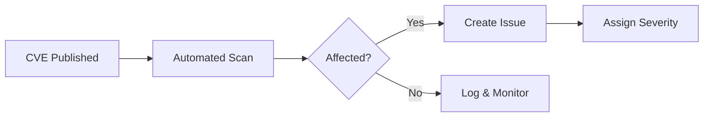

# CVE Response Playbook

## Overview

This playbook defines the process for responding to Common Vulnerabilities and Exposures (CVEs) affecting IntelliFlow CRM dependencies.

**Task**: IFC-121 - Secret Rotation & Vulnerability Updates
**Created**: 2025-12-29

---

## Severity Classification

| Severity | CVSS Score | Response SLA | Example |
|----------|------------|--------------|---------|
| Critical | 9.0 - 10.0 | 24 hours | RCE, authentication bypass |
| High | 7.0 - 8.9 | 7 days | Privilege escalation, data leak |
| Medium | 4.0 - 6.9 | 30 days | DoS, information disclosure |
| Low | 0.1 - 3.9 | 90 days | Minor issues, edge cases |

---

## Response Workflow

### Phase 1: Detection (0-1 hour)



**Actions**:
1. Automated scans (Snyk, Trivy, OSV) detect CVE
2. GitHub Security Alert created automatically
3. Slack notification sent to `#security-alerts`
4. Issue created with severity label

### Phase 2: Assessment (1-4 hours)

**Questions to Answer**:
- [ ] Is the vulnerable component in use?
- [ ] Is the vulnerable code path reachable?
- [ ] Is there a public exploit?
- [ ] What data/functionality is at risk?
- [ ] Is there a patch available?

**Assessment Template**:
```markdown
## CVE Assessment: CVE-YYYY-XXXXX

**Component**: package-name@version
**Severity**: Critical/High/Medium/Low
**CVSS**: X.X

### Impact Analysis
- **Reachability**: Yes/No/Partial
- **Exploit Available**: Yes/No
- **Data at Risk**: [describe]

### Recommendation
- [ ] Patch immediately
- [ ] Apply workaround
- [ ] Accept risk (with justification)
- [ ] No action needed
```

### Phase 3: Remediation

**Option A: Patch Available**
```bash
# Update to patched version
pnpm update package-name@patched-version

# Verify fix
pnpm audit --json | jq '.advisories | keys'

# Run tests
pnpm test

# Deploy
git commit -m "fix(security): patch CVE-YYYY-XXXXX"
git push origin main
```

**Option B: No Patch Available**
```bash
# Option 1: Remove vulnerable package
pnpm remove package-name
# Find alternative

# Option 2: Apply workaround
# Document in SECURITY.md

# Option 3: Temporary mitigation
# Add to waiver file with expiration
echo "CVE-YYYY-XXXXX,2025-03-01,No patch available" >> tools/audit/waivers/cve-waivers.csv
```

### Phase 4: Verification

```bash
# Verify remediation
pnpm audit
snyk test
trivy fs .

# Update vulnerability baseline
npx tsx tools/scripts/update-vuln-baseline.ts

# Close issue with evidence
```

### Phase 5: Post-Incident Review

**Required Documentation**:
- [ ] CVE ID and severity
- [ ] Detection timestamp
- [ ] Time to remediation
- [ ] Root cause (if applicable)
- [ ] Lessons learned
- [ ] Process improvements

---

## Automated Response

### GitHub Dependabot

```yaml
# .github/dependabot.yml
version: 2
updates:
  - package-ecosystem: "npm"
    directory: "/"
    schedule:
      interval: "daily"
    open-pull-requests-limit: 10
    labels:
      - "dependencies"
      - "security"
```

### Automated Patching

```yaml
# Trigger: Critical CVE detected
# Action: Auto-create PR with patch
name: Auto-Patch Critical CVE
on:
  repository_dispatch:
    types: [critical-cve]
jobs:
  patch:
    runs-on: ubuntu-latest
    steps:
      - uses: actions/checkout@v4
      - run: pnpm update ${{ github.event.client_payload.package }}
      - uses: peter-evans/create-pull-request@v6
        with:
          title: "[CRITICAL] Patch ${{ github.event.client_payload.cve }}"
          labels: security,critical,automated
```

---

## Waiver Process

For CVEs that cannot be immediately remediated:

1. **Document justification** in `tools/audit/waivers/cve-waivers.csv`
2. **Set expiration date** (max 90 days)
3. **Get approval** from Security Lead
4. **Monitor** for patch availability
5. **Review** at weekly security meeting

**Waiver Format**:
```csv
CVE_ID,Expiration,Justification,Approver,Mitigations
CVE-2024-1234,2025-03-01,No patch available,security@intelliflow.com,WAF rule added
```

---

## Escalation Matrix

| Severity | Initial Response | Escalation 1 | Escalation 2 |
|----------|------------------|--------------|--------------|
| Critical | Security Engineer | Security Lead (1h) | CTO (4h) |
| High | Security Engineer | Security Lead (24h) | - |
| Medium | Any Developer | Security Engineer (7d) | - |
| Low | Any Developer | - | - |

---

## Communication Templates

### Internal Notification (Critical)
```
CRITICAL SECURITY ALERT

CVE: CVE-YYYY-XXXXX
Component: package-name
Severity: Critical (CVSS X.X)
SLA: 24 hours

Action Required: Immediate patching
Owner: @security-team

Dashboard: [link]
```

### Customer Notification (if required)
```
Security Update Notice

We have identified and patched a security vulnerability in our system.

Impact: [describe impact]
Status: Resolved
Action Required: None

If you have questions, contact security@intelliflow.com
```

---

## Metrics & Reporting

**Key Metrics**:
- Mean Time to Detect (MTTD)
- Mean Time to Remediate (MTTR)
- SLA Compliance Rate
- Waiver Count by Severity
- Patch Coverage Rate

**Weekly Report Template**:
```markdown
## Security Vulnerability Report - Week of YYYY-MM-DD

### Summary
- New CVEs: X
- Remediated: X
- Outstanding: X
- SLA Compliance: XX%

### Critical/High Outstanding
| CVE | Component | Days Outstanding | Status |
|-----|-----------|------------------|--------|
| ... | ... | ... | ... |
```

---

*Last Updated: 2025-12-29*
