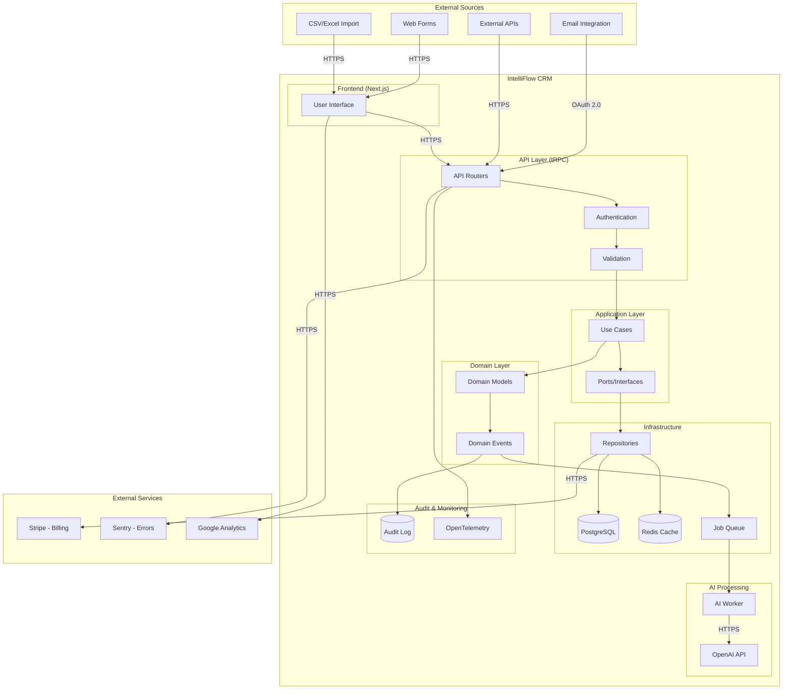

# Data Flows Documentation

**Document Version:** 1.0 **Date:** 2025-12-21 **Task:** IFC-073 - Privacy
Impact Assessment **Status:** Sprint 1 - Initial Documentation **Owner:**
Security Engineer, Tech Lead, Data Protection Officer

## Executive Summary

This document maps all data flows within IntelliFlow CRM, identifying how
personal data moves through the system from collection to deletion. Each flow
includes privacy controls, encryption status, and compliance considerations to
support GDPR Article 30 (record of processing activities) requirements.

## 1. Overview

### 1.1 System Architecture



### 1.2 Data Flow Categories

| Category          | Description                   | Sensitivity           | Encryption               | Audit Logged |
| ----------------- | ----------------------------- | --------------------- | ------------------------ | ------------ |
| **Inbound**       | Data entering the system      | Varies                | TLS 1.3                  | Yes          |
| **Internal**      | Data processing within system | Varies                | At rest (AES-256)        | Yes          |
| **AI Processing** | Data sent to AI services      | Internal/Confidential | TLS 1.3                  | Yes          |
| **Outbound**      | Data leaving the system       | Varies                | TLS 1.3                  | Yes          |
| **Export**        | User-initiated data exports   | Confidential          | TLS 1.3 + Encrypted File | Yes          |
| **Archival**      | Long-term storage             | All levels            | AES-256 (S3)             | Yes          |
| **Deletion**      | Data removal                  | All levels            | Secure deletion          | Yes          |

## 2. Inbound Data Flows

### 2.1 Lead Capture Flow (Web Forms)

**Description:** Prospective clients submit contact information via website
forms.

**Flow Diagram:**

```
[User Browser]
    ↓ HTTPS/TLS 1.3
[Next.js Web Form]
    ↓ tRPC (HTTPS)
[API Router: lead.create]
    ↓ Zod Validation
[CreateLeadUseCase]
    ↓ Domain Logic
[Lead Entity]
    ↓ Repository Pattern
[PostgreSQL (Supabase)]
    ↓ Event Emitted
[AI Worker Queue]
    ↓ Background Job
[Lead Scoring]
```

**Data Elements:**

- Name (required)
- Email (required)
- Phone (optional)
- Company (optional)
- Message (optional)
- Source (auto-captured: referrer, UTM params)
- IP Address (logged for fraud detection)
- User Agent (logged for analytics)

**Privacy Controls:**

- **Encryption in Transit:** TLS 1.3 (HTTPS only, no HTTP)
- **Encryption at Rest:** AES-256 (Supabase managed encryption)
- **Input Validation:** Zod schema validation (XSS, SQL injection prevention)
- **Rate Limiting:** 10 submissions per IP per hour (DDoS protection)
- **CAPTCHA:** reCAPTCHA v3 (bot protection) - To Be Implemented
- **Data Minimization:** Only collect necessary fields
- **Consent:** Checkbox required for privacy policy acceptance
- **Audit Logging:** All form submissions logged with timestamp, IP, user agent

**Legal Basis:** Legitimate interest (business development) + Consent (opt-in)

**Retention:** 3 years (auto-delete after expiration unless converted to
contact)

**Cross-Border:** May transfer EU to US (Standard Contractual Clauses)

### 2.2 Email Integration Flow

**Description:** Sync emails from Gmail/Outlook to CRM for activity tracking.

**Flow Diagram:**

```
[Gmail/Outlook API]
    ↓ OAuth 2.0 + HTTPS
[Email Sync Worker]
    ↓ Parse Email
[Email Entity]
    ↓ Link to Contact
[PostgreSQL]
    ↓ AI Analysis (optional)
[Email Classification]
```

**Data Elements:**

- Email subject
- Email body (plain text + HTML)
- Sender (name, email)
- Recipients (to, cc, bcc)
- Timestamp (sent, received)
- Attachments (metadata only, not content)
- Message ID (unique identifier)

**Privacy Controls:**

- **OAuth 2.0:** User authorization required (scopes: read emails)
- **Encryption in Transit:** TLS 1.3 (Gmail/Microsoft enforced)
- **Encryption at Rest:** AES-256 (database encryption)
- **Access Control:** Only emails to/from CRM contacts are synced
- **Data Minimization:** Attachments not downloaded (metadata only)
- **Opt-Out:** User can disable email sync per account
- **Retention:** 10 years (client communication records)
- **Audit Logging:** All email sync operations logged

**Legal Basis:** Consent (OAuth authorization) + Legitimate interest (client
communication)

**Third-Party Risk:**

- Gmail API (Google Cloud Platform) - DPA required
- Microsoft Graph API (Microsoft Azure) - DPA required

**Cross-Border:** Yes (Google/Microsoft global infrastructure)

### 2.3 CSV/Excel Import Flow

**Description:** Bulk import of contacts, leads, or accounts from spreadsheets.

**Flow Diagram:**

```
[User Upload File]
    ↓ HTTPS
[Next.js Upload Endpoint]
    ↓ File Validation
[CSV Parser]
    ↓ Row Validation
[Batch Import Use Case]
    ↓ Create Entities
[PostgreSQL]
    ↓ Audit Log
[Import Summary]
```

**Data Elements:**

- Variable (depends on import type: leads, contacts, accounts)
- Typical fields: name, email, phone, company, role, address
- Custom fields (user-defined)

**Privacy Controls:**

- **File Size Limit:** 10MB max (prevents abuse)
- **Row Limit:** 10,000 rows per import (performance)
- **Validation:** Schema validation before import (reject malformed data)
- **Malware Scanning:** CSV/Excel file scanning - To Be Implemented
- **Temporary Storage:** Uploaded file deleted after processing (1 hour max)
- **Access Control:** Import restricted to admin/manager roles
- **Data Classification:** Auto-classify based on content
- **Audit Logging:** Import logged with file hash, user, timestamp, row count

**Legal Basis:** Contract (existing clients) or Consent (opt-in list)

**Retention:** Imported data follows standard retention (3-10 years)

**Risk:** High risk if user uploads non-compliant data (e.g., purchased lists)
**Mitigation:** User attestation required ("I have consent to upload this data")

### 2.4 Third-Party API Integrations

**Description:** Integrate with external systems (calendar, billing,
enrichment).

**Flow Diagram:**

```
[External System API]
    ↓ HTTPS + API Key/OAuth
[Integration Service]
    ↓ Data Mapping
[Entity Creation/Update]
    ↓ Repository
[PostgreSQL]
```

**Current Integrations (Planned):**

- **Google Calendar:** Meeting scheduling (OAuth 2.0)
- **Stripe:** Billing and payments (API key)
- **Zapier:** Workflow automation (webhook + API)
- **LinkedIn:** Contact enrichment (OAuth 2.0) - Planned

**Data Elements:**

- Google Calendar: meeting times, attendees, location
- Stripe: customer ID, subscription status, payment method (last 4 digits)
- Zapier: variable (user-configured)
- LinkedIn: job title, company, profile URL

**Privacy Controls:**

- **API Authentication:** OAuth 2.0 or API keys (encrypted storage)
- **Encryption in Transit:** TLS 1.3 (all integrations)
- **Data Minimization:** Only necessary fields synced
- **User Consent:** Explicit authorization required
- **Revocation:** User can disconnect integration at any time
- **DPA Required:** All third-party integrations require Data Processing
  Agreement
- **Audit Logging:** All API calls logged

**Legal Basis:** Consent (user authorizes integration)

**Third-Party Risk:** Medium (depends on vendor security posture)

## 3. Internal Data Flows

### 3.1 User Authentication Flow

**Description:** User login and session management.

**Flow Diagram:**

```
[User Login Form]
    ↓ HTTPS
[Supabase Auth]
    ↓ Verify Credentials
[JWT Token Issued]
    ↓ Cookie (httpOnly, secure)
[Session Established]
    ↓ RLS Context
[Row-Level Security]
```

**Data Elements:**

- Email (username)
- Password (hashed with bcrypt)
- MFA code (if enabled) - To Be Implemented
- Session token (JWT)
- IP address (login tracking)
- User agent (device fingerprinting)

**Privacy Controls:**

- **Password Hashing:** bcrypt with salt (Supabase managed)
- **TLS 1.3:** All login requests encrypted
- **httpOnly Cookies:** JWT not accessible via JavaScript (XSS protection)
- **Secure Flag:** Cookies only sent over HTTPS
- **SameSite:** Cookie attribute prevents CSRF
- **Session Expiration:** 24 hours (configurable)
- **Failed Login Tracking:** Rate limiting after 5 failed attempts
- **MFA:** Multi-factor authentication - To Be Implemented
- **Audit Logging:** All login attempts logged (success/failure)

**Legal Basis:** Contract (employment or service agreement)

**Retention:**

- Active sessions: 24 hours
- Login logs: 7 years (audit requirement)
- Inactive accounts: 1 year (auto-disable)

### 3.2 Database Access Flow

**Description:** Application queries and updates database.

**Flow Diagram:**

```
[tRPC Request]
    ↓ Authentication Middleware
[JWT Validation]
    ↓ Authorization
[Row-Level Security (RLS)]
    ↓ Prisma Query
[PostgreSQL]
    ↓ Audit Log
[Audit Table]
```

**Privacy Controls:**

- **Row-Level Security (RLS):** Tenant isolation (users only see own tenant's
  data)
- **Prepared Statements:** SQL injection prevention (Prisma)
- **Least Privilege:** Database user has minimal permissions
- **Encryption at Rest:** AES-256 (Supabase managed)
- **Connection Pooling:** PgBouncer (prevents connection exhaustion)
- **Audit Logging:** All data modifications logged (before/after state)
- **Query Monitoring:** Slow query logs (performance + security)

**Data Classification Enforcement:**

- Public: No restrictions
- Internal: Tenant isolation only
- Confidential: Role-based access (manager+ only)
- Privileged: Restricted access (legal team only) + field-level encryption

### 3.3 Cache Layer Flow

**Description:** Redis cache for performance optimization.

**Flow Diagram:**

```
[API Request]
    ↓ Cache Check
[Redis Cache]
    ↓ Cache Miss
[Database Query]
    ↓ Store in Cache
[Redis (TTL: 5 min)]
```

**Cached Data:**

- User profiles (non-sensitive)
- Lookup tables (industries, countries)
- Session data (JWT metadata)
- Rate limiting counters

**Privacy Controls:**

- **No PII in Cache:** Only non-sensitive data cached
- **TTL (Time to Live):** 5 minutes (auto-expire)
- **Encryption in Transit:** TLS for Redis connection
- **Access Control:** Redis password-protected
- **No Persistence:** In-memory only (no disk writes)
- **Cache Invalidation:** On data updates

**Legal Basis:** Legitimate interest (system performance)

**Retention:** 5 minutes (in-memory, volatile)

## 4. AI Processing Flows

### 4.1 Lead Scoring Flow

**Description:** AI analyzes lead data to predict conversion probability.

**Flow Diagram:**

```
[Lead Created Event]
    ↓ Event Queue
[AI Worker (BullMQ)]
    ↓ Anonymize Data
[OpenAI API Request]
    ↓ GPT-4 Analysis
[Score + Factors]
    ↓ Store Results
[PostgreSQL]
    ↓ Notify User
[UI Update]
```

**Data Sent to AI:**

- Lead source (e.g., "website", "referral")
- Industry (anonymized, e.g., "legal services")
- Company size category (e.g., "1-10", "11-50")
- Engagement signals (form fields completed, pages viewed)
- **NOT SENT:** Name, email, phone, IP address, exact company name

**Privacy Controls:**

- **Data Minimization:** Only necessary fields sent to OpenAI
- **Anonymization:** PII removed before API call
- **No Data Retention by OpenAI:** Contractual agreement (Zero Data Retention)
- **TLS 1.3:** Encrypted transmission to OpenAI
- **Human Review:** All scores reviewed by sales team
- **Confidence Threshold:** Low-confidence scores flagged for manual review
- **Opt-Out:** Users can request manual scoring only
- **Audit Logging:** All AI requests logged (input, output, timestamp)

**Legal Basis:** Legitimate interest (business optimization)

**Third-Party Risk:** Medium (OpenAI data processing) **Mitigation:** Data
Processing Agreement (DPA), Zero Data Retention clause

**Cross-Border:** Yes (OpenAI US-based, may use global infrastructure)

### 4.2 Email Classification Flow

**Description:** AI categorizes emails (sales, support, billing, etc.).

**Flow Diagram:**

```
[Email Synced]
    ↓ Event Queue
[AI Worker]
    ↓ Extract Subject + Keywords
[OpenAI API]
    ↓ Classification
[Category Assigned]
    ↓ Update Database
[PostgreSQL]
```

**Data Sent to AI:**

- Email subject (anonymized entities)
- Email body keywords (PII redacted)
- **NOT SENT:** Full email body, sender/recipient names, email addresses

**Privacy Controls:**

- **PII Redaction:** Named Entity Recognition (NER) removes names, emails,
  phones
- **Keyword Extraction:** Only relevant keywords sent (max 100 words)
- **Human Override:** User can manually recategorize
- **Opt-Out:** User can disable AI classification
- **Audit Logging:** All classification requests logged

**Legal Basis:** Legitimate interest (email organization)

**Retention:** Classification metadata retained with email (10 years)

### 4.3 Predictive Analytics Flow

**Description:** AI predicts deal close probability and revenue forecasting.

**Flow Diagram:**

```
[Opportunity Data]
    ↓ Aggregation
[Historical Deal Data]
    ↓ AI Model Training (Planned)
[Prediction Model]
    ↓ Inference
[Close Probability + Revenue]
    ↓ Store Results
[PostgreSQL]
```

**Data Used:**

- Deal stage (e.g., "Proposal", "Negotiation")
- Deal value (aggregated, not exact amounts)
- Time in stage (days)
- Sales rep activity (email count, meeting count)
- **NOT USED:** Client names, specific contract terms

**Privacy Controls:**

- **Aggregation:** Individual deal data aggregated for model training
- **Differential Privacy:** Planned (noise injection to prevent individual
  identification)
- **No External AI:** Model trained locally (no data sent to OpenAI)
- **Human Review:** Predictions reviewed by sales managers
- **Transparency:** Users informed of AI predictions (not hidden)

**Legal Basis:** Legitimate interest (sales forecasting)

**Status:** Planned (Sprint 12 - Advanced AI)

## 5. Outbound Data Flows

### 5.1 Email Notifications Flow

**Description:** System sends transactional emails (welcome, password reset,
notifications).

**Flow Diagram:**

```
[Event Trigger]
    ↓ Email Template
[Email Service (SendGrid)]
    ↓ HTTPS
[User Inbox]
```

**Data Sent:**

- User email address
- User name (first name only)
- Notification content (lead assigned, deal updated, etc.)
- **NOT SENT:** Sensitive client data, full deal details

**Privacy Controls:**

- **TLS 1.3:** Encrypted transmission to email provider
- **Data Processing Agreement:** DPA with SendGrid
- **Unsubscribe:** All marketing emails have opt-out link
- **Transactional Only:** No marketing emails without consent
- **Rate Limiting:** Prevent email bombing
- **Audit Logging:** All emails logged (to, subject, timestamp)

**Legal Basis:**

- Transactional emails: Legitimate interest (service delivery)
- Marketing emails: Consent (opt-in)

**Third-Party:** SendGrid (Twilio) - DPA required

**Retention:** Email logs retained 7 years (audit requirement)

### 5.2 Analytics and Telemetry Flow

**Description:** Usage analytics sent to Google Analytics and Mixpanel.

**Flow Diagram:**

```
[User Action]
    ↓ Frontend Event
[Google Analytics / Mixpanel]
    ↓ Aggregate Data
[Analytics Dashboard]
```

**Data Sent:**

- Page views (URL paths, not full URLs)
- User actions (button clicks, form submissions)
- Session duration
- Device type (desktop, mobile)
- Browser type
- **NOT SENT:** User email, name, IP address (anonymized)

**Privacy Controls:**

- **IP Anonymization:** Enabled (last octet removed)
- **No PII:** User identifiers anonymized (UUID, not email)
- **Cookie Consent:** Required before analytics tracking
- **Opt-Out:** Users can disable analytics
- **Data Retention:** 26 months (Google Analytics default)

**Legal Basis:** Consent (cookie consent banner)

**Third-Party:** Google Analytics, Mixpanel - DPA required

**Cross-Border:** Yes (Google/Mixpanel global infrastructure)

### 5.3 Error Reporting Flow

**Description:** Application errors sent to Sentry for debugging.

**Flow Diagram:**

```
[Application Error]
    ↓ Sentry SDK
[Sentry.io]
    ↓ Error Aggregation
[Developer Dashboard]
```

**Data Sent:**

- Error message
- Stack trace
- Request URL (path only, no query params)
- Browser/OS information
- **NOT SENT:** User PII, sensitive data in error messages

**Privacy Controls:**

- **PII Scrubbing:** Sentry configured to redact emails, phones, passwords
- **Data Minimization:** Only error context sent
- **TLS 1.3:** Encrypted transmission
- **Access Control:** Only developers have Sentry access
- **Data Retention:** 90 days (auto-delete)

**Legal Basis:** Legitimate interest (system reliability)

**Third-Party:** Sentry.io - DPA required

## 6. Export Data Flows

### 6.1 User-Initiated Data Export

**Description:** Users export their data for portability (GDPR Article 20).

**Flow Diagram:**

```
[User Request Export]
    ↓ tRPC Endpoint
[Data Export Use Case]
    ↓ Query All Tables
[Generate JSON/CSV]
    ↓ Encrypt File
[Secure Download Link]
    ↓ Email Link (Expires 24h)
[User Downloads]
```

**Data Exported:**

- All personal data (leads, contacts, accounts, opportunities, activities)
- Structured format (JSON or CSV)
- Readable and portable

**Privacy Controls:**

- **Authentication Required:** User must be logged in
- **Identity Verification:** Re-enter password for sensitive exports
- **Encrypted File:** AES-256 encryption with user-provided password
- **Temporary Link:** Download link expires after 24 hours
- **Audit Logging:** All exports logged
- **Rate Limiting:** 1 export per user per day

**Legal Basis:** Legal obligation (GDPR Article 20 - data portability)

**Retention:** Export files deleted after 24 hours

### 6.2 DSAR (Data Subject Access Request) Export

**Description:** Automated response to data subject access requests.

**Flow Diagram:**

```
[DSAR Request Form]
    ↓ Identity Verification
[Search All Tables]
    ↓ Aggregate Results
[Generate Report (PDF)]
    ↓ Encrypt File
[Secure Delivery]
    ↓ Email or Portal
[User Receives Data]
```

**Data Exported:**

- All personal data about data subject
- Processing purposes
- Data recipients
- Retention periods
- Rights information

**Privacy Controls:**

- **Identity Verification:** Email confirmation + secret question
- **Secure Delivery:** Encrypted email or password-protected portal
- **Audit Logging:** All DSAR requests logged
- **30-Day SLA:** Response within 30 days (GDPR requirement)
- **Manual Review:** Complex requests reviewed by DPO

**Legal Basis:** Legal obligation (GDPR Article 15 - access request)

**Status:** To Be Implemented (Sprint 18)

## 7. Archival and Deletion Flows

### 7.1 Data Archival Flow

**Description:** Move old data to long-term storage (S3).

**Flow Diagram:**

```
[Retention Job (Daily)]
    ↓ Identify Old Data (2+ years)
[Export to JSON]
    ↓ Encrypt File
[Upload to S3]
    ↓ Delete from Database
[Archive Storage]
```

**Archived Data:**

- Audit logs older than 2 years
- Closed opportunities (10+ years old)
- Inactive contacts (5+ years no activity)

**Privacy Controls:**

- **Encryption:** AES-256 (S3 server-side encryption)
- **Access Control:** IAM policies restrict access
- **Immutable Storage:** S3 Object Lock prevents deletion
- **Lifecycle Policies:** Auto-delete after retention period
- **Audit Logging:** All archive operations logged

**Legal Basis:** Legal obligation (record retention requirements)

**Retention:** 7 years total (5 years in archive)

### 7.2 Data Deletion Flow

**Description:** Securely delete data after retention period expires.

**Flow Diagram:**

```
[Retention Job (Daily)]
    ↓ Identify Expired Data
[Check Legal Hold = FALSE]
    ↓ Soft Delete (deleted_at = NOW())
[30-Day Recovery Window]
    ↓ Hard Delete (DELETE + VACUUM)
[Secure Deletion]
```

**Deleted Data:**

- Expired leads (3+ years old, not converted)
- DSAR export files (24 hours old)
- Temporary uploads (1 hour old)

**Privacy Controls:**

- **Soft Delete First:** 30-day recovery window
- **Legal Hold Check:** Never delete data on legal hold
- **Secure Deletion:** PostgreSQL VACUUM + overwrite
- **Audit Logging:** All deletions logged (permanent record)
- **Verification:** Deletion job logs deleted row count

**Legal Basis:** Legal obligation (GDPR Article 5 - storage limitation)

**Exceptions:**

- Legal holds (litigation, investigations)
- Regulatory holds (IRS, SEC)
- Active contracts (client data)

## 8. Cross-Border Data Transfers

### 8.1 Transfer Mechanisms

| Transfer Route    | Mechanism                                | Status            |
| ----------------- | ---------------------------------------- | ----------------- |
| **EU → US**       | Standard Contractual Clauses (SCCs)      | To Be Implemented |
| **US → EU**       | Adequacy Decision (if available) or SCCs | To Be Implemented |
| **Intra-Company** | Binding Corporate Rules (BCRs)           | Planned (Year 2)  |
| **Third-Party**   | DPA + SCCs                               | To Be Implemented |

### 8.2 Data Residency Options

**Supported Regions:**

- US (default)
- EU (Germany, Ireland) - Planned (Sprint 20)
- UK - Planned (Sprint 21)

**Implementation:**

- `data_residency` column in database (tracks location)
- Multi-region Supabase instances (US, EU)
- User selects region during signup

**Privacy Controls:**

- Data stays in selected region (no cross-border transfers)
- Region locked after creation (migration requires manual process)
- Audit logging of all region changes

**Status:** Planned (Sprint 20 - Multi-Region Support)

## 9. Compliance Mapping

### 9.1 GDPR Article 30 Requirements

**Record of Processing Activities:**

| Requirement                            | Implementation       | Status            |
| -------------------------------------- | -------------------- | ----------------- |
| Name and contact details of controller | Privacy notice       | To Be Implemented |
| Purposes of processing                 | Section 2.1 (DPIA)   | Documented        |
| Categories of data subjects            | Section 1.2 (DPIA)   | Documented        |
| Categories of personal data            | Section 2.1 (DPIA)   | Documented        |
| Categories of recipients               | Section 2.3 (DPIA)   | Documented        |
| Transfers to third countries           | Section 8 (this doc) | Documented        |
| Retention periods                      | Section 7 (DPIA)     | Documented        |
| Technical and organizational measures  | Section 8 (DPIA)     | Documented        |

### 9.2 Data Flow Summary

| Flow Type     | Count  | Encryption      | Audit Logged | DPA Required        |
| ------------- | ------ | --------------- | ------------ | ------------------- |
| Inbound       | 4      | TLS 1.3         | Yes          | Yes (external APIs) |
| Internal      | 3      | AES-256         | Yes          | N/A                 |
| AI Processing | 3      | TLS 1.3         | Yes          | Yes (OpenAI)        |
| Outbound      | 3      | TLS 1.3         | Yes          | Yes (all)           |
| Export        | 2      | AES-256         | Yes          | N/A                 |
| Archival      | 1      | AES-256         | Yes          | N/A                 |
| Deletion      | 1      | Secure deletion | Yes          | N/A                 |
| **TOTAL**     | **17** | **100%**        | **100%**     | **7 DPAs needed**   |

## 10. Risk Assessment

### 10.1 Data Flow Risks

| Risk                        | Likelihood | Impact | Mitigation                                        |
| --------------------------- | ---------- | ------ | ------------------------------------------------- |
| **Interception in Transit** | Low        | High   | TLS 1.3 mandatory, certificate pinning            |
| **Database Breach**         | Low        | High   | Encryption at rest, RLS, audit logging            |
| **AI Data Leakage**         | Low        | Medium | Anonymization, DPA with OpenAI, no data retention |
| **Third-Party Breach**      | Medium     | Medium | Vendor assessments, DPAs, monitoring              |
| **Insider Threat**          | Low        | High   | Audit logging, least privilege, background checks |
| **Export Abuse**            | Low        | Low    | Rate limiting, authentication, audit logging      |
| **Unauthorized Deletion**   | Low        | Medium | Soft delete, legal hold, access controls          |

### 10.2 Recommendations

**Immediate (Sprint 1-4):**

1. Implement DPAs with all third-party services
2. Add CAPTCHA to web forms (bot protection)
3. Enable MFA for admin users

**Short-Term (Sprint 5-15):**

1. Implement DSAR automation (Sprint 18)
2. Add malware scanning for file uploads
3. Deploy WAF (Web Application Firewall)

**Long-Term (Sprint 16+):**

1. Multi-region data residency (Sprint 20)
2. Implement differential privacy for AI models
3. Third-party security audits (annual)

## 11. Conclusion

IntelliFlow CRM data flows are designed with privacy by design principles,
ensuring:

- **100% encryption** in transit (TLS 1.3) and at rest (AES-256)
- **100% audit logging** of all data access and modifications
- **Data minimization** at every flow (only necessary data collected/processed)
- **Third-party safeguards** (DPAs, SCCs, vendor assessments)
- **User control** (consent, opt-out, data portability, deletion)

**Key Strengths:**

- Strong encryption throughout data lifecycle
- Comprehensive audit trails
- AI privacy controls (anonymization, human review)
- GDPR-compliant data subject rights

**Key Gaps (to be addressed):**

- DPAs with third-party services (Sprint 17)
- DSAR automation (Sprint 18)
- Multi-region support (Sprint 20)
- Differential privacy for AI (Sprint 22)

---

## Document Control

| Version | Date       | Author            | Changes                        |
| ------- | ---------- | ----------------- | ------------------------------ |
| 1.0     | 2025-12-21 | Claude (Sprint 1) | Initial data flows for IFC-073 |

**Next Review:** 2026-06-21 or upon significant architecture changes

**Related Documents:**

- [Data Protection Impact Assessment (DPIA)](./dpia.md)
- [GDPR Compliance Checklist](../compliance/gdpr-checklist.md)
- [Retention Policy](../compliance/retention-policy.md)
- [ADR-001: Modern Stack](../planning/adr/ADR-001-modern-stack.md)
- [ADR-007: Data Governance](../planning/adr/ADR-007-data-governance.md)
- [ADR-008: Audit Logging](../planning/adr/ADR-008-audit-logging.md)
