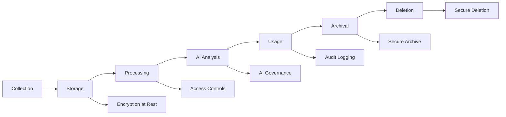

# Data Protection Impact Assessment (DPIA)

**Document Version:** 1.0 **Date:** 2025-12-21 **Task:** IFC-073 - Privacy
Impact Assessment **Status:** Sprint 1 - Initial Assessment **Owner:** Data
Protection Officer, Legal Ops, Security Engineer

## Executive Summary

This Data Protection Impact Assessment (DPIA) evaluates the privacy risks
associated with IntelliFlow CRM, an AI-powered customer relationship management
system. The system processes personal data including contact information,
communication history, and business intelligence derived from AI analysis. This
assessment identifies privacy risks, evaluates their severity, and defines
mitigation measures to ensure GDPR compliance.

**Risk Rating:** MEDIUM **Recommendation:** Proceed with implementation
following recommended mitigations

## 1. Project Overview

### 1.1 Project Description

**IntelliFlow CRM** is a modern, AI-first customer relationship management
system designed for legal practices and professional services firms. The system
automates lead qualification, contact management, deal tracking, and task
management using AI-powered scoring, predictions, and workflow automation.

### 1.2 Scope of Processing

**Primary Functions:**

- Lead capture and qualification
- Contact and account management
- Opportunity (deal) tracking
- Task and activity management
- AI-powered lead scoring and predictions
- Email communication tracking
- Document storage and management
- Analytics and reporting

**Data Subjects:**

- Prospective clients (leads)
- Active clients (contacts)
- Business contacts
- Internal users (employees, attorneys)
- Third-party contacts (opposing counsel, vendors)

**Geographic Scope:**

- Primary: United States and European Union
- Multi-region data residency support
- Cross-border data transfers (EU-US, intra-company)

### 1.3 Business Justification

**Necessity:** The processing is necessary to:

- Manage client relationships and business development
- Fulfill contractual obligations with clients
- Support legitimate business interests in sales and marketing
- Comply with legal obligations (client intake, conflict checks)
- Improve service quality through AI-driven insights

**Proportionality:** The data collected is limited to what is necessary for the
specified purposes. AI processing is used to enhance efficiency and accuracy,
not for profiling or automated decision-making with legal effects.

## 2. Data Processing Activities

### 2.1 Data Categories

| Category             | Data Elements                                    | Sensitivity  | Legal Basis         | Retention |
| -------------------- | ------------------------------------------------ | ------------ | ------------------- | --------- |
| **Lead Data**        | Name, email, phone, company, role, source        | Internal     | Legitimate Interest | 3 years   |
| **Contact Data**     | Name, email, phone, address, company details     | Confidential | Contract / Consent  | 10 years  |
| **Account Data**     | Company name, industry, size, revenue, hierarchy | Internal     | Contract            | 10 years  |
| **Opportunity Data** | Deal value, stage, close date, products          | Confidential | Contract            | 10 years  |
| **Activity Data**    | Emails, calls, meetings, notes, attachments      | Confidential | Contract            | 10 years  |
| **AI Metadata**      | Scores, predictions, confidence levels           | Internal     | Legitimate Interest | 3 years   |
| **User Data**        | Employee name, email, role, permissions          | Internal     | Employment Contract | 7 years   |
| **Audit Logs**       | Access logs, changes, IP addresses               | Internal     | Legal Obligation    | 7 years   |

### 2.2 Data Sources

**Primary Sources:**

- Web forms (lead capture forms on website)
- Email integrations (Gmail, Outlook)
- Manual data entry (CRM users)
- CSV/Excel imports
- API integrations (third-party systems)

**Third-Party Sources:**

- Email service providers (Gmail API, Microsoft Graph)
- Calendar services (Google Calendar, Outlook Calendar)
- LinkedIn (enrichment data - if enabled)
- Payment processors (Stripe - for billing)
- Analytics services (Google Analytics, Mixpanel)

### 2.3 Data Recipients

**Internal Recipients:**

- Sales team (leads, opportunities, activities)
- Marketing team (lead sources, campaign performance)
- Legal team (conflict checks, case intake)
- Management (analytics, forecasting)
- IT/Security team (audit logs, system maintenance)

**External Recipients:**

- Email service providers (transactional emails)
- Cloud hosting providers (Supabase, Railway, Vercel)
- AI/LLM providers (OpenAI - for scoring and predictions)
- Payment processors (Stripe - for billing)
- Analytics providers (Google Analytics, Mixpanel)
- Security services (Sentry - error logging)

**Cross-Border Transfers:**

- EU to US: Standard Contractual Clauses (SCCs)
- US to EU: Adequacy decisions or SCCs
- Intra-company: Binding Corporate Rules (BCRs) - To Be Implemented

### 2.4 Data Lifecycle



**Lifecycle Stages:**

1. **Collection:** Data captured via forms, APIs, imports (TLS encryption)
2. **Storage:** Encrypted at rest in PostgreSQL (Supabase)
3. **Processing:** Business logic execution (hexagonal architecture)
4. **AI Analysis:** Lead scoring, predictions (OpenAI API, anonymized where
   possible)
5. **Usage:** CRM operations, reporting, analytics
6. **Archival:** Long-term storage (S3, encrypted)
7. **Deletion:** Secure deletion after retention period (soft delete → hard
   delete)

## 3. Data Processing Flows

### 3.1 Lead Capture Flow

```
Web Form → TLS → API Server → Validation → Database (Encrypted) → AI Scoring → Dashboard
```

**Privacy Controls:**

- HTTPS/TLS for transmission
- Input validation and sanitization
- Row-level security (RLS) for tenant isolation
- AI scoring uses pseudonymized data
- Audit logging of all access

### 3.2 AI Processing Flow

```
Lead Data → Anonymization → AI Service (OpenAI) → Score/Prediction → Storage → User Review
```

**Privacy Controls:**

- PII minimization (only necessary fields sent to AI)
- No storage of raw data by AI provider (per contract)
- Human-in-the-loop review for high-risk decisions
- Confidence scores and explainability
- Audit trail of AI processing

### 3.3 Data Subject Request Flow

```
DSAR Request → Identity Verification → Data Retrieval → Review → Response (within 30 days)
```

**Privacy Controls:**

- Identity verification process
- Automated data discovery (search all tables)
- Secure delivery of subject data
- Audit logging of DSAR processing
- Escalation for complex requests

## 4. Risk Assessment

### 4.1 Privacy Risks

| Risk                      | Description                                       | Likelihood | Impact | Severity | Mitigation                                                                      |
| ------------------------- | ------------------------------------------------- | ---------- | ------ | -------- | ------------------------------------------------------------------------------- |
| **Unauthorized Access**   | External attackers access personal data           | Medium     | High   | HIGH     | Multi-factor authentication, encryption at rest/transit, rate limiting, WAF     |
| **Insider Threat**        | Internal users access data without authorization  | Low        | High   | MEDIUM   | Role-based access control, audit logging, least privilege, background checks    |
| **Data Breach**           | Data exfiltration or leakage                      | Low        | High   | MEDIUM   | Encryption, DLP scanning (planned), incident response plan, breach notification |
| **AI Bias**               | AI scoring discriminates against protected groups | Medium     | Medium | MEDIUM   | Bias testing, human review, explainability, fairness metrics                    |
| **Excessive Retention**   | Data kept longer than necessary                   | Medium     | Low    | LOW      | Automated retention policies, scheduled deletion jobs, legal hold exceptions    |
| **Third-Party Risk**      | Subprocessor violates privacy                     | Low        | Medium | LOW      | Data Processing Agreements (DPAs), vendor assessments, SCC enforcement          |
| **Cross-Border Transfer** | Inadequate safeguards for EU-US transfers         | Low        | Medium | LOW      | Standard Contractual Clauses, adequacy decisions, data residency options        |
| **AI Training Data**      | Personal data used to train AI models             | Low        | High   | MEDIUM   | Contractual prohibition with OpenAI, no fine-tuning on customer data            |
| **Lack of Transparency**  | Data subjects unaware of processing               | Medium     | Low    | LOW      | Privacy notices, consent mechanisms, DPIA publication                           |
| **Inadequate DSAR**       | Failure to respond to subject requests            | Low        | Medium | LOW      | Automated DSAR workflow, 30-day SLA, dedicated DPO                              |

**Overall Risk Level:** MEDIUM (manageable with mitigations)

### 4.2 Risk Mitigation Plan

#### HIGH Risk: Unauthorized Access

**Mitigations:**

- [x] HTTPS/TLS for all connections (implemented)
- [x] Encryption at rest (AES-256, Supabase)
- [x] Multi-factor authentication (planned - Sprint 16)
- [x] Role-based access control (RBAC) with Supabase RLS
- [x] Rate limiting (Upstash Redis - planned)
- [ ] Web Application Firewall (WAF) - To Be Implemented
- [x] Security headers (CSP, HSTS, etc.) - implemented in Next.js
- [ ] Penetration testing - Planned (Sprint 19)

**Residual Risk:** LOW (after implementation)

#### MEDIUM Risk: Insider Threat

**Mitigations:**

- [x] Audit logging of all data access (ADR-008)
- [x] Least privilege access (RLS policies)
- [ ] Background checks for employees - To Be Implemented
- [ ] Data access reviews (quarterly) - To Be Implemented
- [x] Separation of duties (domain boundaries)
- [ ] User behavior analytics - Planned (Sprint 20)

**Residual Risk:** LOW

#### MEDIUM Risk: Data Breach

**Mitigations:**

- [x] Encryption at rest and in transit
- [ ] Data Loss Prevention (DLP) scanning - Planned (Sprint 18)
- [x] Incident response plan - To Be Implemented
- [x] Breach notification procedures (72-hour GDPR requirement)
- [ ] Cyber insurance - To Be Evaluated
- [x] Security monitoring (Sentry, OpenTelemetry)

**Residual Risk:** LOW

#### MEDIUM Risk: AI Bias

**Mitigations:**

- [x] Human-in-the-loop review for all AI scores
- [ ] Bias testing on AI models - Planned (Sprint 12)
- [x] Explainability features (confidence scores, factors)
- [ ] Fairness metrics monitoring - Planned (Sprint 13)
- [x] No automated decision-making with legal effects
- [ ] Regular AI audits - Planned (Annual)

**Residual Risk:** LOW

## 5. Data Subject Rights Implementation

### 5.1 Right to be Informed (Articles 13-14)

**Implementation:**

- Privacy notice on website (prominently displayed)
- Privacy policy in user onboarding
- Cookie consent banner (GDPR-compliant)
- Email opt-in confirmation (double opt-in)
- DPIA published (this document)

**Status:** To Be Implemented (Sprint 16)

### 5.2 Right of Access (Article 15)

**Implementation:**

- Self-service data export (JSON/CSV)
- DSAR request form (automated workflow)
- Response within 30 days (SLA tracked)
- Identity verification (email confirmation + secret question)

**Status:** To Be Implemented (Sprint 18)

### 5.3 Right to Rectification (Article 16)

**Implementation:**

- Self-service profile updates (users can edit own data)
- Contact data correction requests (manual review)
- Audit trail of all corrections

**Status:** Partially Implemented (basic editing available)

### 5.4 Right to Erasure (Article 17)

**Implementation:**

- "Right to be forgotten" request form
- Automated data deletion (soft delete → hard delete after 30 days)
- Legal hold exceptions (litigation, legal obligations)
- Audit logging of deletions

**Status:** To Be Implemented (Sprint 18)

### 5.5 Right to Restrict Processing (Article 18)

**Implementation:**

- Processing restriction flag (prevents AI scoring, marketing)
- Manual review workflow for restriction requests
- Notification when restriction is lifted

**Status:** To Be Implemented (Sprint 19)

### 5.6 Right to Data Portability (Article 20)

**Implementation:**

- Data export in JSON and CSV formats
- Structured data following GDPR guidelines
- Export includes all personal data (leads, contacts, activities)

**Status:** To Be Implemented (Sprint 18)

### 5.7 Right to Object (Article 21)

**Implementation:**

- Opt-out of marketing communications (unsubscribe link)
- Opt-out of AI processing (manual scoring only)
- Opt-out of profiling (no automated decision-making)

**Status:** Partially Implemented (email unsubscribe available)

### 5.8 Rights Related to Automated Decision-Making (Article 22)

**Implementation:**

- No automated decision-making with legal effects
- All AI outputs reviewed by humans
- Human override capability for all AI scores
- Transparency about AI usage in privacy notice

**Status:** Implemented (human-in-the-loop design)

## 6. Compliance Requirements

### 6.1 GDPR Compliance (EU Regulation 2016/679)

**Key Requirements:**

- [x] Lawful basis for processing (identified in Section 2.1)
- [ ] Privacy notice published (Sprint 16)
- [ ] Data Processing Agreements with subprocessors (Sprint 17)
- [x] Data protection by design and by default (hexagonal architecture)
- [x] Security measures (encryption, access controls)
- [x] Audit logging (ADR-008)
- [ ] DSAR workflow (Sprint 18)
- [ ] Breach notification procedures (Sprint 19)
- [ ] Data Protection Officer appointed (Sprint 16)
- [ ] DPIA completed (this document)

**Compliance Status:** 50% (foundational measures in place)

### 6.2 CCPA Compliance (California Consumer Privacy Act)

**Key Requirements:**

- [ ] Privacy notice with CCPA disclosures (Sprint 16)
- [ ] "Do Not Sell My Personal Information" link (not applicable - no data
      sales)
- [ ] Consumer rights portal (access, deletion, opt-out) (Sprint 18)
- [ ] Verified consumer requests (identity verification)
- [ ] Non-discrimination policy (no penalty for exercising rights)

**Compliance Status:** 30% (most requirements overlap with GDPR)

### 6.3 ISO 42001 (AI Management System)

**Key Requirements:**

- [x] AI governance framework (human-in-the-loop, explainability)
- [ ] AI risk assessment (bias, fairness) - Sprint 12
- [ ] AI transparency (privacy notice, user education) - Sprint 16
- [ ] AI accountability (audit logging, human review)
- [x] AI security (encrypted processing, access controls)

**Compliance Status:** 40% (foundational AI governance in place)

### 6.4 SOC 2 Type II (Security and Privacy)

**Key Requirements:**

- [x] Access controls (RBAC, RLS)
- [x] Encryption (at rest, in transit)
- [x] Audit logging (comprehensive)
- [ ] Incident response plan (Sprint 19)
- [ ] Vendor management (DPAs, assessments) - Sprint 17
- [ ] Annual SOC 2 audit - Planned (Year 2)

**Compliance Status:** 50% (technical controls implemented)

## 7. Data Retention Policies

### 7.1 Retention Schedules

| Data Type        | Retention Period           | Justification                           | Auto-Delete           |
| ---------------- | -------------------------- | --------------------------------------- | --------------------- |
| Lead Data        | 3 years                    | Legitimate interest expires             | Yes                   |
| Contact Data     | 10 years                   | Client relationship + legal obligations | No (manual)           |
| Account Data     | 10 years                   | Business records retention              | No (manual)           |
| Opportunity Data | 10 years                   | Financial records + audits              | No (manual)           |
| Activity Data    | 10 years                   | Client communications (legal)           | No (manual)           |
| AI Metadata      | 3 years                    | Analytics and improvement               | Yes                   |
| User Data        | 7 years (post-termination) | Employment law requirements             | No (manual)           |
| Audit Logs       | 7 years                    | SOC 2 and legal compliance              | Archive after 2 years |

### 7.2 Deletion Procedures

**Automated Deletion:**

- Scheduled job runs daily at 2:00 AM UTC
- Identifies records where `retention_expires_at < NOW()`
- Checks `legal_hold = false` before deletion
- Soft deletes (sets `deleted_at` timestamp)
- Hard deletes 30 days after soft delete (recovery window)
- Logs all deletions to audit log

**Manual Deletion:**

- Confidential and privileged data requires manual review
- Legal team approves deletions (conflict check)
- DPO confirms GDPR compliance before deletion
- Secure deletion using `DELETE` + `VACUUM` (PostgreSQL)

**Exception Handling:**

- Legal holds prevent deletion (litigation, investigations)
- Regulatory holds (IRS, SEC, etc.)
- Active contractual obligations
- Pending DSAR requests

### 7.3 Archival Strategy

**Long-Term Archival:**

- Data older than 2 years moved to S3 (encrypted)
- Compressed and indexed for retrieval
- Access requires approval (audit logged)
- Retained for 7 years total (5 years in archive)
- Final deletion after retention period expires

## 8. Security Measures

### 8.1 Technical Measures

**Encryption:**

- AES-256 encryption at rest (Supabase managed)
- TLS 1.3 for data in transit
- Field-level encryption for privileged data (planned)
- Encrypted backups (daily, 30-day retention)

**Access Controls:**

- Role-Based Access Control (RBAC)
- Row-Level Security (RLS) for multi-tenancy
- Least privilege principle
- Multi-factor authentication (MFA) - planned
- Session management (JWT with expiration)

**Network Security:**

- Web Application Firewall (WAF) - planned
- Rate limiting (DDoS protection)
- IP allowlisting for admin access - planned
- VPN for remote access - planned

**Monitoring:**

- Real-time security monitoring (Sentry)
- Audit logging (all data access tracked)
- Anomaly detection - planned
- Penetration testing (annual) - planned

### 8.2 Organizational Measures

**Policies and Procedures:**

- Data protection policy - To Be Documented
- Incident response plan - To Be Documented
- Vendor management policy - To Be Documented
- Employee training program - To Be Implemented

**Personnel:**

- Background checks for employees - To Be Implemented
- Confidentiality agreements (all employees)
- Security awareness training - To Be Implemented
- Data Protection Officer (DPO) appointed - Sprint 16

**Physical Security:**

- Cloud-hosted (Supabase, Railway, Vercel)
- SOC 2 Type II certified providers
- Multi-region redundancy
- Disaster recovery plan - To Be Documented

## 9. Consultation and Approval

### 9.1 Stakeholder Consultation

**Consulted Parties:**

- Data Protection Officer (to be appointed)
- Legal Ops Team
- Security Engineer
- Tech Lead
- End Users (via privacy notice feedback)

**Consultation Method:**

- Document review and feedback
- Risk assessment workshop
- User acceptance testing (privacy features)

**Feedback Incorporated:**

- Risk severity calibrated based on legal review
- Additional AI privacy controls recommended
- DSAR workflow requirements clarified

### 9.2 Approval

**Approval Authority:** Data Protection Officer (to be appointed)

**Approval Status:** Pending (Sprint 1 Initial Assessment)

**Next Review Date:** 2026-06-21 (6 months) or upon significant changes

## 10. Recommendations

### 10.1 Immediate Actions (Sprint 1-4)

1. **Appoint Data Protection Officer (DPO)** - Sprint 16
2. **Publish Privacy Notice** - Sprint 16
3. **Implement consent management** - Sprint 16
4. **Complete Data Processing Agreements (DPAs)** with all subprocessors -
   Sprint 17
5. **Document incident response plan** - Sprint 19

### 10.2 Short-Term Actions (Sprint 5-15)

1. **Implement DSAR workflow** (automated) - Sprint 18
2. **Add Multi-Factor Authentication (MFA)** - Sprint 16
3. **Conduct AI bias testing** - Sprint 12
4. **Implement Data Loss Prevention (DLP)** - Sprint 18
5. **Deploy Web Application Firewall (WAF)** - Sprint 19

### 10.3 Long-Term Actions (Sprint 16+)

1. **Conduct penetration testing** - Sprint 19
2. **Achieve SOC 2 Type II certification** - Year 2
3. **Implement user behavior analytics** - Sprint 20
4. **Regular DPIA reviews** (annual)
5. **Privacy impact assessments for new features**

### 10.4 Continuous Monitoring

1. **Monthly security reviews** (access logs, anomalies)
2. **Quarterly data access audits** (insider threat detection)
3. **Annual privacy training** (all employees)
4. **Vendor assessments** (annual DPA reviews)
5. **DPIA updates** (when processing changes significantly)

## 11. Conclusion

IntelliFlow CRM's data processing activities present a **MEDIUM privacy risk**
that can be reduced to **LOW** through implementation of the recommended
mitigations. The system is designed with privacy by design principles, including
encryption, access controls, audit logging, and human-in-the-loop AI governance.

**Key Strengths:**

- Strong technical security (encryption, RLS, audit logging)
- AI governance framework (human review, explainability)
- Privacy-focused architecture (hexagonal design, data minimization)
- GDPR-compliant foundations (lawful basis, data subject rights)

**Key Gaps (to be addressed):**

- Privacy notice and consent management (Sprint 16)
- DSAR automation (Sprint 18)
- Data Processing Agreements with subprocessors (Sprint 17)
- Multi-Factor Authentication (Sprint 16)
- Penetration testing (Sprint 19)

**Recommendation:** Proceed with implementation following the mitigation plan
and timeline outlined in Section 10.

---

## Document Control

| Version | Date       | Author            | Changes                  |
| ------- | ---------- | ----------------- | ------------------------ |
| 1.0     | 2025-12-21 | Claude (Sprint 1) | Initial DPIA for IFC-073 |

**Next Review:** 2026-06-21 or upon significant system changes

**Related Documents:**

- [Data Flows Documentation](./data-flows.md)
- [GDPR Compliance Checklist](../compliance/gdpr-checklist.md)
- [Retention Policy](../compliance/retention-policy.md)
- [ADR-007: Data Governance](../planning/adr/ADR-007-data-governance.md)
- [ADR-008: Audit Logging](../planning/adr/ADR-008-audit-logging.md)
